Data Validation
==========

Fire Insights provides various processors for Data Validation.

Data Validation Processors in Fire Insights
----------------------------------------

.. list-table:: 
   :widths: 30 70
   :header-rows: 1

   * - Title
     - Description
   * - Compare Datasets
     - It compares incoming datasets and creates 3 output datasets - Present in 1st but not in 2nd, present in 2nd but not in 1st and Common rows in both.
   * - Node Schema Validation
     - It validates incoming dataset schema against defined schema validation rules. It also imputes missing values as per rules definition.
   * - Validate Address
     - It validates address data value against a valid address format. Some of the valid address formats are '123 xyx avenue' and '1/1 block-D street'.
   * - Validate Fields Advanced
     - It validates incoming dataset based on validation rules defined using validation functions. This node facilitates validation of columns using multiple conditions joined using logical operators like AND / OR.
   * - Validate Fields Simple
     - It validates incoming dataset based on validation rules defined using validation functions. 
	 
Compare Datasets
----------------------------------------

Below is a sample workflow that contains ``Compare Datasets`` processor in Fire Insights. It demonstrates the usage of ``Compare Datasets`` node to compare incoming datasets and create 3 output datasets - Present in 1st but not in 2nd, present in 2nd but not in 1st and common rows in both.

It does the following processing of data:

*	Reads incoming datasets.
*	Compares incoming datasets and create 3 output datasets using ``Compare Datasets`` node - Present in 1st but not in 2nd, present in 2nd but not in 1st and Common rows in both.
*	Prints output datasets created after comparing incoming datasets.

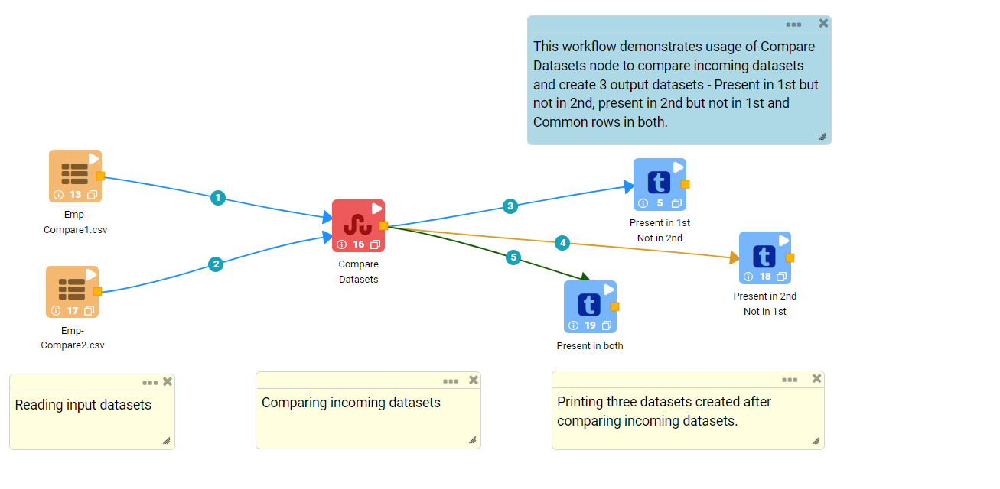
   
**Incoming Datasets**

* First incoming dataset

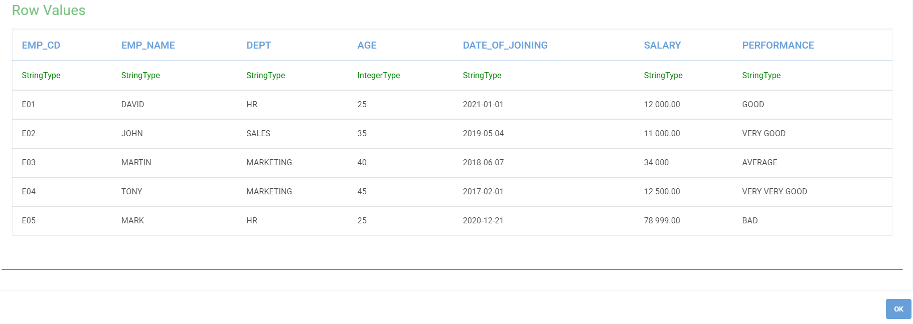
   
* Secong incoming dataset

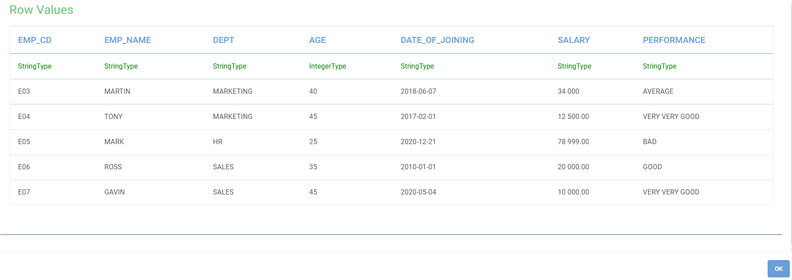
   
**Compare Datasets Node Configuration**

*	``Compare Datasets`` node is configured as below.

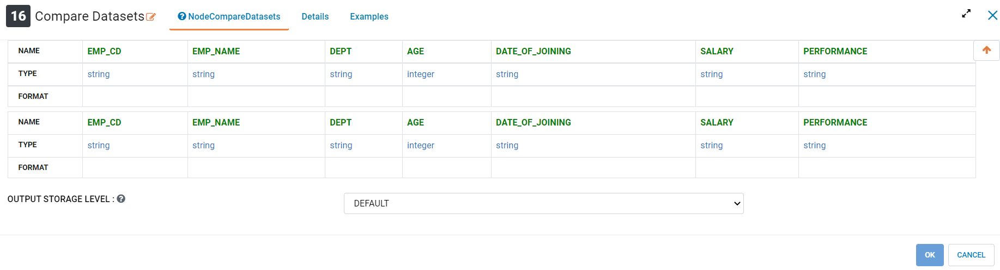
   
**Compare Datasets Node Output**

Output of ``Compare Datasets`` node would be datasets created by comparing incoming datasets.

*	Various comparison results  are printed as below.

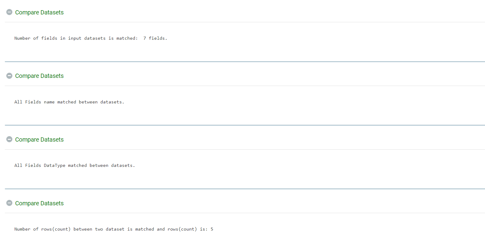

*	Rows present in 1st but not in 2nd.

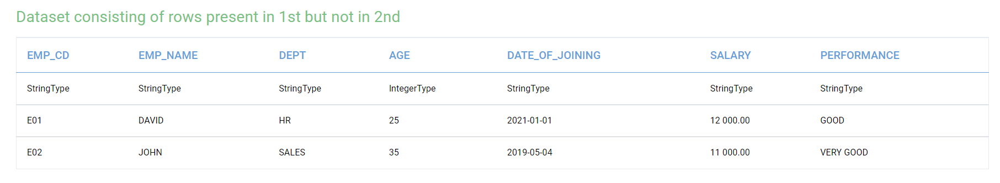

*	Rows present in 2nd but not in 1st.

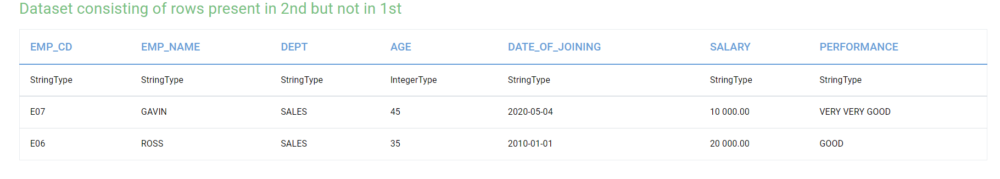

*	Rows common in both the incoming datasets.

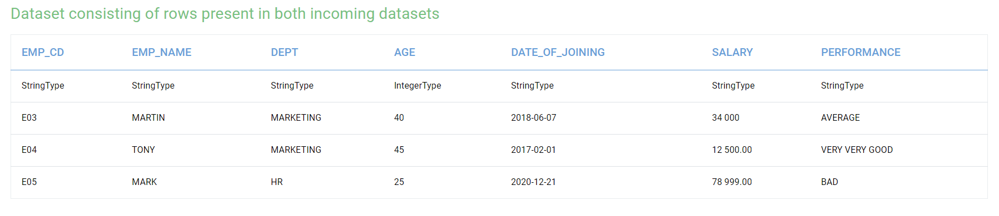

Node Schema Validation
----------------------------------------

Below is a sample workflow that contains ``Node Schema Validation`` processor in Fire Insights. It demonstrates the usage of ``Node Schema Validation`` node to validate incoming dataset schema against defined schema validation rules. It also imputes missing values as per rules definition.

It does the following processing of data:

*	Reads incoming datasets.
*	Validates incoming dataset schema against defined schema validation rules using ``Node Schema Validation`` node. It also imputes missing values as per rules definition.
*	Prints output dataset after imputing missing values.

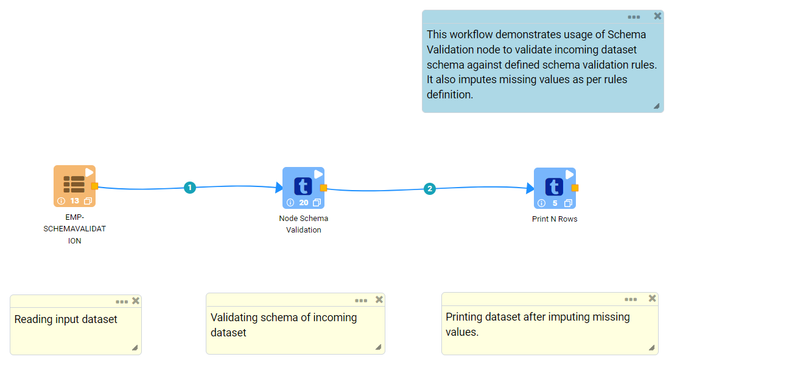
   
**Incoming Dataset**

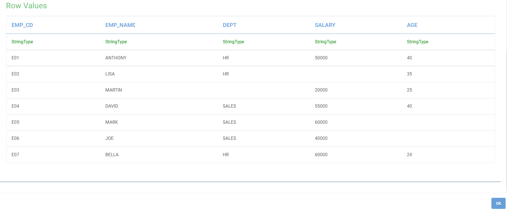
   
**Node Schema Validation Node Configuration**

*	``Node Schema Validation`` node is configured as below.
*	Validation rule needs to be entered in the ``Validation`` box. Validation rule needs to be entered in the format - Column_Name, Data_Type, Required (true/false), Value_To_ImputeMissingValue. Each rule needs to be entered in a separate row.
*	Output would be a dataset after imputing missing values.

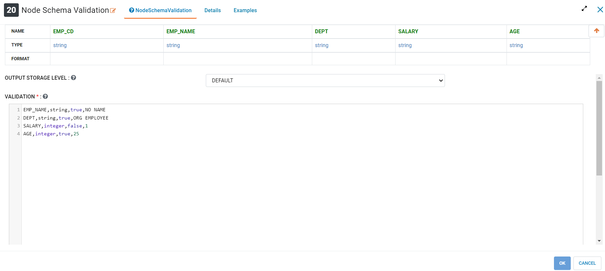
   
**Node Schema Validation Node Output**

Output of ``Node Schema Validation`` node would be a dataset after imputing missing values.

*	Various validations results printed as below.

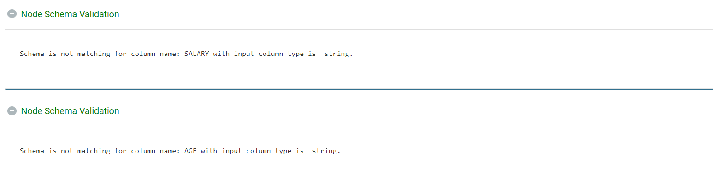

*	Schema Validation result.

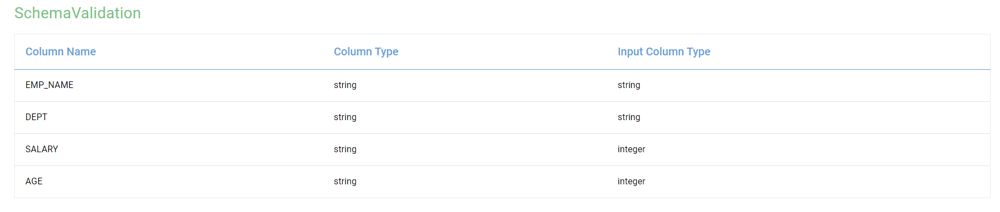

*	Dataset after imputing missing values.

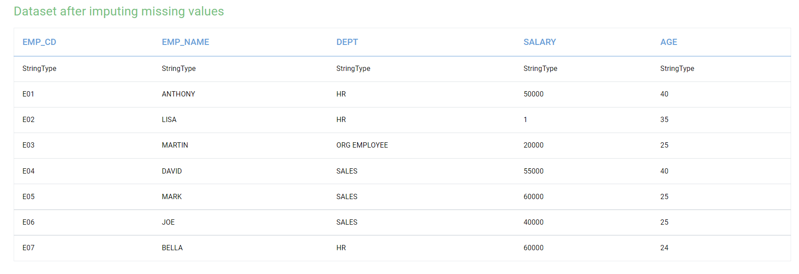

Validate Address
----------------------------------------

Below is a sample workflow that contains ``Validate Address`` processor in Fire Insights. It demonstrates the usage of ``Validate Address`` node to validate address data value against a valid address format. Some of the valid address formats are '123 xyx avenue' and '1/1 block-D street'.

It does  the following processing of data:

*	Reads incoming datasets.
*	Validates address data value against a valid address format using ``Validate Address`` node. Some of the valid address formats are '123 xyx avenue' and '1/1 block-D street'.
*	Prints address validation result in output.

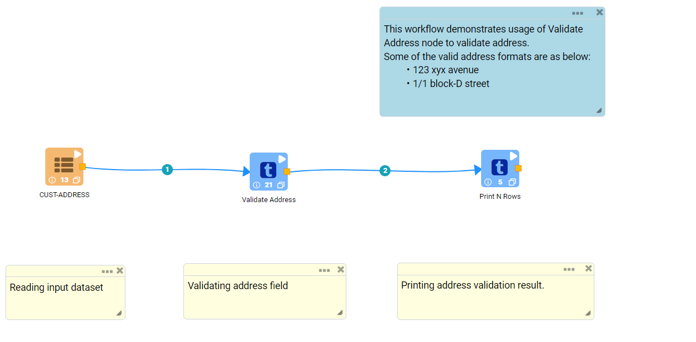
   
**Incoming Dataset**

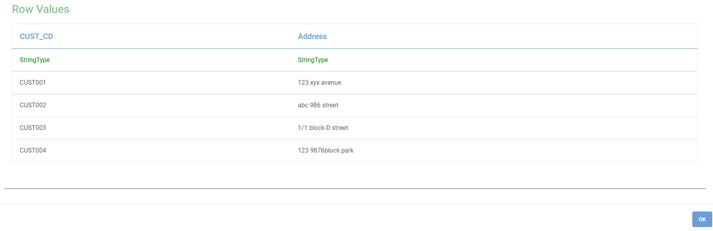
   
**Validate Address Node Configuration**

*	``Validate Address`` node is configured as below.
*	Column containing Address value is to be selected in ``Input Column Name`` list.
*	Output prints address validation result.

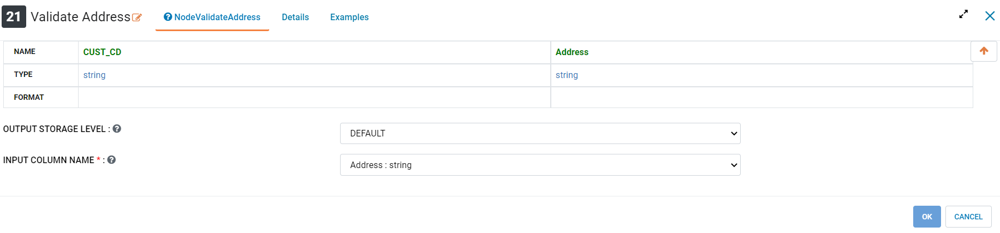
   
**Validate Address Node output**

Output of ``Validate Address`` node prints address validation result.

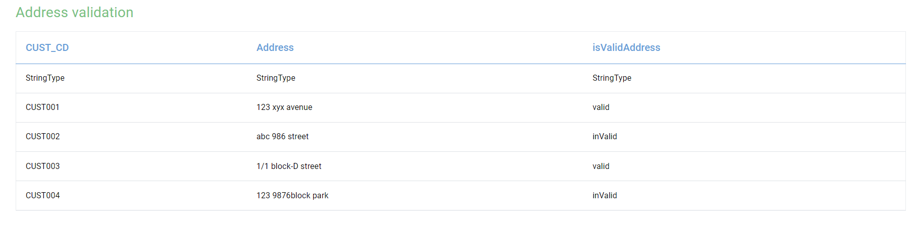

Validate Fields Advanced
----------------------------------------

Below is a sample workflow that contains ``Validate Fields Advanced`` processor in Fire Insights. It demonstrates the usage of ``Validate Fields Advanced`` node to validate incoming dataset based on validation rules defined using validation functions. This node facilitates validation of columns using multiple conditions joined using logical operators like AND / OR.

It does the following processing of data:

*	Reads incoming datasets.
*	Validates incoming dataset based on validation rules defined using validation functions using ``Validate Fields Advanced`` node. This node facilitates validation of columns using multiple conditions joined using logical operators like AND / OR.
*	Prints dataset containing rows that pass validation rules.

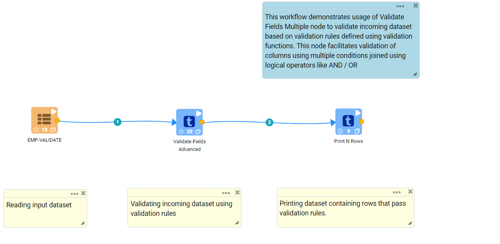
   
**Incoming Dataset**

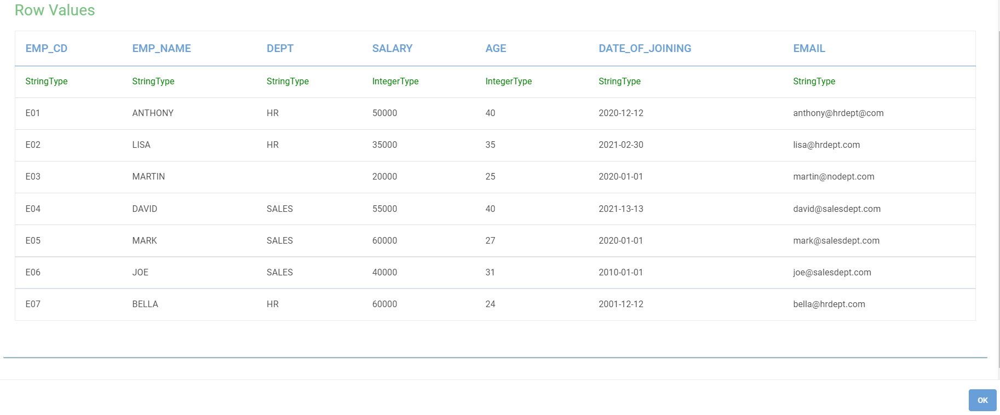
   
**Validate Fields Advanced Node Configuration**

*	``Validate Fields Advanced`` node is configured as below.
*	Short description of validation performed is to be entered in ``Description`` box.
*	Percentage indicating result of validation is to be entered in ``Validation Successful If Percent Good Records>=`` box. Data of each row is validated using validation rules and validation score of 1 is assigned for pass. Summation of validation score percentage against entire dataset for all rules determine Validation Success Percentage.
*	Column that needs to be validated is to be selected in ``Columns`` list.
*	Validation Function that needs to be used to validate data is to be selected in ``Function`` list.
*	If Validation Function compared incoming data against a value then it needs to be entered in ``Value`` box.
*	Logical Operator that needs to be used to join addition validation condition is to be selected in ``Condition`` list.
* 	Three different condiiton can be checked in a validation rule defined for a column.
*	A new row needs to be added to define additional validation rule. 
*	Output prints dataset containing rows that pass validation rules.

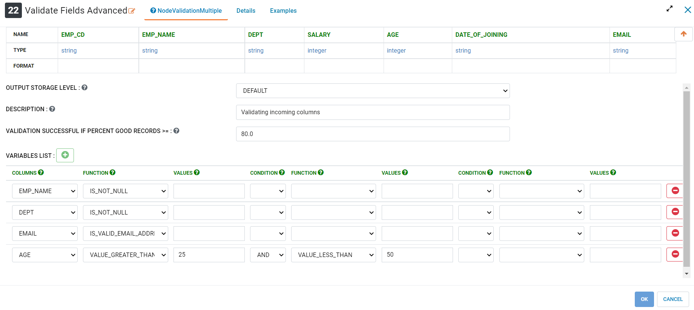
   
**Validate Fields Advanced Node Output**

Output of ``Validate Fields Advanced`` node prints dataset containing rows that pass validation rules.

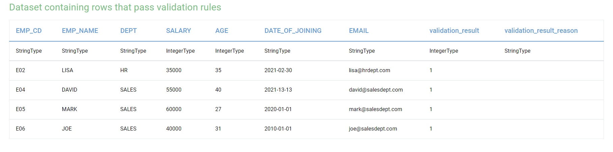

Validate Fields Simple
----------------------------------------

Below is a sample workflow that contains ``Validate Fields Simple`` processor in Fire Insights. It demonstrates the usage of ``Validate Fields Simple`` node to validate incoming dataset based on validation rules defined using validation functions.

It does the following processing of data:

*	Reads incoming datasets.
*	Validates incoming dataset based on validation rules defined using validation functions using ``Validate Fields Simple`` node.
*	Prints dataset containing rows that pass validation rules.

.. figure:: ../../_assets/user-guide/data-preparation/data-validation/validatesimple-workflow.png
   :alt: datavalidation_userguide
   :width: 75%
   
**Incoming Dataset**

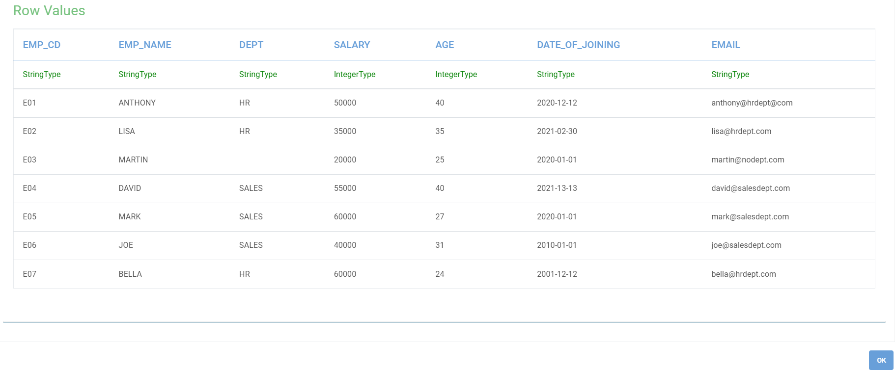
   
**Validate Fields Simple Node configuration**

*	``Validate Fields Simple`` node is configured as below.
*	Short description of validation performed is to be entered in ``Description`` box.
*	Column that needs to be validated is to be selected in ``Columns`` list.
*	Validation Function that needs to be used to validate data is to be selected in ``Function`` list.
*	If Validation Function compared incoming data against a value then it needs to be entered in ``Value`` box.
*	A new row needs to be added to define additional validation rule. 
*	Output prints dataset containing rows that pass validation rules.

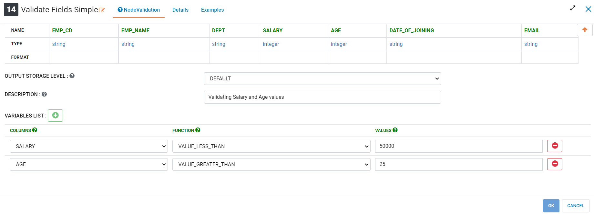
   
**Validate Fields Simple Node Output**

Output of ``Validate Fields Simple`` node prints dataset containing rows that pass validation rules.

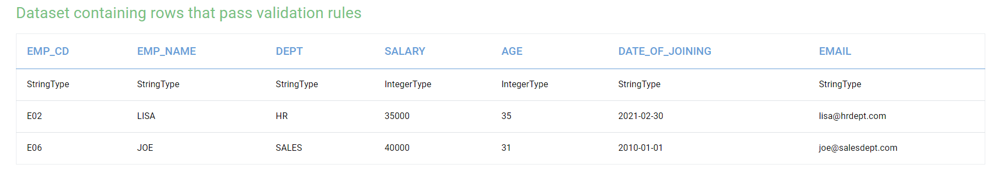
