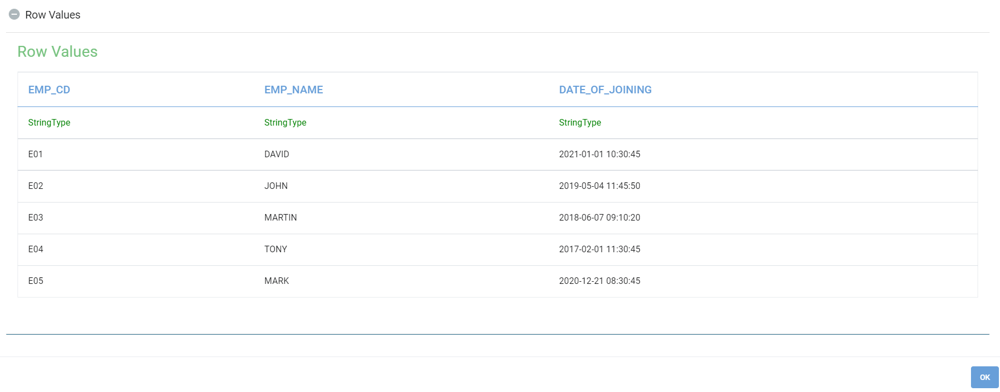
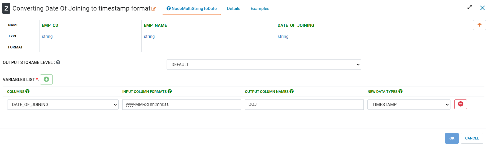
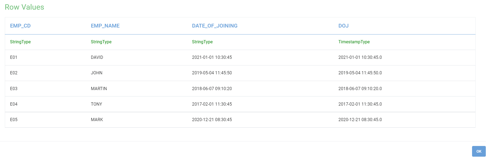
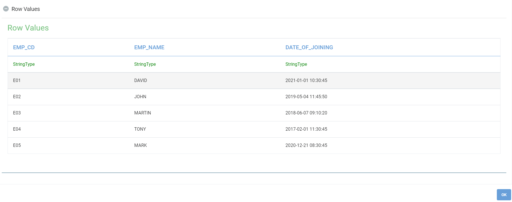
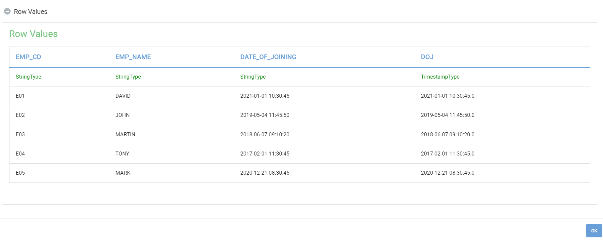
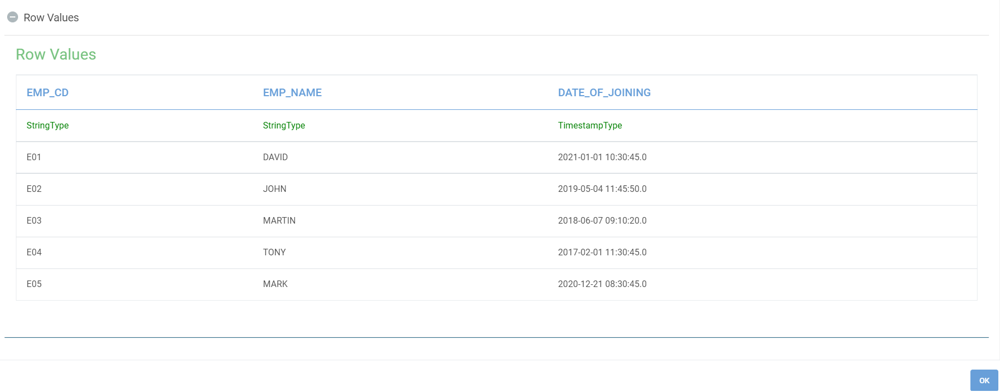
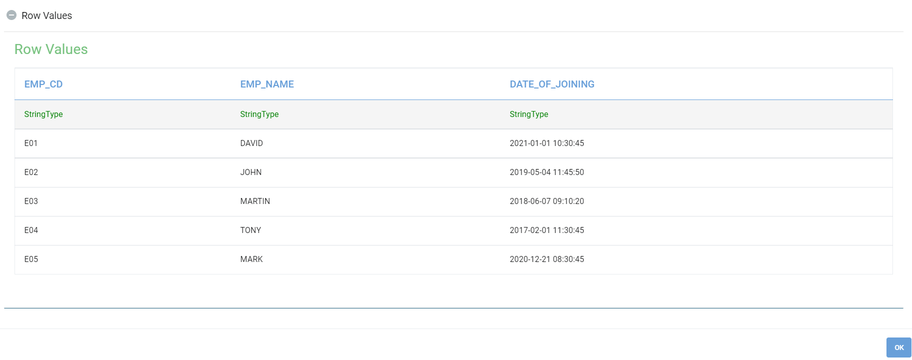

DateTime
==========

Fire Insights provide processors for performing DateTime Formatting, Conversion and Year, Date, Time Split.

Date Time Processors in Fire Insights
----------------------------------------

.. list-table:: DateTime Processors
   :widths: 30 70
   :header-rows: 1

   * - Title
     - Description
   * - Date Time Field Extract
     - It extracts Date parts such as Year, Month, Day Of Month, Hour, Minute, Second and Week Of Year values from an incoming Date value and append extracted parts to to the outgoing Dataframe.
   * - Date Difference
     - It computes difference between two Dates in number of Days, Hours, Minutes and Seconds.
   * - Date To String
     - This node converts a date/time column to a string with the given format.
   * - String To Date
     - This node converts a string column to date using the given date/time format.
   * - String To Unix Time
     - It converts a Date Value in String format to Unix Time value i.e. the number of seconds that have elapsed since the Unix epoch.
   * - Time Functions
     - Node to extract the year, day of the month, day of the year, week of the year, day of the week, quarter, hour, minute, second & season.
   * - Unix Time To String
     - It converts Unix Time Value to Date Value in String format. 

Date Time Field Extract
----------------------------------------

Below is a sample workflow which contains ``Date Time Field Extract`` processor in Fire Insights. It demonstrates usage of Date Time Field Extract node to extract Date Time parts and add them as new columns.

It does following processing of data:

*	Reads incoming Dataset
* 	Transforms String column (Date Of Joining) to Date Time column using ``String To Date`` node
*	Extracts Date Time parts from Date Time column and adds them as new columns using ``Date Time Field Extract`` node
* 	Output Dataset is printed using Print node

.. figure:: ../../_assets/user-guide/data-preparation/datetime/dtfieldextract-demo-workflow.png
   :alt: datetime_userguide
   :width: 90%
   
**Incoming dataset**

**String To Date Node configuration**

Transforms String column (Date Of Joining) to Date Time column using ``String To Date`` node.

**String To Date Node output**

**Date Time Field Extract Node configuration**

Extracts Date Time parts from Date Time column and adds them as new columns using ``Date Time Field Extract`` node.

.. figure:: ../../_assets/user-guide/data-preparation/datetime/dtfieldextract-node-config.png
   :alt: datetime_userguide
   :width: 90%

**Date Time Field Extract output**

Extracted Date Time parts are added as new columns

.. figure:: ../../_assets/user-guide/data-preparation/datetime/dtfieldextract-printnode-output.png
   :alt: datetime_userguide
   :width: 90%

Date Difference
----------------------------------------

Below is a sample workflow which contains ``Date Difference`` processor in Fire Insights. It demonstrates usage of Date Difference node to compute difference between two dates in number of days, hours, minutes and seconds.

It does following processing of data:

*	Reads incoming Dataset
* 	Transforms String column (Date Of Joining) to Date Time column using ``String To Date`` node
*	Computes difference between two Date columns (DOJ and Today) in number of Days, Hours, Minutes and Seconds  using ``Date Difference`` node. Difference calculated is added as new columns
* 	Output Dataset is printed using Print node

.. figure:: ../../_assets/user-guide/data-preparation/datetime/datediff-demo-workflow.png
   :alt: datetime_userguide
   :width: 90%
   
**Incoming dataset**

**String To Date Node configuration**

Transforms String column (Date Of Joining) to Date Time column using ``String To Date`` node.

**String To Date Node output**

**Date Difference Node configuration**

Computes difference between two Date columns (DOJ and Today) in number of Days, Hours, Minutes and Seconds  using ``Date Difference`` node. Difference calculated is added as new columns.

.. figure:: ../../_assets/user-guide/data-preparation/datetime/datediff-node-config.png
   :alt: datetime_userguide
   :width: 90%

**Date Difference output**

Date Difference between two Date Columns is displayed as below.

.. figure:: ../../_assets/user-guide/data-preparation/datetime/datediff-printnode-output.png
   :alt: datetime_userguide
   :width: 90%

Date To String
----------------------------------------

Below is a sample workflow which contains ``Date To String`` processor in Fire Insights. It demonstrates usage of Date To String node to convert a Date value to String value of specified format.

It does following processing of data:

*	Reads incoming Dataset
* 	Transforms Date value (Date Of Joining) to String value (Reformatted DOJ) in MMM dd, yyyy hh:mm:ss format using ``Date To String`` node
* 	Output Dataset is printed using Print node

.. figure:: ../../_assets/user-guide/data-preparation/datetime/datetostr-demo-workflow.png
   :alt: datetime_userguide
   :width: 90%
   
**Incoming dataset**

**Date To String Node configuration**

Transforms Date value (Date Of Joining) to String value (Reformatted DOJ) in MMM dd, yyyy hh:mm:ss format using ``Date To String`` node.

.. figure:: ../../_assets/user-guide/data-preparation/datetime/datetostr-node-config.png
   :alt: datetime_userguide
   :width: 90%

**Date To String output**

Transformed data is displayed as below.

.. figure:: ../../_assets/user-guide/data-preparation/datetime/datetostr-printnode-output.png
   :alt: datetime_userguide
   :width: 90%

String To Date
----------------------------------------

Below is a sample workflow which contains ``String To Date`` processor in Fire Insights. It demonstrates usage of String to Date node to convert a String value in date format to Date value.

It does following processing of data:

*	Reads incoming Dataset
* 	Transforms String column (Date Of Joining) to Date Time column using ``String To Date`` node
* 	Output Dataset is printed using Print node

.. figure:: ../../_assets/user-guide/data-preparation/datetime/strtodate-demo-workflow.png
   :alt: datetime_userguide
   :width: 90%
   
**Incoming dataset**

**String To Date Node configuration**

Transforms String column (Date Of Joining) to Date Time column using ``String To Date`` node.

.. figure:: ../../_assets/user-guide/data-preparation/datetime/strtodate-node-config.png
   :alt: datetime_userguide
   :width: 90%

**String To Date output**

Transformed data is displayed as below.

.. figure:: ../../_assets/user-guide/data-preparation/datetime/strtodate-printnode-output.png
   :alt: datetime_userguide
   :width: 90%
