Date Time Functions
==========

Fire Insights provides processors for performing DateTime Formatting, Conversion and Year, Date, Time Split.

Date Time Processors in Fire Insights
----------------------------------------

.. list-table:: 
   :widths: 30 70
   :header-rows: 1

   * - Title
     - Description
   * - Date Time Field Extract
     - It extracts Date parts such as Year, Month, Day Of Month, Hour, Minute, Second and Week Of Year values from an incoming Date value and append extracted parts to to the outgoing Dataframe.
   * - Date Difference
     - It computes difference between two Dates in number of Days, Hours, Minutes and Seconds.
   * - Date To Age
     - It computes number of Years and Days elapsed since a selected date value.
   * - Date To String
     - This node converts a date or time column to a string column in the given format.
   * - String To Date
     - This node converts a string column to date column using a given date or time format.
   * - String To Unix Time
     - It converts a Date Value in String format to Unix Time value i.e. the number of seconds that have elapsed since the Unix epoch.
   * - Time Functions
     - Node to extract the year, day of the month, day of the year, week of the year, day of the week, quarter, hour, minute, second & season.
   * - Unix Time To String
     - It converts Unix Time Value to Date Value in String format. 

Date Time Field Extract
----------------------------------------

Below is a sample workflow which contains ``Date Time Field Extract`` processor in Fire Insights. It demonstrates the usage of ``Date Time Field Extract`` node to extract Date Time parts and add them as new columns.

It does the following processing of data:

*	Reads incoming dataset.
* 	Transforms String column (Date Of Joining) to Date Time column using ``String To Date`` node.
*	Extracts Date Time parts from Date Time column and adds them as new columns using ``Date Time Field Extract`` node.
* 	Output Dataset is printed using the Print node.

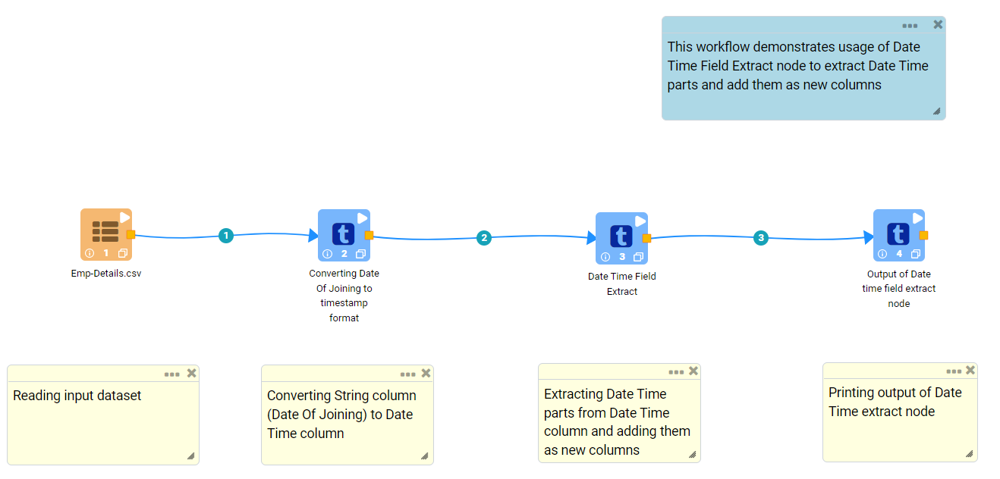
   

**Date Time Field Extract Node Configuration**

*	Extracts Date Time parts from Date Time column and adds them as new columns using ``Date Time Field Extract`` node.
*	A Date Time column from the incoming Dataset needs to be selected in ``Column``.
* 	Date Time parts that need to be extracted is to be selected as ``True``. Extracted Date Time parts would be appended as new columns to the outgoing Dataset.

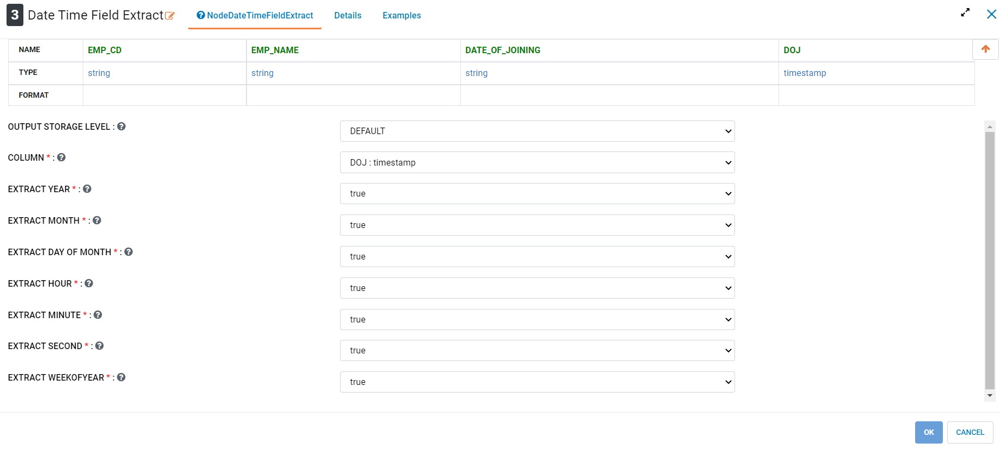

**Date Time Field Extract Output**

Extracted Date Time parts are added as new columns

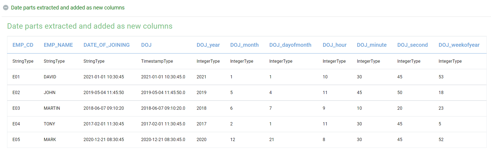

Date Difference
----------------------------------------

Below is a sample workflow which contains ``Date Difference`` processor in Fire Insights. It demonstrates the usage of ``Date Difference`` node to compute difference between two dates in number of days, hours, minutes and seconds.

It does the following processing of data:

*	Reads incoming dataset.
* 	Transforms String column (Date Of Joining) to Date Time column using ``String To Date`` node.
*	Computes difference between two Date columns (DOJ and Today) in number of Days, Hours, Minutes and Seconds using ``Date Difference`` node. Difference calculated values are added as new columns.
* 	Output Dataset is printed using the Print node.

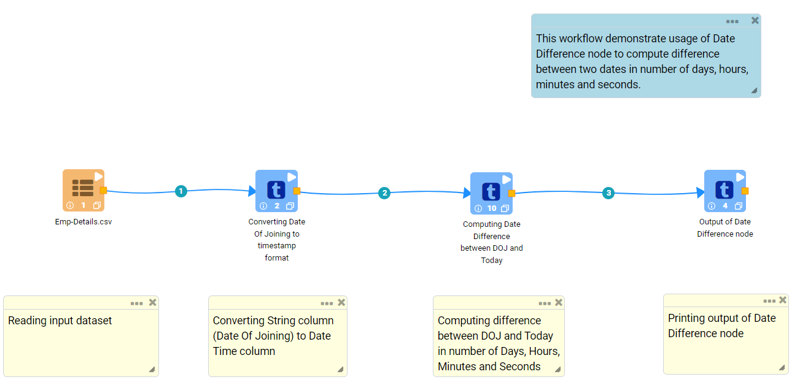
   
   
**Date Difference Node Configuration**

*	It computes difference between two Date columns (DOJ and Today) in number of Days, Hours, Minutes and Seconds using ``Date Difference`` node. Difference of calculated values are added as new columns.
*	Date columns from incoming Dataset between which difference needs to be calculated are to be selected as ``From Date`` and ``To Date``.
*	If difference needs to be calculated with respect to ``Current Date`` then ``USECURRENTDATEASTOCOL`` needs to be set to ``True``.
*	``Day``, ``Hours``, ``Minutes`` and ``Seconds`` need to be set to ``True`` to compute difference, i.e., if ``Hours`` is set to true then difference would be computed in Number of Hours. 
*	Difference Calculated values would be added as new columns to the outgoing Dataset.

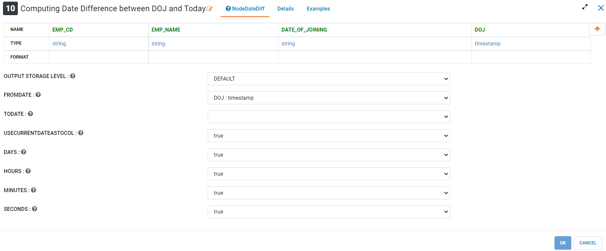

**Date Difference Output**

Date Difference between two Date Columns is displayed as below.

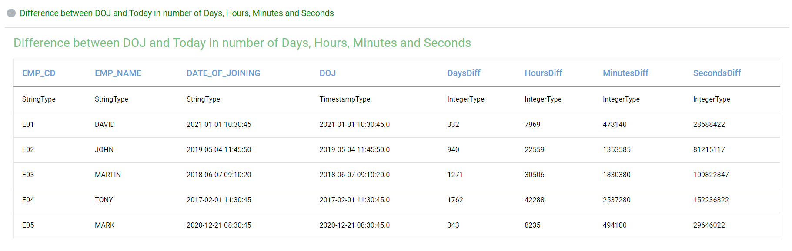

Date To Age
----------------------------------------

Below is a sample workflow which contains ``Date To Age`` processor in Fire Insights. It demonstrates the usage of ``Date To Age`` node to compute Number of Years and Days elapsed since selected date value.

It does the following processing of data:

*	Reads incoming datasets.
*	Computes Number of Years and Days elapsed since selected date value using ``Date To Age`` node.
*	Prints dataset containing Number of Years and Days elapsed.

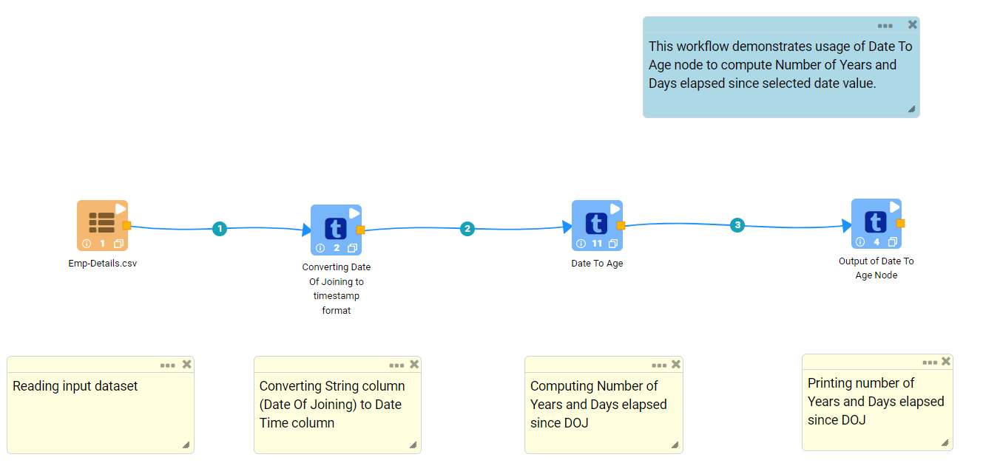
   
**Incoming Dataset**

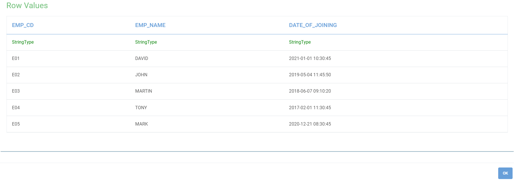
   
**Date To Age Node Configuration**

*	``Date To Age`` node is configured as below.
*	Date column against which Number of elapsed Years and Days needs to be calculated is to be selected in ``Input Column Name`` list.
*	Column in the output to list number of Years elapsed is to be entered in ``Years Output Column Name`` box.
*	Column in the output to list number of Days elapsed is to be entered in ``Days Output Column Name`` box.
*	Output prints dataset containing Number of Years and Days elapsed.

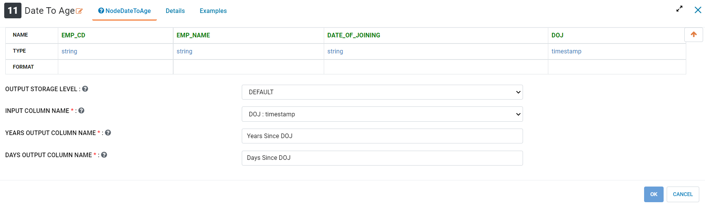
   
**Date To Age Node Output**

Output of ``Date To Age`` node prints dataset containing Number of Years and Days elapsed.

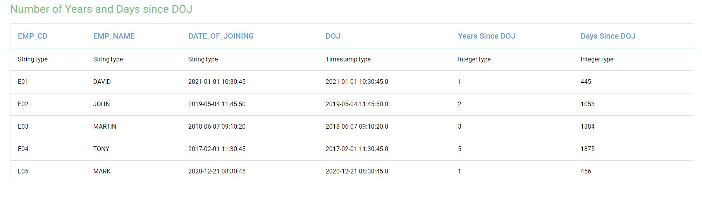

Date To String
----------------------------------------

Below is a sample workflow which contains ``Date To String`` processor in Fire Insights. It demonstrates the usage of ``Date To String`` node to convert a Date value to String value of specified format.

It does the following processing of data:

*	Reads incoming dataset.
* 	Transforms Date value (Date Of Joining) to String value (Reformatted DOJ) in ``MMM dd, yyyy hh:mm:ss`` format using ``Date To String`` node.
* 	Output Dataset is printed using the Print node.

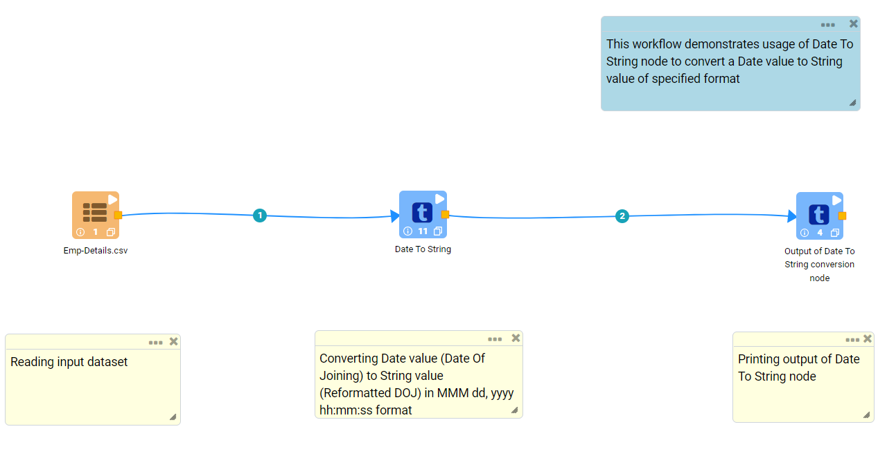
   
**Date To String Node Configuration**

*	Transforms Date value (Date Of Joining) to String value (Reformatted DOJ) in ``MMM dd, yyyy hh:mm:ss`` format using ``Date To String`` node.
*	Date Time columns from the incoming Dataset need to be selected as ``Input Column Name``. If multiple columns need to be transformed then additional rows need to be added.
*	Date format in which transformed data needs to be displayed is to be entered in ``Output Column Formats``.
*	Output column to display transformed data needs to be entered in ``Output Column Names``.

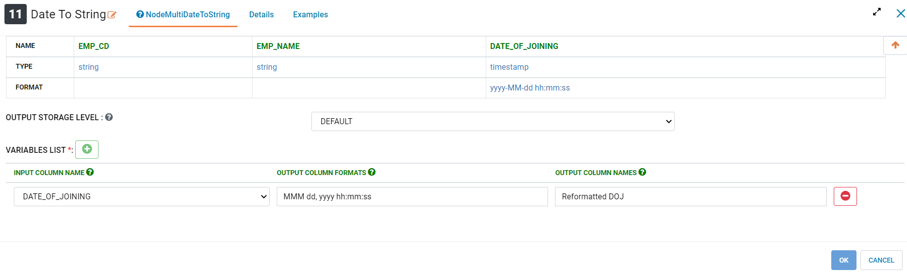

**Date To String Output**

Transformed data is displayed as below.

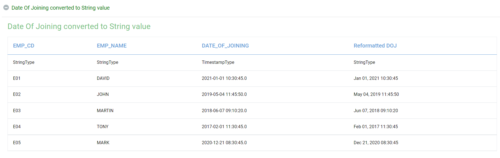

String To Date
----------------------------------------

Below is a sample workflow which contains ``String To Date`` processor in Fire Insights. It demonstrates the usage of ``String to Date`` node to convert a Date value in String format to a Date value.

It does the following processing of data:

*	Reads incoming dataset.
* 	Transforms String column (Date Of Joining) to Date Time column using ``String To Date`` node.
* 	Output Dataset is printed using the Print node.

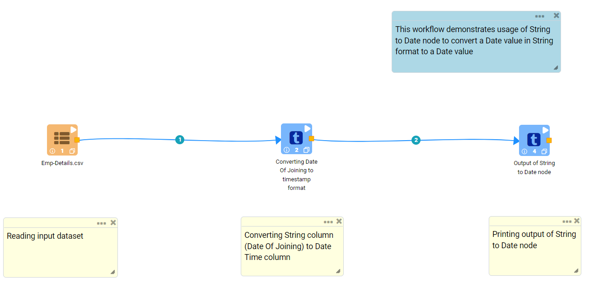
   
**String To Date Node Configuration**

*	It transforms String column (Date Of Joining) to Date Time column using ``String To Date`` node.
*	String columns from the incoming Dataset containing Date value in String format need to be selected in ``Columns``. If multiple columns need to be transformed then additional rows need to be added.
*	Date format in which Date value is present needs to be entered in ``Input Column Formats``.
*	Output column name to hold transformed data needs to be entered in ``Output Column Names``.
*	Datatype of the transformed data needs to be entered in ``New Data Types``.

**String To Date output**

Transformed data is displayed as below.

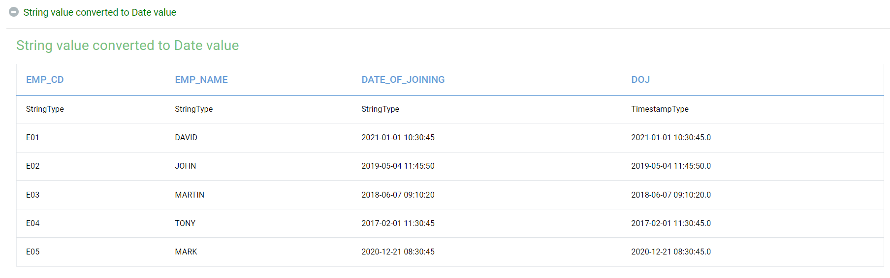

String To Unix Time
----------------------------------------

Below is a sample workflow which contains ``String To Unix Time`` processor in Fire Insights. It demonstrates usage of ``String To Unix Time`` node to convert a Date value in String format to Unix Time value i.e. the number of seconds that have elapsed since the Unix epoch.

It does following processing of data:

*	Reads incoming dataset.
* 	Transforms String column (Date Of Joining) to Unix Time value using ``String To Unix Time`` node.
* 	Output Dataset is printed using the Print node.

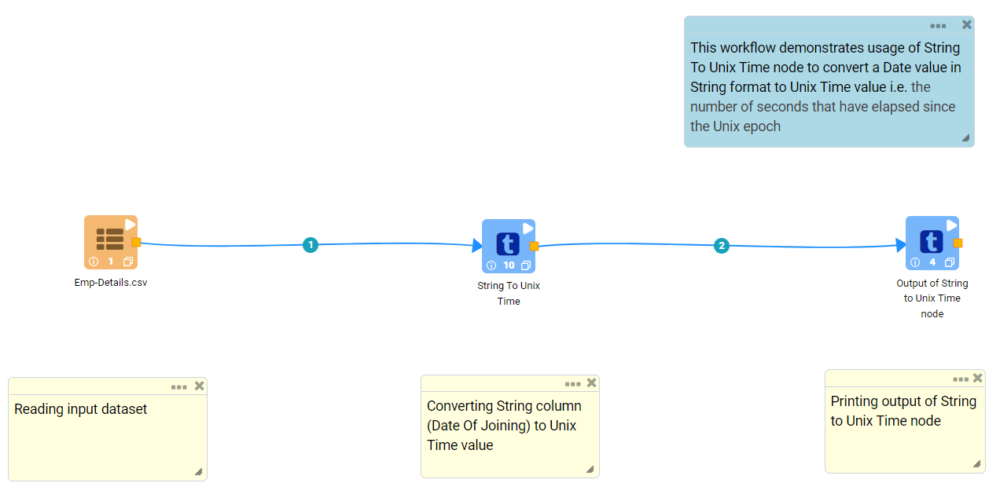
   
**String To Unix Time Node Configuration**

*	Transforms String column (Date Of Joining) to Unix Time value using ``String To Unix Time`` node.
*	String column from the incoming Dataset containing Date value in String format need to be selected in ``Input Column Name``.
*	Date format in which Date value is present needs to be entered in ``Input Column Format``.
*	Output column name to hold transformed data needs to be entered in ``Output Column Name``.

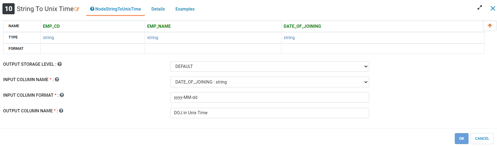

**String To Unix Time Output**

Transformed data is displayed as below.

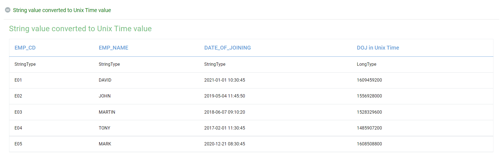

Time Functions
----------------------------------------

Below is a sample workflow which contains ``Time Functions`` processor in Fire Insights. It demonstrates the usage of ``Time Functions`` node to extract Date Time parts and add them as new columns.

It does the following processing of data:

*	Reads incoming dataset.
* 	Transforms String column (Date Of Joining) to Date Time column using ``String To Date`` node.
*	Extracts Date Time parts from Date Time column and adds them as new columns using ``Time Functions`` node.
* 	Output Dataset is printed using the Print node.

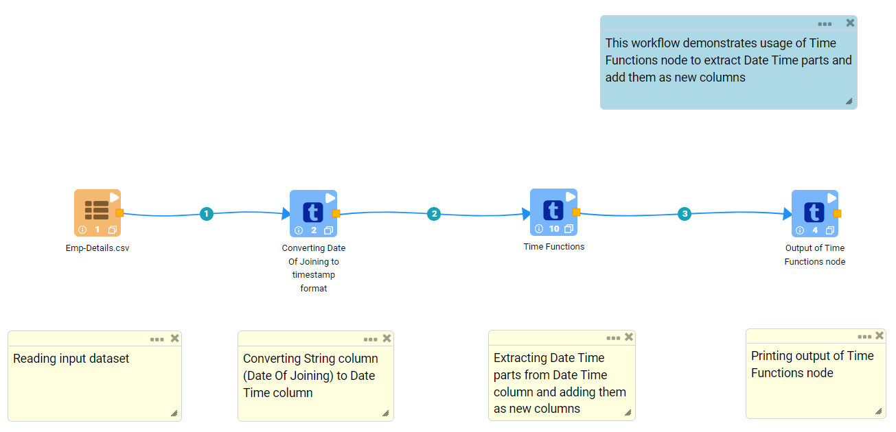
   
**Time Functions Node Configuration**

*	Extracts Date Time parts from Date Time column and adds them as new columns using ``Time Functions`` node.
*	Date Time column from the incoming Dataset from which Date Time parts need to be extracted is to be selected in ``Timestamp Column Name``.
*	Date Time parts that need to be extracted is to be selected in ``Time Functions``. Extracted values would be appended as new columns to the outgoing dataset.

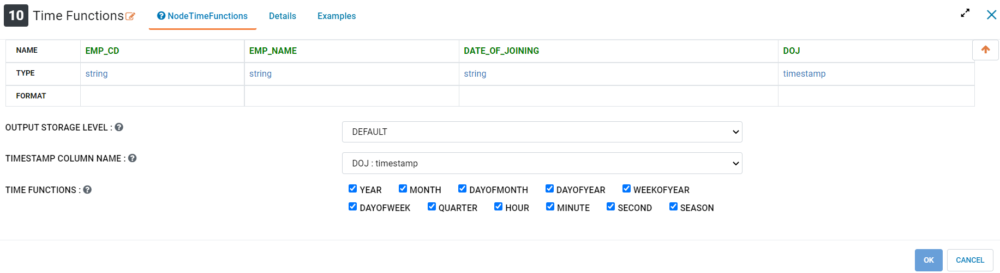

**Time Functions Output**

Date Time parts extracted from a Date Time column is displayed as below.

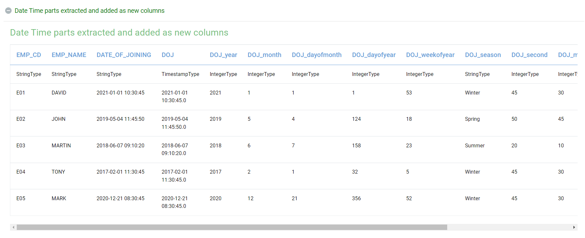
   
Unix Time To String
----------------------------------------

Below is a sample workflow which contains ``Unix Time To String`` processor in Fire Insights. It demonstrates the usage of ``Unix Time to String`` node to convert a Unix Time value to Date value in String format. Unix Time value denotes the number of seconds that have elapsed since the Unix epoch.

It does the following processing of data:

*	Reads incoming dataset
* 	Transforms String column (Date Of Joining) to Unix Time value using ``String To Unix Time`` node.
* 	Transforms Unix Time value back to Date Time value in String format using ``Unix Time To String`` node.
* 	Output Dataset is printed using the Print node.

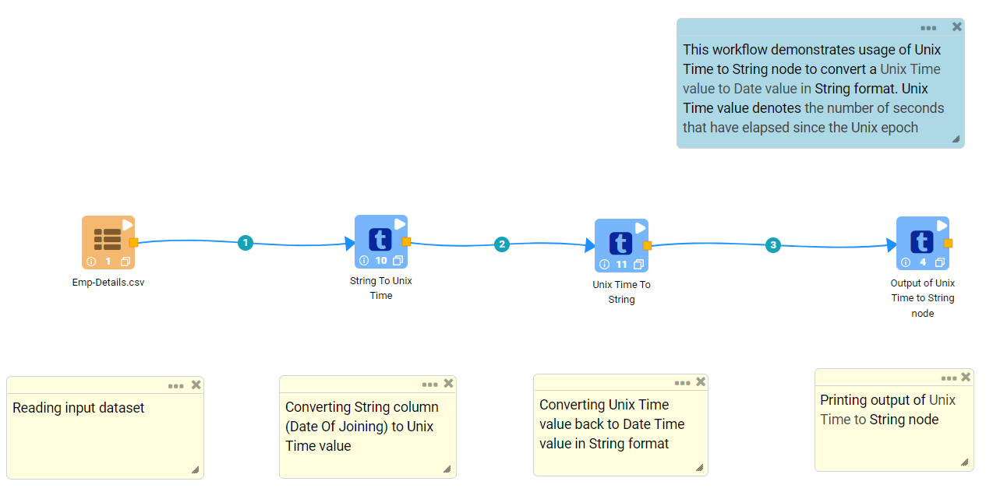
   
**Unix Time To String Node Configuration**

*	It transforms Unix Time value to Date Time value in String format.
*	Field from the input Dataset containing Unix Time value needs to be selected as ``Input Column Name``.
*	``Output Column Name`` needs to be specified for the field to hold transformed Date Time data in String format. It would be added to the outgoing Dataset.
*	Output Date Format needs to be entered in ``Output Column Format`` such as ``yyyy-MM-dd hh:mm:ss``.

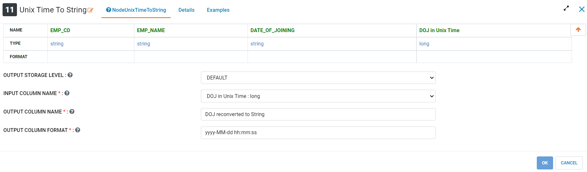

**Unix Time To String Output**

Transformed data would be added to the output and would be displayed as below.

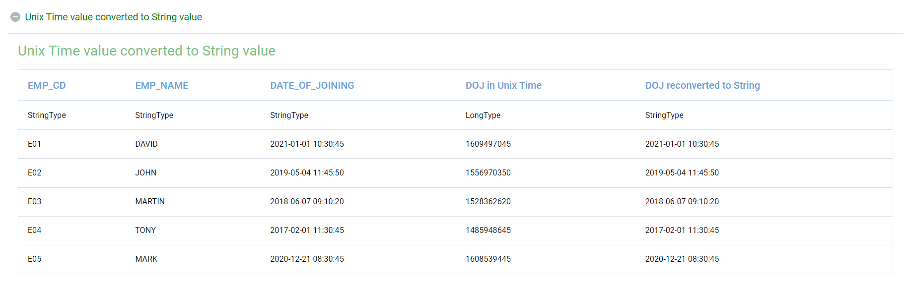
