Filtering
=========

Fire Insights provides processors for filtering columns and rows.

Filtering Processors in Fire Insights
----------------------------------------

.. list-table:: 
   :widths: 30 70
   :header-rows: 1

   * - Title
     - Description
   * - SelectColumns
     - This node creates a new DataFrame that contains only the selected columns.
   * - DropColumns
     - This node creates a new DataFrame by deleting columns specified as an input.
   * - FilterByDateRange
     - This node filters Rows within the given date range.
   * - FilterByStringLength
     - This node filters the Rows within the given string length. The column to be used for determining the string length is specified.
   * - FilterByNumberRange
     - This node filter Rows in the given Number Range.
   * - RowFilter
     - This node creates a new DataFrame containing only rows satisfying given condition.
   * - RowFilterWithIndex
     - This node creates a new DataFrame containing only rows satisfying given condition.
 

Videos
-----------

* Filter by Date Range: https://www.youtube.com/watch?v=jhymRSPH2sQ
* Filter by String Length: https://www.youtube.com/watch?v=VccGi4GYxtE
* Filter By Number Range: https://www.youtube.com/watch?v=g6bKSeFYyIs
* Row Filter: https://www.youtube.com/watch?v=XVXFddSflVk

Select Columns
----------------------------------------

Below is a sample workflow which contains Select Columns processor in Fire Insights. It demonstrates the usage of Select Columns node to create outgoing dataset from columns selected from the incoming dataset.

It does following processing of data:

*	Reads incoming dataset.
*	Selects columns from incoming dataset using Select Columns node. Selected columns are passed on to the outgoing dataset.
* 	Output dataset containing selected columns is printed using Print node.

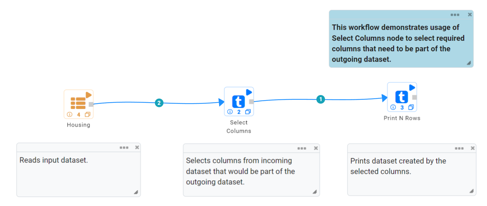
   
**Incoming Dataset**

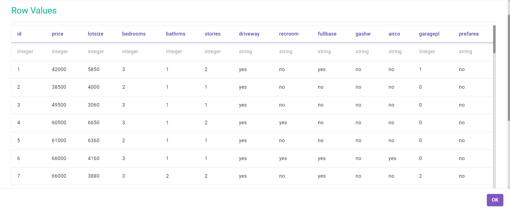

**Select Columns Node Configuration**

Select Columns node is configured as below.

*	Input of this node is the incoming dataset.
*	Columns that need to be part of outgoing dataset are to be selected in ``Columns`` list.
*	Output of this node would contain selected columns only.

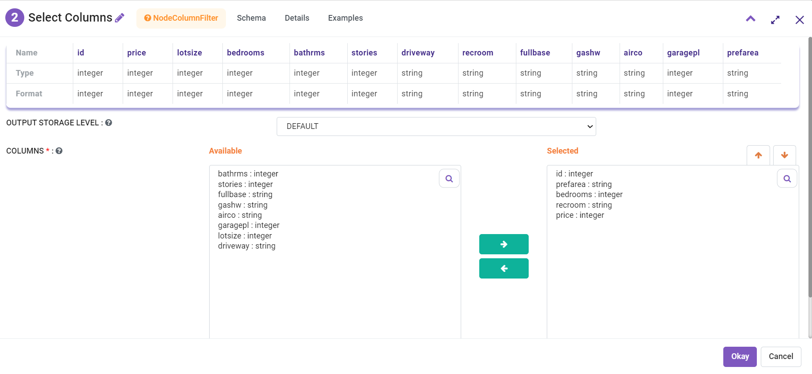
   
**Select Columns Node Output**

Output of Select Columns node displaying selected columns from incoming dataset.

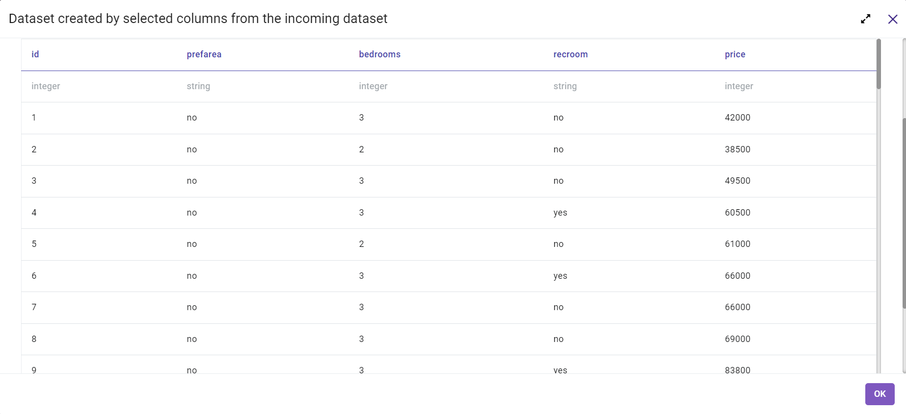
   
Drop Columns
----------------------------------------

Below is a sample workflow which contains Drop Columns processor in Fire Insights. It demonstrates the usage of Drop Columns node to facilitate dropping of selected columns from the outgoing dataset.

It does the following processing of data:

*	Reads incoming dataset.
*	Drops columns from incoming dataset using Drop Columns node. Selected columns are dropped from the outgoing dataset.
* 	Output of dataset containing the remaining columns is printed using the Print node.

.. figure:: ../../_assets/user-guide/data-preparation/filtering/drop-col-wf.png
   :alt: filtering_userguide
   :width: 75%
   
**Incoming Dataset**

**Drop Columns Node Configuration**

Drop Columns node is configured as below.

*	Input of this node is the incoming dataset.
*	Columns that need to be dropped from outgoing dataset are to be selected in ``Columns`` list.
*	Output of this node would contain remaining columns.

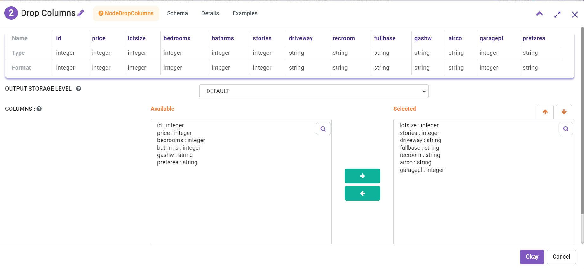
   
**Drop Columns Node Output**

Output of Drop Columns node displaying remainig columns from incoming dataset.

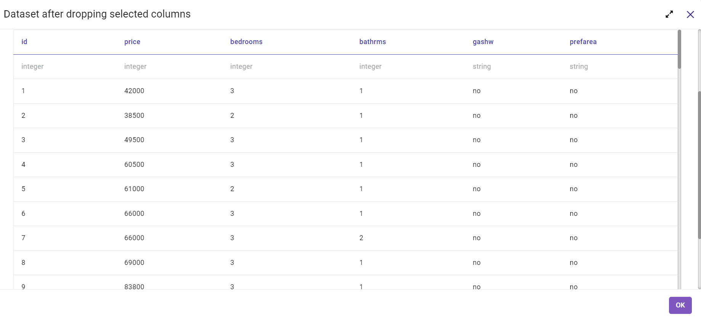
   
Filter By Date Range
----------------------------------------

Below is a sample workflow which contains Filter By Date Range processor in Fire Insights. It demonstrates the usage of Filter By Date Range node to filter incoming dataset based on a given date range. Data of a column, as per selection, is compared against the date range to filter rows.

It does the following processing of data:

*	Reads incoming dataset.
*	Filters incoming dataset for a given date range using Filter By Date Range node. Data of a column, as per selection, is compared against the date range to filter rows.
* 	Output dataset containing rows falling in the given date range is printed using the Print node.

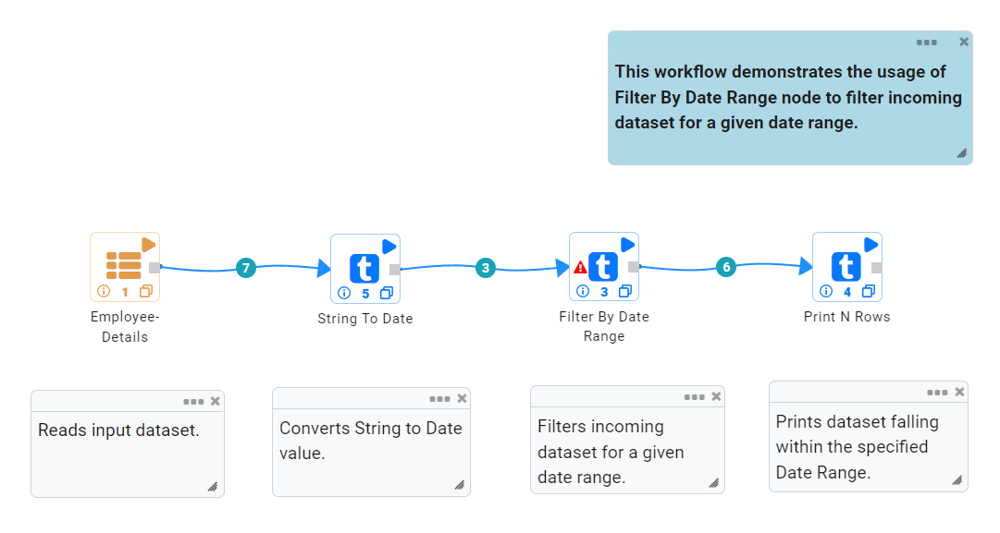
   
**Incoming Dataset**

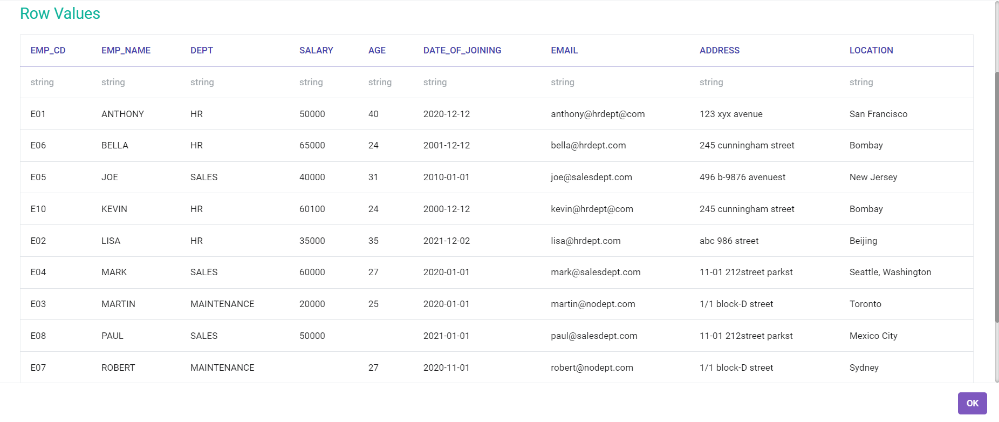

**Filter By Date Range Node Configuration**

Filter By Date Range node is configured as below.

*	Input of this node is the incoming dataset.
*	Column for which the value needs to be checked against the given date range is to be selected in the ``Column`` dropdown.
*	``From Date`` and ``To Date`` defining the date range needs to be selected in the respective fields.
*	Output of this node would contain rows in which selected column's data falls within the selected date range.

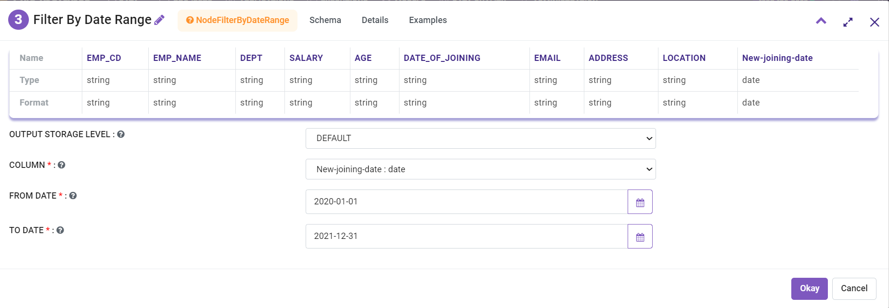
   
**Filter By Date Range Node output**

Output of Filter By Date Range node displaying rows in which selected column's data falls within the selected date range.

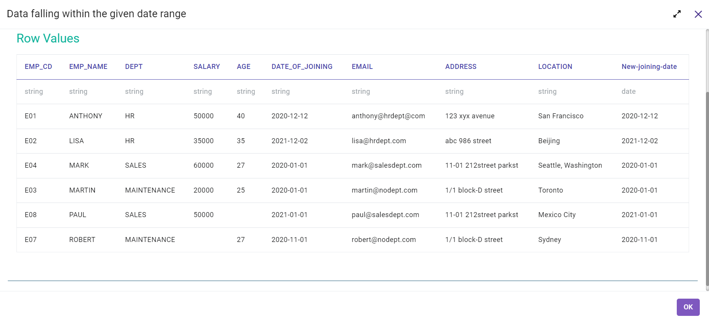
   

Filter By String Length
----------------------------------------

Below is a sample workflow which contains Filter By String Length processor in Fire Insights. It demonstrates the usage of Filter By String Length node to filter incoming dataset based on length of a column's data. Data length of a column, as per selection, is compared against the range defined to filter rows.

It does the following processing of data:

*	Reads incoming dataset.
*	Filters incoming dataset for a given data length range using Filter By String Length node. Data length of a column as per selection is compared against the range defined to filter rows.
* 	Output dataset containing rows in which data length of the selected column falls in the defined range is printed using the Print node.

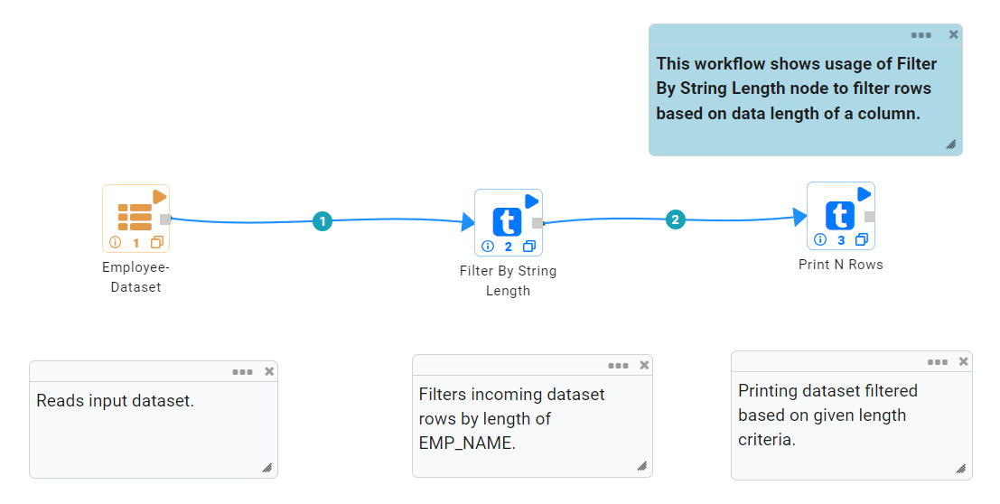
   
**Incoming Dataset**

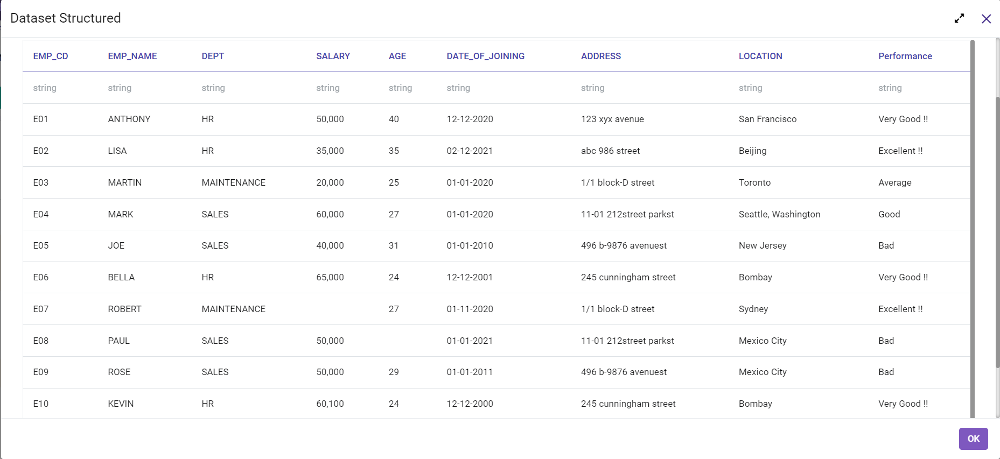

**Filter By String Length Node Configuration**

Filter By String Length node is configured as below.

*	Input of this node is the incoming dataset.
*	Column for which the data length needs to be checked against the given range is to be selected in the ``Input Column Name`` dropdown.
*	``Minimum Length`` and ``Maximum Length`` defining the range needs to be entered in the respective fields.
*	Output of this node would contain rows in which data length of the selected column falls in the defined range.

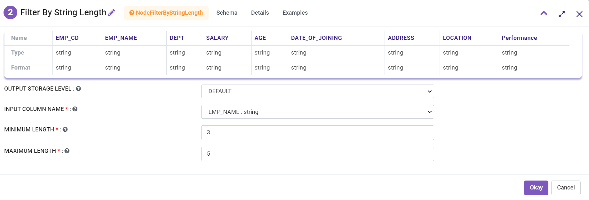
   
**Filter By String Length Node Output**

Output of ``Filter By String Length`` node displaying rows in which data length of the selected column falls in the defined range.

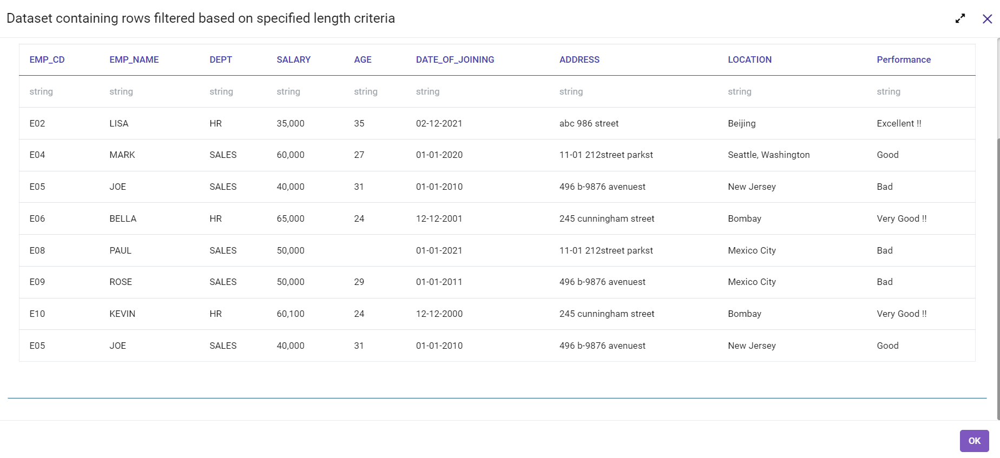
   
Filter By Number Range
----------------------------------------

Below is a sample workflow which contains Filter By Number Range processor in Fire Insights. It demonstrates the usage of Filter By Number Range node to filter incoming dataset based on a column's data falling within a given range. Data value of a column, as per selection, is compared against the range defined to filter rows.

It does the following processing of data:

*	Reads incoming dataset.
*	Filters incoming dataset for a given data value range using Filter By Number Range node. Data value of a column as per selection is compared against the range defined to filter rows.
* 	Output dataset containing rows in which data value of the selected column falls in the defined range is printed using the Print node.

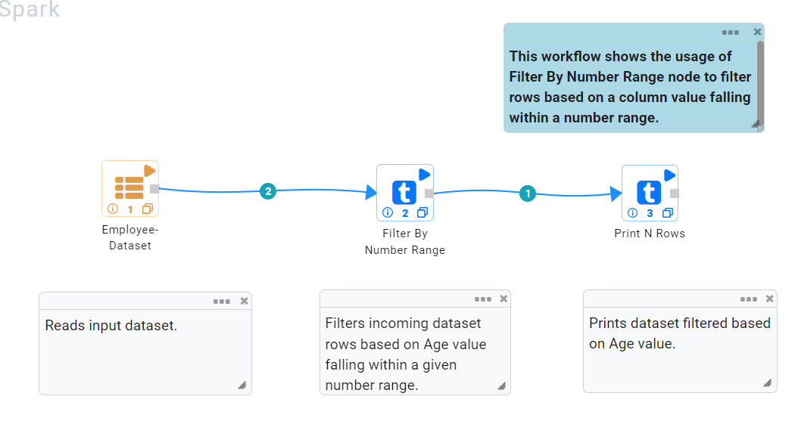
   
**Incoming Dataset**

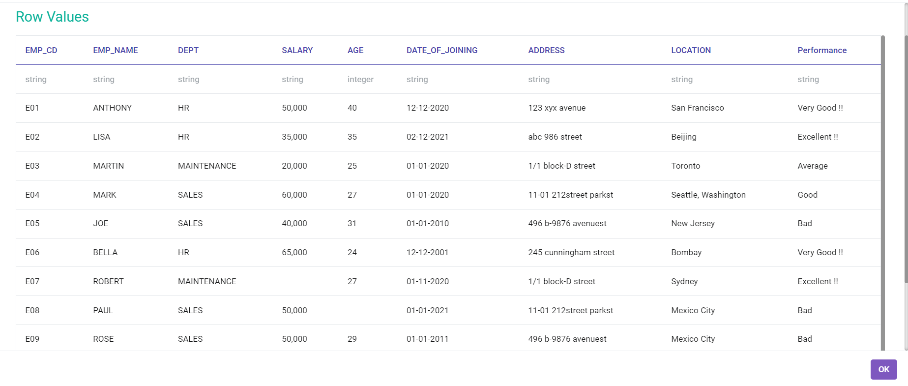

**Filter By Number Range Node Configuration**

Filter By Number Range node is configured as below.

*	Input of this node is the incoming dataset.
*	Column for which the data value needs to be checked against the given range is to be selected in the ``Input Column Name`` dropdown.
*	``Lowest Value`` and ``Highest Value`` defining the range needs to be entered in the respective fields.
*	Output of this node would contain rows in which data value of the selected column falls in the defined range.

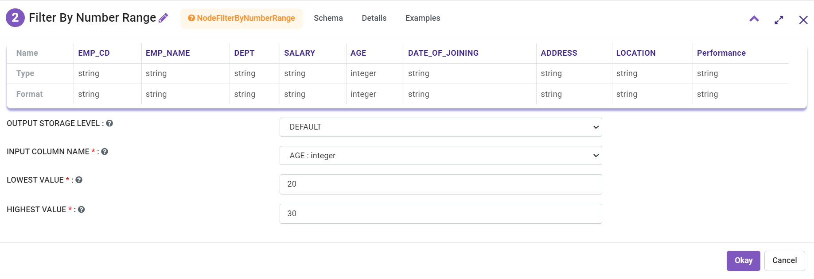
   
**Filter By Number Range Node Output**

Output of Filter By Number Range node displaying rows in which data value of the selected column falls in the defined range.

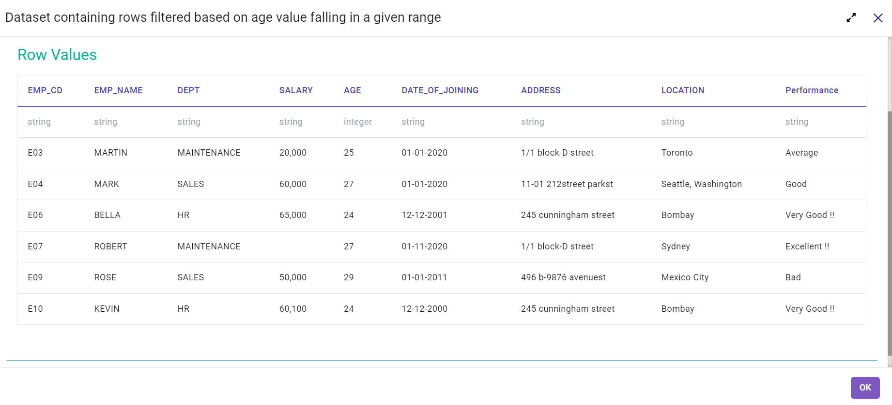
   
Row Filter
----------------------------------------

Below is a sample workflow which contains Row Filter processor in Fire Insights. It demonstrates the usage of Row Filter node to filter incoming dataset based on specified condition.

It does the following processing of data:

*	Reads incoming dataset.
*	Filters incoming dataset based on specified condition using Row Filter node.
* 	Output dataset containing rows that meet the condition specified in the node is printed using the Print node.

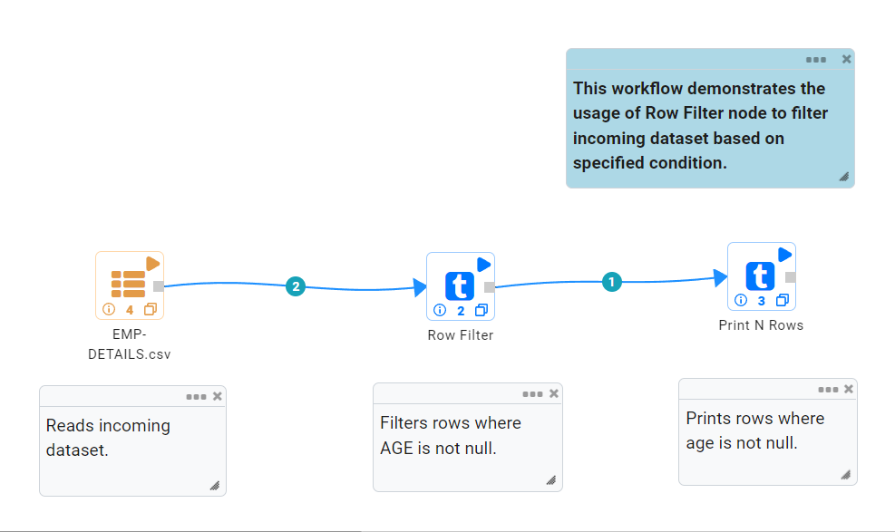
   
**Incoming Dataset**

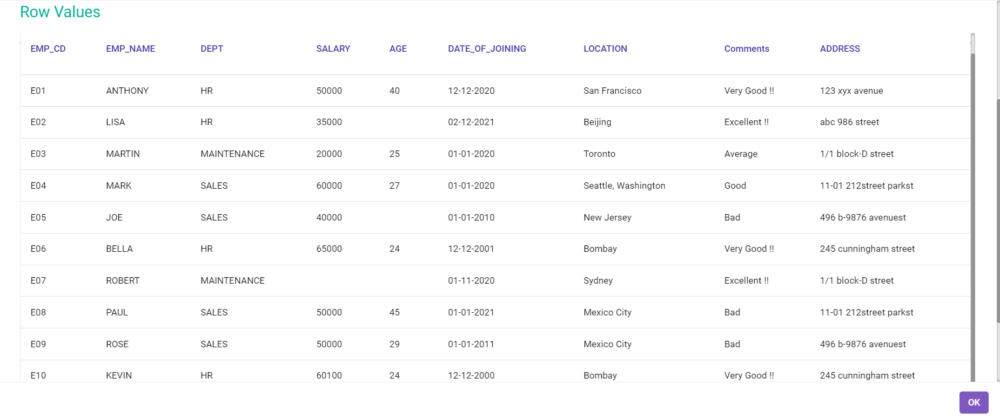

**Row Filter Node Configuration**

Row Filter node is configured as below.

*	Input of this node is the incoming dataset.
*	Condition to select rows needs to be entered in ``Conditional Expression`` box.
*	Output of this node would contain rows that meet the condition specified in the node.

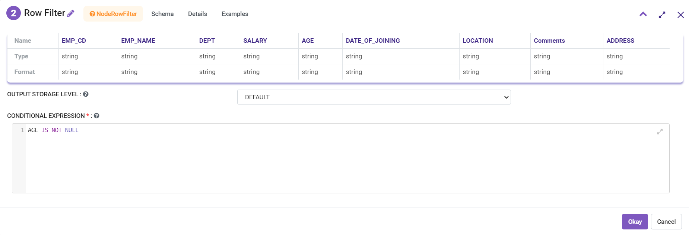
   
**Row Filter Node Output**

Output of Row Filter node displaying rows that meet the condition specified in the node.

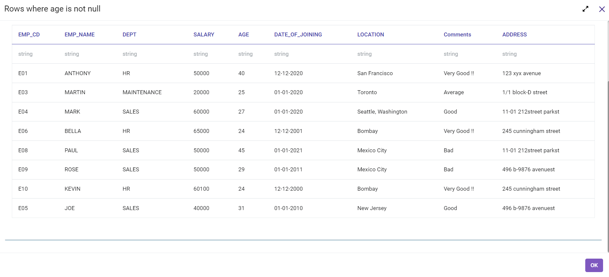
   
Row Filter By Index
----------------------------------------

Below is a sample workflow which contains Row Filter By Index processor in Fire Insights. It demonstrates the usage of Row Filter By Index node to filter rows based on Row Index Numbers or Row Index Range within the incoming dataset.

It does the following processing of data:

*	Reads incoming dataset.
*	Filters incoming dataset based on Row Index Numbers within the incoming dataset using Row Filter By Index node.
* 	Output dataset containing rows with the Row Index Numbers mentioned in the node is printed using the Print node.

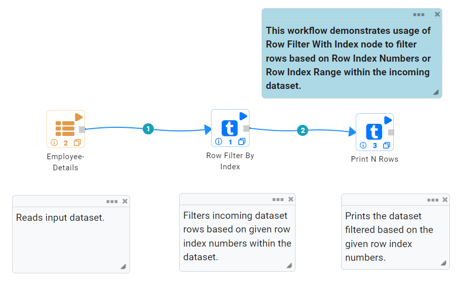
   
**Incoming Dataset**

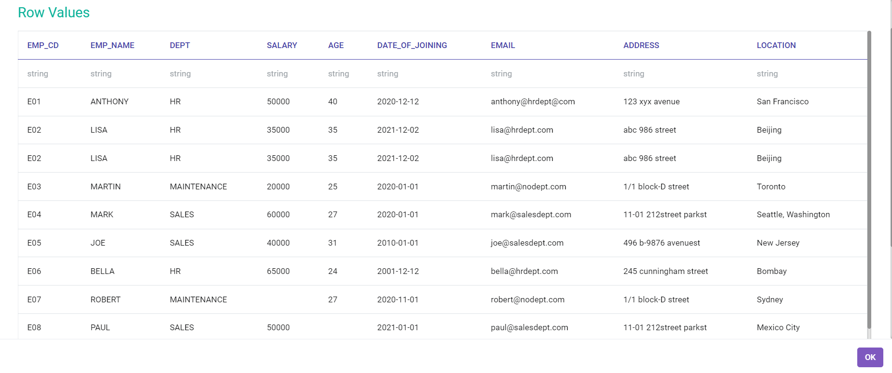

**Row Filter By Index Node configuration**

Row Filter By Index node is configured as below.

*	Input of this node is the incoming dataset.
*	Row Index Numbers that would be used to select rows need to be entered in ``Indexes`` box.
*	Alternatively, range of Row Index Numbers that would be used to select rows can be entered in ``Indexesrange`` box.
*	Output of this node would contain rows with the Row Index Numbers or within the index number range mentioned in the node.

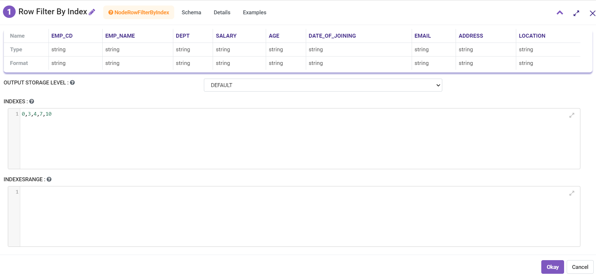
   
**Row Filter By Index Node Output**

Output of Row Filter By Index node displaying rows with the Row Index Numbers specified in the node.

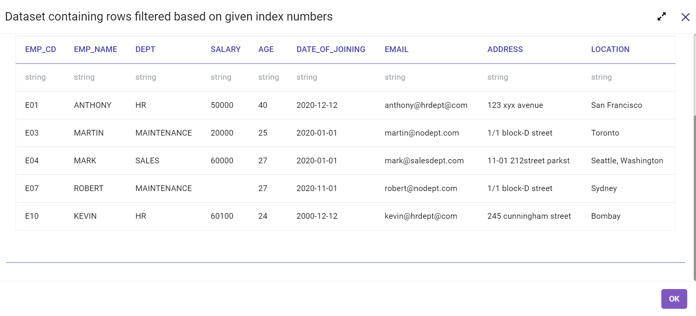
