Imputing
==========

Fire Insights provide processors for Imputing data

Imputing Processors in Fire Insights
----------------------------------------

.. list-table:: Imputing Processors
   :widths: 30 70
   :header-rows: 1

   * - Title
     - Description
   * - Imputing With Constant
     - It imputes missing value with a constant value. It fills missing values (None) in selected columns with a given constant value for the corresponding column, in the incoming        DataFrame
   * - Imputing With Mean Value
     - Imputing the missing values by column mean
   * - Imputing With Median
     - Imputing with missing value with median value. It fills missing values (None) in selected columns with a median value in the corresponding column, in the incoming                 DataFrame.
   * - Imputing With Mode Value
     - Imputing with the most frequently observed value. It fills missing values (None) in selected columns with the most frequently observed value in the corresponding column, in       the incoming DataFrame.

 
Imputing With Constant
----------------------------------------

Below is a sample workflow which contains ``Imputing With Constant`` processor in Fire Insights. It demonstrates usage of ``Imputing With Constant`` node to replace missing values with constant values.

It does following processing of data:

*	Reads incoming Dataset
*	Replaces missing values with constant values using ``Imputing With Constant`` node.
*	Prints output dataset containing replaced values using Print node.

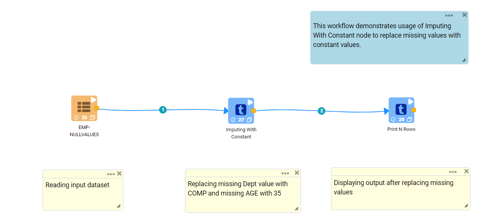
   
**Incoming dataset**

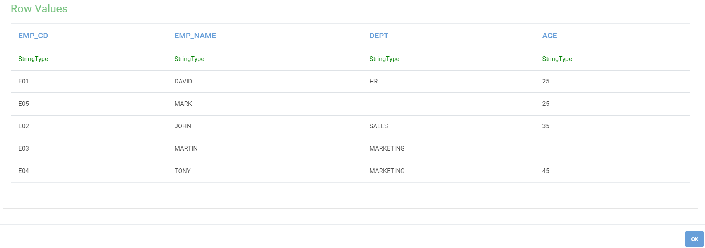

**Imputing With Constant Node configuration**

*	``Imputing With Constant`` node is configured as below.
*	Input of this node is the incoming dataset.
*	Each row in the ``Variables List`` specifies imputing details for each columns.
*	Column in which missing values need to be replaced with Constant value is to be selected in ``Columns`` list.
*	Constant value that needs to be used to replace missing value is to be entered in ``Constants`` box.
*	Additional rows need to be added for each imputing requirement.
*	Output of this node would display misssing values replaced with Constant values.

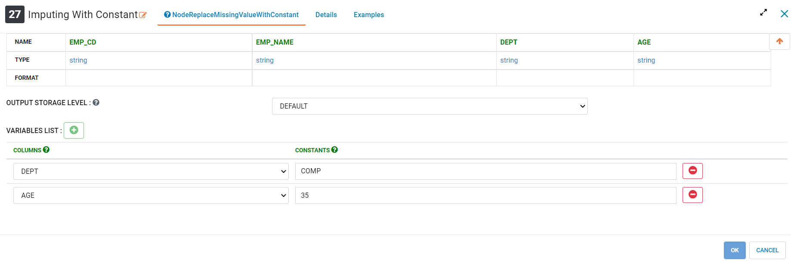
   
**Imputing With Constant Node output**

Output of ``Imputing With Constant`` node displaying misssing values replaced with Constant values.

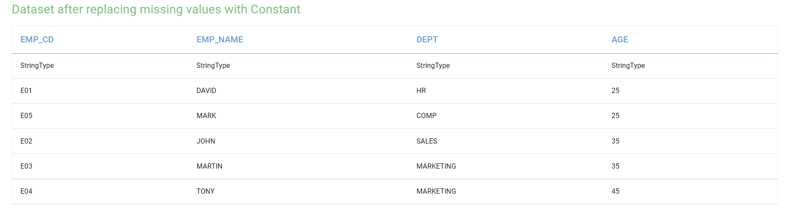
   
Imputing With Mean Value
----------------------------------------

Below is a sample workflow which contains ``Imputing With Mean Value`` processor in Fire Insights. It demonstrates usage of ``Imputing With Mean Value`` node to replace missing values with Mean value of the column.

It does following processing of data:

*	Reads incoming Dataset
*	Replace missing values with Mean value of the column using ``Imputing With Mean Value`` node.
*	Prints output dataset containing missing values replaced with Mean values using Print node.

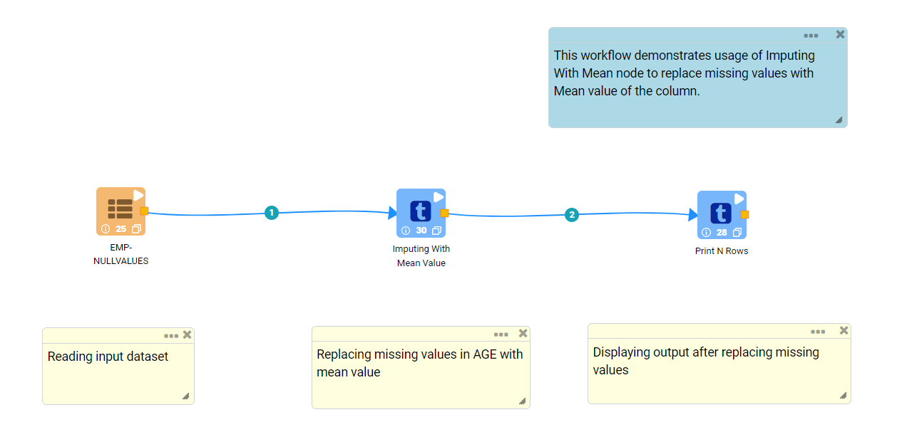
   
**Incoming dataset**

.. figure:: ../../_assets/user-guide/data-preparation/imputing/imputemean-incoming-dataset.png
   :alt: imputing_userguide
   :width: 90%

**Imputing With Mean Value Node configuration**

*	``Imputing With Mean Value`` node is configured as below.
*	Input of this node is the incoming dataset.
*	Numeric columns in which missing values are to be replaced with Mean values need to be selected in ``Column Names`` list.
*	Multiple numeric columns can be selected.
*	Output of this node would display dataset containing missing values replaced with Mean values.

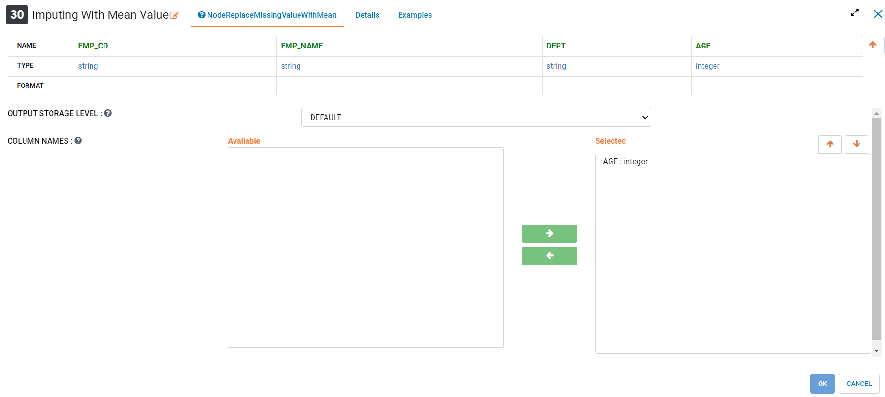
   
**Imputing With Mean Value Node output**

Output of ``Imputing With Mean Value`` node displaying missing values replaced with Mean values.

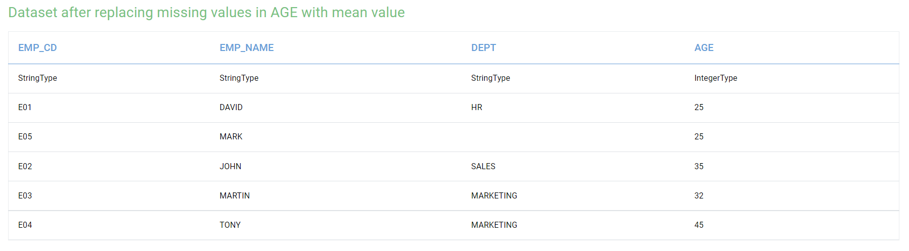
   
Imputing With Median
----------------------------------------

Below is a sample workflow which contains ``Imputing With Median`` processor in Fire Insights. It demonstrates usage of ``Imputing With Median`` node to replace missing values with Meadian value.

It does following processing of data:

*	Reads incoming Dataset
*	Replaces missing values with Median value using ``Imputing With Median`` node.
*	Prints output dataset containing missing values replaced with Median values using Print node.

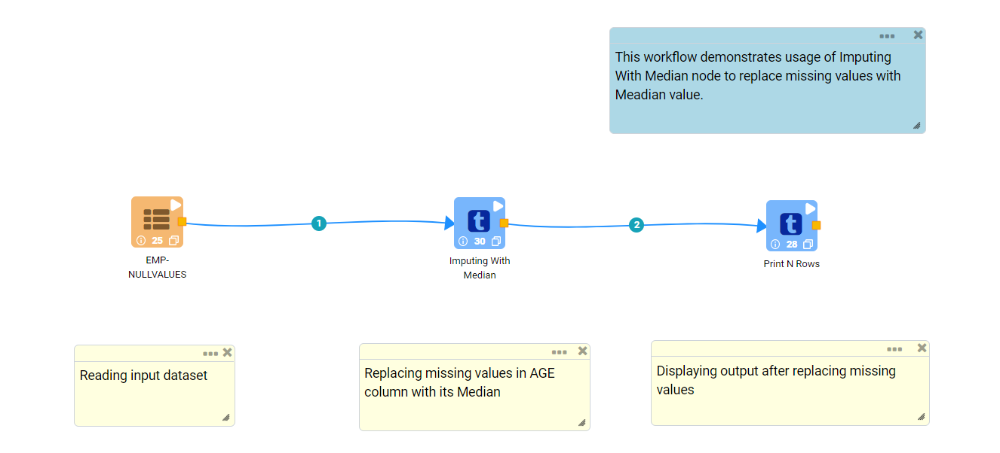
   
**Incoming dataset**

.. figure:: ../../_assets/user-guide/data-preparation/imputing/imputemedian-incoming-dataset.png
   :alt: imputing_userguide
   :width: 90%

**Imputing With Median Node configuration**

*	``Imputing With Median`` node is configured as below.
*	Input of this node is the incoming dataset.
*	Numeric columns in which missing values are to be replaced with Median values need to be selected in ``Column Names`` list.
*	Multiple numeric columns can be selected.
*	Output of this node would display dataset containing missing values replaced with Median values.

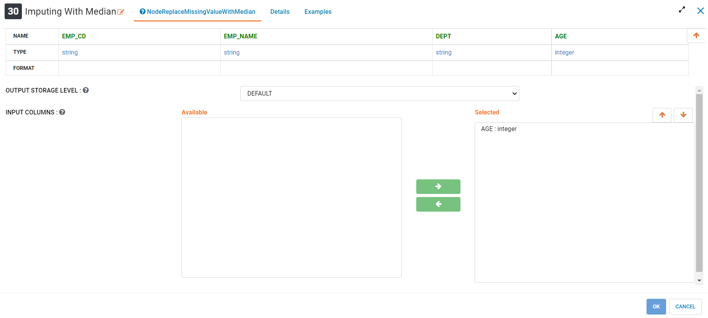
   
**Imputing With Median Node output**

Output of ``Imputing With Median`` node displaying missing values replaced with Median values.

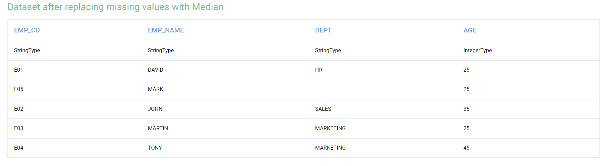
   
Imputing With Mode Value
----------------------------------------

Below is a sample workflow which contains ``Imputing With Mode Value`` processor in Fire Insights. It demonstrates usage of ``Imputing With Mode Value`` node to replace missing values with Mode value.

It does following processing of data:

*	Reads incoming Dataset
*	Replaces missing values with Mode value using ``Imputing With Mode Value`` node.
*	Prints output dataset containing missing values replaced with Mode values using Print node.

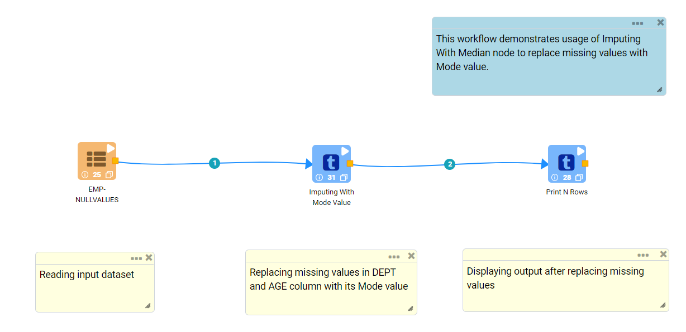
   
**Incoming dataset**

.. figure:: ../../_assets/user-guide/data-preparation/imputing/imputemode-incoming-dataset.png
   :alt: imputing_userguide
   :width: 90%

**Imputing With Mode Value Node configuration**

*	``Imputing With Mode Value`` node is configured as below.
*	Input of this node is the incoming dataset.
*	Columns in which missing values are to be replaced with Mode values need to be selected in ``Columns`` list.
*	Multiple columns can be selected.
*	Output of this node would display dataset containing missing values replaced with Mode values.

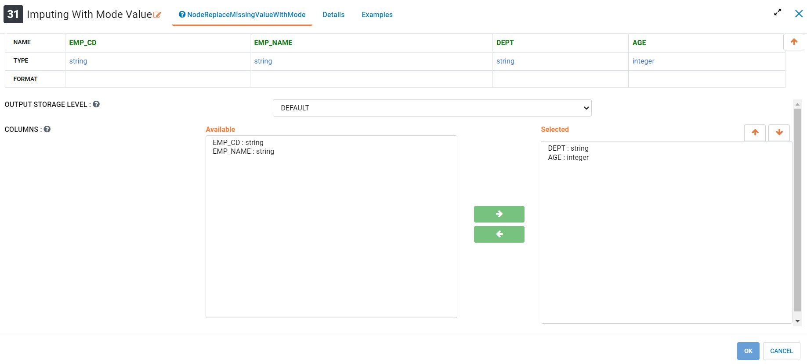
   
**Imputing With Mode Value Node output**

Output of ``Imputing With Mode Value`` node displaying missing values replaced with Mode values.

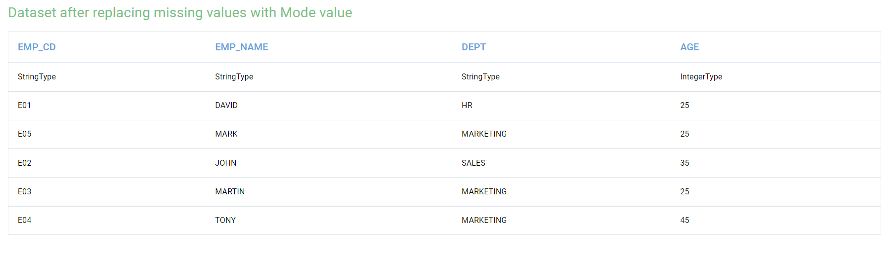
