Joins and Unions
==========

Fire Insights provides processors for performing Joins and Unions.

Join and Union Processors in Fire Insights
----------------------------------------

.. list-table:: 
   :widths: 30 70
   :header-rows: 1

   * - Title
     - Description
   * - UnionAll
     - This node creates a new DataFrame by merging all the rows without removing the duplicates.
   * - Union Distinct
     - This node creates a new DataFrame by performing a DISTINCT on the result set, eliminating any duplicate rows.
   * - Join Using SQL
     - This node registers the incoming DataFrames as temporary tables and executes the SQL provided.
   * - Geo Join
     - This node joins the incoming dataframes.
   * - Join On Columns
     - This node joins the incoming dataframes on columns.
   * - Join On Common Column
     - This node joins the incoming dataframes on a join Column.
   * - Join On Common Columns
     - This node joins the incoming dataframes on 1 or more columns.  
   * - Troubleshooting Common Scenarios
     - This section lists troubleshooting steps for common scenarios to fix observations.   
     
     
Union All
----------------------------------------

Below is a sample workflow which contains Union All processor in Fire Insights. It demonstrates the usage of Union All node to join two datasets.

It does the following processing of data:

*	Reads incoming Datasets.
*	Joins incoming datasets using Union All node and results in a dataset containing all rows from both the datasets without removing duplicate rows.
* 	Joined data is printed using the Print node.

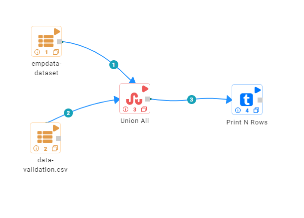
   
**Incoming Datasets**

*	Incoming Dataset 01

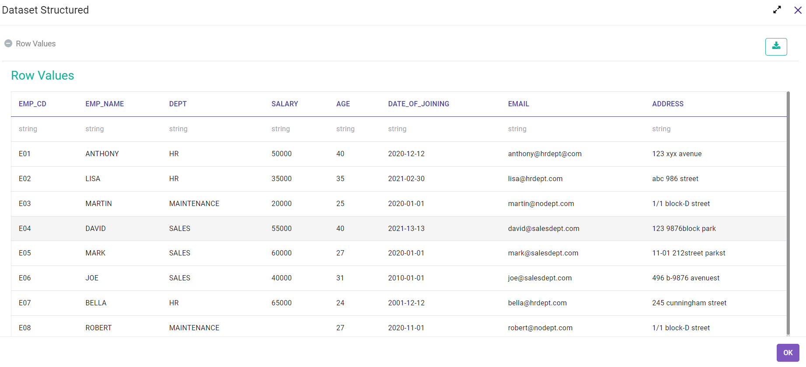

*	Incoming Dataset 02

.. figure:: ../../_assets/user-guide/data-preparation/joinsandunion/unionall/unionall_data2.PNG
   :alt: joinsandunion_userguide
   :width: 75%

**Union All Node configuration**

Union All node is configured as below to join incoming datasets.

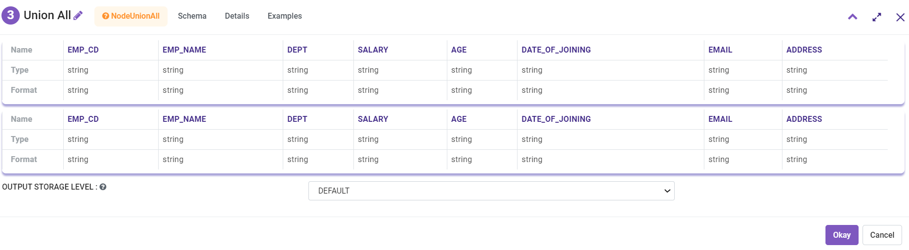

**Union All Node output**

Output of Union All node joining all rows from incoming datasets is shown as below:

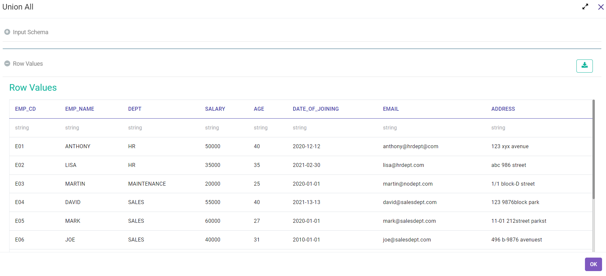
   
Union Distinct
----------------------------------------

Below is a sample workflow which contains ``Union Distinct`` processor in Fire Insights. It demonstrates the usage of ``Union Distinct`` node to join two datasets.

It does the following processing of data:

*	Reads incoming Datasets.
*	Joins incoming datasets using Union Distinct node and results in a dataset containing only distinct rows from both the datasets. If incoming datasets have duplicate rows then they are removed in the output.
* 	Joined data is printed using the Print node.

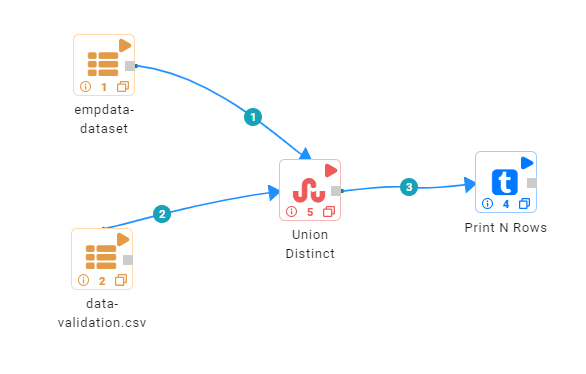
   
**Incoming Datasets**

*	Incoming Dataset 01

*	Incoming Dataset 02

.. figure:: ../../_assets/user-guide/data-preparation/joinsandunion/unionall/unionall_data2.PNG
   :alt: joinsandunion_userguide
   :width: 75%

**Union Distinct Node configuration**

Union Distinct node is configured as below to join incoming datasets.

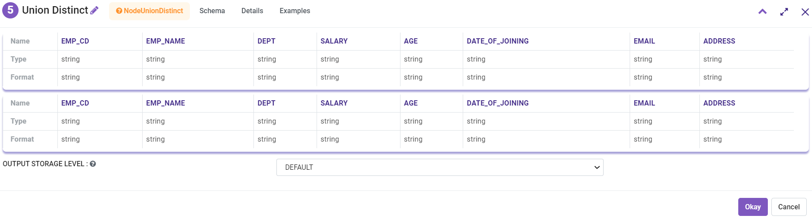

**Union Distinct Node output**

Output of Union Distinct node joining all rows from incoming datasets and selecting only the distinct rows is shown below:

.. figure:: ../../_assets/user-guide/data-preparation/joinsandunion/unionall/uniondistinct/uniondistinct_output.PNG
   :alt: joinsandunion_userguide
   :width: 75%
   

Join Using SQL
----------------------------------------

Below is a sample workflow which contains Join Using SQL processor in Fire Insights. It demonstrates the usage of Join Using SQL node to join two datasets.

It does the following processing of data:

*	Reads incoming Datasets.
*	Joins incoming datasets by executing SQL statement written in the Join Using SQL node.
* 	Joined data is printed using the Print node.

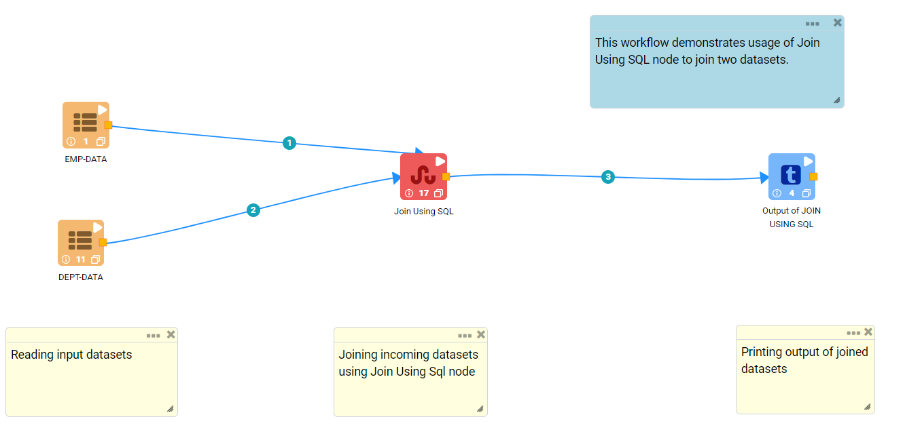
   
**Incoming Datasets**

*	Incoming Dataset 01

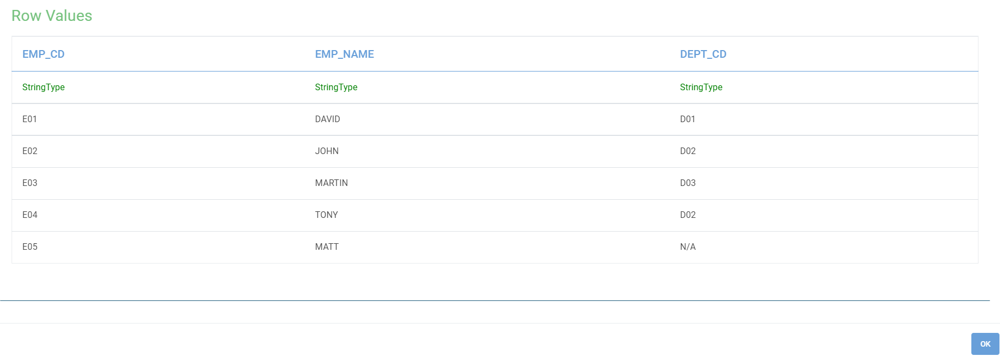

*	Incoming Dataset 02

**Join Using SQL Node configuration**

Join Using SQL node is configured as below to join incoming datasets.

*	Temp Table Name needs to be provided for each incoming dataset. Order of the Temp Table names matches to the order and count of incoming datasets.
*	SQL statement to join incoming datasets needs to be written in the ``SQL`` box.
*	Once SQL Statement is written schema needs to be refreshed by clicking on the ``Refresh Schema`` button in the ``Schema`` tab. Columns listed would be passed on to the output.

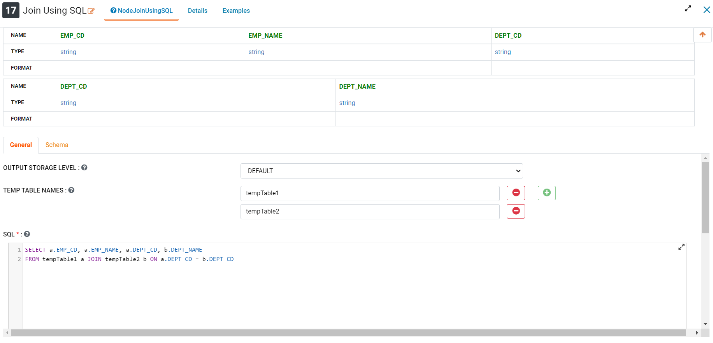

**Join Using SQL Node output**

Output of Join Using SQL node joining incoming datasets is shown below:

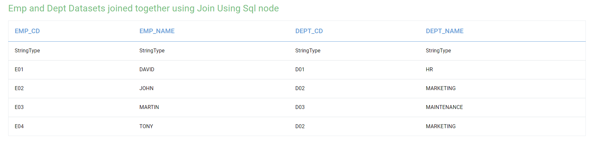
   
Join On Columns
----------------------------------------

Below is a sample workflow which contains Join On Columns processor in Fire Insights. It demonstrates the usage of Join On Columns node to join two datasets.

It does the following processing of data:

*	Reads incoming Datasets.
*	Joins incoming datasets on Common Columns. More than one column can be selected to join datasets. 
*	Datasets can be joined using Inner, Outer, Left Outer, Right Outer and Left Semi mode. Output would be impacted by Join Type selected.
* 	Joined data is printed using the Print node.

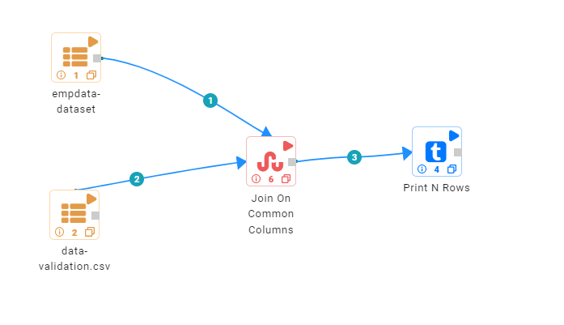
   
**Incoming Datasets**

*	Incoming Dataset 01

*	Incoming Dataset 02

.. figure:: ../../_assets/user-guide/data-preparation/joinsandunion/unionall/unionall_data2.PNG
   :alt: joinsandunion_userguide
   :width: 75%

**Join On Columns Node configuration**

Join On Columns node is configured as below to join incoming datasets.

*	Incoming datasets are joined using the common columns. More than one column can be selected to join datasets.
*	First Dataset selected is the Left Dataset and second one is  the Right Dataset.
*	``Join Type`` can be selected as Inner, Outer, Left Outer, Right Outer and Left Semi mode. Output would be impacted by ``Join Type`` selected.

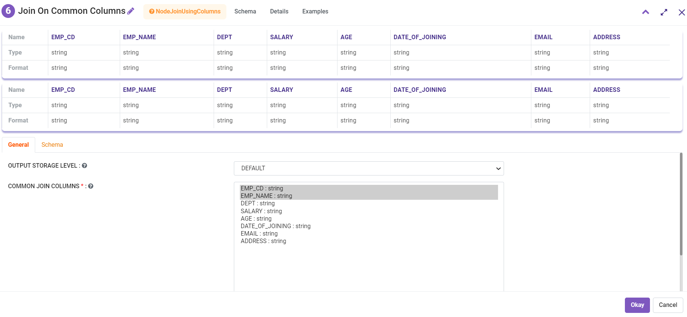

**Join On Columns Node output**

Output of ``Join On Columns`` node joining incoming datasets is shown below:

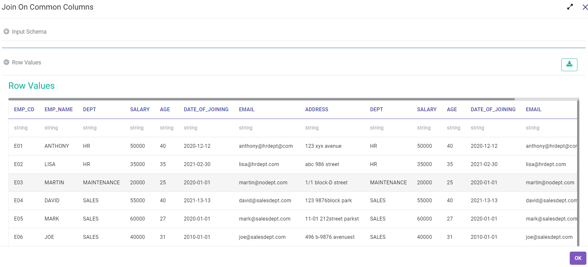
   

Join On Common Column
----------------------------------------

Below is a sample workflow which contains Join On Common Column processor in Fire Insights. It demonstrates the usage of Join On Common Column node to join two datasets.

It does following processing of data:

*	Reads incoming Datasets.
*	Joins incoming datasets on a Common Column. Only one column can be selected to join datasets. 
*	Datasets can be joined using Inner, Outer, Left Outer, Right Outer and Left Semi mode. Output would be impacted by Join Type selected.
* 	Joined data is printed using Print node.

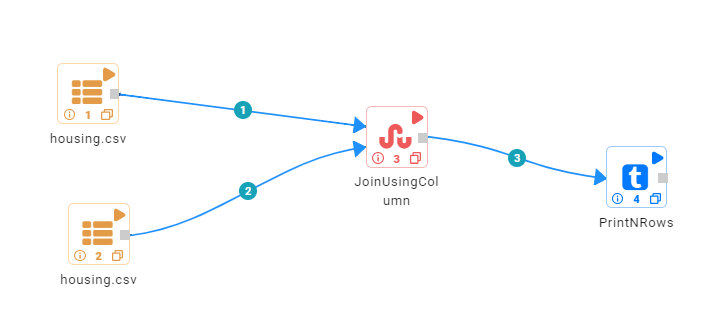
   
**Incoming datasets**

*	Incoming Dataset 01

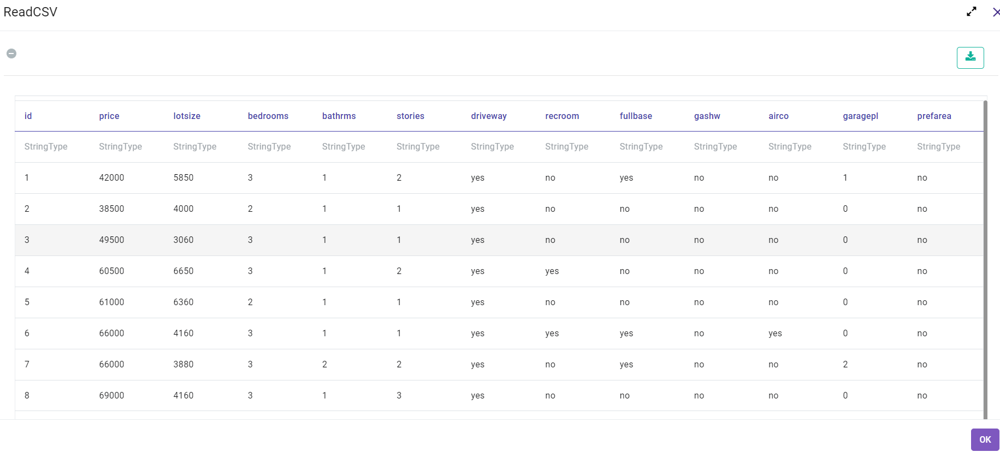

*	Incoming Dataset 02

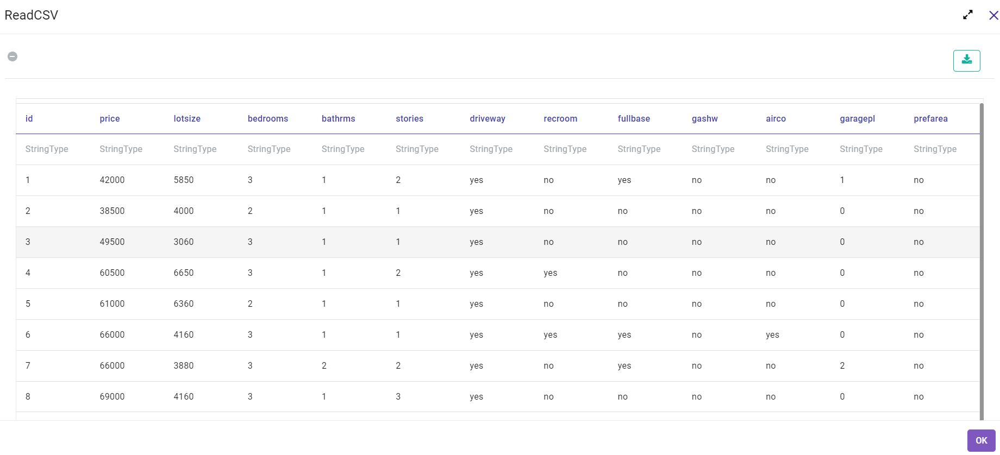

**Join On Common Column Node configuration**

Join On Common Column node is configured as below to join incoming datasets.

*	Incoming datasets are joined using a common column. Only one column can be selected to join datasets.
*	First Dataset selected is the Left Dataset and second one is the Right Dataset.
*	``Join Type`` can be selected as Inner, Outer, Left Outer, Right Outer and Left Semi mode. Output would be impacted by ``Join Type`` selected.
*	Schema needs to be refreshed by clicking on the  ``Refresh Schema`` button in the ``Schema`` tab. Columns listed would be passed on to the output.

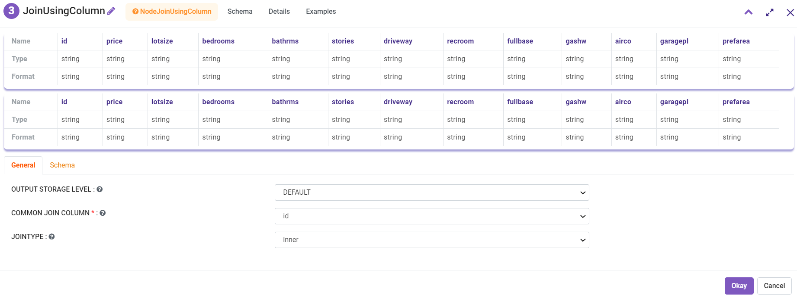

**Join On Common Column Node output**

Output of ``Join On Common Column`` node joining incoming datasets is shown below:

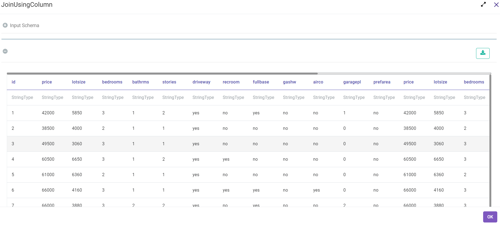
   
Join On Common Columns
----------------------------------------

Below is a sample workflow which contains ``Join On Common Columns`` processor in Fire Insights. It demonstrates the usage of ``Join On Common Columns`` node to join two datasets.

It does the following processing of data:

*	Reads incoming Datasets.
*	Joins incoming datasets on Common Columns. One or more columns are selected to join datasets. 
*	Datasets can be joined using Inner, Outer, Left Outer, Right Outer and Left Semi mode. Output would be impacted by Join Type selected.
* 	Joined data is printed using the Print node.

   
**Incoming Datasets**

*	Incoming Dataset 01

*	Incoming Dataset 02

.. figure:: ../../_assets/user-guide/data-preparation/joinsandunion/unionall/unionall_data2.PNG
   :alt: joinsandunion_userguide
   :width: 75%

**Join On Common Columns Node configuration**

Join On Common Columns node is configured as below to join incoming datasets.

*	Incoming datasets are joined using common columns. One or more columns are selected to join datasets.
*	First Dataset selected is the Left Dataset and second one is the Right Dataset.
*	``Join Type`` can be selected as Inner, Outer, Left Outer, Right Outer and Left Semi mode. Output would be impacted by ``Join Type`` selected.
*	Where condition can be entered in the ``Where Clause`` box to filter the output.
*	Schema needs to be refreshed by clicking on the ``Refresh Schema`` button in the ``Schema`` tab. Columns listed would be passed on to the output.

   
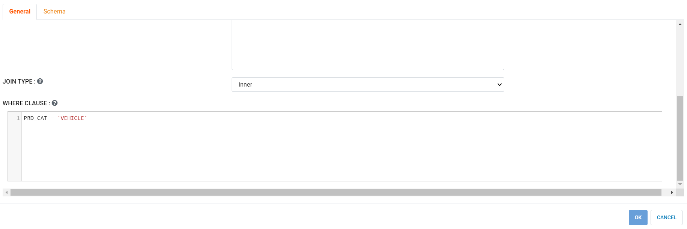

**Join On Common Columns Node output**

Output of Join On Common Columns node joining incoming datasets is shown below:

   
Troubleshooting Common Scenarios
----------------------------------------

This section lists common observations and steps to fix them.

**Joining Datasets using Common Column/s Node**

*	While joining Datasets using Join On Common Column and Join On Common Columns nodes the case of the joining columns is not taken into considerations. The case of the joining column can be same or different. 
*  If ``Dataset-A`` has a column ``ID`` and other dataset i.e. ``Dataset-B`` has a column ``id``. These two ``Ids`` columns would be considered same ( as the join column is not case sensitive). 

**Incoming Datasets have common columns**

*	If incoming datasets have common columns then after joining, the common columns would appear in duplicate in the output.
*	If ``Dataset-A`` has columns [Id, Name, Age] and ``Dataset-B`` has columns [Id, Name, Address] and they are joined using ``Common Column`` [Id]. Output would contain these columns [Id, Name, Name, Age, Address]. Name column appears in duplicate as it is contributed by both the datasets.
* 	To handle this scenario please rename columns using ``Columns Rename`` before joining datasets. Columns can be renamed to Name-A and Name-B before joining. This would help in bringing clarity with regard to data. 
