Joins and Unions
==========

Sparkflows provides processors for performing Joins and Unions.

Join and Union Processors in Sparkflows
----------------------------------------

.. list-table:: 
   :widths: 30 70
   :header-rows: 1

  
   * - Title
     - Description
   * - Join Advance
     - This node combines two input DataFrames (Left/Target and Right/Source) horizontally by matching records based on shared key columns or row position.
   * - Union Advanced
     - This node combines rows from multiple DataFrames with flexible configuration options.
   * - Append Fields
     - This node appends columns from a Source DataFrame to every row of a Target DataFrame.
   * - UnionAll
     - This node creates a new DataFrame by merging all the rows without removing the duplicates.
   * - Union Distinct
     - This node creates a new DataFrame by performing a DISTINCT on the result set, eliminating any duplicate rows.
   * - Join Using SQL
     - This node registers the incoming DataFrames as temporary tables and executes the SQL provided.
   * - Geo Join
     - This node joins the incoming dataframes.
   * - Join On Columns
     - This node joins the incoming dataframes on columns.
   * - Join On Common Column
     - This node joins the incoming dataframes on a join Column.
   * - Join On Common Columns
     - This node joins the incoming dataframes on 1 or more columns.  
   * - Troubleshooting Common Scenarios
     - This section lists troubleshooting steps for common scenarios to fix observations.   
   

Join Advance
----

Below is a sample workflow which contains the Join Advance processor in Sparkflows. It demonstrates how the Join Advance Node merges distinct datasets into a unified schema while isolating non-matching records.

It does the following processing of data:

* Reads the incoming Left and Right datasets.
* Aligns rows based on the configured Join By method (Specific Fields or Position).
* Applies schema transformations (Select, Rename, Cast) to prepare the data.
* Generates three distinct outputs:

   * Inner Join: The merged dataset with all transformations applied.
   * Left Anti-Join: Rows from the left dataset that found no match.
   * Right Anti-Join: Rows from the right dataset that found no match.

* Prints the resulting DataFrames using the Print N Rows node.

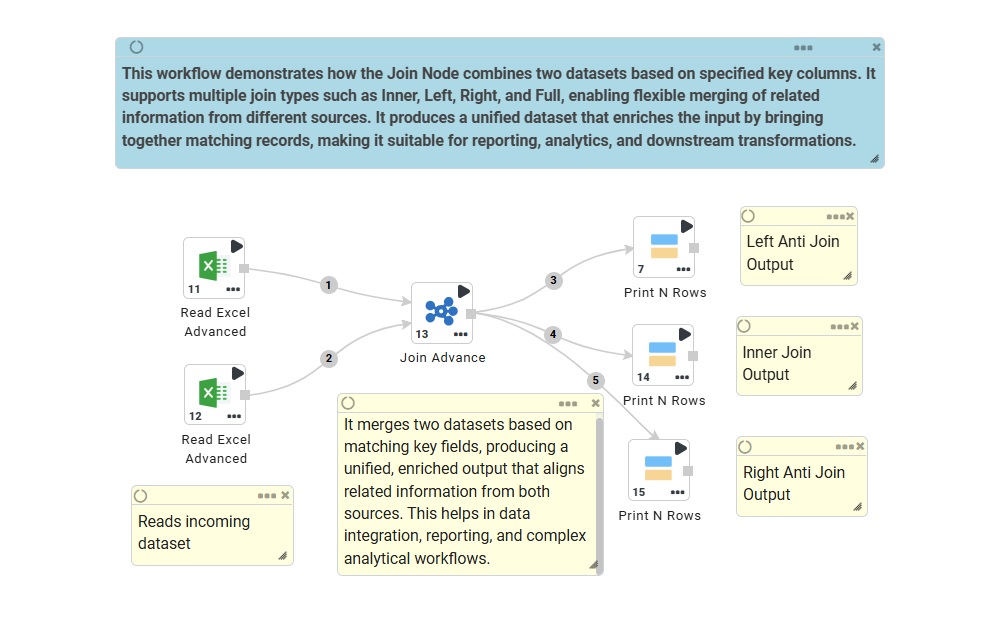

**Incoming Dataset**
++++++++++++++++++++++++++++

* Incoming Dataset 01

  .. figure:: ../../_assets/user-guide/data-preparation/joinsandunion/join-advance-input-dataset-1.png
     :alt: joinsandunion_userguide
     :width: 75%

* Incoming Dataset 02

  .. figure:: ../../_assets/user-guide/data-preparation/joinsandunion/join-advance-input-dataset-2.png
     :alt: joinsandunion_userguide
     :width: 75%

**Join Advance Node Configuration**
+++++++++++++++++++++++++++++++++++++++++

This node can be configured as below:

* **Join Tab Configuration**

   * Join By

      * **Position:** Joins records based on their row index (Row 1 matches Row 1). Useful for ordered datasets without a common key.
      * **Specific Fields:** Joins records based on values in selected columns (e.g., ID = ID). Supports normalization of Null/Empty values for reliable matching.

   * Joining Columns

      * **Left/Right Table Join Column:** Uses specific columns as keys for matching. It is required only when Join By is set to "Specific Fields".

  .. figure:: ../../_assets/user-guide/data-preparation/joinsandunion/join-advance-config-1.png
     :alt: joinsandunion_userguide
     :width: 75%

* **Columns Tab Configuration**

   * **Select Fields:** Choose which columns to keep from the Left and Right datasets.
   * **Rename Fields:** Rename columns to resolve conflicts or improve readability before the join occurs.
   * **Data Type Fields:** Cast columns to new data types (e.g., String to Integer) during the process.

  .. figure:: ../../_assets/user-guide/data-preparation/joinsandunion/join-advance-config-2.png
     :alt: joinsandunion_userguide
     :width: 75%

* **Drop Tab Configuration**

   * **Input Propagate Schema:**

      * True → Attempts to pass through the original schema structure where applicable.
      * False → Strictly adheres to the configured output schema.

   * **Drop Columns:** Explicitly remove specific columns from the final output. Smart handling ensures that if a column is dropped, it is cleanly removed unless it is required as a Join Key.

  .. figure:: ../../_assets/user-guide/data-preparation/joinsandunion/join-advance-config-3.png
     :alt: joinsandunion_userguide
     :width: 75%

**Join Advance Node Output**
++++++++++++++++++++++++++++++++

Output of the Join Advance node produces three distinct output edges:

* **Left Anti-Join:** Contains records from the Left DataFrame that did not match any record in the Right DataFrame and retains the original Left schema.

  .. figure:: ../../_assets/user-guide/data-preparation/joinsandunion/join-advance-node-output-1.png
     :alt: joinsandunion_userguide
     :width: 75%

* **Inner Join:** Contains merged records where keys matched, includes all selected columns from both sides, prefixes conflicting Right-side columns with Right_ (e.g., Right_id), and applies all configured renames, casts, and drops.

  .. figure:: ../../_assets/user-guide/data-preparation/joinsandunion/join-advance-node-output-2.png
     :alt: joinsandunion_userguide
     :width: 75%

* **Right Anti-Join:** Contains records from the Right DataFrame that did not match any record in the Left DataFrame and retains the original Right schema.

  .. figure:: ../../_assets/user-guide/data-preparation/joinsandunion/join-advance-node-output-3.png
     :alt: joinsandunion_userguide
     :width: 75%

Union Advanced
----------------------------------------
Below is a sample workflow which contains the Union Advanced processor in Sparkflows. It demonstrates the usage of the Union Advanced node to combine multiple datasets (Employee and Position) into a single consolidated table by stacking all incoming records sequentially without performing any join operations.

It does the following processing of data:

* Reads the incoming datasets (employees.csv and positions.csv).
* Combines both datasets using the Union Advanced node.
* Prints the output of the combined data using the Print node.

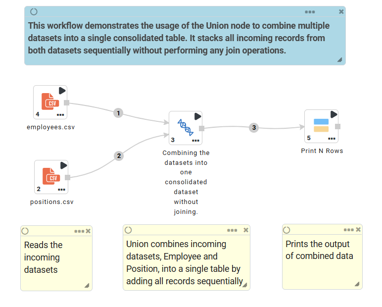

**Union Advanced Node Configuration**

The Union Advanced node provides flexible union operations that can align columns either by name or by position, with options to include all columns or only common ones, and gracefully handle schema differences.

Union Advanced node is configured by refering the table below:

.. list-table:: 
   :widths: 30 70
   :header-rows: 1

  
   * - Parameter
     - Description
   * - Configure By
     - Determines how columns are matched across input datasets: • NAME – Matches columns by their names (recommended for datasets with meaningful column names) • POSITION – Matches columns by their ordinal position (1st column with 1st, 2nd with 2nd, etc.)
   * - Output Fields
     - Controls which columns appear in the output: • ALL – Includes every unique column from all inputs (missing values filled with null) • COMMON – Includes only columns present in all input datasets
   * - Allow Missing Columns
     - When true (default), datasets with differing numbers of columns are allowed — missing columns are filled with null. When false, all input datasets must have identical schema/structure (throws error otherwise).

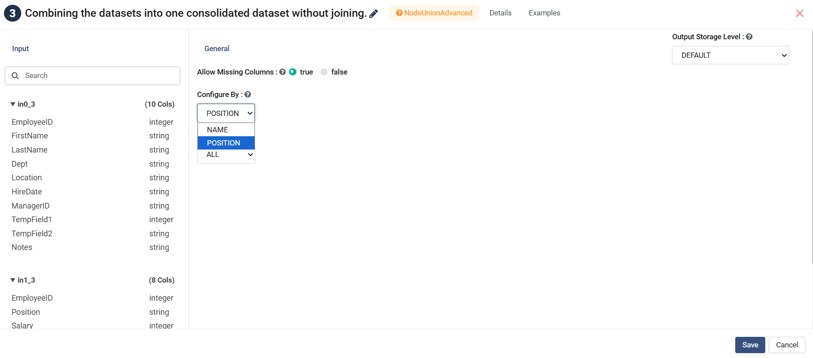

**Example:** With Configure By = NAME and Output Fields = ALL, the node preserves the first-seen data type and order of columns by name, adding null where a column is absent in a particular input.

**Union Advanced Node Output**

Output of Union Advanced node (combined incoming datasets) is shown as below:

* Name-based Union (configBy = NAME)

  .. figure:: ../../_assets/user-guide/data-preparation/joinsandunion/union-advanced-node-output-1.png
     :alt: joinsandunion_userguide
     :width: 75%

  .. figure:: ../../_assets/user-guide/data-preparation/joinsandunion/union-advanced-node-output-1'.png
     :alt: joinsandunion_userguide
     :width: 75%

* Position-based Union (configBy = POSITION)

  .. figure:: ../../_assets/user-guide/data-preparation/joinsandunion/union-advanced-node-output-2.png
     :alt: joinsandunion_userguide
     :width: 75%

Append Fields
--------------------
Below is a sample workflow which contains the Append Fields processor in Sparkflows. It demonstrates the usage of the Append Fields node to create all possible combinations of rows from two datasets — effectively performing a Cartesian (cross) join between every employee record and every position record, resulting in a complete matrix of Employee–Position pairs.

It does the following processing of data:

* Reads the incoming datasets (employees.csv and positions.csv).
* Attaches every Position record to every Employee record using the Append Fields node (Cartesian-style append).
* Prints the output of the combined data using the Print node.

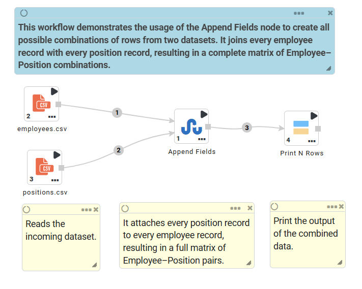

**Append Fields Node Configuration**
++++

The Append Fields node is designed to append columns from a Source DataFrame to every row of a Target DataFrame. This is particularly useful when you need to broadcast a small lookup or reference table (Source) across a larger fact table (Target), creating a full cross product.

Append Fields node is configured by refering the table below:

**General Tab Configurations**

.. list-table:: 
   :widths: 30 70
   :header-rows: 1

  
   * - Parameter
     - Description
   * - Select Target Fields
     - Columns from the Target (main) DataFrame to keep in the output. Leave empty to keep all.
   * - Select Source Fields
     - Columns from the Source (lookup) DataFrame to append to every Target row.
   * - Rename Target/Source Fields
     - Optionally rename selected columns from Target or Source before merging.
   * - Data Type Target/Source Fields
     - Force a new data type (e.g., STRING, INTEGER, DOUBLE) on selected columns.

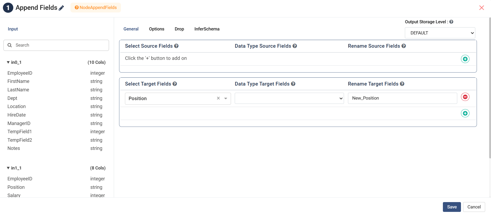

**Options Tab Configurations**

.. list-table:: 
   :widths: 30 70
   :header-rows: 1

  
   * - Parameter
     - Description
   * - Prefix / Suffix
     - Automatically add a prefix/suffix to all appended Source column names (useful to avoid name clashes).
   * - Threshold Behavior
     - Controls behavior when Source has more than 16 rows (safety guard against accidental huge Cartesian products): none – No check, warn – Logs a warning, error – Throws exception and fails the workflow
   * - Join Type (multiRowSourceBehavior)
     - * cartesian – Full cross join: every Source row × every Target row (default for true Cartesian)
       * first_row – Broadcast only the first row of the Source dataset (behaves like a scalar append)

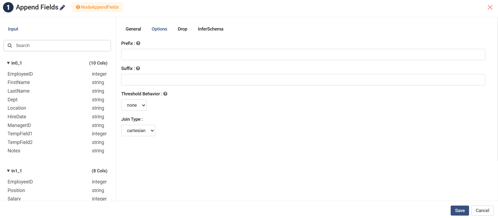

**Drop Tab Configurations**

.. list-table:: 
   :widths: 30 70
   :header-rows: 1

  
   * - Parameter
     - Description
   * - Drop Target/Source Fields
     - Explicitly drop unwanted columns from Target or Source after selection.

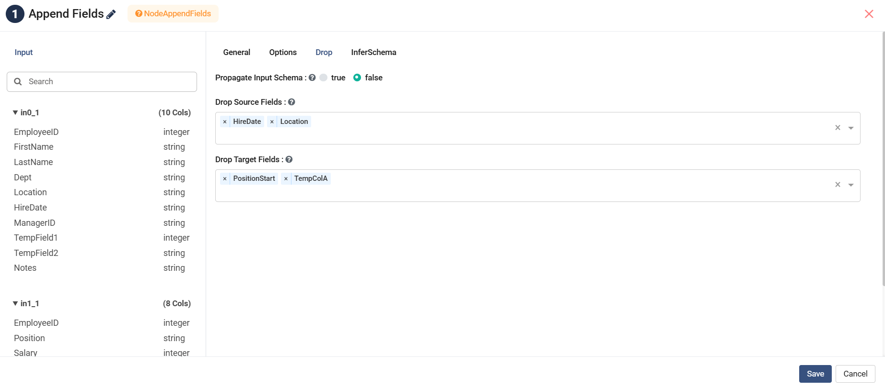

**Append Fields Node Output**
++++

Output of this node is a dataset that contains every Employee record duplicated for each Position, with Position-related columns appended:

(Actual number of output rows = Employees × Positions)

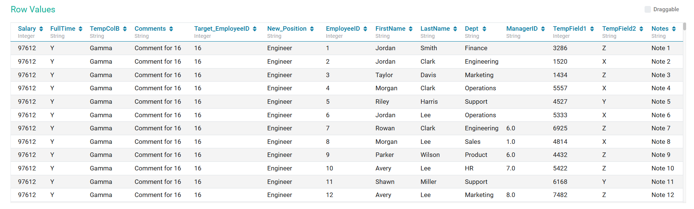

     
Union All
----------------------------------------

Below is a sample workflow which contains Union All processor in Sparkflows. It demonstrates the usage of Union All node to join two datasets.

It does the following processing of data:

*	Reads incoming Datasets.
*	Joins incoming datasets using Union All node and results in a dataset containing all rows from both the datasets without removing duplicate rows.
* 	Joined data is printed using the Print node.

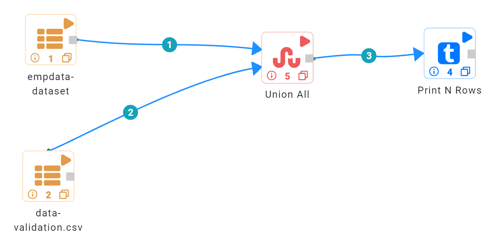
   
**Incoming Datasets**

*	Incoming Dataset 01

.. figure:: ../../_assets/user-guide/data-preparation/joinsandunion/unionall/unionall_data1.PNG
   :alt: joinsandunion_userguide
   :width: 75%

*	Incoming Dataset 02

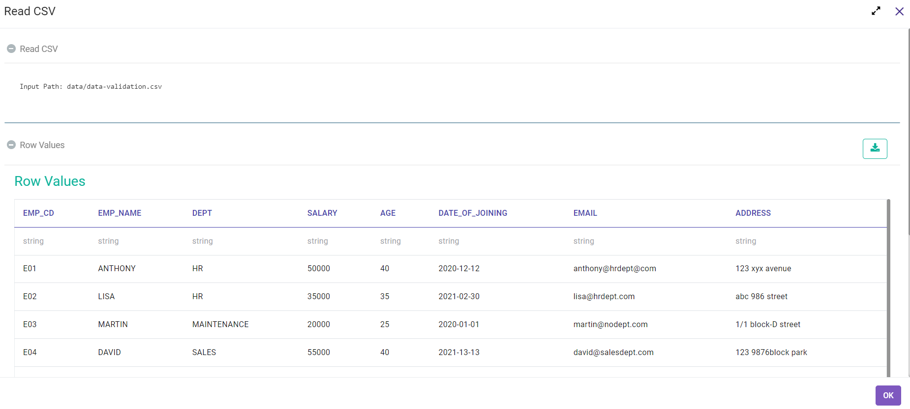

**Union All Node configuration**

Union All node is configured as below to join incoming datasets.

.. figure:: ../../_assets/user-guide/data-preparation/joinsandunion/unionall/unionall_config.PNG
   :alt: joinsandunion_userguide
   :width: 75%

**Union All Node output**

Output of Union All node joining all rows from incoming datasets is shown as below:

.. figure:: ../../_assets/user-guide/data-preparation/joinsandunion/unionall/unionall_result.PNG
   :alt: joinsandunion_userguide
   :width: 75%
   
**Videos**

Watch tutorial videos at Sparkflows YouTube Channel to get more insights. Find the video link below:

* Union All Node Tutorial: https://www.youtube.com/watch?v=27OkicAGTDc

Union Distinct
----------------------------------------

Below is a sample workflow which contains ``Union Distinct`` processor in Sparkflows. It demonstrates the usage of ``Union Distinct`` node to join two datasets.

It does the following processing of data:

*	Reads incoming Datasets.
*	Joins incoming datasets using Union Distinct node and results in a dataset containing only distinct rows from both the datasets. If incoming datasets have duplicate rows then they are removed in the output.
* 	Joined data is printed using the Print node.

.. figure:: ../../_assets/user-guide/data-preparation/joinsandunion/unionall/uniondistinct/union-distinct-wf.png
   :alt: joinsandunion_userguide
   :width: 75%
   
**Incoming Datasets**

*	Incoming Dataset 01

.. figure:: ../../_assets/user-guide/data-preparation/joinsandunion/unionall/unionall_data1.PNG
   :alt: joinsandunion_userguide
   :width: 75%

*	Incoming Dataset 02

**Union Distinct Node configuration**

Union Distinct node is configured as below to join incoming datasets.

.. figure:: ../../_assets/user-guide/data-preparation/joinsandunion/unionall/uniondistinct/uniondistinct_config.PNG
   :alt: joinsandunion_userguide
   :width: 75%

**Union Distinct Node output**

Output of Union Distinct node joining all rows from incoming datasets and selecting only the distinct rows is shown below:

.. figure:: ../../_assets/user-guide/data-preparation/joinsandunion/unionall/uniondistinct/uniondistinct_output.PNG
   :alt: joinsandunion_userguide
   :width: 75%

   
**Videos**

Watch tutorial videos at Sparkflows YouTube Channel to get more insights. Find the video link below:

* Union Distinct Node Tutorial: https://www.youtube.com/watch?v=ZyQ7m4fqm6w 
   

Join Using SQL
----------------------------------------

Below is a sample workflow which contains Join Using SQL processor in Sparkflows. It demonstrates the usage of Join Using SQL node to join two datasets.

It does the following processing of data:

*	Reads incoming Datasets.
*	Joins incoming datasets by executing SQL statement written in the Join Using SQL node.
* 	Joined data is printed using the Print node.

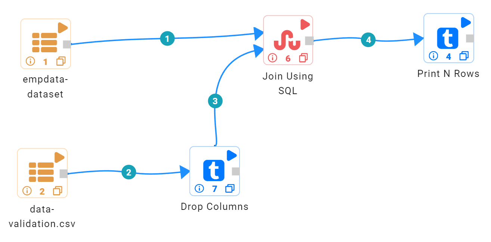
   
**Incoming Datasets**

*	Incoming Dataset 01

.. figure:: ../../_assets/user-guide/data-preparation/joinsandunion/unionall/unionall_data1.PNG
   :alt: joinsandunion_userguide
   :width: 75%

*	Incoming Dataset 02

**Join Using SQL Node configuration**

Join Using SQL node is configured as below to join incoming datasets.

*	Temp Table Name needs to be provided for each incoming dataset. Order of the Temp Table names matches to the order and count of incoming datasets.
*	SQL statement to join incoming datasets needs to be written in the ``SQL`` box.
*	Once SQL Statement is written schema needs to be refreshed by clicking on the ``Refresh Schema`` button in the ``Schema`` tab. Columns listed would be passed on to the output.

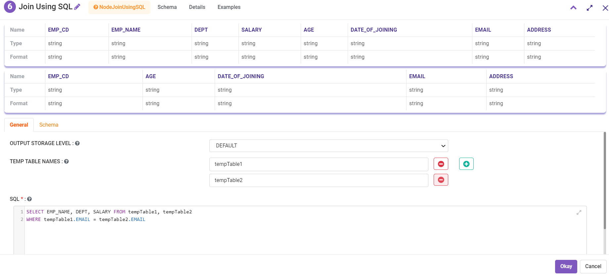

**Join Using SQL Node output**

Output of Join Using SQL node joining incoming datasets is shown below:

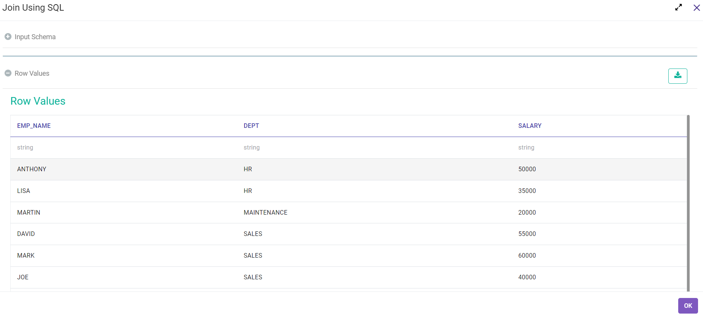
   
Join On Columns
----------------------------------------

Below is a sample workflow which contains Join On Columns processor in Sparkflows. It demonstrates the usage of Join On Columns node to join two datasets.

It does the following processing of data:

*	Reads incoming Datasets.
*	Joins incoming datasets on Common Columns. More than one column can be selected to join datasets. 
*	Datasets can be joined using Inner, Outer, Left Outer, Right Outer and Left Semi mode. Output would be impacted by Join Type selected.
* 	Joined data is printed using the Print node.

.. figure:: ../../_assets/user-guide/data-preparation/joinsandunion/join-on-columns/join-on-columns-wf.png
   :alt: joinsandunion_userguide
   :width: 75%
   
**Incoming Datasets**

*	Incoming Dataset 01

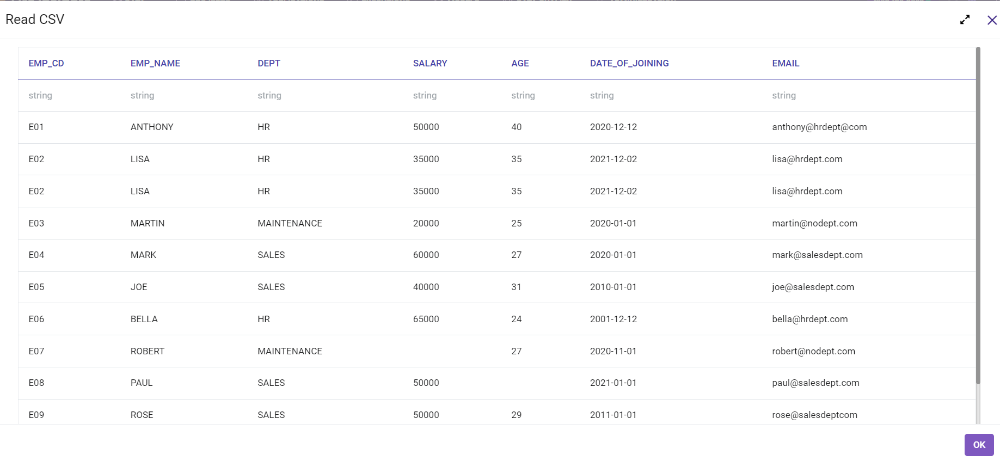

*	Incoming Dataset 02

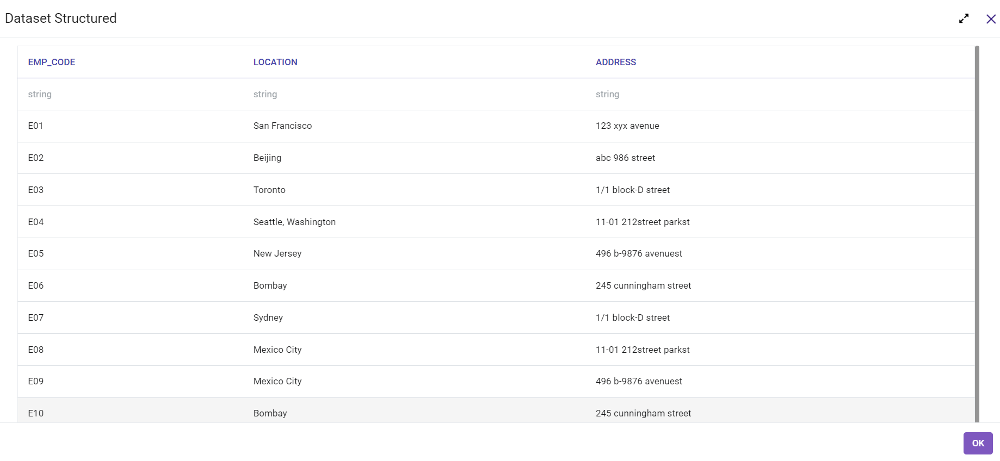

**Join On Columns Node configuration**

Join On Columns node is configured as below to join incoming datasets.

*	Incoming datasets are joined using the common columns. More than one column can be selected to join datasets.
*	First Dataset selected is the Left Dataset and second one is  the Right Dataset.
*	``Join Type`` can be selected as Inner, Outer, Left Outer, Right Outer and Left Semi mode. Output would be impacted by ``Join Type`` selected.

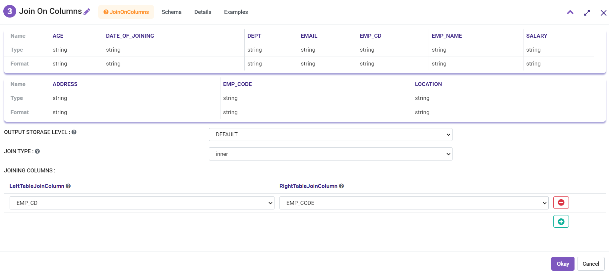

**Join On Columns Node output**

Output of ``Join On Columns`` node joining incoming datasets is shown below:

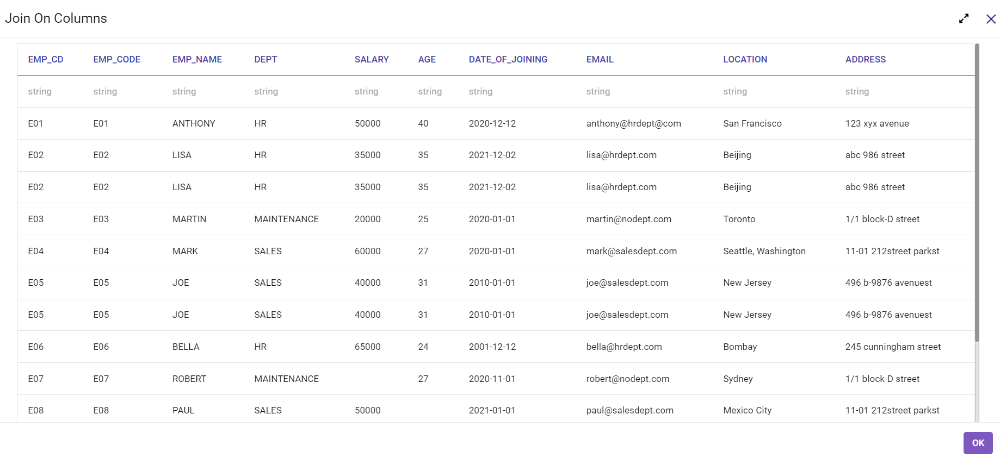
   
**Videos**

Watch tutorial videos at Sparkflows YouTube Channel to get more insights. Find the video link below:

* Join On Columns Node Tutorial: https://www.youtube.com/watch?v=GbJIiUSA7-g

Join On Common Column
----------------------------------------

Below is a sample workflow which contains Join On Common Column processor in Sparkflows. It demonstrates the usage of Join On Common Column node to join two datasets.

It does following processing of data:

*	Reads incoming Datasets.
*	Joins incoming datasets on a Common Column. Only one column can be selected to join datasets. 
*	Datasets can be joined using Inner, Outer, Left Outer, Right Outer and Left Semi mode. Output would be impacted by Join Type selected.
* 	Joined data is printed using Print node.

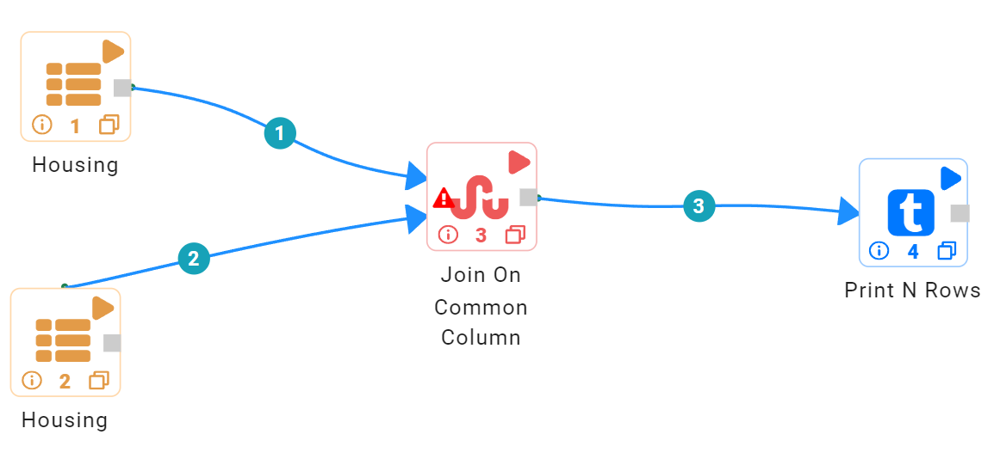
   
**Incoming datasets**

*	Incoming Dataset 01

.. figure:: ../../_assets/user-guide/data-preparation/joinsandunion/join_column/join_column_data1.PNG
   :alt: joinsandunion_userguide
   :width: 75%

*	Incoming Dataset 02

.. figure:: ../../_assets/user-guide/data-preparation/joinsandunion/join_column/join_column_data2.PNG
   :alt: joinsandunion_userguide
   :width: 75%

**Join On Common Column Node configuration**

Join On Common Column node is configured as below to join incoming datasets.

*	Incoming datasets are joined using a common column. Only one column can be selected to join datasets.
*	First Dataset selected is the Left Dataset and second one is the Right Dataset.
*	``Join Type`` can be selected as Inner, Outer, Left Outer, Right Outer and Left Semi mode. Output would be impacted by ``Join Type`` selected.
*	Schema needs to be refreshed by clicking on the  ``Refresh Schema`` button in the ``Schema`` tab. Columns listed would be passed on to the output.

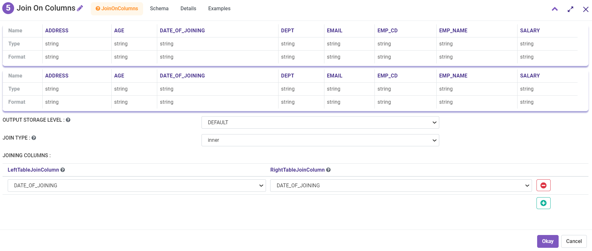

**Join On Common Column Node output**

Output of ``Join On Common Column`` node joining incoming datasets is shown below:

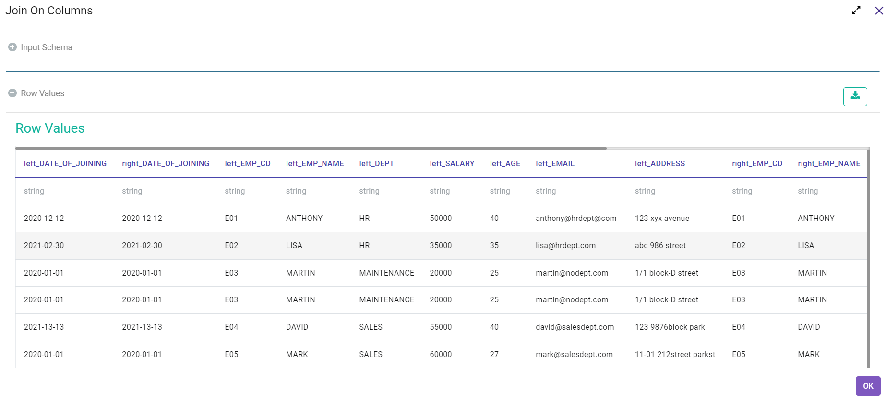
   
Join On Common Columns
----------------------------------------

Below is a sample workflow which contains ``Join On Common Columns`` processor in Sparkflows. It demonstrates the usage of ``Join On Common Columns`` node to join two datasets.

It does the following processing of data:

*	Reads incoming Datasets.
*	Joins incoming datasets on Common Columns. One or more columns are selected to join datasets. 
*	Datasets can be joined using Inner, Outer, Left Outer, Right Outer and Left Semi mode. Output would be impacted by Join Type selected.
* 	Joined data is printed using the Print node.

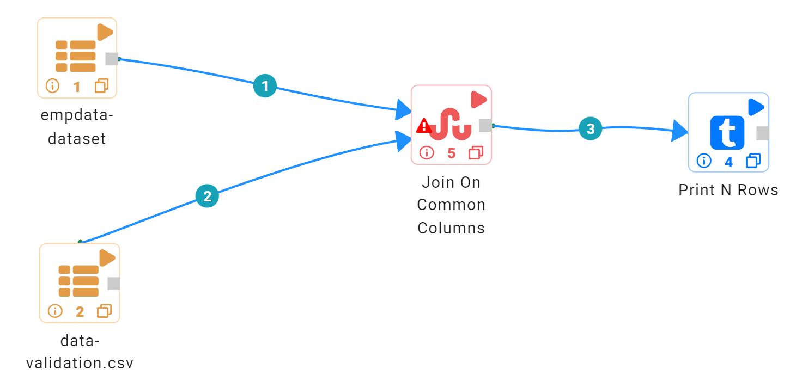
   
**Incoming Datasets**

*	Incoming Dataset 01

.. figure:: ../../_assets/user-guide/data-preparation/joinsandunion/unionall/unionall_data1.PNG
   :alt: joinsandunion_userguide
   :width: 75%

*	Incoming Dataset 02

**Join On Common Columns Node configuration**

Join On Common Columns node is configured as below to join incoming datasets.

*	Incoming datasets are joined using common columns. One or more columns are selected to join datasets.
*	First Dataset selected is the Left Dataset and second one is the Right Dataset.
*	``Join Type`` can be selected as Inner, Outer, Left Outer, Right Outer and Left Semi mode. Output would be impacted by ``Join Type`` selected.
*	Where condition can be entered in the ``Where Clause`` box to filter the output.
*	Schema needs to be refreshed by clicking on the ``Refresh Schema`` button in the ``Schema`` tab. Columns listed would be passed on to the output.

.. figure:: ../../_assets/user-guide/data-preparation/joinsandunion/joincolumns/join_columns_config.PNG
   :alt: joinsandunion_userguide
   :width: 75%
   
.. figure:: ../../_assets/user-guide/data-preparation/joinsandunion/joinoncommoncols-config1.png
   :alt: joinsandunion_userguide
   :width: 75%

**Join On Common Columns Node output**

Output of Join On Common Columns node joining incoming datasets is shown below:

.. figure:: ../../_assets/user-guide/data-preparation/joinsandunion/joincolumns/join_columns_result.PNG
   :alt: joinsandunion_userguide
   :width: 75%
   
Troubleshooting Common Scenarios
----------------------------------------

This section lists common observations and steps to fix them.

**Joining Datasets using Common Column/s Node**

*	While joining Datasets using Join On Common Column and Join On Common Columns nodes the case of the joining columns is not taken into considerations. The case of the joining column can be same or different. 
*  If ``Dataset-A`` has a column ``ID`` and other dataset i.e. ``Dataset-B`` has a column ``id``. These two ``Ids`` columns would be considered same ( as the join column is not case sensitive). 

**Incoming Datasets have common columns**

*	If incoming datasets have common columns then after joining, the common columns would appear in duplicate in the output.
*	If ``Dataset-A`` has columns [Id, Name, Age] and ``Dataset-B`` has columns [Id, Name, Address] and they are joined using ``Common Column`` [Id]. Output would contain these columns [Id, Name, Name, Age, Address]. Name column appears in duplicate as it is contributed by both the datasets.
* 	To handle this scenario please rename columns using ``Columns Rename`` before joining datasets. Columns can be renamed to Name-A and Name-B before joining. This would help in bringing clarity with regard to data. 
