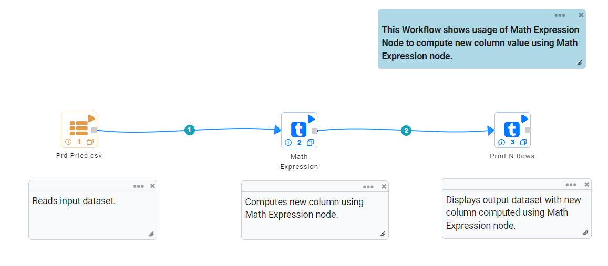
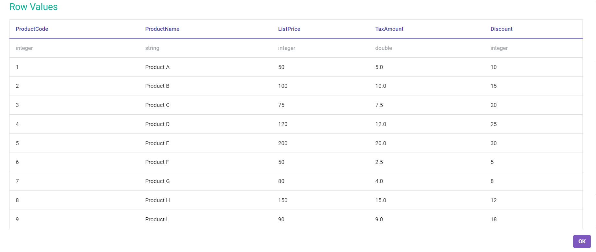
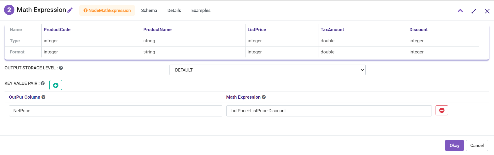
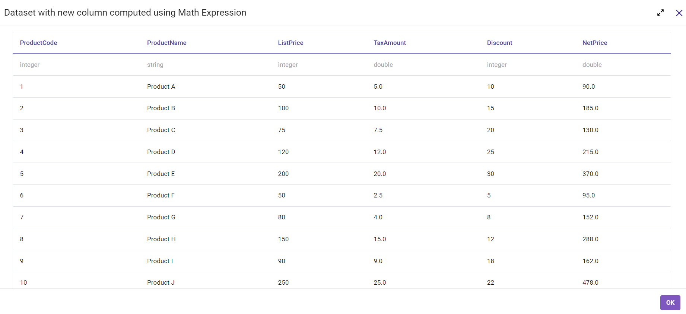
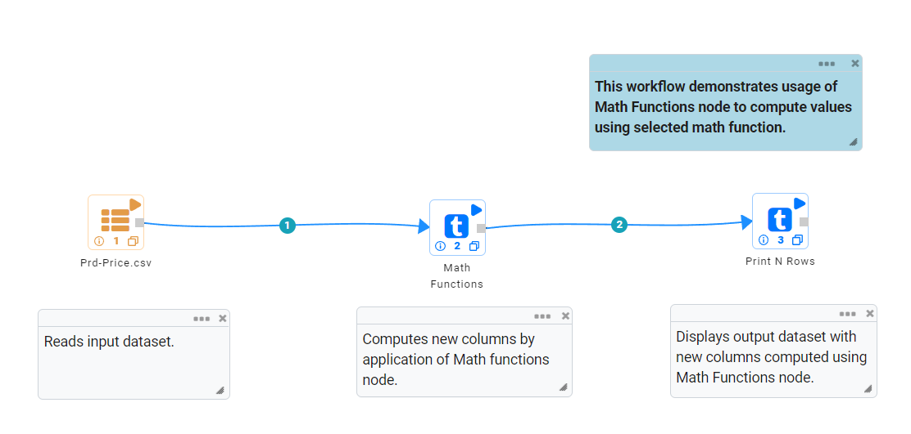
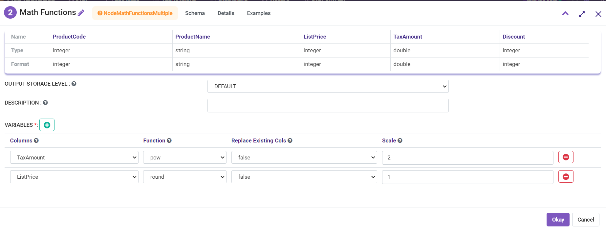
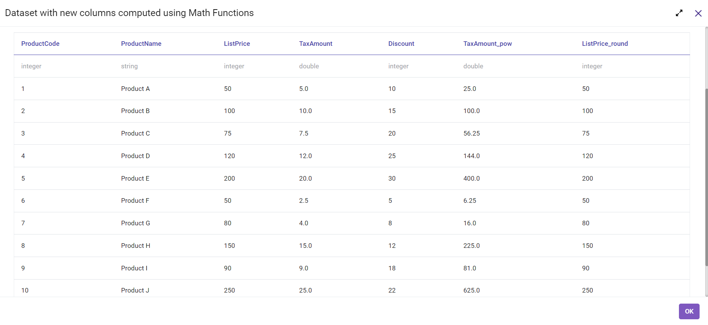

Math Function
==========

Fire Insights provides processors for Mathematical computation. 

Math Processors in Fire Insights
----------------------------------------

.. list-table:: Math Processors
   :widths: 30 70
   :header-rows: 1

   * - Title
     - Description
   * - Math Expression
     - It computes new values using Math Expression.
   * - Math Functions
     - It computes new values by application of Math Functions on incoming columns.
 
 
Math Expression
----------------------------------------

Below is a sample workflow that contains Math Expression processor in Fire Insights. It demonstrates the usage of Math Expression node to compute new column value using Math Expressions.

It does the following processing of data:

*	Reads incoming dataset.
*	Computes new column value by evaluating expressions using Math Expression node.
*	Prints output dataset with new columns computed by evaluating math expressions.

   
**Incoming Dataset**

   
**Math Expression Node Configuration**

Math Expression node is configured as below.

*	Input of this node are the incoming datasets.
*	Column that needs to list computed values in the output is to be entered in ``Output Column`` box.
*	Mathematical Expression that needs to be evaluated to create new column is to be entered in the field Math Expression.
*	A new ``Key Value Array`` row needs to be added for each additional Math Expression.
*	Output of this node would display dataset with new columns computed by evaluating math expressions.

   
**Math Expression Node Output**

Output of Math Expression node displaying dataset with new columns computed by evaluating math expressions is shown as below.

   

Math Functions
----------------------------------------

Below is a sample workflow that contains Math Functions processor in Fire Insights. It demonstrates the usage of Math Functions node to compute values using selected Math function.

It does the following processing of data:

*	Reads incoming dataset.
*	Computes values by application of selected Math function on incoming columns using Math Functions node.
*	Prints output dataset with new columns computed by using math functions.

   
**Incoming Dataset**

   
**Math Functions Node Configuration**

Math Functions node is configured as below.

*	Input of this node are the incoming datasets.
*	Incoming Column on which math function needs to be applied to compute new value is to be selected in ``Columns`` list.
*	Function that needs to be applied on incoming column to compute new value is to be selected in ``Function`` list.
*	``Replace Existing Cols`` needs to be selected as true if new column is to replace existing incoming column in the output.
*	Scale that needs to be applied while using math function is to be entered in ``Scale`` box. In this example ``Tax_Amt`` value is to be raised by a Power of 2 hence scale is entered as 2. In another calculation ``List_Price`` value is to be rounded to 1 decimal place hence Scale is selected as 1.
*	A new ``Variables List`` row needs to be added for each additional computation.
*	Output of this node would display dataset with new columns computed by using math functions.

   
**Math Functions Node output**

Output of Math Functions node displaying dataset with new columns computed using math functions is shown as below.

   
