Data Preparation: Miscellaneous
==========

Fire Insights provides various processors for Data Preparation.

Data Preparation Processors in Fire Insights
----------------------------------------

.. list-table::
   :widths: 30 70
   :header-rows: 1

   * - Title
     - Description
   * - Columns Rename
     - It renames incoming dataset columns.
   * - Round Value
     - It converts incoming value to a decimal value of specified precision.
   * - Count
     - It fetches and prints row count of incoming dataset.
   * - Moving Windows Function
     - It computes moving values such as average/max/min by application of specified function on the windows of rows defined.
   * - Multi Windows Analytics
     - It selects a value by application of windows functions such as first_val/last_val on a group of rows.
   * - Multi Windows Ranking
     - It ranks rows within a group using a windows function.
   * - Sample
     - It selects a sample dataset out of incoming dataset.
   * - Sort By
     - It sorts incoming dataset on selected columns.
   * - Sort Columns
     - It changes order of columns in the output as per selection.
   * - Transpose
     - It transposes incoming dataset against on the selected column.
   * - Windows Analytics
     - It selects a value by application of windows functions such as first_val/last_val within a group of rows.
   * - Windows Ranking
     - It ranks rows within a group using a windows function.   
   * - Flatten
     - It adds new columns for each element of a struct present in a Column data.   
   * - Explode
     - It adds new rows for each value of an array data that is contained in a column data.
   * - Hive Incremental
     - It facilitates reading data from a Hive table incrementally using watermark data.
   * - Save Watermark
     - It facilitates saving of updated status information so that new data are read during next cycle.
     
 
Columns Rename
----------------------------------------

Below is a sample workflow that contains ``Columns Rename`` processor in Fire Insights. It demonstrates the usage of ``Columns Rename`` node to rename incoming dataset columns.

It does the following processing of data:

*	Reads incoming dataset.
*	Renames incoming dataset columns using ``Columns Rename`` node.
*	Prints output dataset with incoming columns renamed to new values.

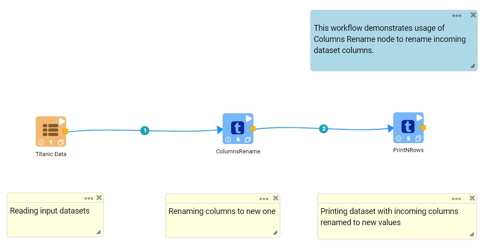
   
**Incoming Dataset**

.. figure:: ../../_assets/user-guide/data-preparation/others/colsrename-incoming-dataset.png
   :alt: dataprepothers_userguide
   :width: 70%
   
**Columns Rename Node Configuration**

*	``Columns Rename`` node is configured as below.
*	Input of this node are the incoming datasets.
*	Incoming columns that need to be renamed is to be selected in ``Current Column Names`` list.
*	New column name is to be entered in ``Columns New Name`` box.
*	A new ``Variables List`` row needs to be added for additional renaming requirement.	
*	Output of this node would be a dataset with incoming columns renamed to new values.

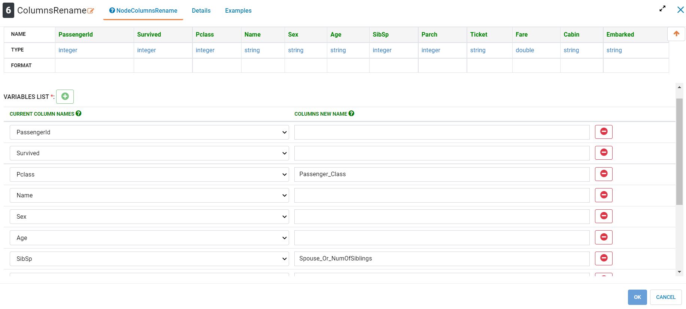
   
**Columns Rename Node Output**

Output of ``Columns Rename`` node would be a dataset with incoming columns renamed to new values.

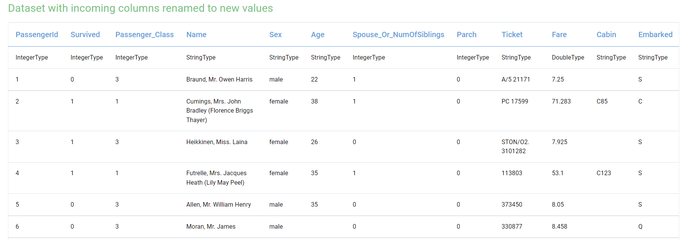

Round Value
----------------------------------------

Below is a sample workflow that contains ``Round Value`` processor in Fire Insights. It demonstrates the usage of ``Round Value`` node to convert incoming value to a decimal value of specified precision.

It does the following processing of data:

*	Reads incoming dataset.
*	Converts incoming value to a decimal value of specified precision using ``Round Value`` node.
*	Prints output dataset with incoming values converted to decimal values of specified precision.

.. figure:: ../../_assets/user-guide/data-preparation/others/roundvalue-workflow.png
   :alt: dataprepothers_userguide
   :width: 70%
   
**Incoming Dataset**

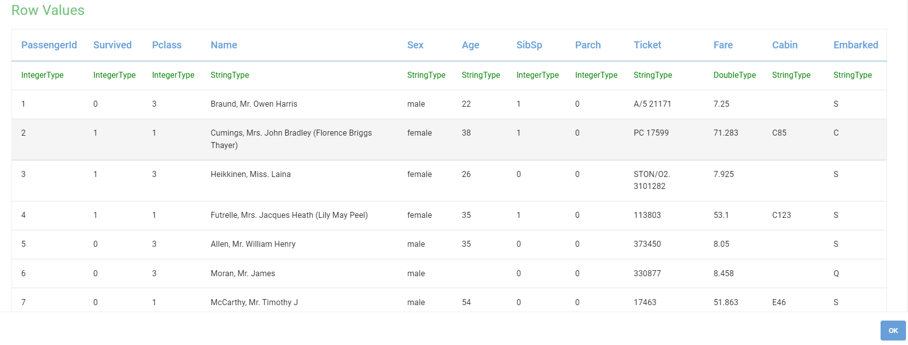
   
**Round Value Node Configuration**

*	``Round Value`` node is configured as below.
*	Input of this node are the incoming datasets.
*	Columns of which values are to be rounded off are to be selected in ``Input Column`` list.
*	Precision expected in the output rounded value is to be entered in ``Precision`` box.
*	Output of this node would be a dataset with incoming values converted to decimal values of specified precision.

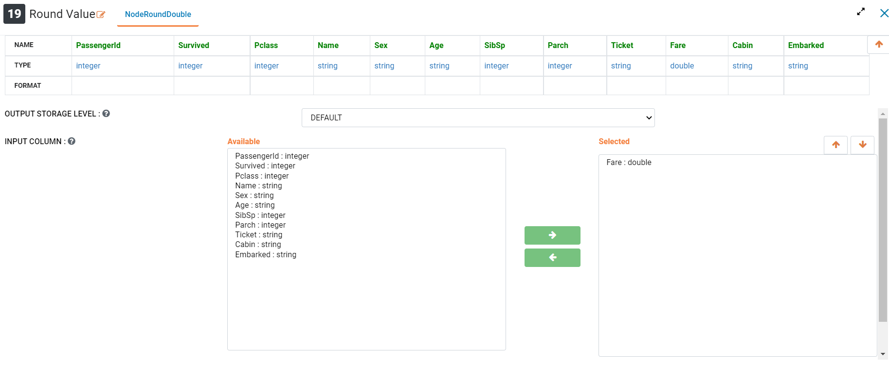

   
**Round Value Node Output**

Output of ``Round Value`` node would be a dataset with incoming values converted to decimal values of specified precision.

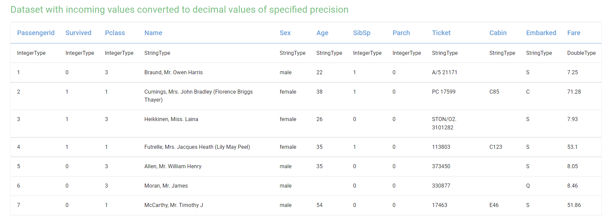

Count
----------------------------------------

Below is a sample workflow that contains ``Count`` processor in Fire Insights. It demonstrates the usage of ``Count`` node to fetch and print row count of incoming dataset.

It does the following processing of data:

*	Reads incoming dataset.
*	Fetches and prints row count of incoming dataset using ``Count`` node.
*	Prints row count of incoming dataset.

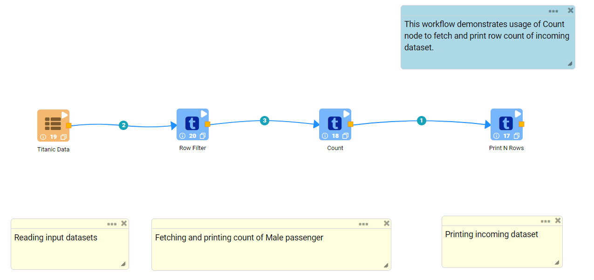
   
**Incoming Dataset**

.. figure:: ../../_assets/user-guide/data-preparation/others/count-incoming-dataset.png
   :alt: dataprepothers_userguide
   :width: 70%
   
**Count Node Configuration**

*	``Count`` node is configured as below.
*	Input of this node are the incoming datasets.
*	Column in the output to display count is to be entered in ``Variable Name`` box.
*	If count is to be displayed in the output then True needs to be selected in ``PrintCount`` list.
*	Output of this node would display row count of incoming dataset.

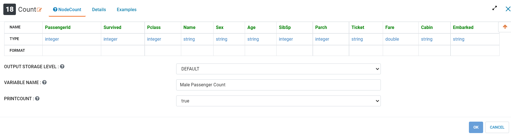

**Count Node Output**

Output of ``Count`` node would display row count of incoming dataset.

Moving Windows Function
----------------------------------------

Below is a sample workflow that contains ``Moving Windows Function`` processor in Fire Insights. It demonstrates the usage of ``Moving Windows Function`` node to compute moving values such as average/max/min by application of specified function on the windows of rows defined.

It does the following processing of data:

*	Reads incoming dataset.
*	Computes moving values such as average/max/min by application of specified function on the windows of rows defined using ``Moving Windows Function`` node.
*	Prints output dataset with computed moving average calculated in the windows defined.

.. figure:: ../../_assets/user-guide/data-preparation/others/movwinfn-workflow.png
   :alt: dataprepothers_userguide
   :width: 70%
   
**Incoming Dataset**

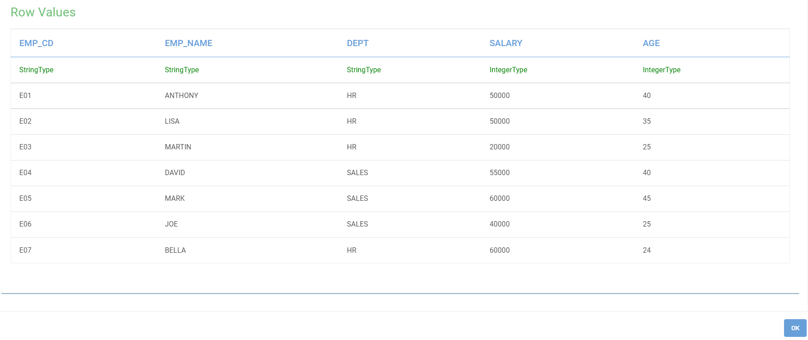
   
**Moving Windows Function Node Configuration**

*	``Moving Windows Function`` node is configured as below.
*	Input of this node are the incoming datasets.
*	Number of rows above the current row that needs to be included in the windows is to be entered in ``Window Start`` box. If it contains -2 then window for row would start at 2 rows above.
*	Number of rows below the current row that needs to be included in the windows is to be entered in ``Window End`` box. If it contains 2 then window for row would end at 2 rows below.
*	Partition defines boudary of windows definition. Column that is used to define partition is to be selected in ``Partition Column Name`` list.
*	Column used to order rows within a partition is to be selected in ``Order Column Name`` list.
*	Column that is used to compute output by application of Windows Function is to be selected in ``Input Columns`` list.
*	Windows function to be used is to be selected in ``Functions`` list.
*	A new row needs to be added for each additional computation requirement. 
*	Output would be a dataset with computed moving average calculated in the windows defined.

.. figure:: ../../_assets/user-guide/data-preparation/others/movwinfn-config.png
   :alt: dataprepothers_userguide
   :width: 70%

**Moving Windows Function Node Output**

Output of ``Moving Windows Function`` node would display a dataset with computed moving average calculated in the windows defined.

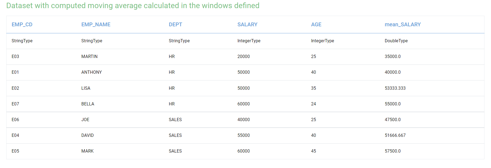
   

Multi Windows Analytics
----------------------------------------

Below is a sample workflow that contains ``Multi Windows Analytics`` processor in Fire Insights. It demonstrates the usage of ``Multi Windows Analytics`` node to select a value by application of windows functions such as first_val / last_val within a group of rows.

It does the following processing of data:

*	Reads incoming dataset.
*	Selects a value by application of windows functions such as first_val / last_val within a group of rows using ``Multi Windows Analytics`` node.
*	Prints output dataset with a value selected within a group using windows function.

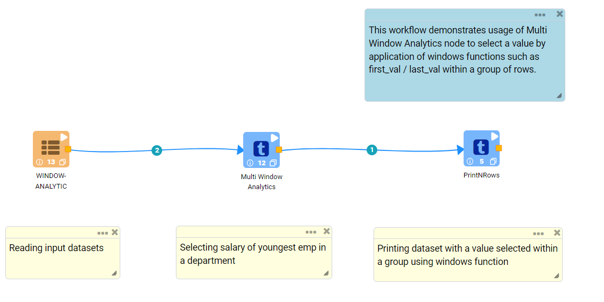
   
**Incoming Dataset**

   
**Multi Windows Analytics Node Configuration**

*	``Multi Windows Analytics`` node is configured as below.
*	Input of this node are the incoming datasets.
*	Column that is used to compute output by application of Windows Function is to be selected in ``AnalyticsColumn`` list.
*	Windows function to be used is to be selected in ``Windows Function`` list.
*	Column that is used to define partition is to be entered in ``PartitionBy`` box.
*	Column used to order rows is to be entered in ``OrderBy`` box.
*	Column name in the output to list computed value is to be entered in ``OutputColumn`` box.
*	Output would be a dataset with a value selected within a group using windows function.

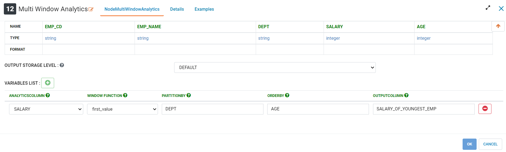

**Multi Windows Analytics Node Output**

Output of ``Multi Windows Analytics`` node would display a dataset with a value selected within a group using windows function.

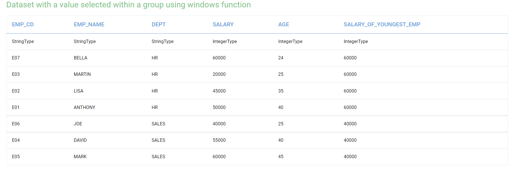
   

Multi Windows Ranking
----------------------------------------

Below is a sample workflow that contains ``Multi Windows Ranking`` processor in Fire Insights. It demonstrates the usage of ``Multi Windows Ranking`` node to rank rows within a group using a windows function.

It does the following processing of data:

*	Reads incoming dataset.
*	Ranks rows within a grou using ``Multi Windows Ranking`` node.
*	Prints output dataset with rank value for each row computed using windows function.

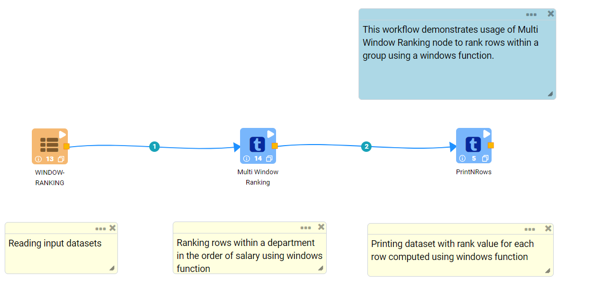
   
**Incoming Dataset**

   
**Multi Windows Ranking Node configuration**

*	``Multi Windows Ranking`` node is configured as below.
*	Input of this node are the incoming dataset.
*	Windows function to be used is to be selected in ``WindowsFunction`` list.
*	Column that is used to define partition is to be entered in ``PartitionBy`` box.
*	Column used to order rows is to be entered in ``OrderBy`` box.
*	Column name in the output to list computed value / rank is to be entered in ``OutputColumn`` box.
*	Output would be a dataset with rank value for each row computed using windows function.

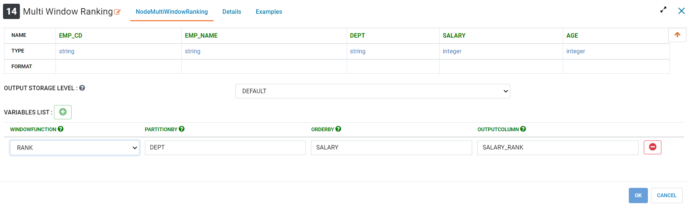

**Multi Windows Ranking Node Output**

Output of ``Multi Windows Ranking`` node would display a dataset with rank value for each row computed using the windows function.

.. figure:: ../../_assets/user-guide/data-preparation/others/mulwinrank-printnode-output.png
   :alt: dataprepothers_userguide
   :width: 70%       	    
   

Sample
----------------------------------------

Below is a sample workflow that contains ``Sample`` processor in Fire Insights. It demonstrates the usage of ``Sample`` node to select a sample dataset out of incoming dataset.

It does the following processing of data:

*	Reads incoming dataset.
*	Selects a sample dataset out of incoming dataset using ``Sample`` node.
*	Prints sample dataset.

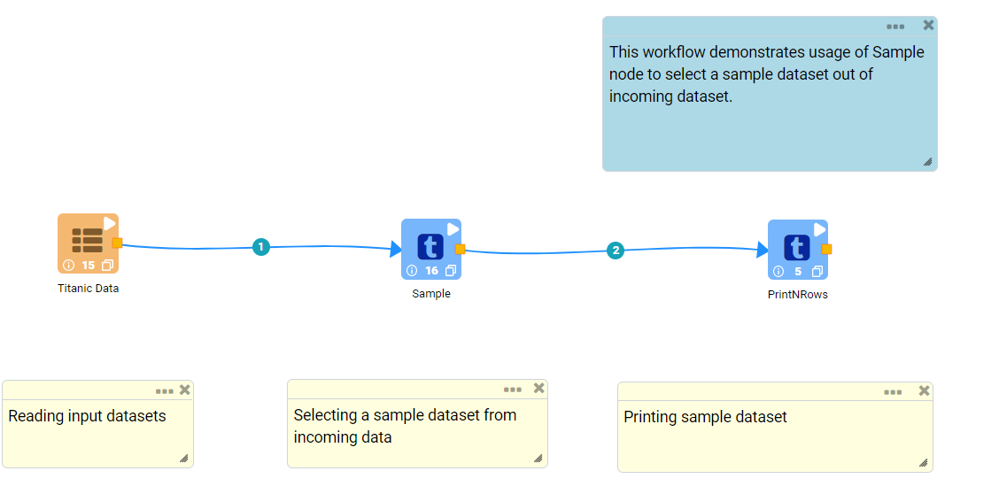
   
**Incoming Dataset**

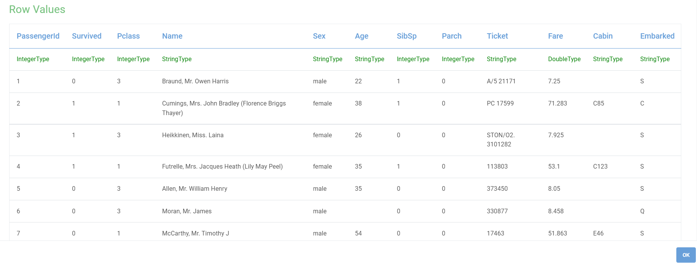
   
**Sample Node Configuration**

*	``Sample`` node is configured as below.
*	Input of this node are the incoming datasets.
*	If selected sample can be picked again in subsequent sampling run then ``Replacement Values`` is to be selected as true.
*	Fraction of incoming dataset that needs to be selected as sample is to be entered in ``Fraction`` box.
*	Seed value of the sample selected is to be entered in ``OrderBy`` box. Same sample would be picked if same seed value is entered for multiple runs. 
*	Output would be a Sample dataset.

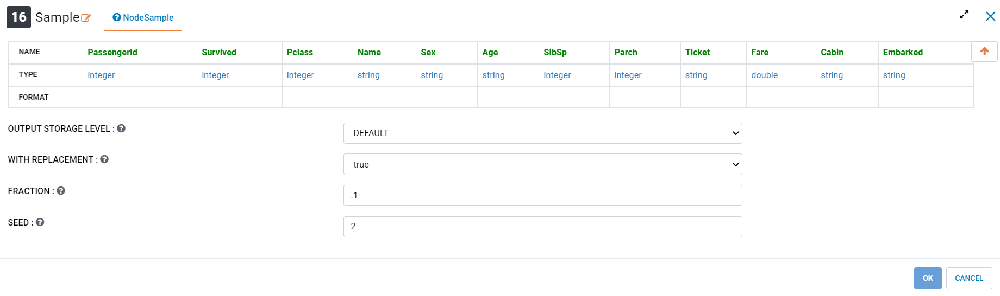

**Sample Node Output**

Output of ``Sample`` node would display a Sample dataset.

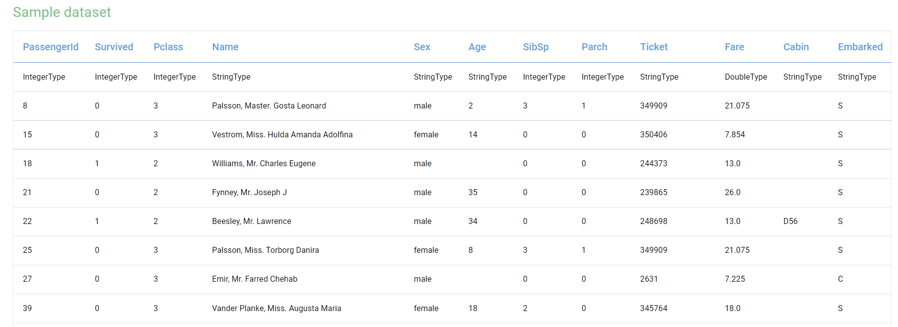
   
Sort By
----------------------------------------

Below is a sample workflow that contains ``Sort By`` processor in Fire Insights. It demonstrates the usage of ``Sort By`` node to sort incoming dataset on selected columns.

It does the following processing of data:

*	Reads incoming dataset.
*	Sorts incoming dataset on selected columns using ``Sort By`` node.
*	Prints sorted dataset.

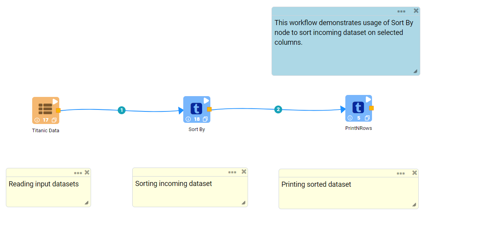
   
**Incoming Dataset**

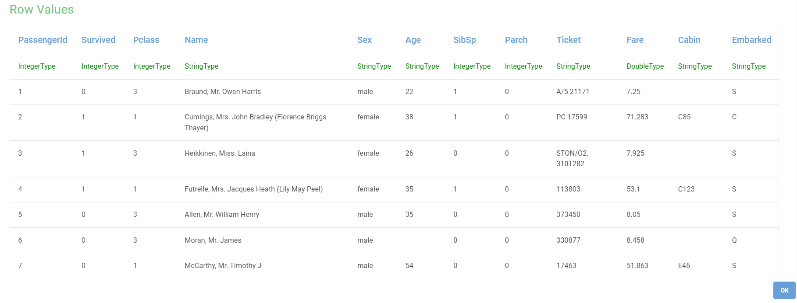
   
**Sort By Node Configuration**

*	``Sort By`` node is configured as below.
*	Input of this node are the incoming datasets.
*	Description of sorting operation needs to be entered in ``Description`` box.
*	Column used to sort incoming dataset is to be selected in ``Columns`` list.
*	Order in which output is to be displayed; either in ascending or descending order of selected column is to be selected in ``Sorting Order`` list.
*	Output would be a Sorted dataset.

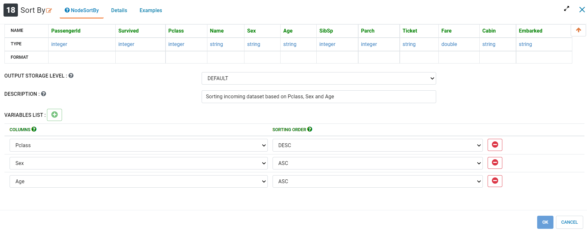

**Sort By Node Output**

Output of ``Sort By`` node would display a Sorted dataset.

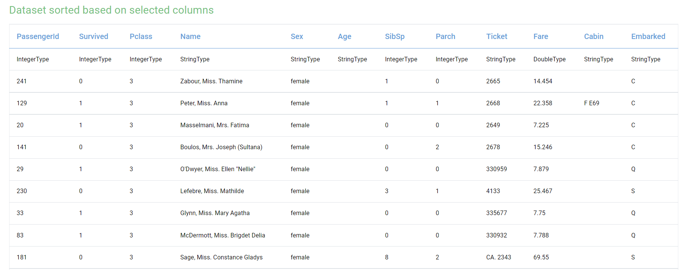
   

Sort Columns
----------------------------------------

Below is a sample workflow that contains ``Sort Columns`` processor in Fire Insights. It demonstrates the usage of ``Sort Columns`` node to change order of columns in the output as per selection.

It does the following processing of data:

*	Reads incoming dataset.
*	Changes order of columns in the output as per selection using ``Sort Columns`` node.
*	Prints output dataset displaying columns sorted in the selected order.

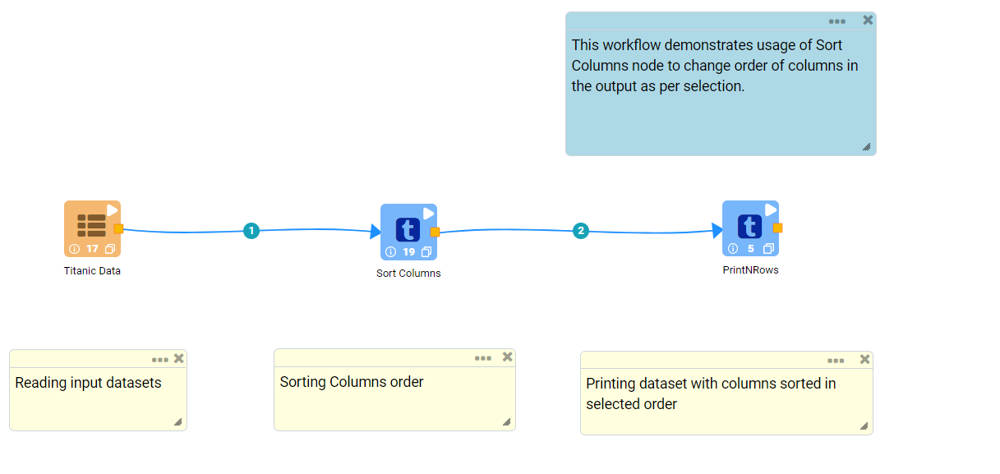
   
**Incoming Dataset**

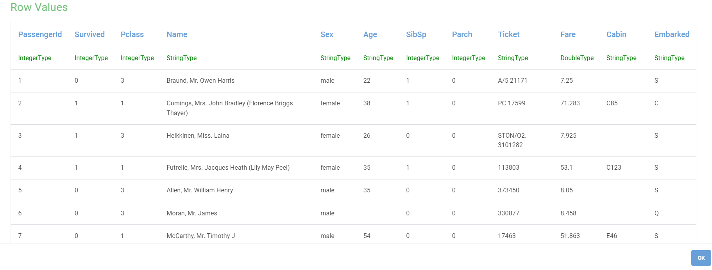
   
**Sort Columns Node Configuration**

*	``Sort Columns`` node is configured as below.
*	Input of this node are the incoming datasets.
*	Action defines the column sorting pattern to be used.
*	``A-Z`` action is to be selected if columns need to be sorted in ascending order of column names.
*	``Z-A`` action is to be selected if columns need to be sorted in descending order of column names. Similarily other action needs to be selected based on need.
*	Output would be a dataset displaying columns sorted in the selected order.

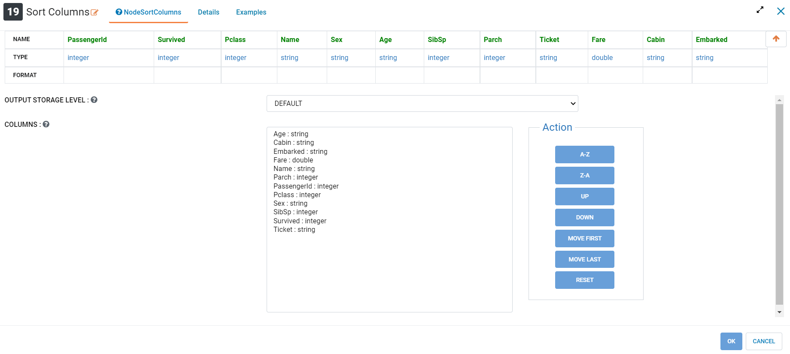

**Sort Columns Node Output**

Output of ``Sort Columns`` node would display a dataset displaying columns sorted in the selected order.

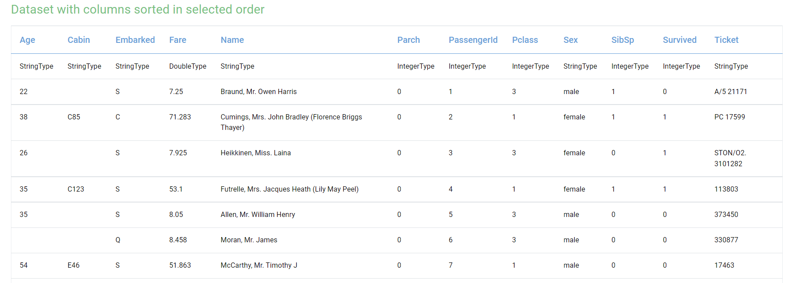
   

Transpose
----------------------------------------

Below is a sample workflow which contains ``Transpose`` processor in Fire Insights. It demonstrates the usage of ``Transpose`` node to transpose incoming dataset against on the selected column.

It does the following processing of data:

*	Reads incoming dataset.
*	Transpose incoming dataset against on the selected column using ``Transpose`` node. Incoming dataset needs to have all columns of same datatype.
*	Prints output dataset displaying transposed dataset against selected column.

.. figure:: ../../_assets/user-guide/data-preparation/others/transpose-workflow.png
   :alt: dataprepothers_userguide
   :width: 70%
   
**Incoming Dataset**

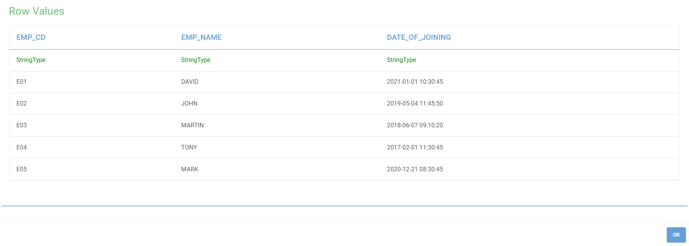
   
**Transpose Node Configuration**

*	``Transpose`` node is configured as below.
*	Input of this node are the incoming datasets.
*	Column against which incoming dataset is to be transposed is to be selected in ``TransposeByColumn Name`` list.
*	Data of the selectd Column would be displayed in rows in the output and other columns data would be displayed in columns. 
*	Output would be a dataset displaying transposed dataset against selected column.

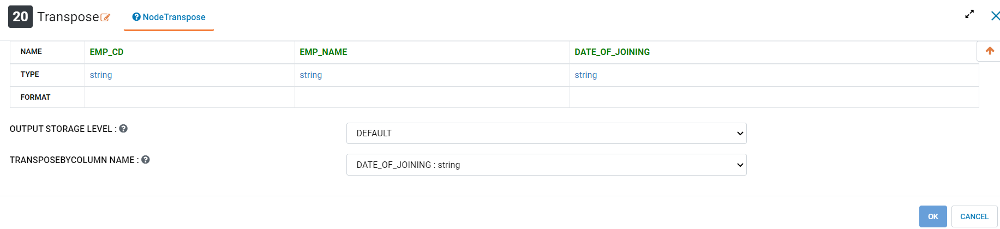

**Transpose Node Output**

Output of ``Transpose`` node would display a dataset displaying transposed dataset against selected column.

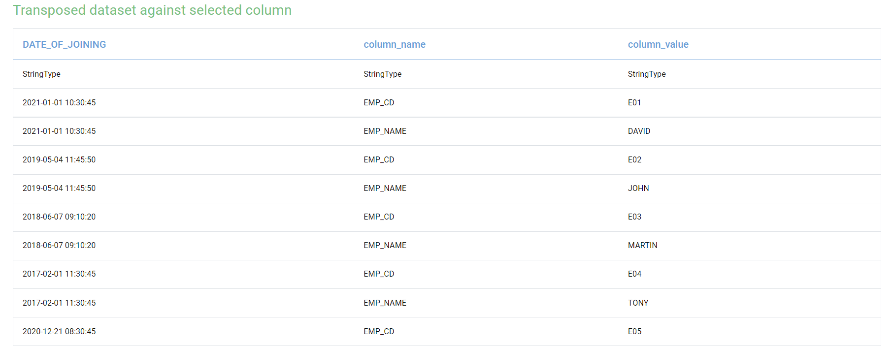
   
Windows Analytics
----------------------------------------

Below is a sample workflow that contains ``Windows Analytics`` processor in Fire Insights. It demonstrates the usage of ``Windows Analytics`` node to select a value by application of windows functions such as first_val / last_val within a group of rows.

It does the following processing of data:

*	Reads incoming Dataset.
*	Selects a value by application of windows functions such as first_val / last_val within a group of rows using ``Windows Analytics`` node.
*	Prints output dataset with a value selected within a group using windows function.

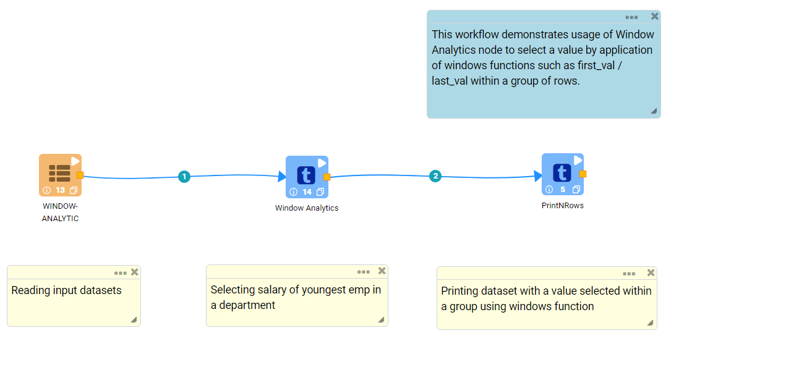
   
**Incoming Dataset**

   
**Windows Analytics Node Configuration**

*	``Windows Analytics`` node is configured as below.
*	Input of this node are the incoming datasets.
*	Column that is used to define partition is to be entered in ``PartitionBy`` box.
*	Column used to order rows is to be entered in ``OrderBy`` box.
*	Windows function to be used is to be selected in ``Windows Function`` list.
*	Column that is used to compute output by application of Windows Function is to be selected in ``Analytics Column`` list.
*	Lead and Lag value to be used for selection is to be entered in ``Window Offset`` box.
*	Output would be a dataset with a value selected within a group using windows function.

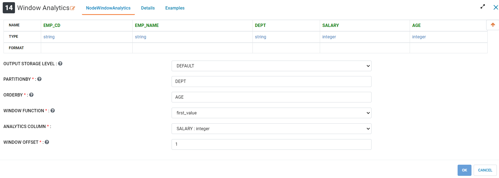

**Windows Analytics Node Output**

Output of ``Windows Analytics`` node would display a dataset with a value selected within a group using windows function.

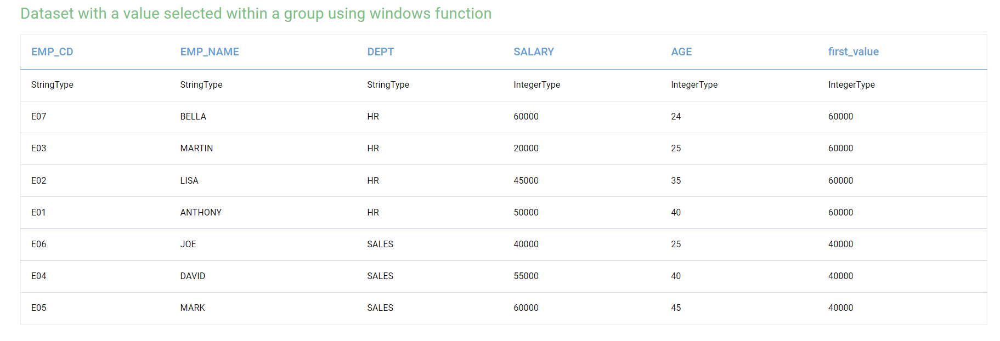

Windows Ranking
----------------------------------------

Below is a sample workflow that contains ``Windows Ranking`` processor in Fire Insights. It demonstrates the usage of ``Windows Ranking`` node to rank rows within a group using a windows function.

It does the following processing of data:

*	Reads incoming dataset.
*	Ranks rows within a group using a windows function using ``Windows Ranking`` node.
*	Prints output dataset with rank value for each row computed using windows function.

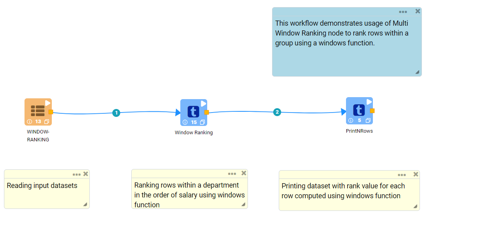
   
**Incoming Dataset**

   
**Windows Ranking Node Configuration**

*	``Windows Ranking`` node is configured as below.
*	Input of this node are the incoming dataset.
*	Column that is used to define partition is to be entered in ``PartitionBy`` box.
*	Column used to order rows is to be entered in ``OrderBy`` box.
*	Windows function to be used is to be selected in ``Window Function`` list.
*	Output would be a dataset with rank value for each row computed using windows function.

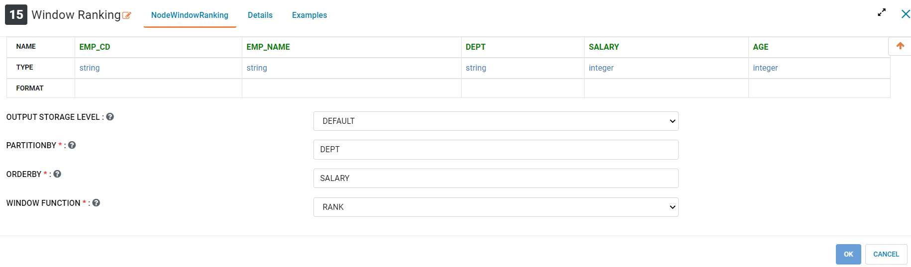

**Windows Ranking Node Output**

Output of ``Windows Ranking`` node would display a dataset with rank value for each row computed using windows function.

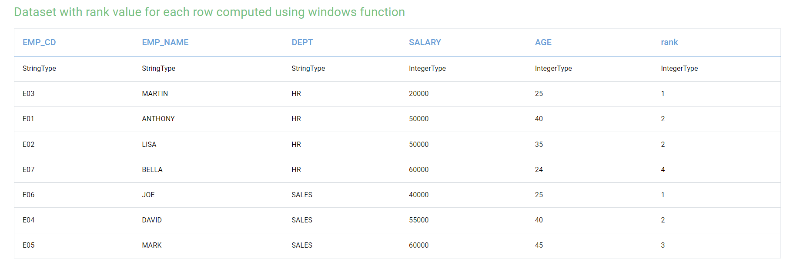

Flatten
----------------------------------------

Below is a sample workflow that contains ``Flatten`` processor in Fire Insights. It demonstrates the usage of ``Flatten`` node to add new columns for each element of a struct present in a Column data.   

It does the following processing of data:

*	Reads incoming dataset.
*	Adds new columns for each element of a struct present in a Column data using ``Flatten`` node.
*	Prints output dataset with new columns added to it.

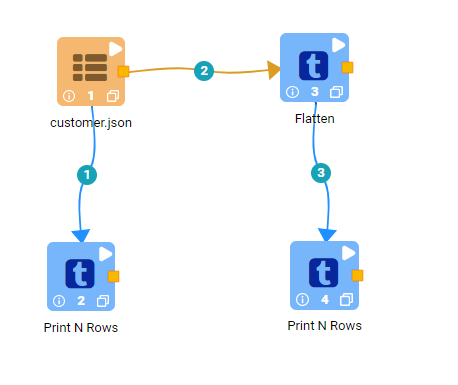
   
**Incoming Dataset**

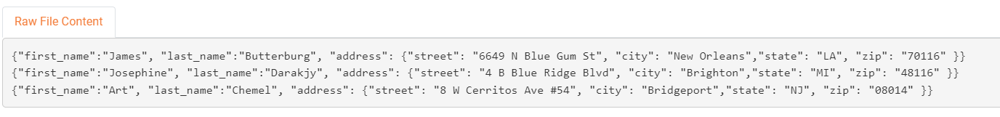
   
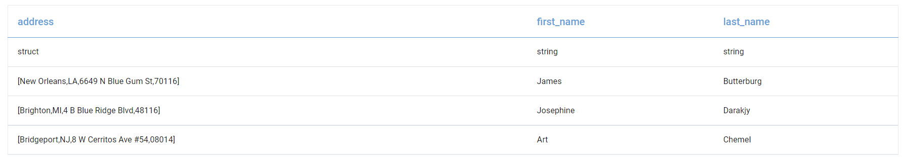
   
**Flatten Node Configuration**

*	``Flatten`` node is configured as below.
*	Input of this node is an incoming dataset i.e. a JSON data.
*	Struct of which elements need to be added as new column is to be selected in the ``Schema`` section. In this example, ``Address`` column contains struct data.
*	Elements that need to be added as columns is to be selected.
*	Output of this node would be a dataset with new columns added to it.

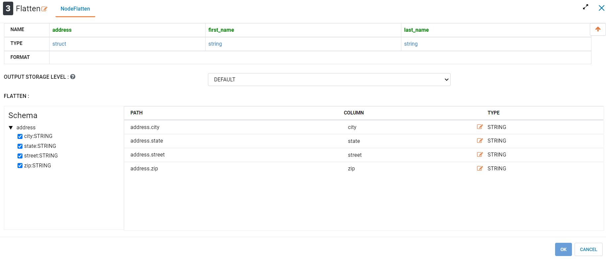
   
**Flatten Node Output**

Output of ``Flatten`` node would be a dataset with new columns added to it.

.. figure:: ../../_assets/user-guide/data-preparation/others/flatten-printnode-output.png
   :alt: dataprepothers_userguide
   :width: 80%       	    
	 
Explode
----------------------------------------

Below is a sample workflow that contains ``Explode`` processor in Fire Insights. It demonstrates the usage of ``Explode`` node to add new rows for each value of an array data that is contained in a column data.

It does the following processing of data:

*	Reads incoming dataset.
*	Adds new rows for each value of an array data that is contained in a column data using ``Explode`` node.
*	Prints output dataset with new rows added to it.

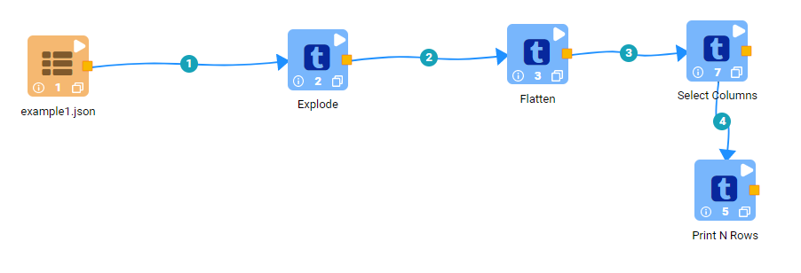
   
**Incoming Dataset**

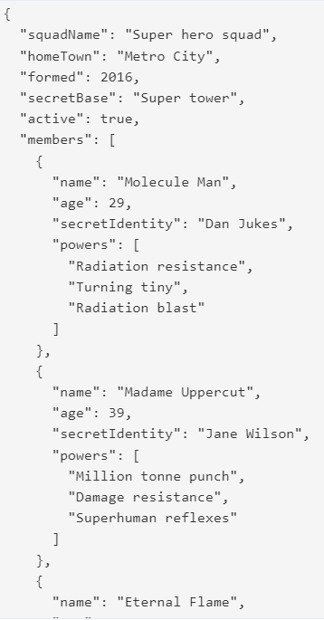
   
**Explode Node Configuration**

*	``Explode`` node is configured as below.
*	Input of this node is an incoming dataset i.e. a complex JSON data.
*	Array data of which elements need to be added as new rows is to be selected in the ``Input Columns`` section. In this example, ``Members`` column contains Array data.
*	After inserting rows using values from Array data, ``Flatten`` is used to extract elements values.
*	Output of this node would be a dataset with new rows added to it.

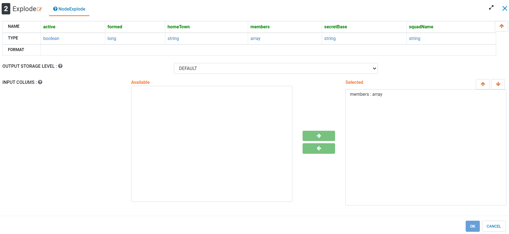
   
**Explode Node Output**

Output of ``Explode`` node would be a dataset with new rows added to it.

*	Array Data from the input as displayed in the output.

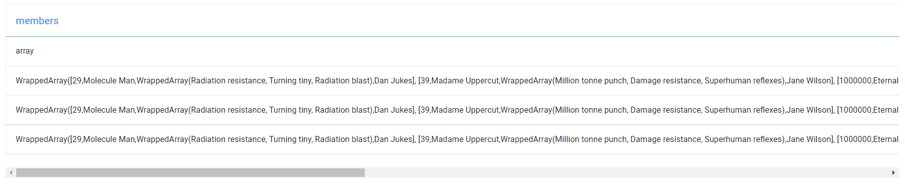
	 
*	Array Data from the input added as new rows using ``Explode`` node and further data from each array element is added as new column using ``Flatten`` node.

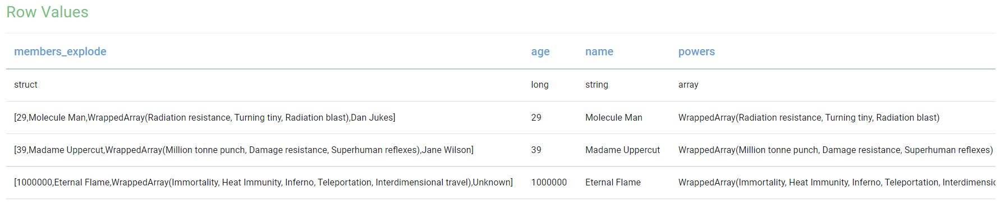

Hive Incremental
----------------------------------------

Below is a sample workflow that contains ``Hive Incremental`` processor in Fire Insights. It demonstrates the usage of ``Hive Incremental`` node to read data from a Hive table incrementally using watermark data.

It does the following processing of data:

*	Reads incoming data from a Hive table incremenatlly using ``Hive Incremental`` node.
*	Saves data to the target table and update watermark data using ``Save Watermark`` node.

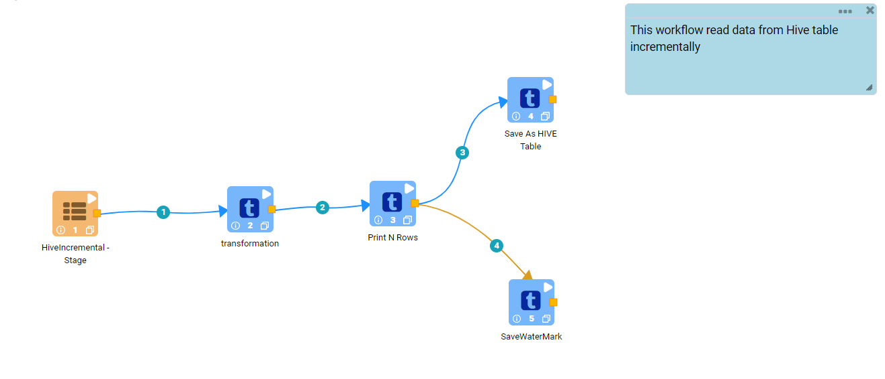
   
**Hive Incremental Node Configuration**

*	``Hive Incremental`` node is configured as below.
*	Hive database information needs to be entered in ``Hive Database`` field. ``Browse Hive DB`` button can be used to selected Hive Database based on the Hive connection defined.
*	Hive Table information needs to be entered in ``Hive Table`` field. ``Browse Hive Table`` button can be used to select Hive Table.
*	Path of the watermark data needs to be entered in ``Path`` field. Browse buttons can be used to select the path.
*	Columns that are used to filter incoming data based on Watermark information needs to be entered in ``Filterfields`` field. Multiple columns can be entered separated by comma.
* 	Click on ``Refresh Schema`` button to fetch schema information from the table selected.

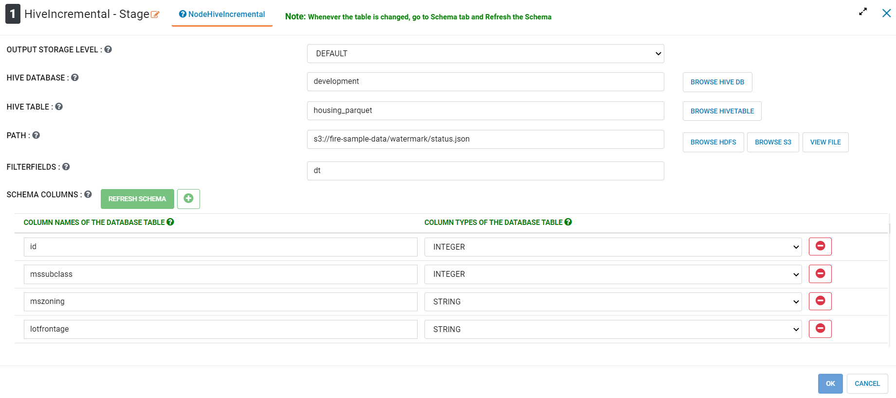
   
**Save Watermark Node to Save Status**

*	Updated Watermark status information is saved using ``Save Watermark`` node.
*	During next cycle of execution updated status information is used to read new Hive data.

**Save Watermark Node Configuration**

*	``Save Watermark`` node is configured as below.
*	Path of the watermark data needs to be entered in ``Path`` field. Browse buttons can be used to select the path.

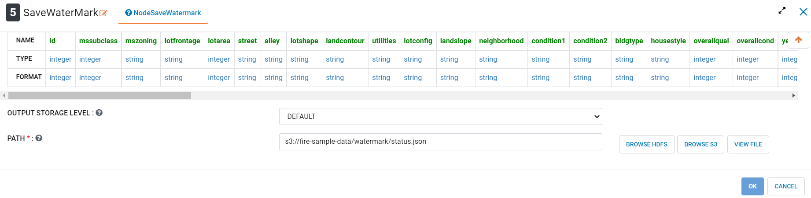
