Parse Functions
======

Fire Insights provides processors that parse the values of the selected columns.

Parse Processors in Fire Insights
----------------------------------------

.. list-table:: 
   :widths: 30 70
   :header-rows: 1

   * - Title
     - Description
   * - Apache Logs
     - Reads in Apache Log files from a given path, parses them, and loads them into a DataFrame.
   * - Field Splitter
     - This node splits the string of the specified input column using the specified delimiter.
   * - Fixed Length Fields
     - It extracts data of fixed length from a column and appends them as new columns to the outgoing DataFrame.
   * - Multi Regex Extractor
     - It extracts data from columns based on provided pattern and adds them as new columns in outgoing DataFrame.
   * - OCR
     - Performs Optical Character Recognition using the Tesseract library.
   * - Parse JSON Col
     - It parses JSON data present in a column and extracts data. Extracted data are appended as new columns in the outgoing DataFrame.
   * - Regex Tokenizer
     - This node creates a new DataFrame by the process of taking text (such as a sentence) and breaking it into individual terms (usually words) based on regex expressions.

Apache Logs
----------------------------------------

Below is a sample workflow which contains ``Apache Logs`` processor in Fire Insights. It demonstrates the usage of ``Apache Logs`` node to parse an apache log file.

It does the following processing of data:

*	Reads incoming dataset containing apache logs data and parse it using ``Apache Logs`` node.
* 	Parsed data is printed using the Print node.

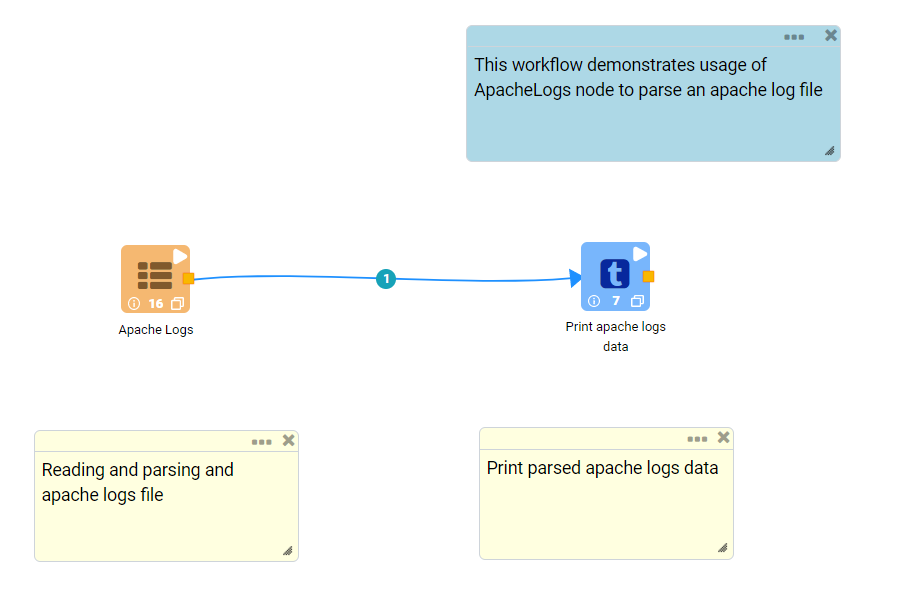
   

**Apache Logs Node Configuration**

*	Reads apache logs data and parse it using ``Apache Logs`` node.
*	Parsed data is listed in Data Columns format.
*	Apache Logs file need to be selected in ``Path`` field.

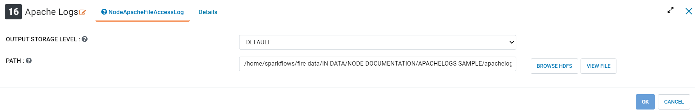

**Apache Logs Node Output**

Parsed data using ``Apache Logs`` node is displayed using the Print node as below.

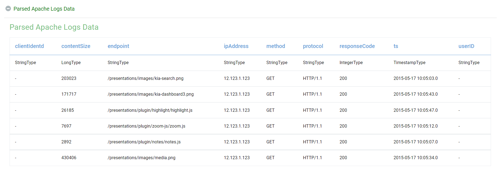
   
Field Splitter
----------------------------------------

Below is a sample workflow which contains ``Field Splitter`` processor in Fire Insights. It demonstrates the usage of ``Field Splitter`` node to split a column value using a delimiter into multiple data columns. Splitted columns are appended to output.

It does the following processing of data:

*	Reads incoming Dataset. Incoming Dataset contains a column (PRD_DETAILS) populated with multiple data values joined together using a delimiter (:).
*	``Field Splitter`` node is used to split data present in column (PRD_DETAILS) into multiple data parts. Splitted data parts are appended as new columns to the outgoing dataset.
* 	Output is printed using the Print node.

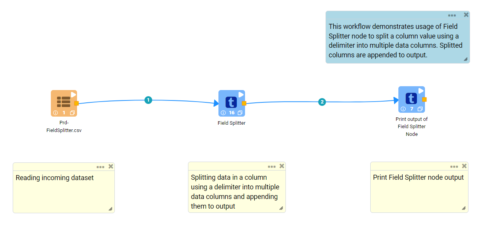
   

**Field Splitter Node Configuration**

*	Column from incoming dataset containing multiple data parts needs to be selected in ``Input Column``.
*	Name of output columns that would be created after splitting needs to be entered in ``Output Columns``. Multiple column names can be entered separated by comma. These columns would be added to the output.
*	Delimiter used to join multiple data parts needs to be entered in ``Separator``. 
*  In the below example, ``:`` is used as a ``Separator``. For few ``Separator`` such as ``Pipe Symbol`` or ``|``, ``Escape Characater`` or ``\`` needs to be used as a prefix, i.e., ``Separator`` needs to be entered as ``\|``. 

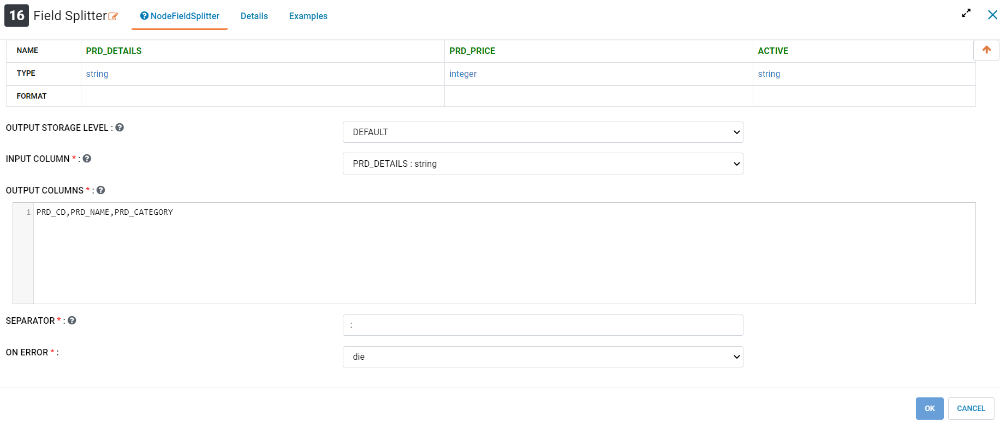

**Field Splitter Node Output**

Output is displayed as below.

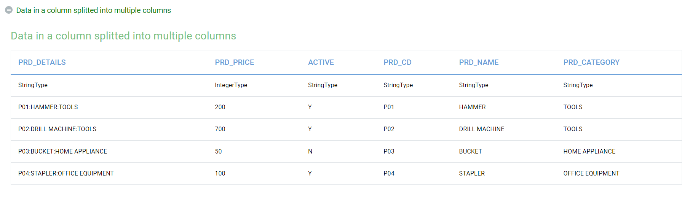
   
Fixed Length Fields
----------------------------------------

Below is a sample workflow which contains ``Fixed Length Fields`` processor in Fire Insights. It demonstrates the usage of ``Fixed Length Fields`` node to split a column value into multiple data columns of fixed length. Splitted columns are appended to output.

It does the following processing of data:

*	Reads incoming Dataset. Incoming Dataset contains a column (DATA_COL) populated with multiple data values of fixed length joined together.
*	``Fixed Length Fields`` node is used to split data present in column (DATA_COL) into multiple data parts of fixed length. Splitted data parts are appended as new columns to the outgoing dataset.
* 	Output is printed using the Print node.

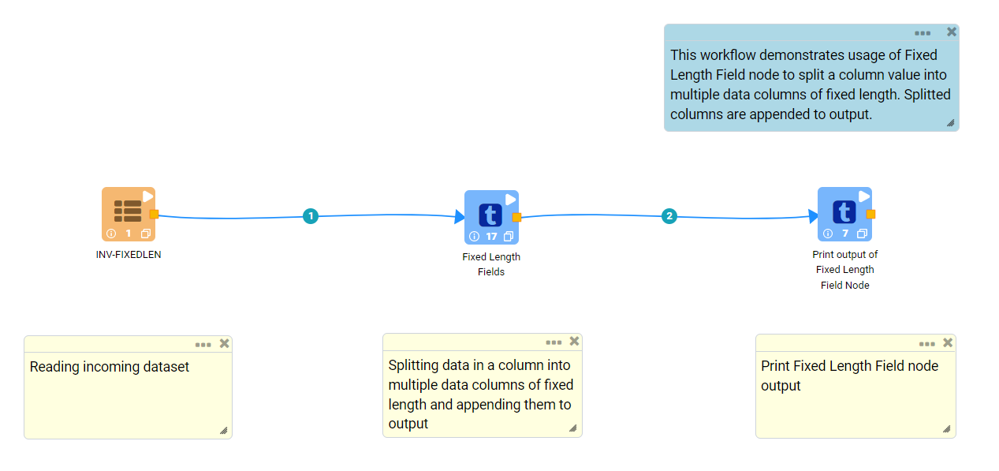
   

**Fixed Length Fields Node Configuration**

*	Column from incoming dataset containing multiple data parts needs to be selected in ``Input Column``.
*	Column name for Data Part needs to be entered in ``Column Names For The CSV``.
*	Data Type and Length of the data part needs to be entered in ``Column Types For The CSV`` and ``Length Of Each Column`` respectively.
*	In case of multiple data parts additional rows need to be entered. These would be added as new columns to the output.

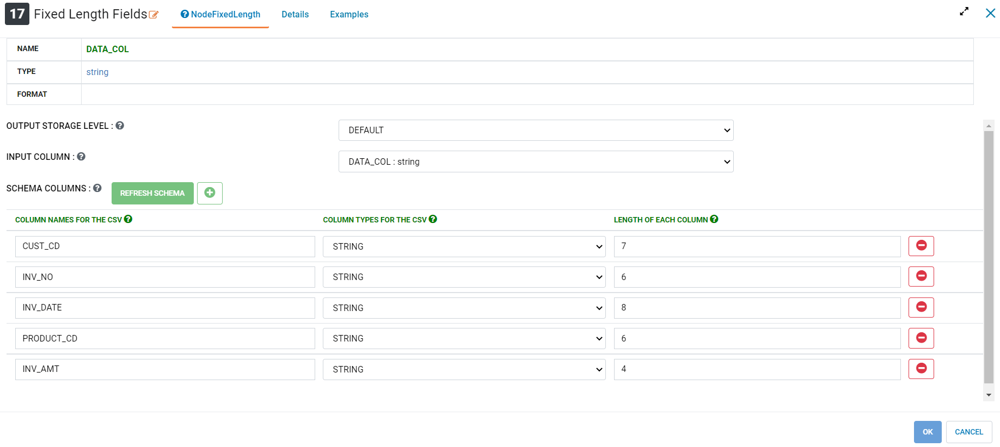

**Fixed Length Fields Node Output**

Output is displayed as below.

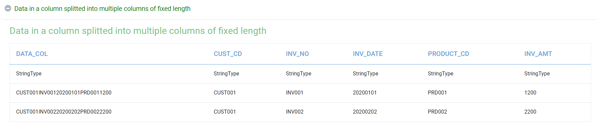
   
Multi Regex Extractor
----------------------------------------

Below is a sample workflow which contains ``Multi Regex Extractor`` processor in Fire Insights. It demonstrates the usage of ``Multi Regex Extractor`` node to extract data from a field using a Regex Expression. Extracted data is appended to the output dataset. Multiple data parts can be extracted from input columns.

It does the following processing of data:

*	Reads incoming dataset.
*	Extracts data parts from incoming dataset of specific Regex pattern using ``Multi Regex Extractor`` and appends them as new columns to output.
* 	Output is printed using the Print node.

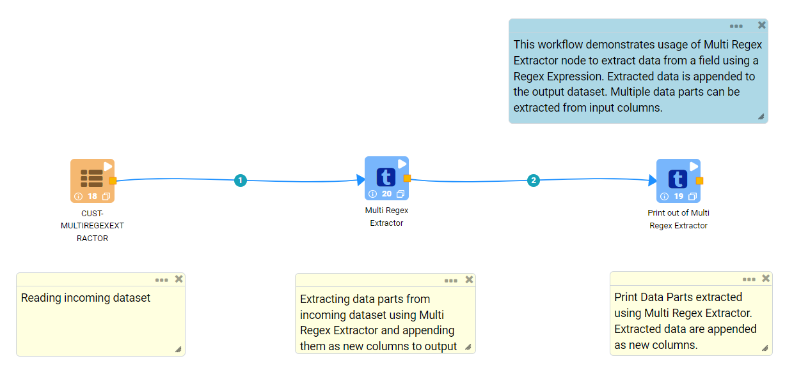
   

**Multi Regex Extractor Node configuration**

*	Column from incoming dataset from which data parts need to be extracted is to be selected in ``InputColumnsName``.
*	Name of the column to display extracted data part in the outgoing dataset needs to be entered in ``OutputColumnsName``.
*	Regex Pattern used to extract data part needs to be entered in ``Patterns``.
*	Regex Expression group defining the portion of the matching string to be extracted needs to be entered in ``Groups``.
*	If multiple data parts need to be extracted then additional rows need to be added.

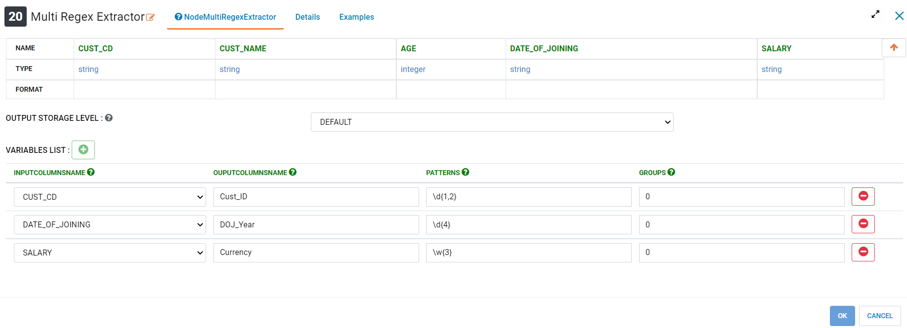

**Multi Regex Extractor Node Output**

Output is displayed as below.

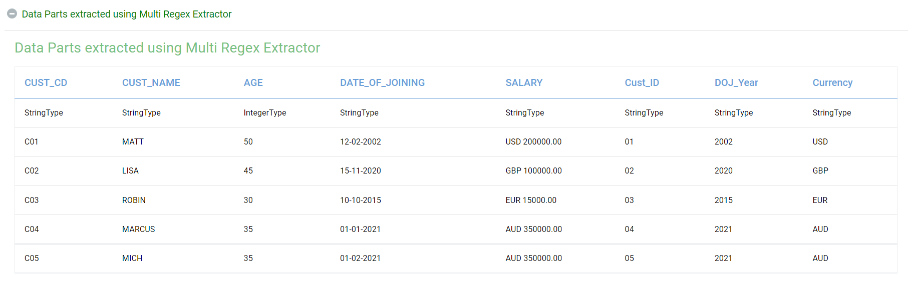
   
Parse JSON Col
----------------------------------------

Below is a sample workflow which contains ``Parse JSON Col`` processor in Fire Insights. It demonstrates the usage of ``Parse JSON Col`` node to parse JSON data present in the incoming dataset. Extracted data is appended to the output dataset. Multiple data parts can be extracted from input columns.

It does the following processing of data:

*	Reads incoming dataset.
*	Parses JSON data present in the incoming dataset using ``Parse JSON Col`` node and appends extracted data as new columns to output.
* 	Output is printed using the Print node.

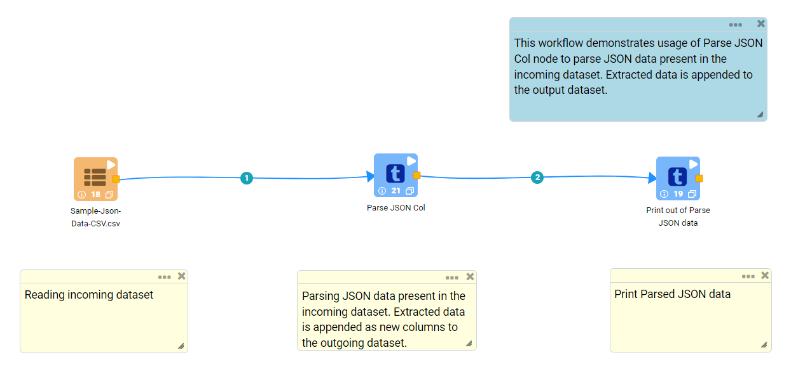
   

**Parse JSON Col Node Configuration**

*	Column in incoming dataset containing JSON data needs to be selected in ``JSON Col Name``.
*	Column Name that needs to be parsed is to be selected in ``Input Col``.
*	JSON field name that needs to be extracted is to be entered in ``JSON Field Names``.
*	Datatype of the JSON field needs to be selected in ``JSON Field Type``.
*	If multiple JSON fields need to be extracted then additional rows need to be added.

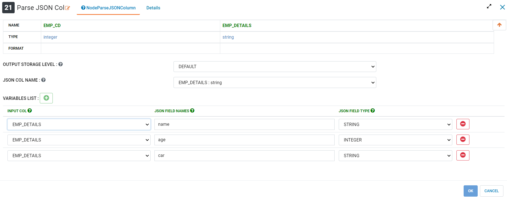

**Parse JSON Col Node Output**

Output is displayed as below.

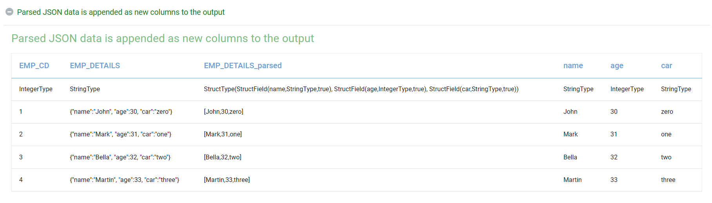
