Split Function
==========

Fire Insights provides processors for Splitting data.

Splitting Processors in Fire Insights
----------------------------------------

.. list-table:: 
   :widths: 30 70
   :header-rows: 1

   * - Title
     - Description
   * - Compare All Columns
     - It Compares 2 incoming DataFrames and outputs 3 DataFrames (A-B), (B-A), (A intersection B).
   * - Compare All Columns Single Output
     - It Compares 2 incoming DataFrames and outputs either of the 3 DataFrames (A-B), (B-A), (A intersection B) based on User's input.
   * - Compare Specific Columns
     - It Compares 2 incoming DataFrames on specific columns and outputs 3 DataFrames (A-B), (B-A), (A intersection B).
   * - Compare Specific Columns Single Output
     - It Compares 2 incoming DataFrames on specific columns and outputs either of the 3 DataFrames (A-B), (B-A), (A intersection B) based on User's input.
   * - Split By Expression
     - It splits the incoming DataFrames into two output DataFrames by applying the conditional logic.
   * - Split By Multiple Expressions
     - It splits the incoming DataFrame into multiple output DataFrames by applying the conditional logic.
 
 
Compare All Columns
----------------------------------------

Below is a sample workflow which contains ``Compare All Columns`` processor in Fire Insights. It demonstrates the usage of ``Compare All Columns`` node to split two incoming datasets into three outgoing datasets created based on A-B, B-A and A Intersection B.

It does the following processing of data:

*	Reads incoming Datasets. This node takes two DataFrames as input and creates three DataFrames as output.
*	Compares all columns of incoming datasets and splits them into three outgoing datasets created based on A-B, B-A and A Intersection B using ``Compare All Columns`` node.
*	First DataFrame (A-B) is created with rows that are part of 1st incoming DataFrame but not present in 2nd DataFrame.
*	Second DataFrame (B-A) is created with rows that are part of 2nd incoming DataFrame but not present in 1st DataFrame.
*	Third DataFrame (A intersection B) is created with rows that are part of both incoming DataFrames.
*	Prints output datasets using the Print node.

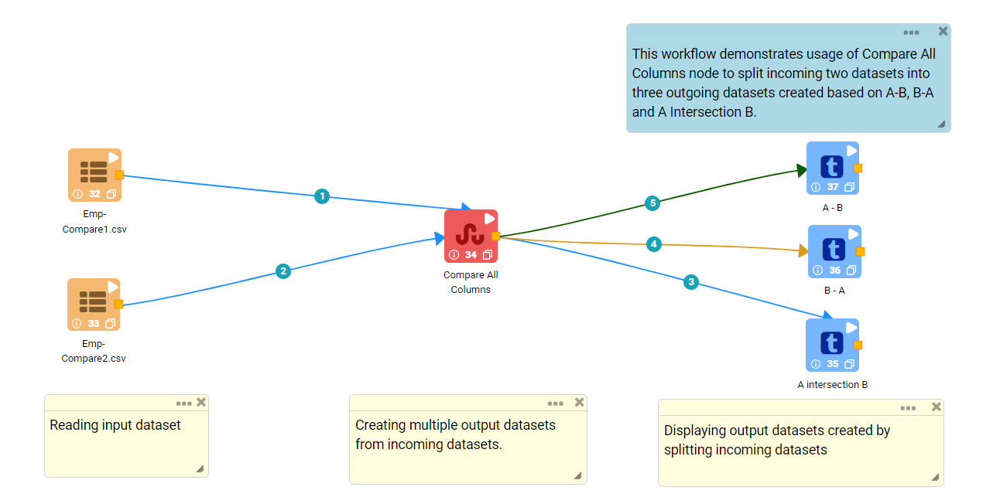
   
**Incoming Dataset**

.. figure:: ../../_assets/user-guide/data-preparation/splitting/compareallcols-incoming-dataset1.png
   :alt: splitting_userguide
   :width: 70%
   
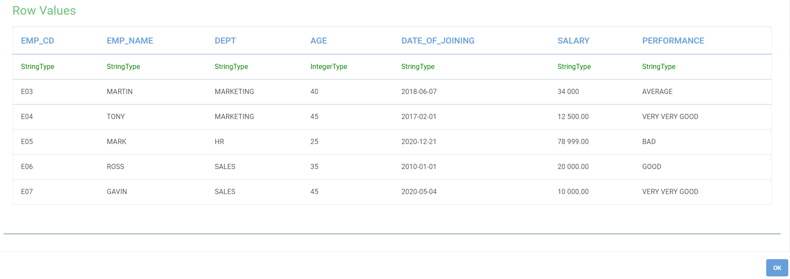

**Compare All Columns Node Configuration**

*	``Compare All Columns`` node is configured as below.
*	Input of this node are the incoming datasets.
*	Output of this node would display datasets created by splitting incoming datasets.

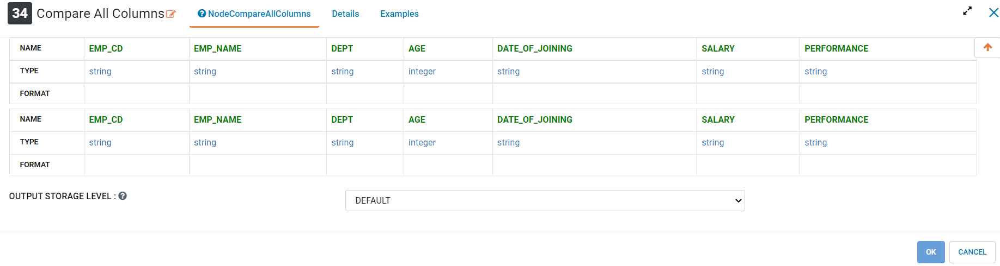
   
**Compare All Columns Node output**

Output of ``Compare All Columns`` node displaying datasets created by splitting incoming datasets.

*	First DataFrame (A-B) is created with rows that are part of 1st incoming DataFrame but not present in 2nd DataFrame.

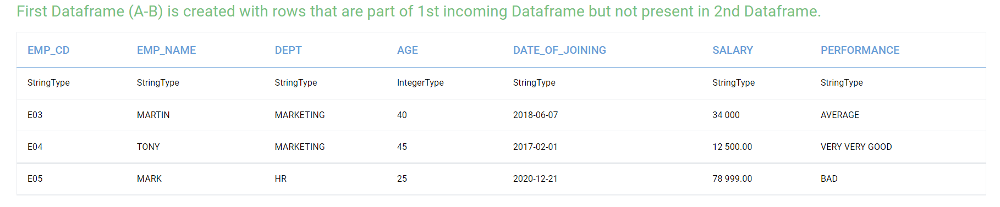
   
*	Second DataFrame (B-A) is created with rows that are part of 2nd incoming DataFrame but not present in 1st DataFrame.
   
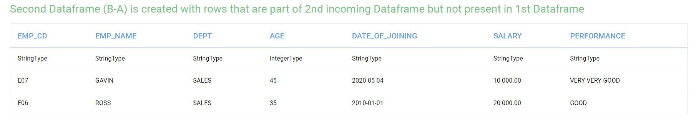
   
*	Third DataFrame (A intersection B) is created with rows that are part of both incoming DataFrames.
   
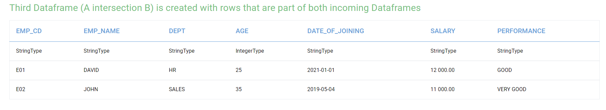
   
Compare All Columns Single Output
----------------------------------------

Below is a sample workflow which contains ``Compare All Columns Single Output`` processor in Fire Insights. It demonstrates the usage of ``Compare All Columns Single Output`` node to split two incoming datasets into either of three datasets created based on A-B, B-A and A Intersection B as per User's selection.

It does the following processing of data:

*	Reads incoming Datasets. This node takes two DataFrames as input and creates three DataFrames as output.
*	Compares all columns of incoming datasets and splits them into either of three datasets created based on A-B, B-A and A Intersection B as per User's selection using ``Compare All Columns Single Output`` node.
*	DataFrame (A-B) is created with rows that are part of 1st incoming DataFrame but not present in 2nd DataFrame.
*	DataFrame (B-A) is created with rows that are part of 2nd incoming DataFrame but not present in 1st DataFrame.
*	DataFrame (A intersection B) is created with rows that are part of both incoming DataFrames.
*	Prints output datasets using the Print node.

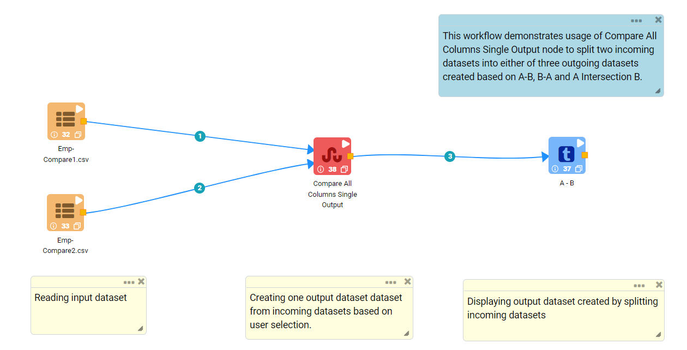
   
**Incoming Dataset**

.. figure:: ../../_assets/user-guide/data-preparation/splitting/compareallcolsop-incoming-dataset1.png
   :alt: splitting_userguide
   :width: 70%
   
.. figure:: ../../_assets/user-guide/data-preparation/splitting/compareallcolsop-incoming-dataset2.png
   :alt: splitting_userguide
   :width: 70%

**Compare All Columns Single Output Node Configuration**

*	``Compare All Columns Single Output`` node is configured as below.
*	Input of this node are the incoming datasets.
*	``Compare Type`` value needs to be selected based on the output dataset needed. In this example ``LeftDataframe_Except_RightDataframe``,i.e., A-B option is selected.
*	Output of this node would display datasets created by splitting incoming datasets.

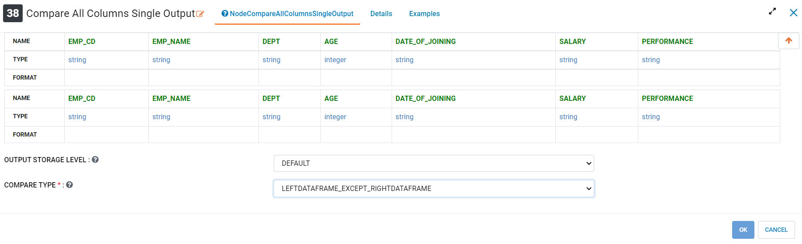
   
**Compare All Columns Single Output Node Output**

Output of ``Compare All Columns Single Output`` node displaying dataset created by splitting incoming datasets as per User's selection.

*	DataFrame (A-B) is created with rows that are part of 1st incoming DataFrame but not present in 2nd DataFrame.

.. figure:: ../../_assets/user-guide/data-preparation/splitting/compareallcolsop-printnode-output1.png
   :alt: splitting_userguide
   :width: 70%       	    
   
Compare Specific Columns
----------------------------------------

Below is a sample workflow which contains ``Compare Specific Columns`` processor in Fire Insights. It demonstrates the usage of ``Compare Specific Columns`` node to compare incoming datasets on specific columns and splits them into three outgoing datasets created based on A-B, B-A and A Intersection B.

It does the following processing of data:

*	Reads incoming Datasets. This node takes two DataFrames as input and creates three DataFrames as output.
*	Compares specific columns of incoming datasets and splits them into three outgoing datasets created based on A-B, B-A and A Intersection B using ``Compare Specific Columns`` node.
*	First DataFrame (A-B) is created with rows that are part of 1st incoming DataFrame but not present in 2nd DataFrame.
*	Second Dataframe (B-A) is created with rows that are part of 2nd incoming DataFrame but not present in 1st DataFrame.
*	Third DataFrame (A intersection B) is created with rows that are part of both incoming DataFrames.
*	Prints output datasets using the Print node.

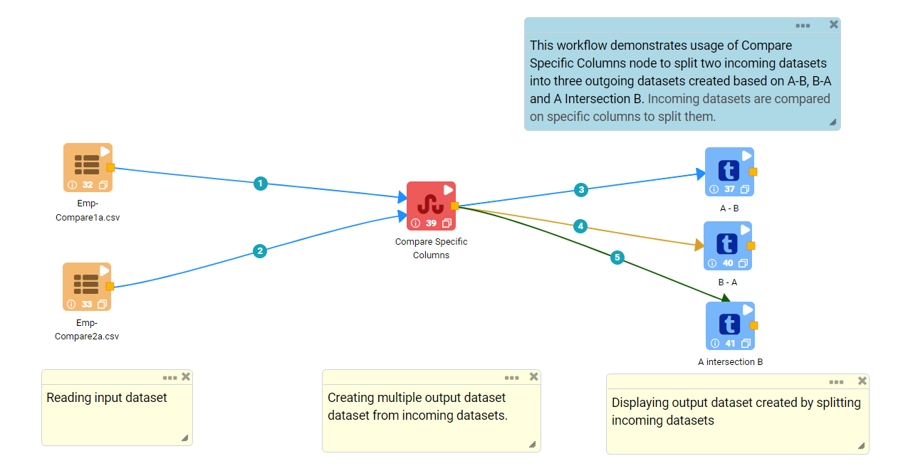
   
**Incoming Dataset**

.. figure:: ../../_assets/user-guide/data-preparation/splitting/comparespecols-incoming-dataset1.png
   :alt: splitting_userguide
   :width: 70%
   
.. figure:: ../../_assets/user-guide/data-preparation/splitting/comparespecols-incoming-dataset2.png
   :alt: splitting_userguide
   :width: 70%

**Compare Specific Columns Node Configuration**

*	``Compare Specific Columns`` node is configured as below.
*	Input of this node are the incoming datasets.
*	Columns on which incoming datasets need to be compared are to be selected in ``Columns To Compare`` list.
*	Output of this node would display datasets created by splitting incoming datasets.

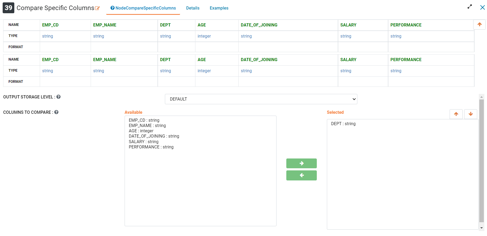
   
**Compare Specific Columns Node Output**

Output of ``Compare Specific Columns`` node displaying datasets created by splitting incoming datasets based on specific columns comparison.

*	First DataFrame (A-B) is created with rows that are part of 1st incoming DataFrame but not present in 2nd DataFrame.

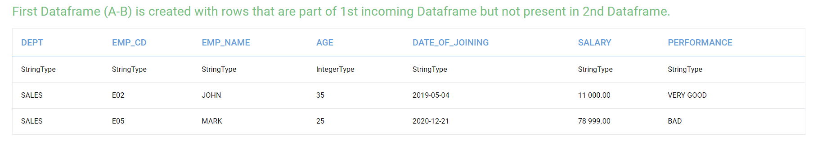
   
*	Second DataFrame (B-A) is created with rows that are part of 2nd incoming DataFrame but not present in 1st DataFrame.
   
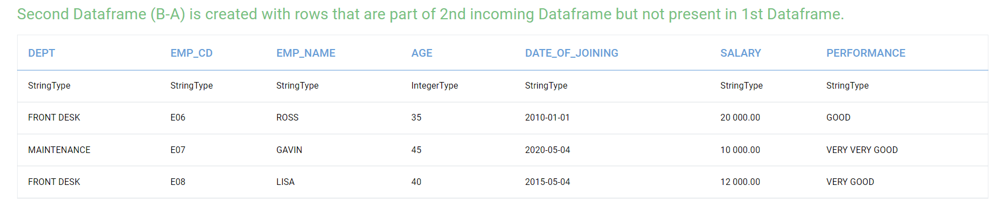
   
*	Third DataFrame (A intersection B) is created with rows that are part of both incoming DataFrames.
   
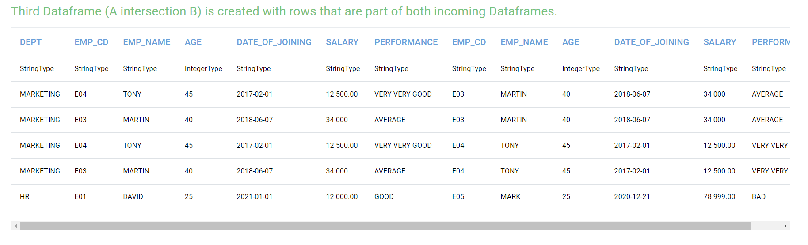
   
Compare Specific Columns Single Output
----------------------------------------

Below is a sample workflow which contains ``Compare Specific Columns Single Output`` processor in Fire Insights. It demonstrates the usage of ``Compare Specific Columns Single Output`` node to compare incoming datasets on specific columns and split them into either of three datasets created based on A-B, B-A and A Intersection B as per User's selection.

It does the following processing of data:

*	Reads incoming Datasets. This node takes two DataFrames as input and creates three F as output.
*	Compares specific columns of incoming datasets and splits them into either of three datasets created based on A-B, B-A and A Intersection B as per User's selection using ``Compare Specific Columns Single Output`` node.
*	DataFrame (A-B) is created with rows that are part of 1st incoming DataFrame but not present in 2nd DataFrame.
*	DataFrame (B-A) is created with rows that are part of 2nd incoming DataFrame but not present in 1st DataFrame.
*	DataFrame (A intersection B) is created with rows that are part of both incoming DataFrames.
*	Prints output datasets using the Print node.

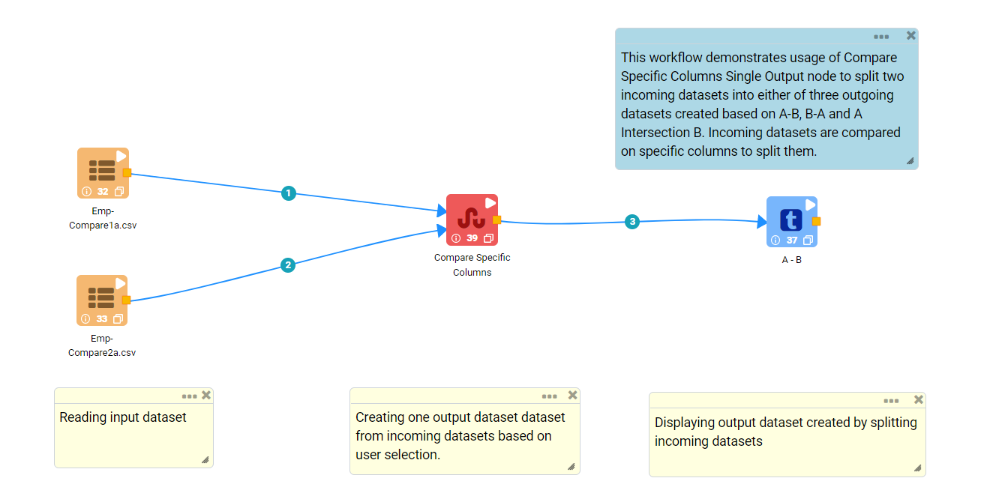
   
**Incoming Dataset**

.. figure:: ../../_assets/user-guide/data-preparation/splitting/comparespecolsop-incoming-dataset1.png
   :alt: splitting_userguide
   :width: 70%
   
.. figure:: ../../_assets/user-guide/data-preparation/splitting/comparespecolsop-incoming-dataset2.png
   :alt: splitting_userguide
   :width: 70%

**Compare Specific Columns Single Output Node Configuration**

*	``Compare Specific Columns Single Output`` node is configured as below.
*	Input of this node are the incoming datasets.
*	Columns on which incoming datasets need to be compared are to be selected in ``Columns To Compare`` list.
*	``Compare Type`` value needs to be selected based on the output dataset needed. In this example ``LeftDataframe_Except_RightDataframe``, i.e., A-B option is selected.
*	Output of this node would display datasets created by splitting incoming datasets.

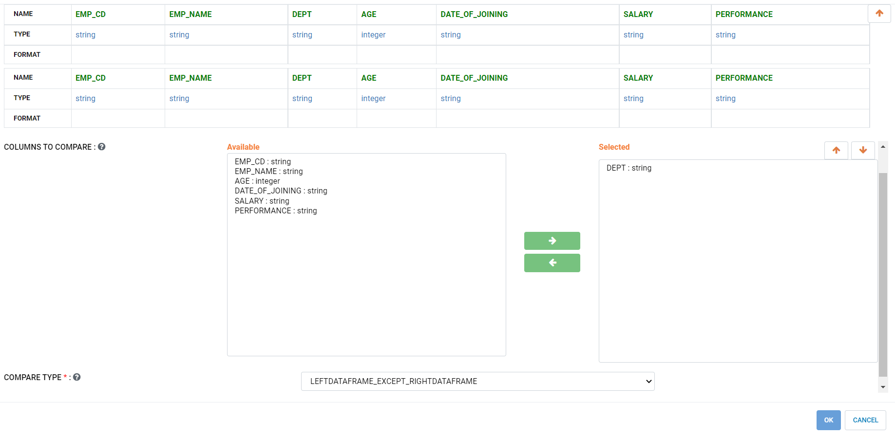
   
**Compare Specific Columns Single Output Node output**

Output of ``Compare Specific Columns Single Output`` node displaying dataset created by splitting incoming datasets as per User's selection.

*	DataFrame (A-B) is created with rows that are part of 1st incoming DataFrame but not present in 2nd DataFrame.

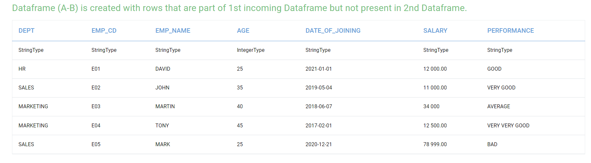
   
Split By Expression
----------------------------------------

Below is a sample workflow which contains ``Split By Expression`` processor in Fire Insights. It demonstrates the usage of ``Split By Expression`` node to split incoming datasets based on an expression.

It does the following processing of data:

*	Reads incoming Datasets. This node takes two DataFrames as input and creates three DataFrames as output.
*	Splits incoming datasets based on Expression provided using ``Split By Expression`` node. 
*	First output dataset contains rows that meet the condition specified by the expression.
*	Second output dataset contains rows that don't meet condition specified by the expression.
*	Prints output datasets using the Print node.

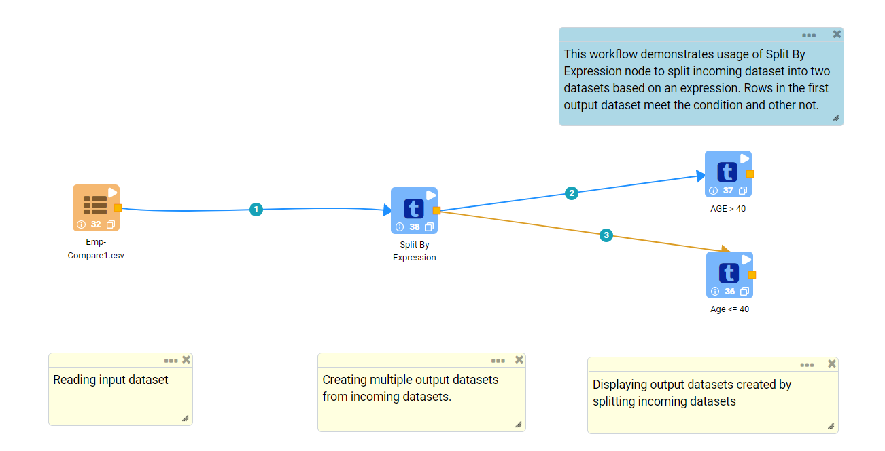
   
**Incoming Dataset**

.. figure:: ../../_assets/user-guide/data-preparation/splitting/splitbyexp-incoming-dataset1.png
   :alt: splitting_userguide
   :width: 70%
   
.. figure:: ../../_assets/user-guide/data-preparation/splitting/splitbyexp-incoming-dataset2.png
   :alt: splitting_userguide
   :width: 70%

**Split By Expression Node Configuration**

*	``Split By Expression`` node is configured as below.
*	Input of this node are the incoming datasets.
*	Expression that needs to be used to split incoming datasets is to be entered in ``Conditional Expression To Split The Data On`` box.
*	Output of this node would display datasets created by splitting incoming datasets.

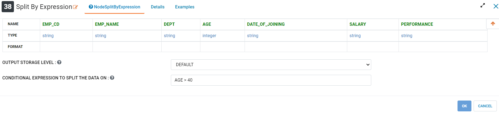
   
**Split By Expression Node Output**

Output of ``Split By Expression`` node displaying datasets created by splitting incoming datasets as per the Expression entered.

*	Rows that meet the conditon.

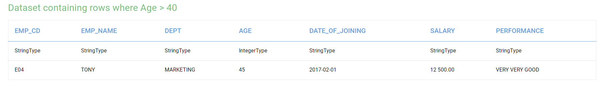
   
*	Rows that don't meet the conditon.
   
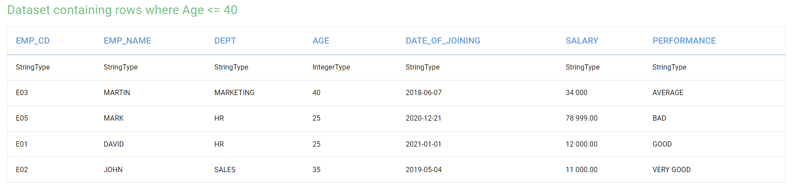
   
Split By Multiple Expressions
----------------------------------------

Below is a sample workflow which contains ``Split By Multiple Expressions`` processor in Fire Insights. It demonstrates the usage of ``Split By Multiple Expressions`` node to split incoming datasets into multiple datasets based on different expressions. An output dataset is created for each expression.

It does the following processing of data:

*	Reads incoming datasets. This node takes two DataFrames as input and creates three DataFrames as output.
*	Splits incoming datasets into multiple datasets based on different expressions using ``Split By Multiple Expressions`` node. An output dataset is created for each expression.  
*	First output dataset contains rows that meet the first condition specified by the expression, second dataset for the second expression and so on.
*	Prints output datasets using the Print node.

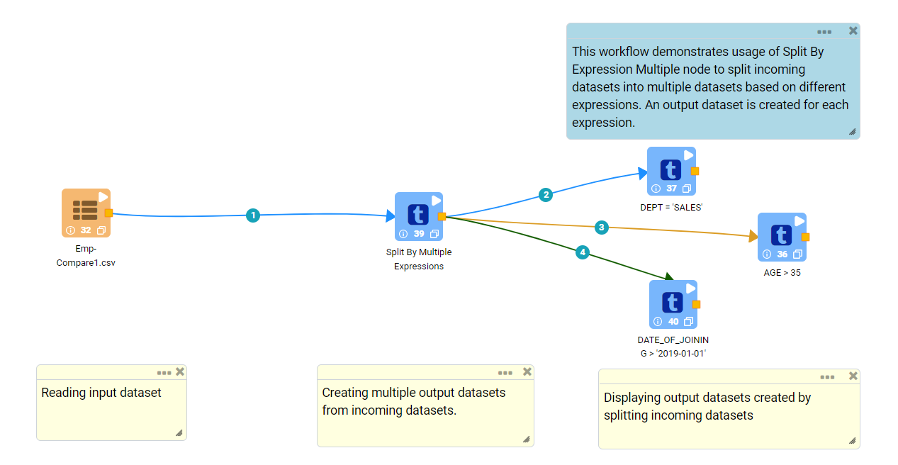
   
**Incoming Dataset**

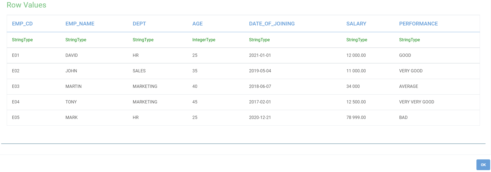
   
.. figure:: ../../_assets/user-guide/data-preparation/splitting/splitbymulexp-incoming-dataset2.png
   :alt: splitting_userguide
   :width: 70%

**Split By Multiple Expressions Node Configuration**

*	``Split By Multiple Expressions`` node is configured as below.
*	Input of this node are the incoming datasets.
*	First Expression that needs to be used to split incoming datasets is to be entered in ``Conditional Expression 1 To Split The Data On`` box. It needs to be done to all 5 expressions based on the need.
*	Output of this node would display datasets created by splitting incoming datasets.

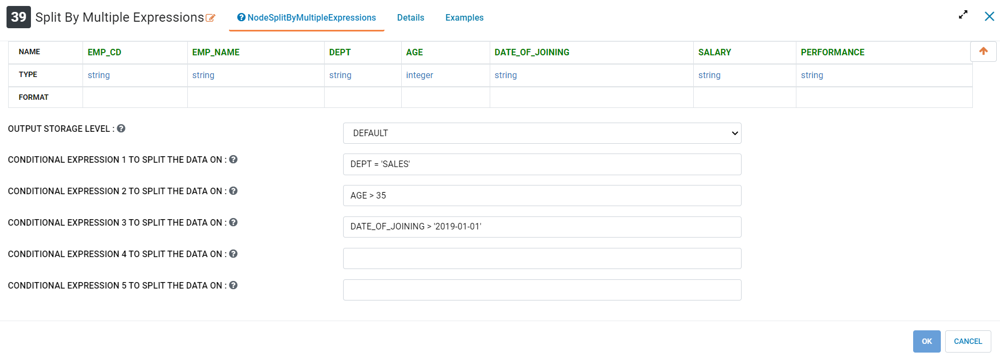
   
**Split By Multiple Expressions Node Output**

Output of ``Split By Multiple Expressions`` node displaying datasets created by splitting incoming datasets as per the Expression entered.

*	Output of 1st Expression.

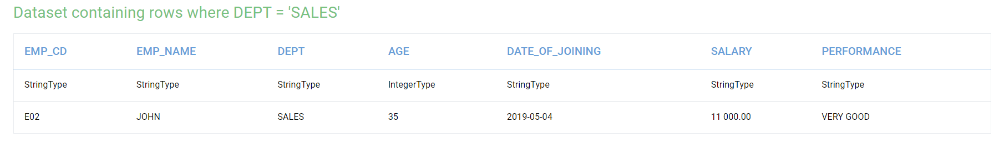
   
*	Output of 2nd Expression.
   
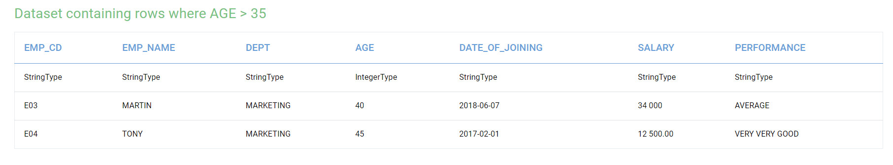
   
*	Output of 3rd Expression.
   
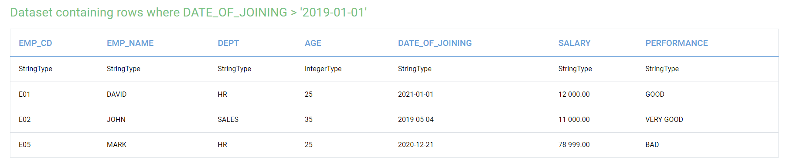
