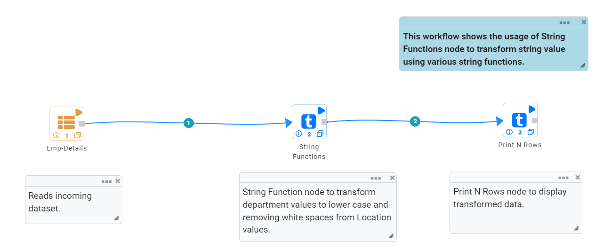
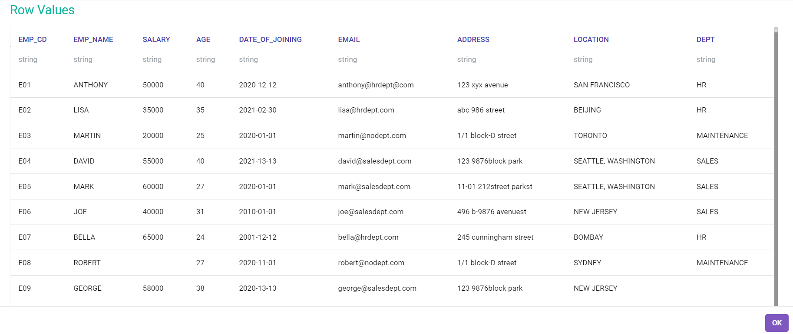
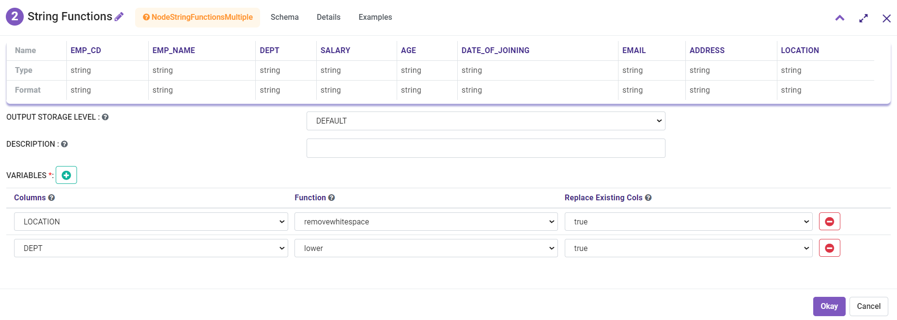
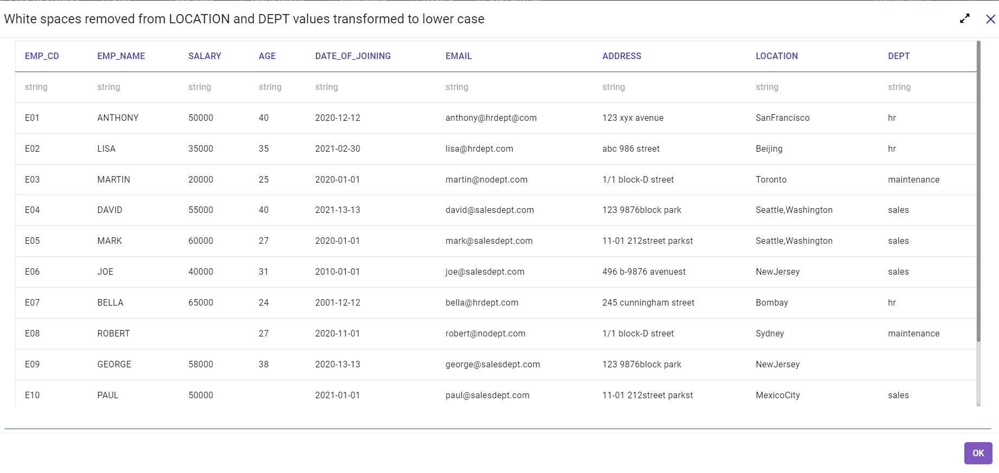
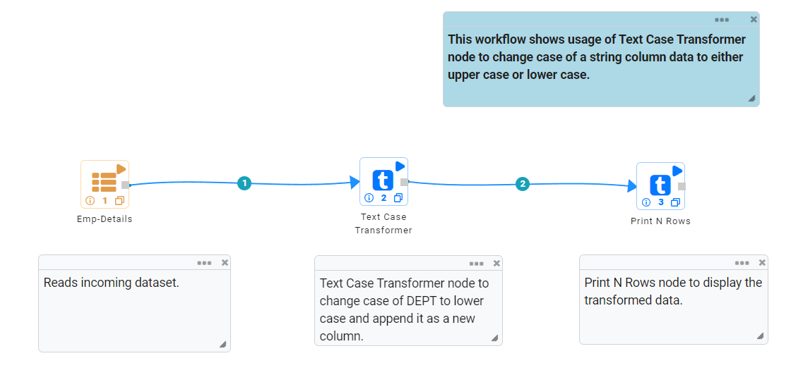
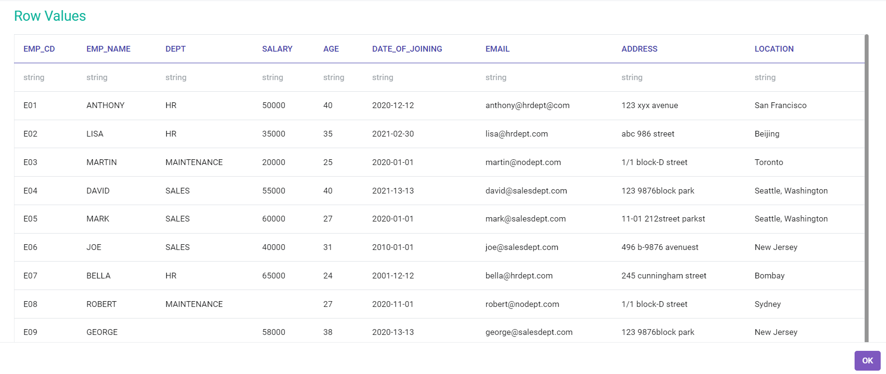
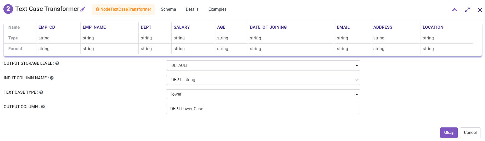
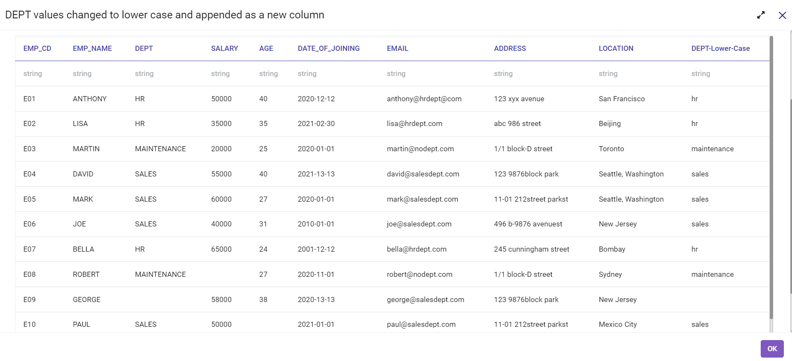

String Functions
==========

Fire Insights provides various processors for performing String functions on a row or text.

String Processors in Fire Insights
----------------------------------------

.. list-table:: 
   :widths: 30 70
   :header-rows: 1

   * - Title
     - Description
   * - String Functions
     - This node performs a specified String function on a row.
   * - Text Case Transformer
     - This node converts text to upper or lower case.

String Functions
----------------------------------------

Below is a sample workflow which contains String Functions processor in Fire Insights. It demonstrates the usage of String Functions node to transform String value using various String Functions.

It does the following processing of data:

*	Reads incoming dataset.
*	Transforms String column data using String Functions node to change case to lower of location column and removes white spaces from Dept Column.
* 	Transformed data is printed using the Print node.

   
**Incoming Dataset**

**String Functions Node Configuration**

Input Columns are selected as below to transform to lower case and remove white spaces.

**String Functions Node Output**

Output of Print node displaying transformed data in lower case and removed white spaces is shown as below.

   

Text Case Transformer
----------------------------------------

Below is a sample workflow which contains Text Case Transformer processor in Fire Insights. It demonstrates the usage of Text Case Transformer node to change case of a String column data to either Upper case or Lower case.

It does the following processing of data:

*	Reads incoming dataset.
*	It changes case of Dept data to lower case and append it as a new column to the output dataset.
* 	Transformed data is printed using the Print node.

   
**Incoming Dataset**

**Text Case Transformer Node Configuration**

Text Case Transformer node is configured as below to transform Dept Column values to lower case and append it as a new output column.

**Text Case Transformer Node output**

Output of Print node displaying transformed data using the Text Case Transformer node.

