String Functions
==========

Fire Insights provide various processors for performing String functions on a row or text.

String Processors in Fire Insights
----------------------------------------

.. list-table:: String Processors
   :widths: 30 70
   :header-rows: 1

   * - Title
     - Description
   * - String Functions
     - This node performs a specified String function on a row.
   * - String Functions Multiple
     - This node creates a new Dataframe by transforming data of multiple columns using specified string functions.
   * - Text Case Transformer
     - This node converts text to upper or lower case.

String Functions
----------------------------------------

Below is a sample workflow which contains ``String Functions`` processor in Fire Insights. It demonstrates the usage of String Functions node to transform String value using various String Functions.

It does the following processing of data:

*	Reads incoming dataset.
*	Transforms String column data (Location and Dept) using String Functions node to change case to lower.
* 	Transformed data is printed using the Print node.

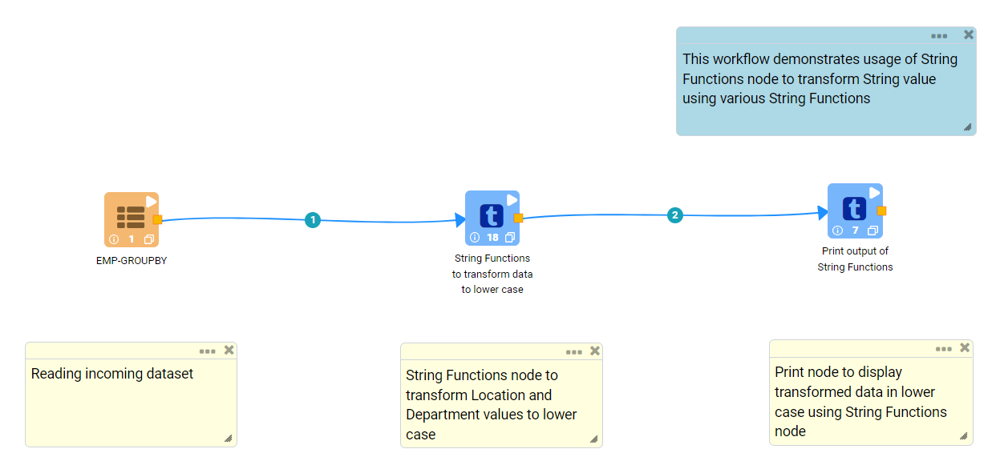
   
**Incoming Dataset**

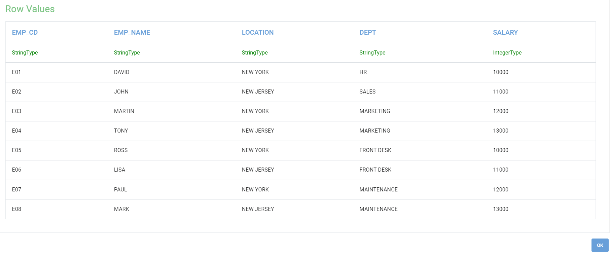

**String Functions Node Configuration**

Input Columns are selected as below to transform to lower case.

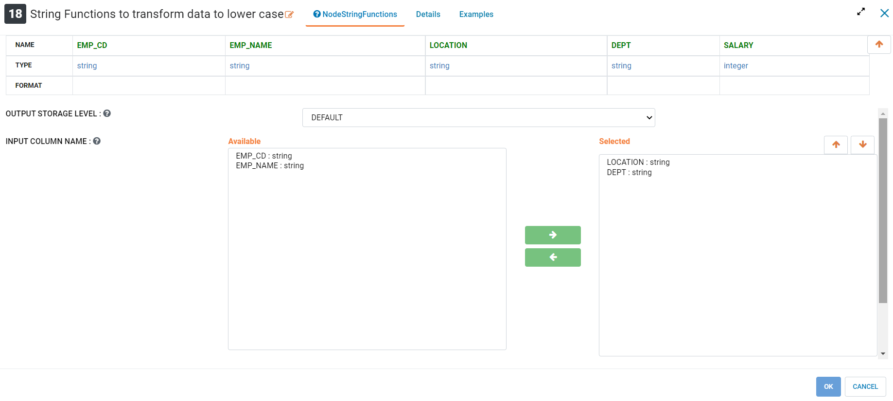

String function selection to transform data to lower case is done as below.

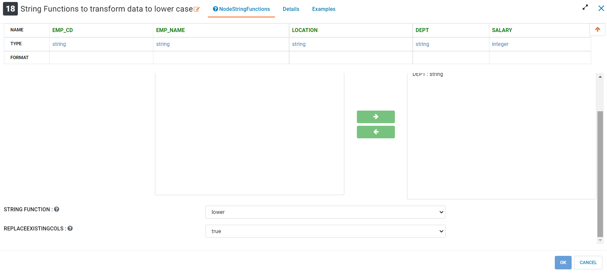

**String Functions Node Output**

Output of Print node displaying transformed data in lower case using the String Functions node.

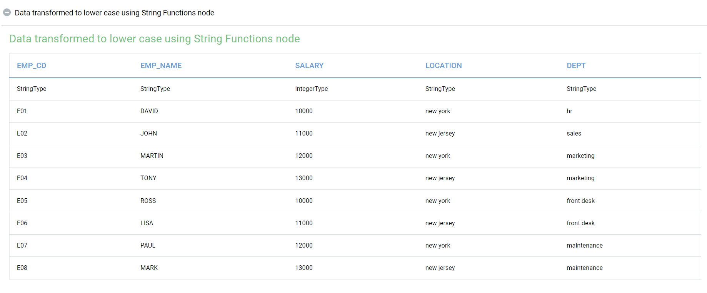
   
String Functions Multiple
----------------------------------------

Below is a sample workflow which contains ``String Functions Multiple`` processor in Fire Insights. It demonstrates the usage of String Functions Multiple node to transform multiple String columns data in one go using various String Functions.

It does the following processing of data:

*	Reads incoming dataset.
*	It removes white spaces from Location data and transforms Department values to lower case using the String Functions Multiple node.
* 	Transformed data is printed using the Print node.

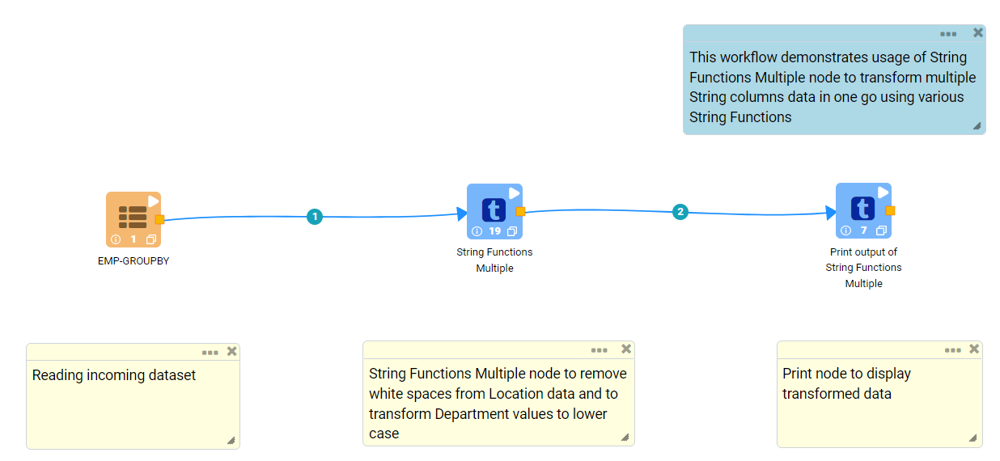
   
**Incoming Dataset**

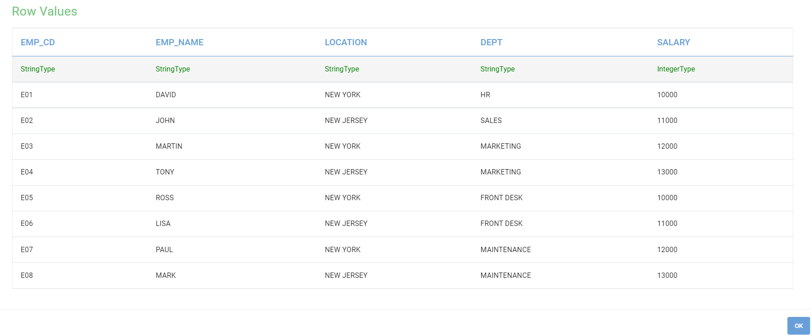

**String Functions Multiple Node Configuration**

String Functions Multiple node is configured as below to remove white spaces from Location data and to transform Department values to lower case.

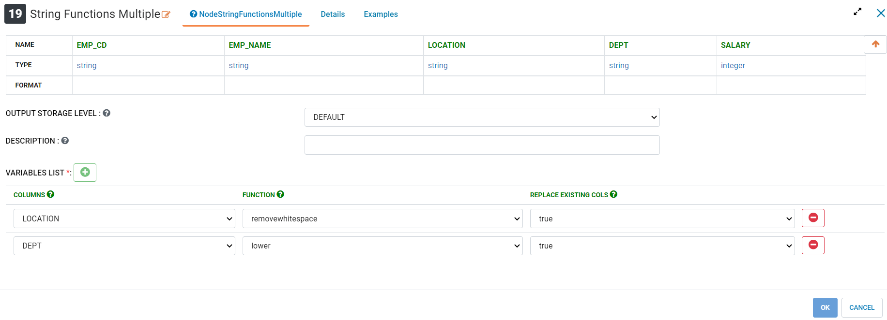

**String Functions Multiple Node Output**

Output of Print node displaying transformed data using the String Functions Multiple node.

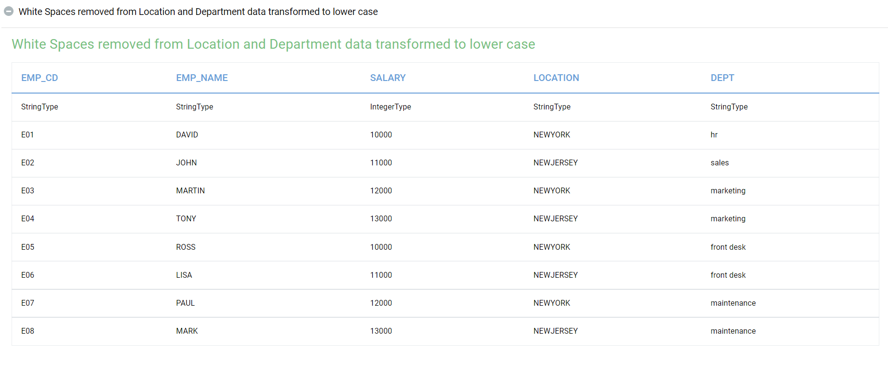
   
Text Case Transformer
----------------------------------------

Below is a sample workflow which contains ``Text Case Transformer`` processor in Fire Insights. It demonstrates the usage of Text Case Transformer node to change case of a String column data to either Upper case or Lower case.

It does the following processing of data:

*	Reads incoming dataset.
*	It changes case of Location data to lower case and append it as a new column to the output dataset.
* 	Transformed data is printed using  the Print node.

.. figure:: ../../_assets/user-guide/data-preparation/string/casetrans-demo-workflow.png
   :alt: string_userguide
   :width: 90%
   
**Incoming Dataset**

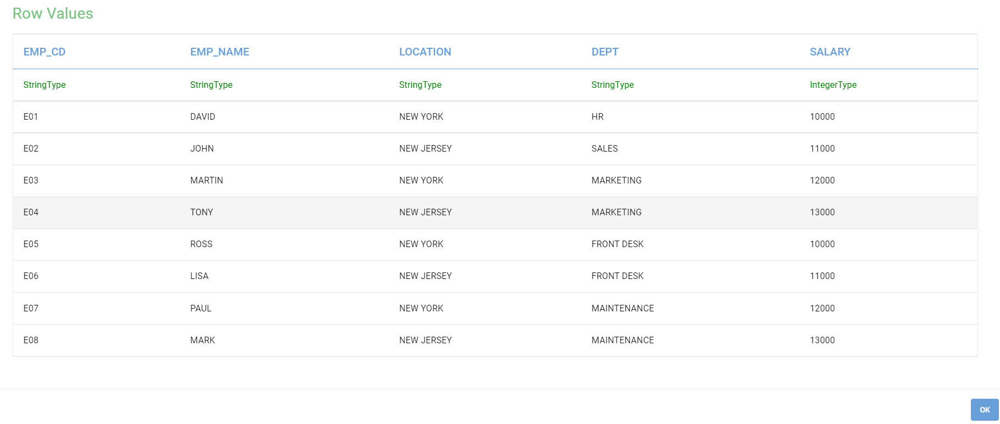

**Text Case Transformer Node Configuration**

Text Case Transformer node is configured as below to transform Location values to lower case and append it as a new output column.

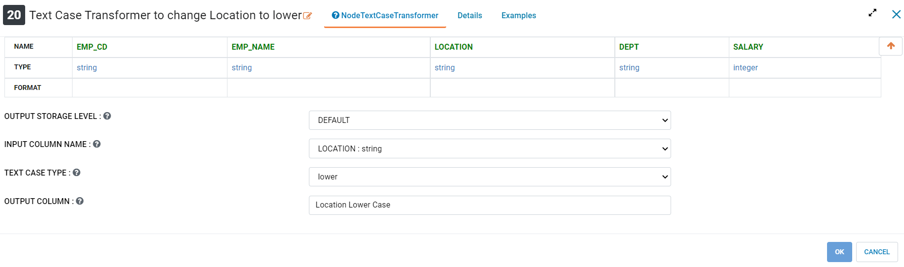

**Text Case Transformer Node output**

Output of Print node displaying transformed data using the Text Case Transformer node.

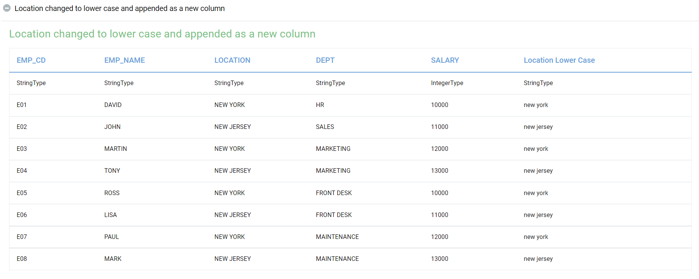
