Automated Data Profiling
===========================

There are 2 ways to perform Automated Data Profiling:

#. Automated Data Profiling from top-level `Data Quality` menu.
#. Automated Data Profiling for a  selected `Dataset` inside a Project.

This document outlines detailed steps to perform automated data profiling.

Automated Data Profiling from top-level Data Quality Menu
-------------------------------------------------

Step 1 : Select a project and the required datasets
+++++++++++++++

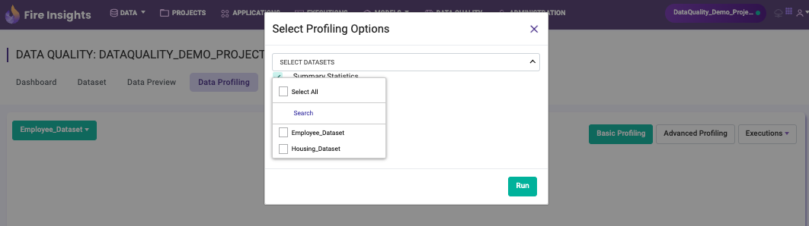

Step 2 : Run the basic profiling automatically on multiple datasets
++++++++++++++++++++
  
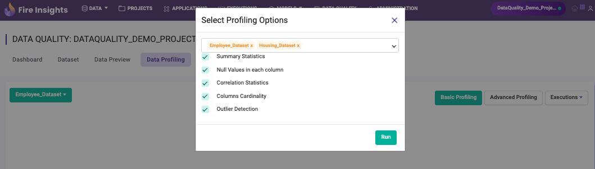

Step 3 : Select a dataset and view the execution results in real-time
+++++++++++++++++++++++++++
  
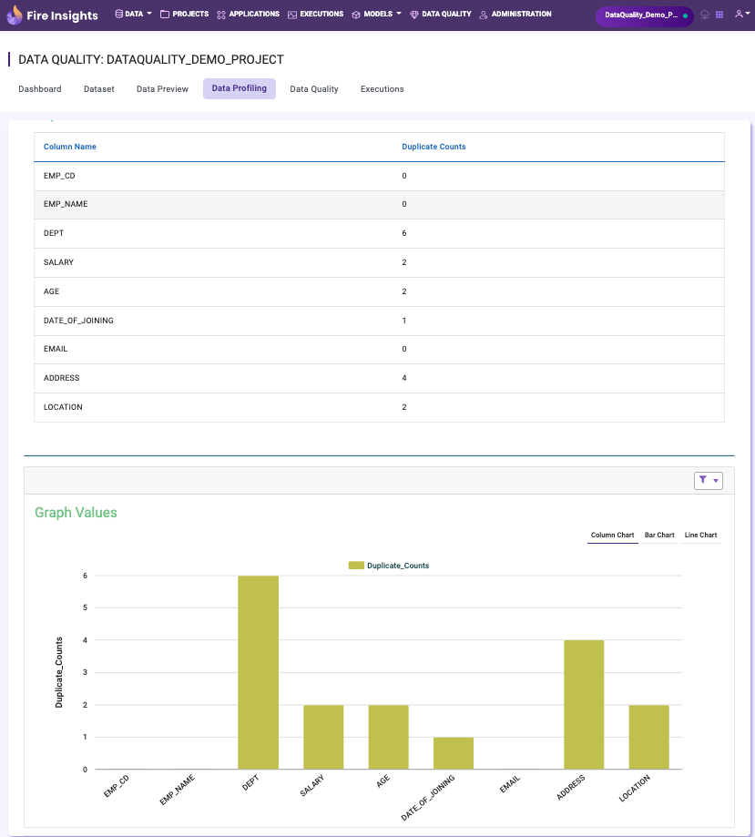

Step 4 : Perform advanced profiling by selecting required columns
+++++++++++++++++++++++++++++++++++++
  
This includes checking missing values, skewness, cross tab, duplicate values, finding presence of sensitive columns and checking columns against a secondary dataset.

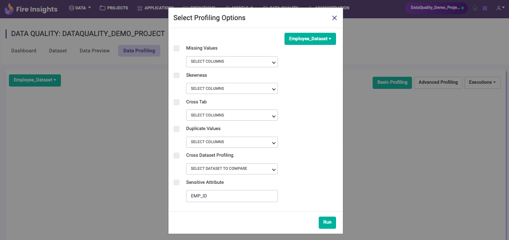

Automated Data Profiling for a  selected `Dataset` inside a Project
-------------------------------------------------------------

Dataset profiling is the process of examining and analyzing a dataset in order to understand its structure, content, and quality. The goal of data profiling is to gain a deeper understanding of the data, identify any issues or inconsistencies, and prepare the data for further analysis or use.

Data profiling typically involves several steps, including:

* **Data discovery:** This is the process of identifying the structure of the data, such as the number of tables, columns, and rows as well as the data types and sizes of the columns.
* **Data exploration:** This is the process of looking at the data in a more detailed manner, such as calculating summary statistics for each column and identifying any missing or duplicate values.

Below are the steps required to perform Data Profiling in Fire Insights:

Step 1 : Go to Projects Page
++++++++++++++

Go to the project page where you want to create a dataset or already have an existing one.

Step 2 : Open Datasets Tab
+++++++++++++++++++++

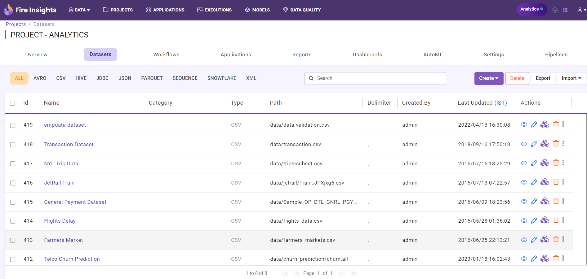

Step 3 : Select Dataset 
++++++++++++++++++++++

Select a dataset & under the **ACTION** icon, choose **Dataset Profile**. Clicking on the Dataset profile will take you to the next page.

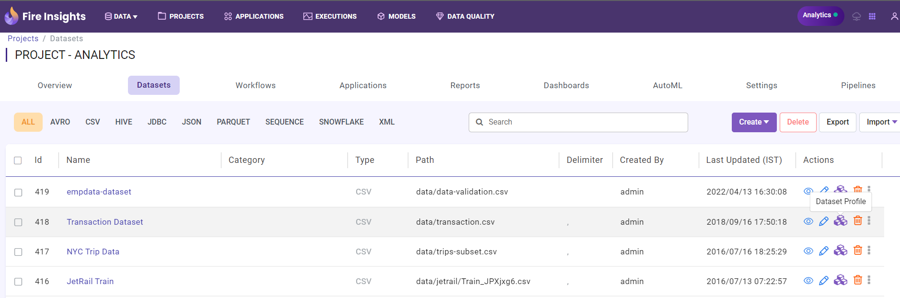

Step 4 : Perform Dataset Profiling
+++++++++++++++++++++++++++++

On Dataset Profile Page, click on the **Run Data Profiling** option and **Select Profiling Parameters**.

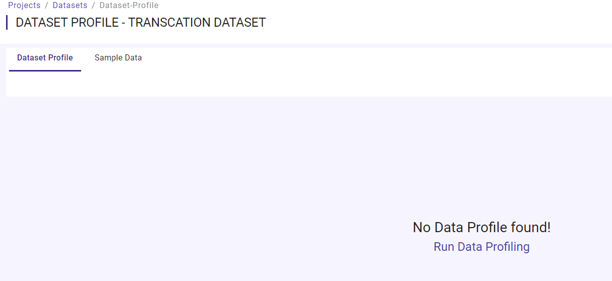

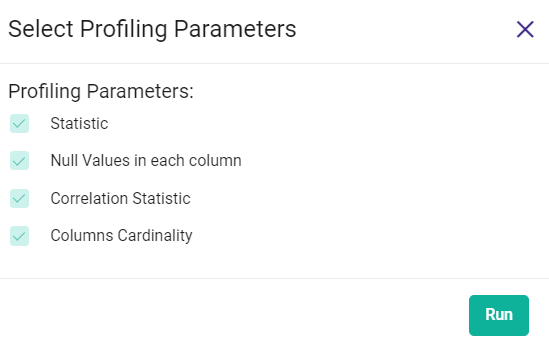

Once you click on the above option, notifications about the process getting started will be displayed, as shown below:

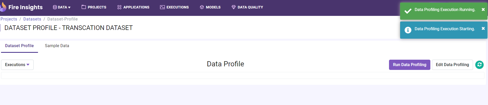

Step 5 : View Execution Result
++++++++++++++++++++

On refreshing the page after successful execution of the process, the latest execution result is displayed on the page.

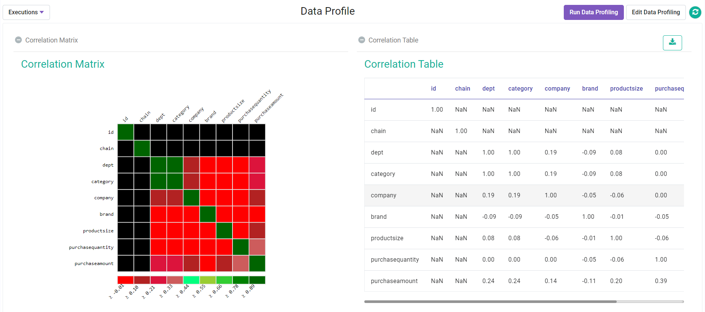

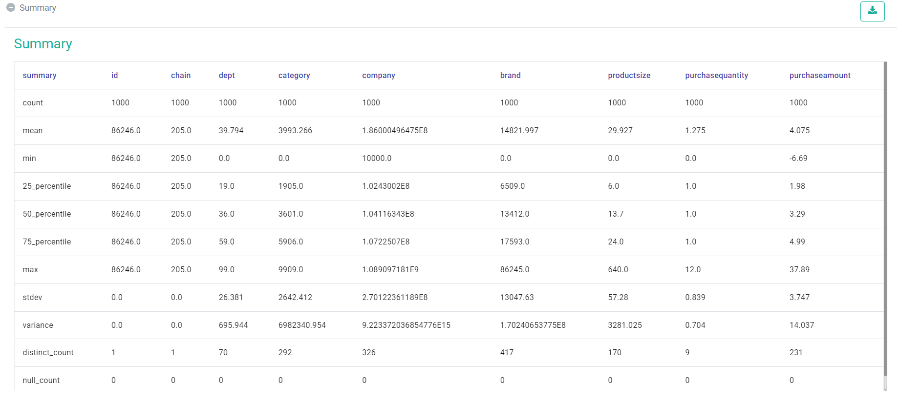

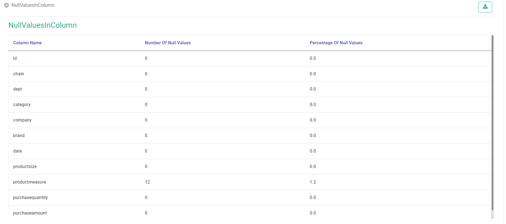
