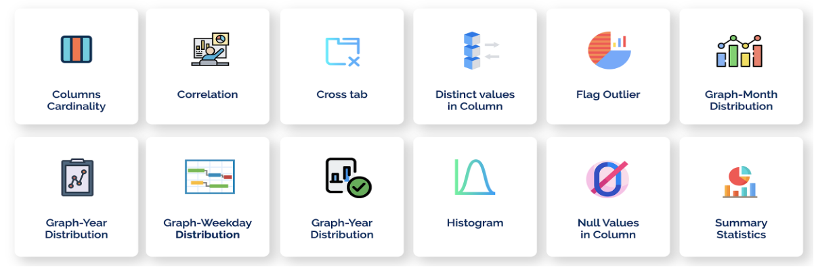

Data Profiling
=============

Data Profiling, refers to the process of examining and analyzing a dataset in order to understand its structure, content, and characteristics. The goal of data exploration is to gain a deeper understanding of the data, identify patterns and trends, and to prepare the data for further analysis or modeling. 

.. panels::
    :container: container-lg pb-2

    :doc:`/user-guide/data-profile/data-profiling`

    Data Exploration

    ---

    :doc:`/user-guide/data-profile/automated-data-profiling`

    Automated Dataset Profiling

.. toctree::
   :hidden:

   data-profiling.rst
   automated-data-profiling.rst

