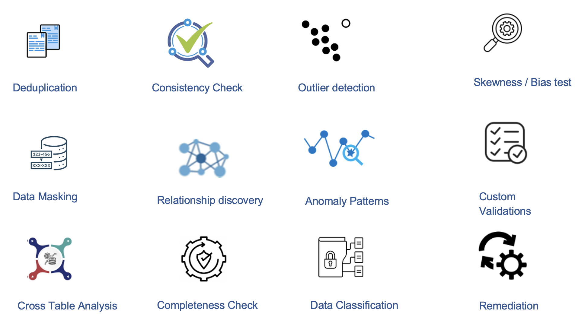

Data Quality
-------

Fire Insights provides powerful capabilities for monitoring data quality. It provides for various processors that aid in pre-processing and validation of data to ensure that only high quality, reliable, and accurate data is fed into the process of analysis, reporting, and decision-making.

Sparkflows offers a large number of automated Data Quality Assessment and Cleansing features.

.. panels::
    :container: container-lg pb-3
    :column: text-center col-lg-6 col-md-6 col-sm-6 col-xs-12 p-2

    :doc:`/user-guide/data-quality/automated-data-quality`

    Automated Data Quality

    ---

    :doc:`/user-guide/data-quality/standard-data-quality-processors`

    Data Quality Processors

    

.. toctree::
   :hidden:
    
   automated-data-quality.rst 
   standard-data-quality-processors.rst

   

