Data Quality
-------

Fire Insights provides powerful capabilities for monitoring data quality. It provides for various processors that aid in pre-processing and validation of data to ensure that only high quality, reliable, and accurate data is fed into the process of analysis, reporting, and decision-making.

Data Quality Processors in Fire Insights
+++++++

.. list-table:: Great Expectations based Data Quality Processors in Fire Insights
   :widths: 30 70
   :header-rows: 1

   * - Title
     - Description
   * - ExpectColumnValuesToBeInBetween
     - This node is used to define an expectation that the values in a particular column of a dataset should fall within a specified range.  
     
   * - ExpectColumnValuesToBeNull
     - This node is used to define an expectation that the values in a particular column of a dataset should be null or None.  
   
   * - ExpectColumnValuesToBeUnique
     - This node is used to define an expectation that the values in a particular column of a dataset should be unique, i.e., there should be no duplicate values in the column.
     
   * - ExpectColumnValuesToNotBeNull
     - This node is used to define an expectation that the values in a particular column of a dataset should not be null or None.
     
   * - ExpectTableRowCountToBeBetween
     - This node is used to define an expectation that the number of rows in a dataset should fall within a specified range.
	
   * - ExpectColumnValueLengthsToEqual
     - This node is used to define an expectation that the lengths of the values in a particular column of a dataset should be equal to a specified value.

   * - ExpectColumnValueLengthToBeInBetween 
     - This node is used to define an expectation that the lengths of the values in a particular column of a dataset should fall within a specified range.

   * - ExpectColumnValuesToBeInSet
     - This node is used to define an expectation that the values in a particular column of a dataset should be in a specified set of values.

   * - ExpectColumnValuesToMatchRegex 
     - This node is used to define an expectation that the values in a particular column of a dataset should match a specified regular expression pattern. 
   
   * - ExpectColumnValueToMatchStrftimeFormat 
     - This node is used to define an expectation that the values in a particular column of a dataset should match a specified strftime format.
	
	

Expect Column Values To Be In Between
+++++++

Below is a sample workflow which contains **ExpectColumnValuesToBeInBetween processor** in Fire Insights. It demonstrates the usage of ExpectColumnValuesToBeInBetween node to validate whether the selected column values fall between the specified minimum and maximum values (both values inclusive).

It does the following processing of data:

* Reads the incoming dataset.
* Validates the columns with entries to be between the specified range (i.e. minimum and maximum values).
* Prints the output using the print node.

ExpectColumnValuesToBeInBetween Node Sample Workflow
=========

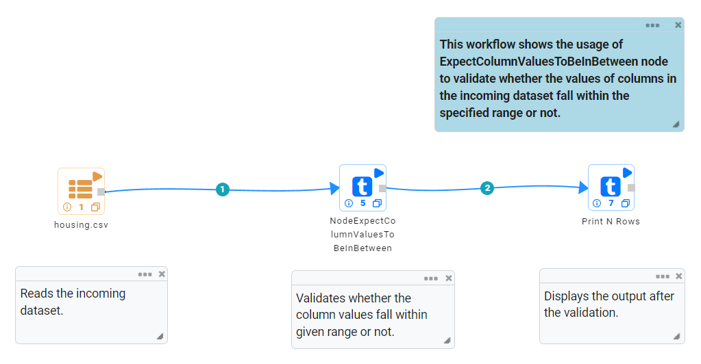

   
Incoming Dataset
=======

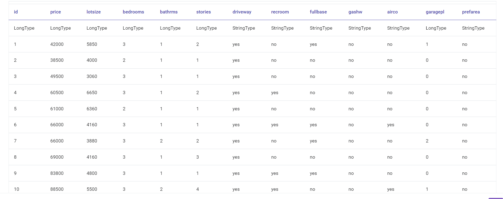

ExpectColumnValuesToBeInBetween Node Configuration
=======

ExpectColumnValuesToBeInBetween Node is configured as below.

* Input of this node is the incoming dataset.
* Column(s) for which the values need to be checked against the specified range is(are) to be selected in the ``Column Name`` drop-down box.
* Range of values against which each column entry needs to be checked is to be entered in ``Min`` and ``Max`` columns respectively for each selected column.        

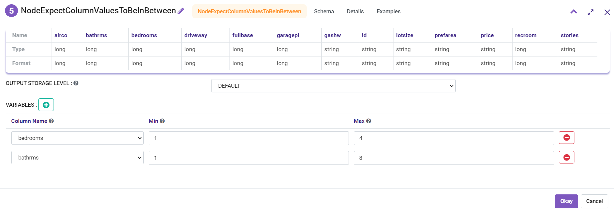
   
ExpectColumnValuesToBeInBetween Node Output
=======

The Output of this node would produce the following results:

* If the expectation is met (i.e. all values in the column are within the specified range), then the processor would return value of the ``success`` column as **True**.
* If the expectation is not met (i.e. at least one value in the column falls outside of the specified range), then the processor would return the value of the ``success`` column as **False**.

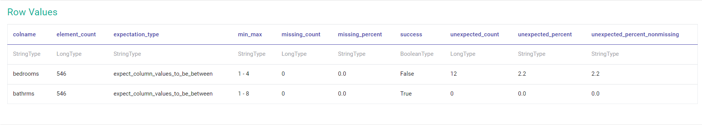
   

Expect Column Values To Be Null
+++++++++

Below is a sample workflow which contains **ExpectColumnValuesToBeNull** processor in Fire Insights. It demonstrates the usage of ExpectColumnValuesToBeInBetween node to validate the presence of null values in specified columns of the input dataset.

It does the following processing of data:

* Reads the incoming dataset.
* Validates the presence of null values in specified columns of the input dataset.
* Prints the output using the print node.

ExpectColumnValuesToBeNull Node Sample Workflow
=========

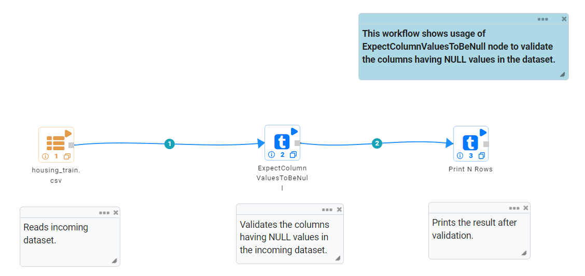
   
Incoming Dataset
=======

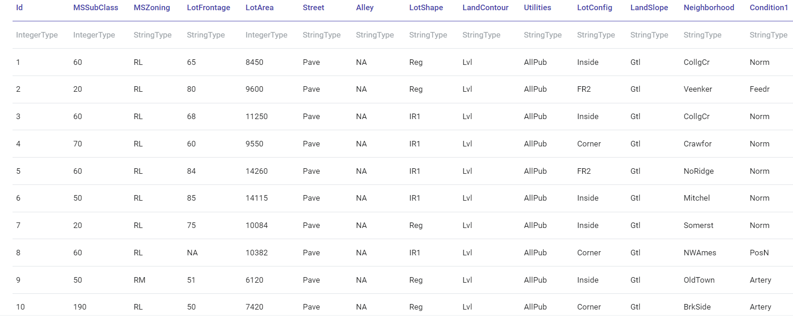

ExpectColumnValuesToBeNull Node Configuration
=======

* Input of this node is the incoming dataset.
* Column(s) which need to be validate for the presence of NULL values is(are) to be selected in the ``Column Name`` drop-down box.
* Percentage of data to be validated can be specified under the ``Mostly`` Column for each selected column. Any decimal Value between 0-1 can be specified where 0 = 0% and 1 = 100% (e.g. specifying 0.6 would validate the data if atleast 60% of column values match the given expectation i.e. has NULL values). If it is left blank then it would validate the data only when all the column values match the given expectation i.e. by default, it takes "1" as the value.

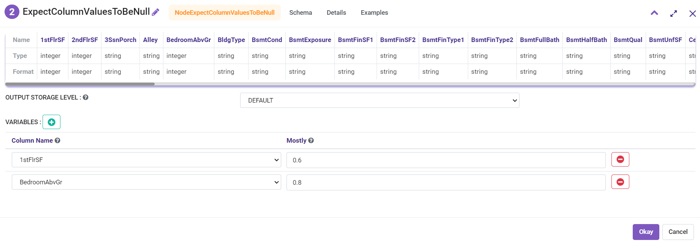
   
ExpectColumnValuesToBeNull Node Output
=======

The Output of this node would produce the following results:

* If the expectation is met (i.e. the given percentage of data has NULL values), then the processor would return value of the ``success`` column as **True**.
* If the expectation is not met (i.e. the given percentage of data does not have any NULL values), then the processor would return the value of the ``success`` column as **False**. 

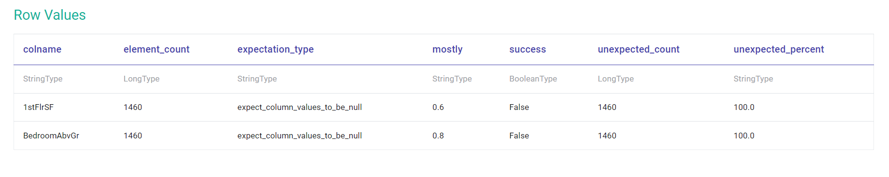
   

Expect Column Values To Be Unique
++++++++++++++++++++

Below is a sample workflow which contains **ExpectColumnValuesToBeUnique processor** in Fire Insights. It demonstrates the usage of ExpectColumnValuesToBeUnique node to validate the data on the basis of uniqueness of the column values.

It does the following processing of data:

* Reads the incoming dataset.
* Validates the data if the values in the selected column(s) are unique, without any duplicates.
* Prints the output using the print node.

ExpectColumnValuesToBeUnique Node Sample Workflow
=========

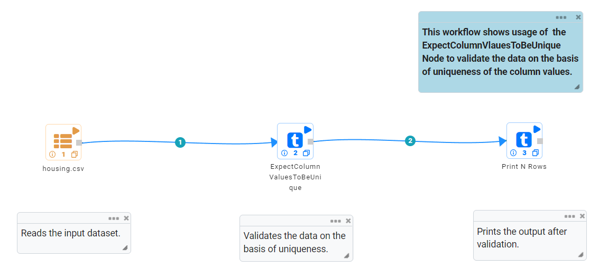

Incoming Dataset
=========

.. figure:: ../../_assets/user-guide/data-quality/expect-unique-input.png
   :alt: data-quality-userguide
   :width: 65%

ExpectColumnValuesToBeUnique Node Configuration
=========

* Input of this node is the incoming dataset.
* Column(s) for which the uniqueness of values need to be checked is(are) to be selected in the ``Column Name`` drop-down box.
* Percentage of data to be validated can be specified under the ``Mostly`` Column for each selected column. Any decimal Value between 0-1 can be specified where 0 = 0% and 1 = 100% (e.g. specifying 0.6 would validate the data if atleast 60% of column values match the given expectation i.e. has unique values). If left blank, then it would validate the data only when all the column values match the given expectation i.e. by default, it takes "1" as the value.

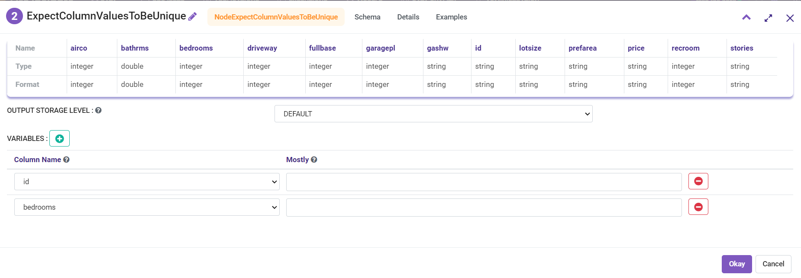

ExpectColumnValuesToBeUnique Node Output
========

The Output of this node would produce the following results:

* If the expectation is met (i.e. for the given percentage all values in the selected column(s) are unique), then the processor would return the value of the ``success`` column as **True**.
* If the expectation is not met (i.e. there are duplicate values in the selected column(s)), then the processor would return the value of the ``success`` column as **False**.

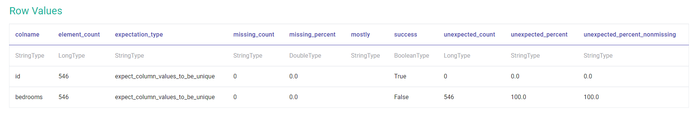

Expect Column Values To Not Be Null
++++++++

Below is a sample workflow which contains the **ExpectColumnValuesToNotBeNull processor** in Fire Insights. It demonstrates the usage of the ExpectColumnValuesToNotBeNull node to validate the absence of null values in specified columns of the input dataset.

It does the following processing of data:

* Reads the incoming dataset.
* Validates the absence of null values in specified columns of the input dataset.
* Prints the output using the print node.

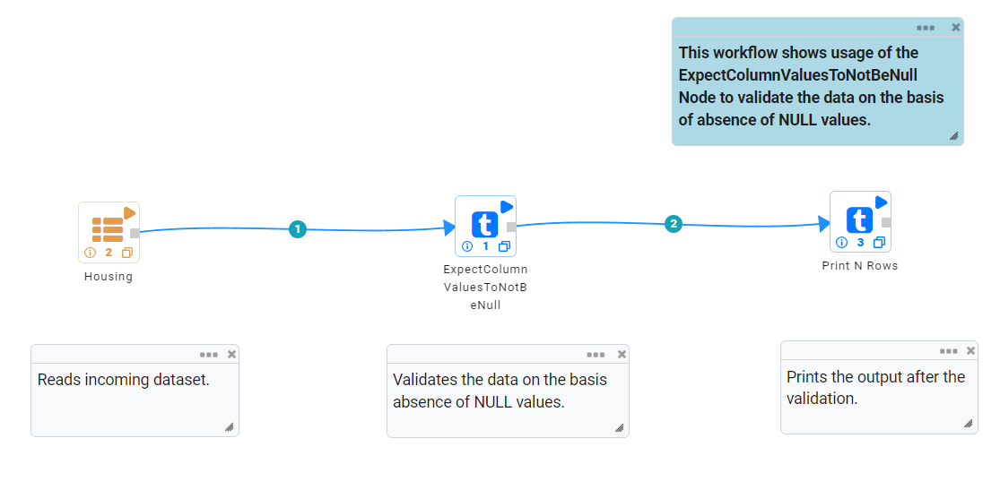

Incoming Dataset
=======

.. figure:: ../../_assets/user-guide/data-quality/expect-unique-input.png
   :alt: data-quality-userguide
   :width: 65%

ExpectColumnValuesToNotBeNull Node Configuration
========

* The input of this node is the incoming dataset.
* Columns that need to be validated for the absence of NULL values are to be selected in the ``Column Name`` drop-down box.
* The percentage of data to be validated can be specified under the ``Mostly`` Column for each selected column. Any decimal value between 0-1 can be specified, where 0 = 0% and 1 = 100%. For example, specifying 0.6 would validate the data if at least 60% of column values do not have null values. If it is left blank, it would validate the data only when all the column values do not have null values. By default, it takes "1" as the value.

.. figure:: ../../_assets/user-guide/data-quality/expect-not-null-config.png
   :alt: data-quality-userguide
   :width: 65%

ExpectColumnValuesToNotBeNull Node Output
=========

The output of this node would produce the following results:

* If the expectation is met (i.e. the given percentage of data does not have any null values), then the processor would return the value of the ``success`` column as **True**.
* If the expectation is not met (i.e. the given percentage of data has null values), then the processor would return the value of the ``success`` column as **False**.

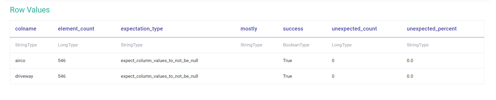

Expect Table Row Count To Be Between
+++++++++

Below is a sample workflow which contains the **ExpectTableRowCountToBeBetween processor** in Fire Insights. It demonstrates the usage of the ExpectTableRowCountToBeBetween node to validate the tabular data on the basis of row count. 

It does the following processing of data:

* Reads the incoming dataset.
* Validates the input data in tabular format if the row count falls within the specified range.
* Prints the output using the print node.

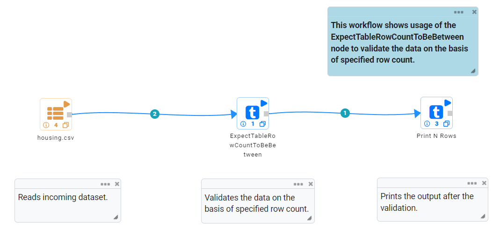

Incoming Dataset
=======

.. figure:: ../../_assets/user-guide/data-quality/expect-unique-input.png
   :alt: data-quality-userguide
   :width: 65%

ExpectTableRowCountToBeBetween Node Configuration
===========

* The input of this node is the incoming dataset.
* The minimum and maximum row count values have to be specified under the ``Min Count`` and ``Max Count`` boxes respectively.

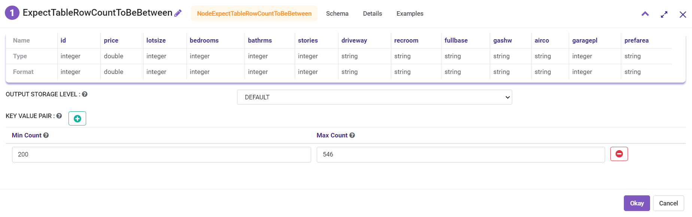

ExpectTableRowCountToBeBetween Node Output
==========

The output of this node would produce the following results:

* If the expectation is met (i.e. the row count of the input dataset falls within the specified range), then the processor would return the value of the ``success`` column as True.
* If the expectation is not met (i.e. the row count of the input dataset does not fall within the specified range), then the processor would return the value of the ``success`` column as **False**. 

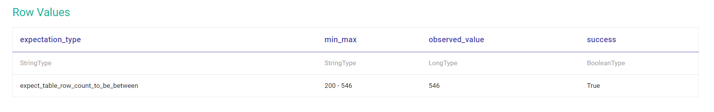

Expect Column Value Lengths To Equal
+++++++
Below is a sample workflow which contains **ExpectColumnValueLengthsToEqual processor** in Fire Insights. It demonstrates the usage of ExpectColumnValueLengthsToEqual node to validate whether the length of the selected column entries match the specified length.

It does the following processing of data:

* Reads the incoming dataset.
* Validates the columns with entries to have length equal to the specified length.
* Prints the output using the print node.

ExpectColumnValueLengthsToEqual Node Sample Workflow
=========

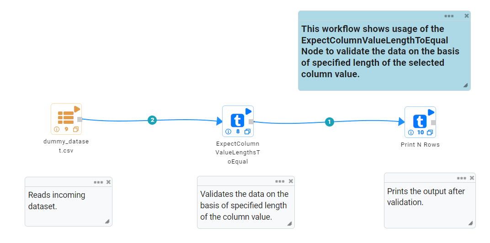

Incoming Dataset
======

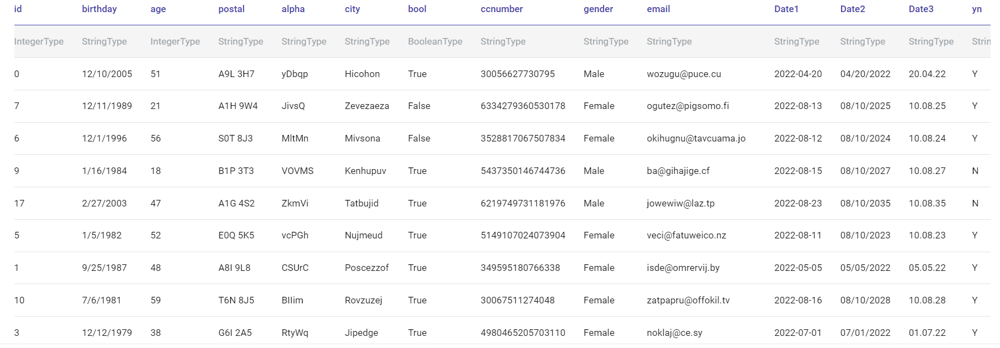

ExpectColumnValueLengthsToEqual Node Configuration
========

* Input of this node is the incoming dataset.
* Column(s) for which the length of the values need to be validated against the specified length is(are) to be selected in the ``Column Name`` drop-down box. 
* Specified length against which each column entry's length needs to be validated is to be entered in the ``value`` column for each selected column.
* The percentage of data to be validated can be specified under the ``Mostly`` Column for each selected column.

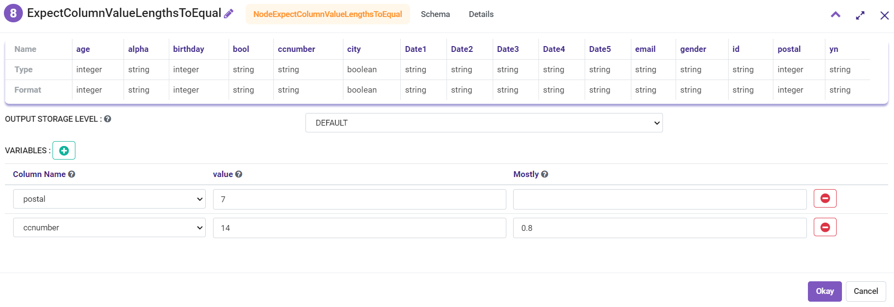

ExpectColumnValueLengthsToEqual Node Output
=========

The output of this node would produce the following results:

* If the expectation is met (i.e. all values in the column have length equal to the specified length), then the processor would return value of the ``success`` column as **True**.
* If the expectation is not met (i.e. at least one value in the column has length different from the specified length), then the processor would return the value of the ``success`` column as **False**.

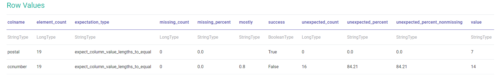

Expect Column Value Length To Be In Between
+++++++
Below is a sample workflow which contains **ExpectColumnValueLengthToBeInBetween processor** in Fire Insights. It demonstrates the usage of the ExpectColumnValueLengthToBeInBetween node to validate the data on the basis of specified range of value length of the column in the input dataset.

It does the following processing of data:

* Reads the incoming dataset.
* Validates the data on the basis of length of column value that falls within the specified range.
* Prints the output using the print node.

ExpectColumnValueLengthToBeInBetween Node Sample Workflow
=======

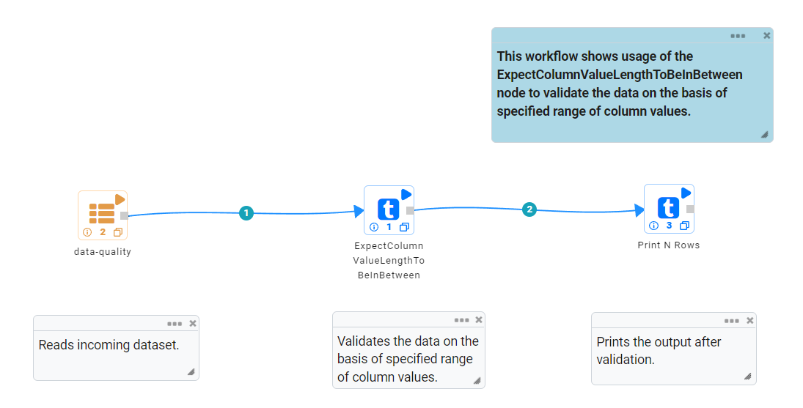
   
Incoming Dataset
======

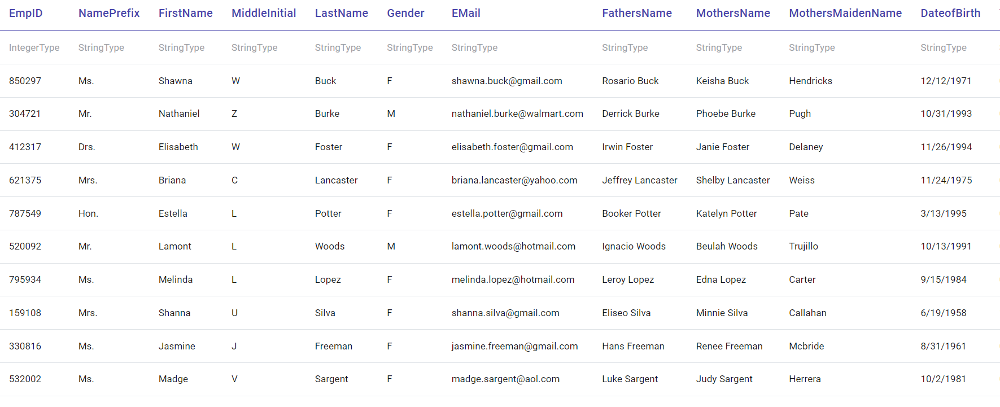
   
ExpectColumnValueLengthToBeInBetween Node Configuration
======

* Input of this node is the incoming dataset.
* Column(s) for which the length of the values need to be validated against the specified range is(are) to be selected in the ``Column Name`` drop-down box.
* Range of values against which each column entry's length needs to be checked is to be entered in ``Min`` and  ``Max`` columns respectively for each selected column.

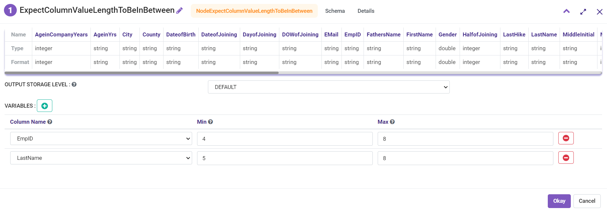

ExpectColumnValueLengthToBeInBetween Node Output
++++++

The output of this node would produce the following results:

* If the expectation is met (i.e. all values in the column have length within the specified range), then the processor would return value of the ``success`` column as **True**.
* If the expectation is not met (i.e. at least one value in the column has length outside of the specified range), then the processor would return the value of the ``success`` column as **False**.

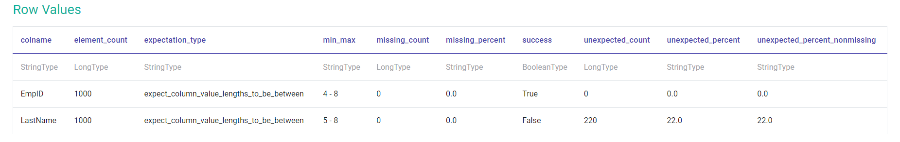

Expect Column Values To Be In Set
+++++++
Below is a sample workflow which contains **ExpectColumnValuesToBeInSet processor** in Fire Insights. It demonstrates the usage of ExpectColumnValuesToBeInSet node to to validate whether the values in a specified column of a dataset are present in a given set of expected values.

It does the following processing of data:

* Reads the incoming dataset.
* Validates the columns with entries to exist in the specified set of values.
* Prints the output using the print node.

ExpectColumnValuesToBeInSet Sample Workflow
======

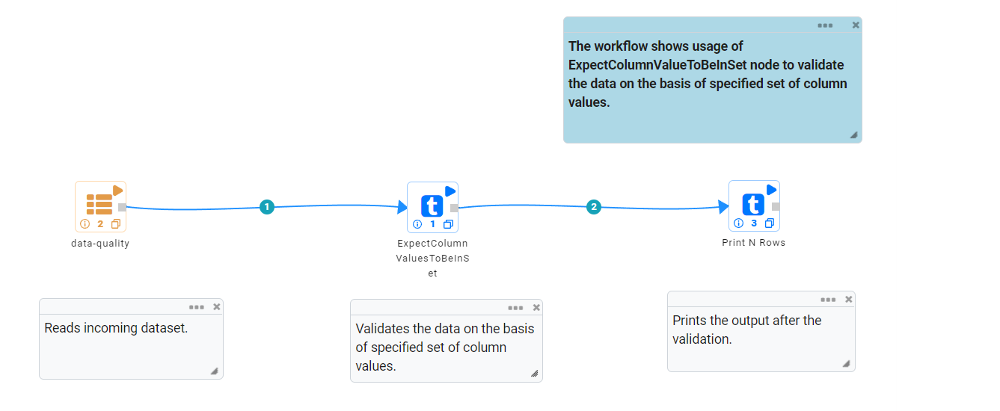

Incoming Dataset
=======

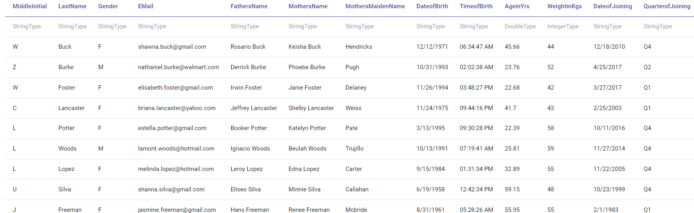

ExpectColumnValuesToBeInSet Node Configuration
========

* Input of this node is the incoming dataset.
* Column(s) for which the values need to be checked against the specified set is(are) to be selected in the ``Column Name`` column.
* Set of values against which each column entry needs to be checked is to be entered in ``value`` column for each selected column. The values in the set can be separated by a semicolon.
* The processor can be configured to check for spaces present in the column values. To check for spaces use acronym ``SP``. Refer the below image.
* The percentage of data to be validated can be specified under the ``Mostly`` column for each selected column.

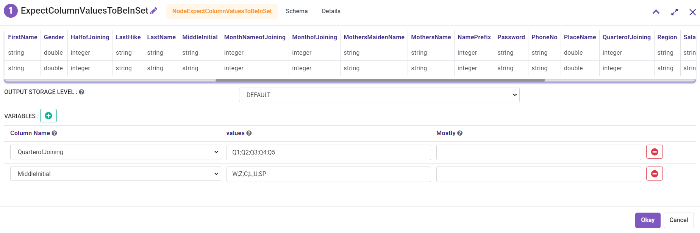

ExpectColumnValuesToBeInSet Node Output
========

The output of this node would produce the following results:

* If the expectation is met (i.e. all values in the column exist in the specified set), then the processor would return value of the ``success`` column as **True**.
* If the expectation is not met (i.e. at least one value in the column does not exist in the specified set), then the processor would return the value of the ``success`` column as **False**. 

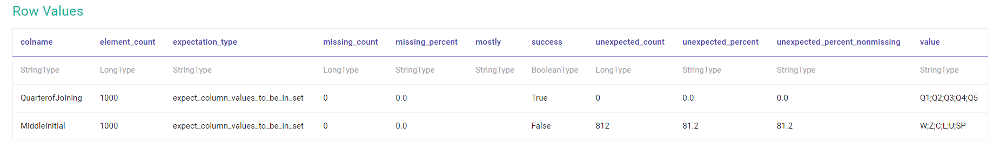

Expect Column Values To Match Regex
+++++++

Below is a sample workflow which contains **ExpectColumnValuesToMatchRegex processor** in Fire Insights. It demonstrates the usage of ExpectColumnValuesToMatchRegex node to validate the data on the basis that the selected column(s) values match a specified regular expression pattern.

It does the following processing of data:

* Reads the incoming dataset.
* Validates the selected column(s) on the basis of matching them with a specified regular expression pattern.
* Prints the output using the print node.

ExpectColumnValuesToMatchRegex Node Sample Workflow
=========

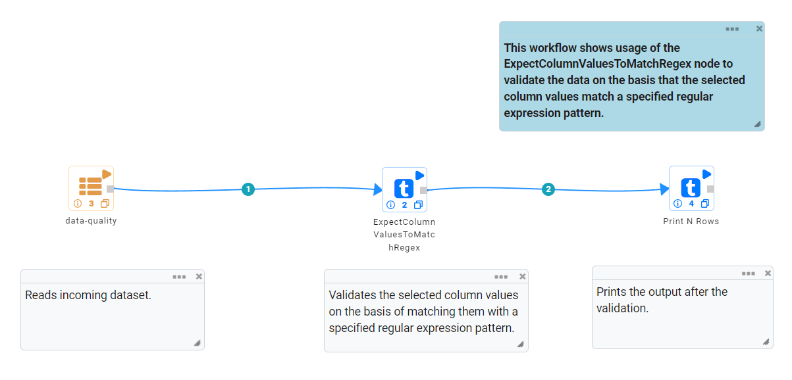

Incoming Dataset
==========

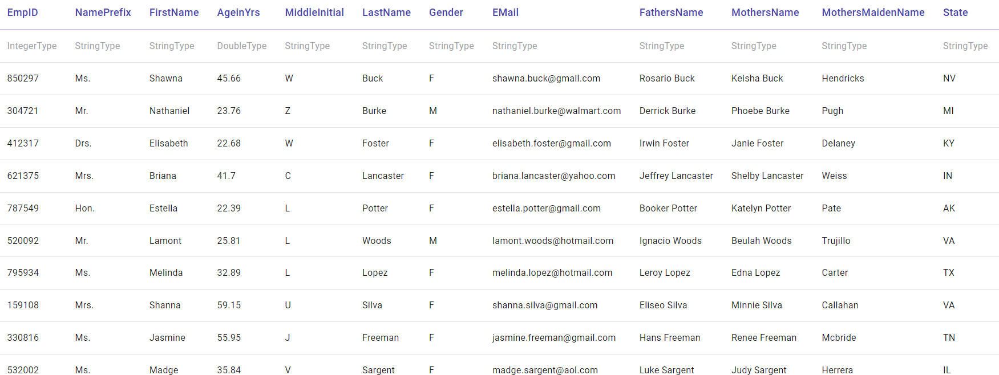

ExpectColumnValuesToMatchRegex Node Configuration
=========

* Input of this node is the incoming dataset.
* Column(s) for which the values need to be checked against the specified regular expression pattern is(are) to be selected in the ``Column Name`` drop-down box.
* Regular expression pattern against which each column entry needs to be checked is to be entered in the ``Regex`` column for each selected column.
* The percentage of data to be validated can be specified under the ``Mostly`` column for each selected column.

.. figure:: ../../_assets/user-guide/data-quality/expect-value-match-regex-config.png
   :alt: data-quality-userguide 	
   :width: 65%

ExpectColumnValuesToMatchRegex Node Output
========

The output of this node would produce the following results:

* If the expectation is met (i.e. all values in the selected column(s) match the specified regular expression pattern), then the processor would return value of the ``success`` column as **True**.
* If the expectation is not met (i.e. at least one value in the selected column(s) does not match the specified regular expression pattern), then the processor would return the value of the ``success`` column as **False**. 
* It is important to note that the regular expression pattern needs to be specified correctly for this validation to work as expected.

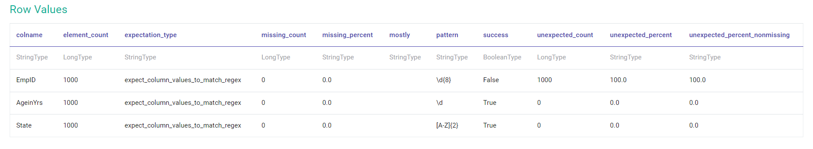

Expect Column Values To Match Strftimeformat
+++++++
Below is a sample workflow which contains **ExpectColumnValuesToMatchStrftimeFormat processor** in Fire Insights. It demonstrates the usage of the ExpectColumnValuesToMatchStrftimeFormat node to validate the data on the basis that the selected column(s) values match a specified strftime format.

It does the following processing of data:

* Reads the incoming dataset.
* Validates the selected column(s) values for matching a specified strftime format.
* Prints the output using the print node.

ExpectColumnValuesToMatchStrftimeFormat Node Sample Workflow
=======

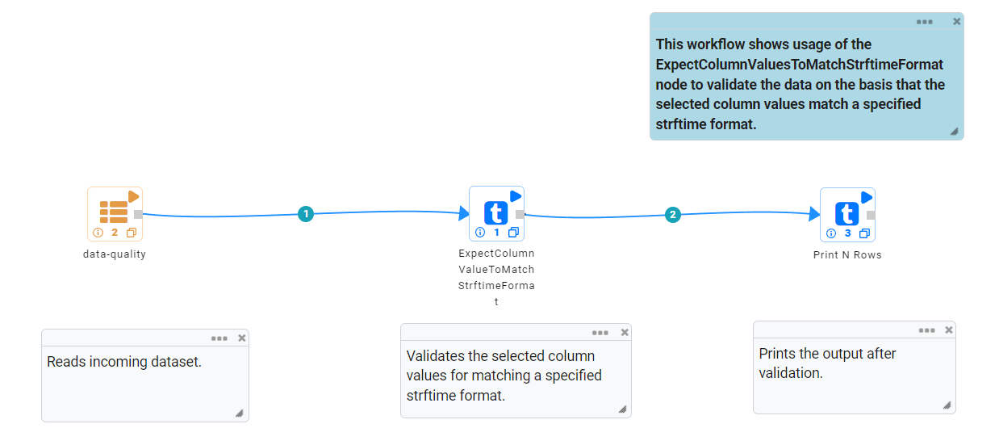
   
Incoming Dataset
======

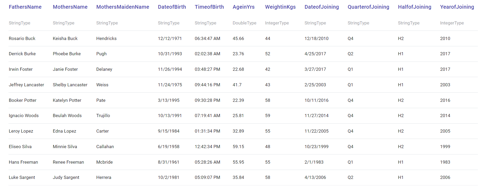
   
ExpectColumnValuesToMatchStrftimeFormat Node Configuration
=========

* Input of this node is the incoming dataset.
* Column(s) for which the values need to be checked against the specified strftime format is(are) to be selected in the ``Column Name`` drop-down box.
* Strftime format against which each column entry needs to be checked is to be entered in the ``Strftime Format`` column for each selected column.
* The percentage of data to be validated can be specified under the ``Mostly`` column for each selected column.

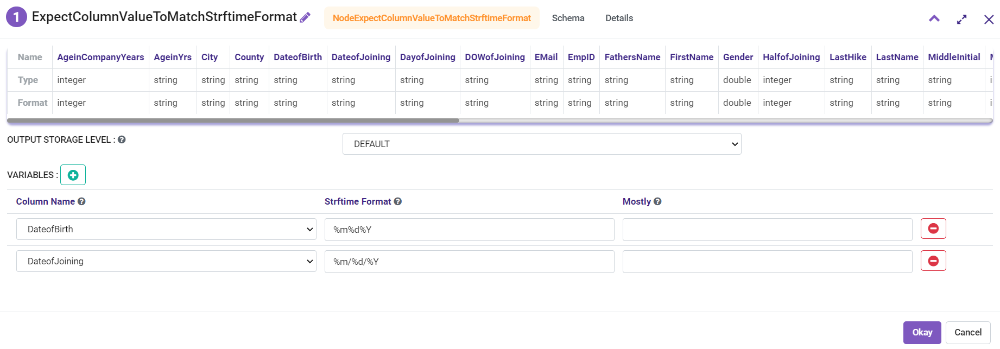
   
ExpectColumnValuesToMatchStrftimeFormat Node Output
========

Output of this node would produce the following results:

* If the expectation is met (i.e. all values in the selected column(s) match the specified strftime format), then the processor would return value of the ``success`` column as **True**.
* If the expectation is not met (i.e. at least one value in the selected column(s) does not match the specified strftime format), then the processor would return the value of the ``success`` column as **False**. 
* It is important to note that the strftime format needs to be specified correctly for this validation to work as expected.

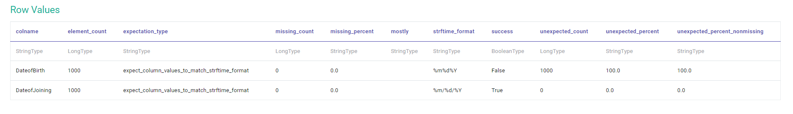

Example Workflow
++++++++

Here is a sample workflow that uses all the above-mentioned nodes. 

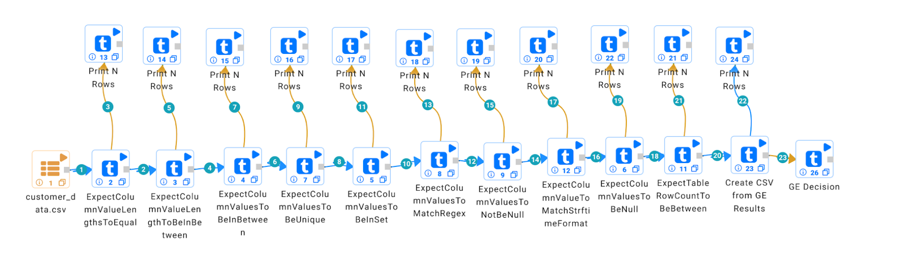

