Dashboards
=======================

Fire Insights allows creating the Dashboard. You can create new datasets using JDBC data type from MySQL database using connection and then use the datasets in creating charts & dashboards.

Creating Dashboard
--------------------

- For creating a Dashboard, you need to create MySQL Connection, add Google REST API key which is used in displaying the Google Maps and then create a JDBC dataset using it.

You can define a new dataset by clicking on the ``Create Dataset`` button using Connections option on the dataset page.

It will bring up the dialog box below. Select the MySQL Connection being used for creating dataset.

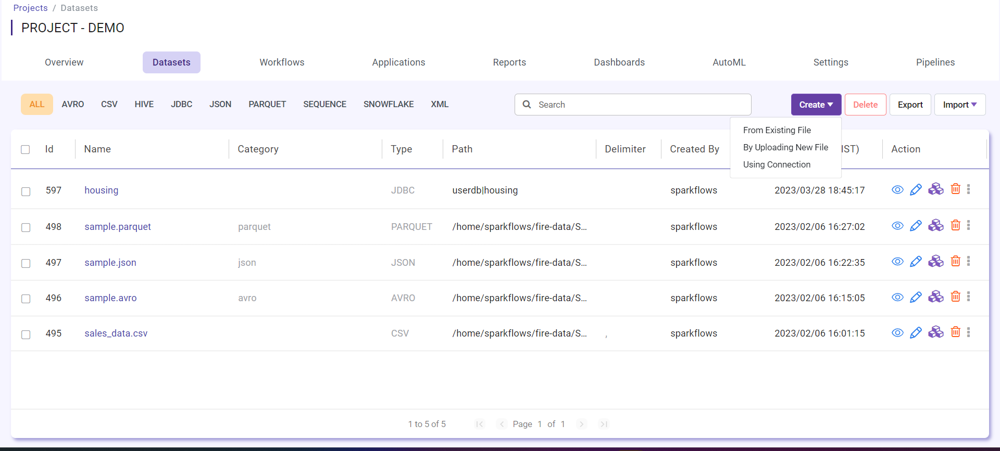

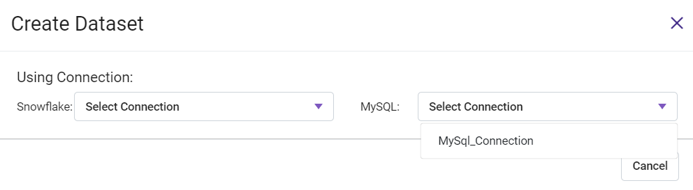

Entering Field Details
^^^^^^^^^^^^^^^^^^^^

Below are the details of the fields in the ``Create Dataset`` page:

- **NAME**: Name of the new dataset we are creating.
- **DESCRIPTION**: Description of the new dataset.
- **CATEGORY**: Category of the new dataset.
- **DB**: Database for MySQL database.
- **TABLE**: Table for MySQL.

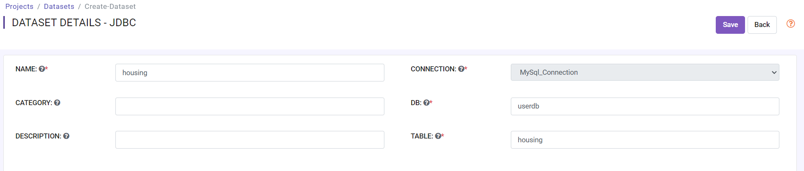

Updating the Schema of the Dataset
^^^^^^^^^^^^^^^^^^^^

You can update the Schema of the dataset by clicking on ``Update Sample Data/Schema``. It would display sample data for the dataset followed by the Schema inferred by Fire Insights.

You can update the column names in the schema based on your data.
 
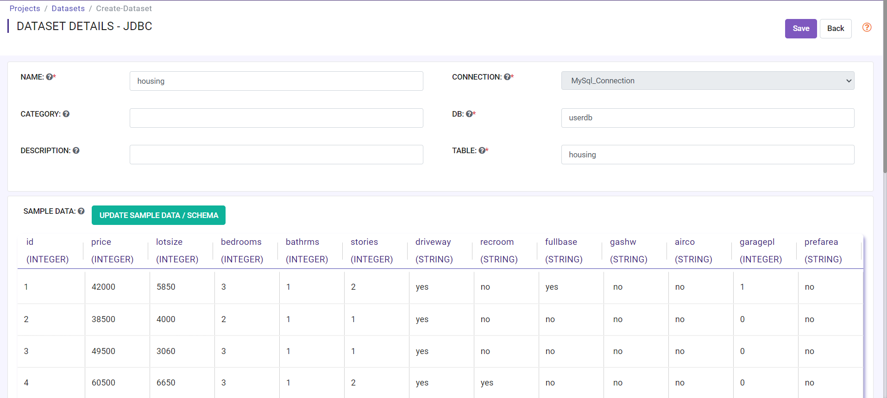

Saving the New Dataset
^^^^^^^^^^^^^^^^^^^^

Click on the ``Save`` button to save the new dataset created.

Dashboard
^^^^^^^^^^^^^^^^^^^^^^

Click on the ``Dashboard`` tab in the same application where you have created JDBC dataset.

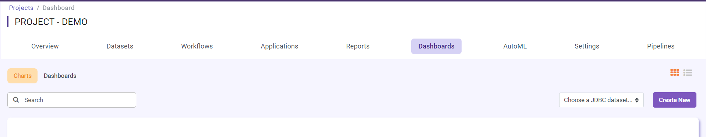

Click on the ``Chart`` tab and select Choose a JDBC dataset, there you will find all JDBC datasets created under your application.

.. figure:: ../../_assets/tutorials/dataset/jdbc_dataset.PNG
   :alt: Dataset
   :width: 65%

Select any JDBC dataset for which you want to create ``Chart`` and select ``CREATE NEW``

It will take you to the new page, as below :

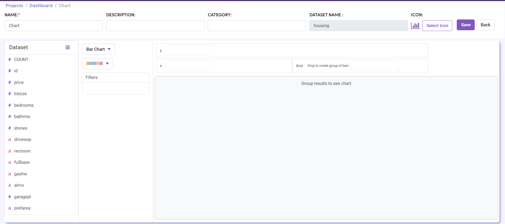

Select the ``Chart Type`` if you want to see the availble chart types.

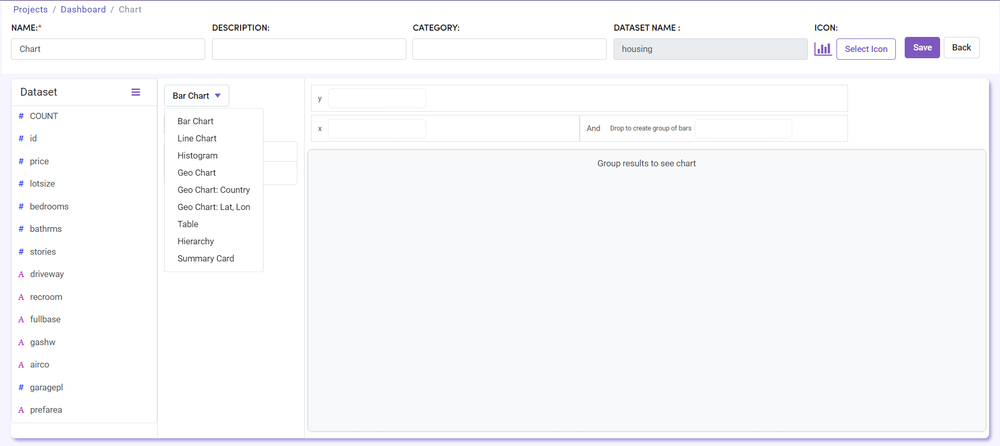

In the above step, we selected ``Bar Chart`` and updated column for x and y axis and added some filters.

Add NAME, DESCRIPTION and save it.

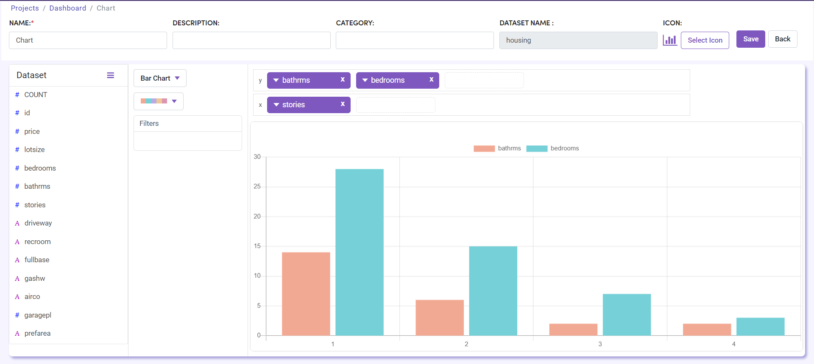

Once you save it, the chart will appear on the chart list page.

Similarly, you can create a different chart using a specified chart type.

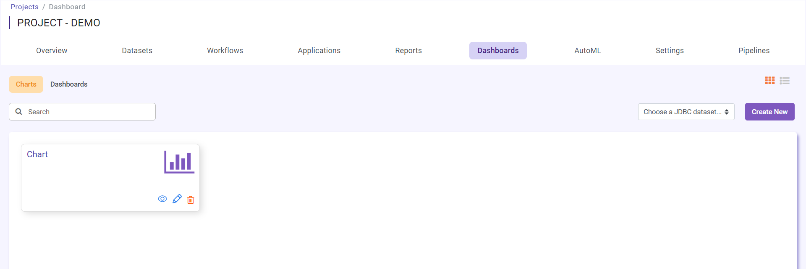

Now using an existing chart, you can create a new dashboard. 

Select the ``Dashboard`` tab and click on ``CREATE DASHBOARD``.

.. figure:: ../../_assets/tutorials/dataset/Dashboards/12.png
   :alt: Dataset
   :width: 65%

It will take you to the new dashboard page.

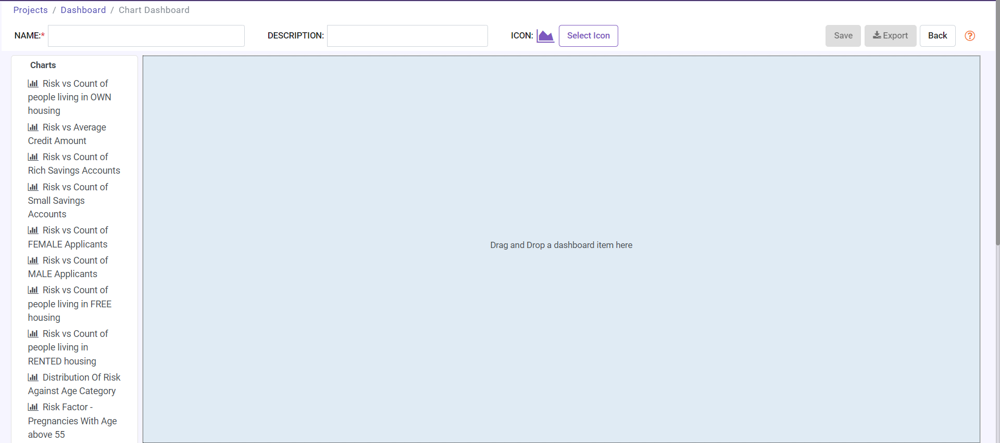

Using drag and drop you need to add a chart in canvas and then Add NAME and DESCRIPTION to it. After this SAVE it.

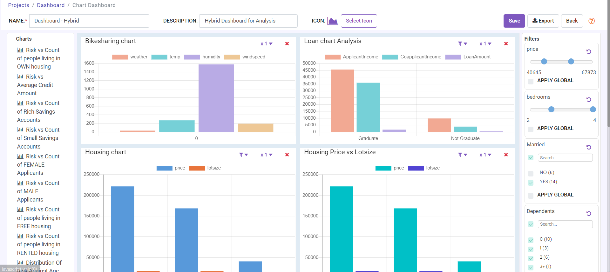

Once the Dashboard gets successfully saved, it will appear on the dashboard list (Grid or List view) page from where you can view, edit and delete it.

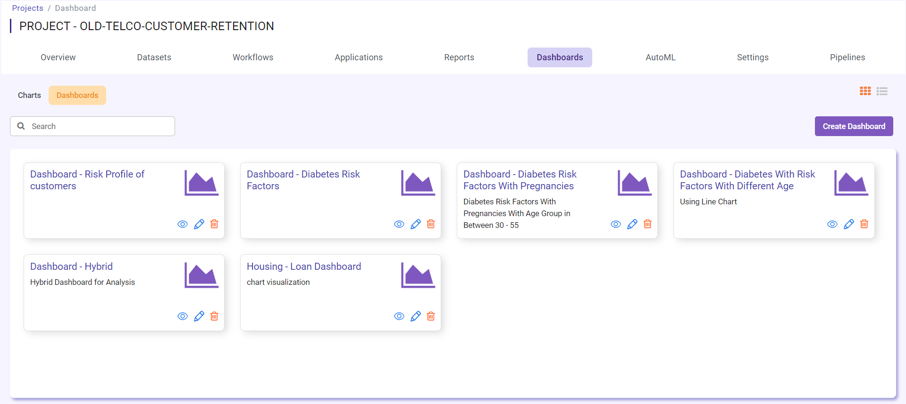

.. note::  Make sure to add Google REST API key in Fire Insights configurations.
