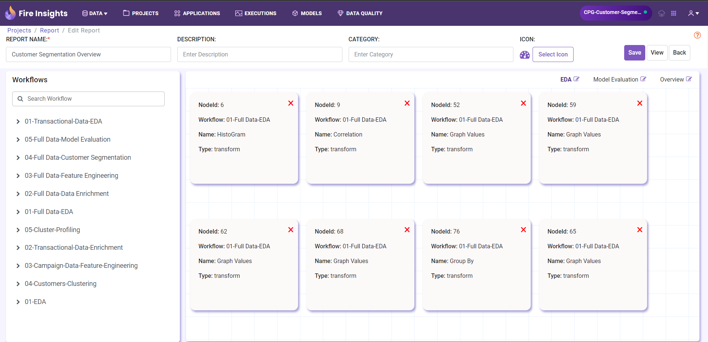
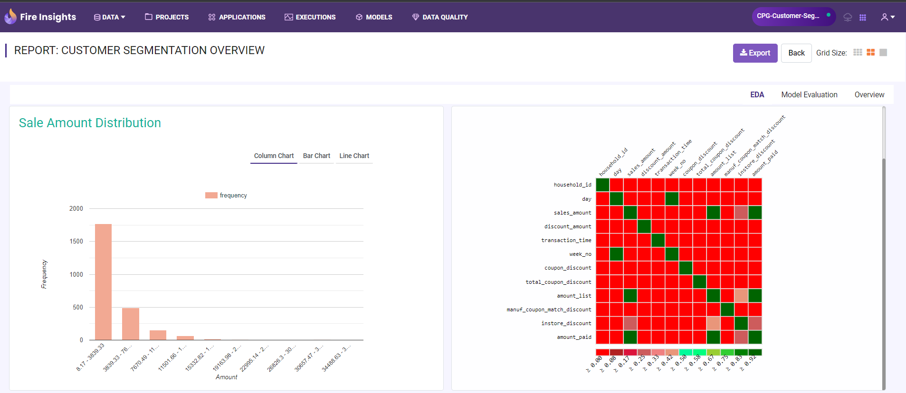

Reports
=======================

Sparkflows allows you to create reports based upon an assortment of data.

Processors in Sparkflows can provide output of data in the form of tables, charts, maps and simple strings. Reports allow combining of the output of various processors into one User Interface.

For example, we might want to take output of a chart of the number of bike rentals per hour, another by per day and another map displaying the total number of bike rentals per city for the day. 
Report can combine all these into one view.

This document gives detailed explanation of steps needed to access, create, edit, view and stream reports in Fire Insights.

Step 1 : Accessing Reports
--------------------

The Reports Tab of the project is the place where all the reports connected to the Project reside. 

Follow the below steps to access these reports :

#. Open the concerned **project**.
#. Hit the **Reports Tab** to open **Reports List Page**.  
#. Hit the **Iye Icon** to access (open and view) the report.

  *Note: If there are no previously created reports, the Reports List page would appear empty.*
 
  .. figure:: ../../_assets/user-guide/reports/ReportList.png
     :alt: Fire Insights Access Report
     :width: 60%   
 
Step 2: Creating Reports
--------------------
 
To create a new report, follow the below steps :

#. From the Reports List Page, hit **Create New Report/Create Report**.
#. Choose the **report type**. Fire offers 2 types :
   
   * Classic Report
   * Standard Report
   
   Note: Standard Report is preferable if you want more customization flexibility.

#. On the Create Report Page, **add processors** into the **Report Canvas**. To add :

   * Hit the **workflow name** in Workflows Repository located on LHS.
   * **Drag and drop** the required **processors** into the Report Canvas.
   
#. Save the Report after you finish adding processors. To save: 

   * Give a **name**, **description** and **category** to your report.
   * Hit the **Save** Button.
   
   Now, you are ready to edit or view reports.
   
  .. figure:: ../../_assets/user-guide/reports/CreateReport.png
     :alt: Fire Insights Create Report
     :width: 65%
 
.. Note:: When the corresponding workflows are run, the output is stored by Sparkflows into the relational store. These get displayed in the Report.

Editing Reports
------------------

Editing reports is like creating them, except that you click the edit button to edit the corresponding report.
 

   
   
Viewing Reports
------------------

Once a report has been created, you can view it by clicking on the ``View`` button.
  

   
Streaming Reports
---------------------
 
- Sparkflows allows you to create streaming workflow.
- The streaming workflows have a mini-batch duration, say 30 seconds.
- In this case, the output in the reports gets updated every 30 seconds as the new data comes in.

Videos
-----------------

Watch the video tutorial on how to create a report at the Sparkflows YouTube channel. Find the link below.

* Creating a Report: https://www.youtube.com/watch?v=lWWRPKxMf7Q

