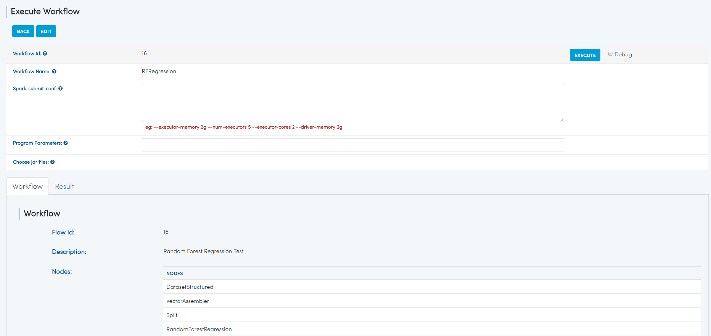
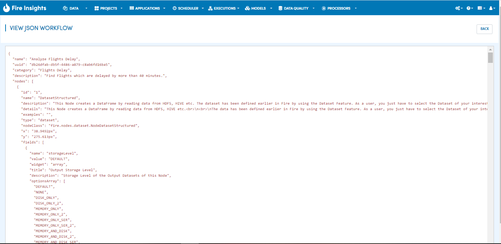
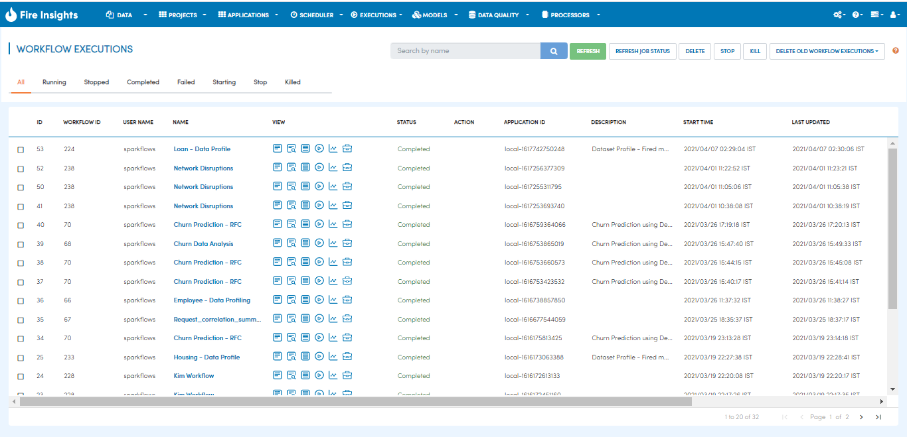

Executing Workflows
===================

Fire Workflows can be executed in the following ways:
 
 * **Interactively within the User Interface**
 * **Submitting the workflows using spark-submit through the command line**
 * **Scheduling for execution with your scheduler of choice**
 
Interactively within the User Interface
------------------------------------------

Workflows can be executed from the Browser by going into the Execute page of the workflow.

Executing Workflows with spark-submit
--------------------------------------
 
Workflows are saved as text files in JSON format.
Workflows can be submitted to be run on the cluster with spark-submit::
  
    spark-submit    --class    fire.execute.WorkflowExecuteFromFile    --master yarn    --deploy-mode client    --executor-memory 1G    --num-executors 1    --executor-cores 1       fire-core-1.4.2-jar-with-dependencies.jar       --postback-url http://<machine>:8080/messageFromSparkJob        --job-id 1         --workflow-file      kmeans.wf

For providing extra variables to the workflow, the following parameters can be added to spark-submit::

    --var name1=value1   --var name2=value2    --var name3=value3
    
In the above:

+--------------------+--------------------------------------------------------------------------------------------------------------------------------------------------------------------------------------------------------+
| Parameter          | Details                                                                                                                                                                                                |
+====================+========================================================================================================================================================================================================+
| fire-core jar file | It is the fire-core jar file required code for executing the workflow. The fire-core jar file is in the fire-lib directory of the sparkflows install                                                   |
+--------------------+--------------------------------------------------------------------------------------------------------------------------------------------------------------------------------------------------------+
| postback-url       | http://<machine>:8080/messageFromSparkJob is the postback URL for fire UI. <machine> should be the machine name on which Sparkflows is running. 8080 should be the port on which Sparkflows is running |
+--------------------+--------------------------------------------------------------------------------------------------------------------------------------------------------------------------------------------------------+
| job-id             | 1 is the job id. It can be any value for now                                                                                                                                                           |
+--------------------+--------------------------------------------------------------------------------------------------------------------------------------------------------------------------------------------------------+
| workflow-file      | kmeans.wf is the json workflow file containing the kmeans workflow in this case.                                                                                                                       |
+--------------------+--------------------------------------------------------------------------------------------------------------------------------------------------------------------------------------------------------+

 For providing extra variables to the workflow, the following parameters can be added to spark-submit::
 
    --var name1=value1   --var name2=value2    --var name3=value3
 
In the workflow, these variables can be used with $name1    $name2
Specific nodes make use of the variables by substituting $name with the value provided for the name.
 

Workflow JSON
--------------
 
In Sparkflows, there are 2 json representations of the workflow.
 
  * One is used in the Sparkflows UI
  * The other is used when submitting to the spark cluster. The one used for submitting on to the spark cluster does not have fields like the x and y positions.  
  
  
The View JSON Workflow page of the Workflow displays both the JSON representations of the workflow. Analysis Flow Fire JSON should be used when submitting the workflow to the cluster with spark-submit:

 
 
Scheduling Workflow execution with Scheduler of choice
----------------------------------------------------------
 
Since Fire workflows can be submitted with spark-submit, you can use your scheduler of choice for scheduler the execution of the workflows.
 
These include Oozie, crontab etc.
 
Viewing Results of Workflow Execution
--------------------------------------
 
The results of Workflow Execution are streamed into the Browser as they are executed and displayed in Rich Format. A workflow may run for a very long time.

The results of past executions can also be viewed in the Workflow Executions page.
 

