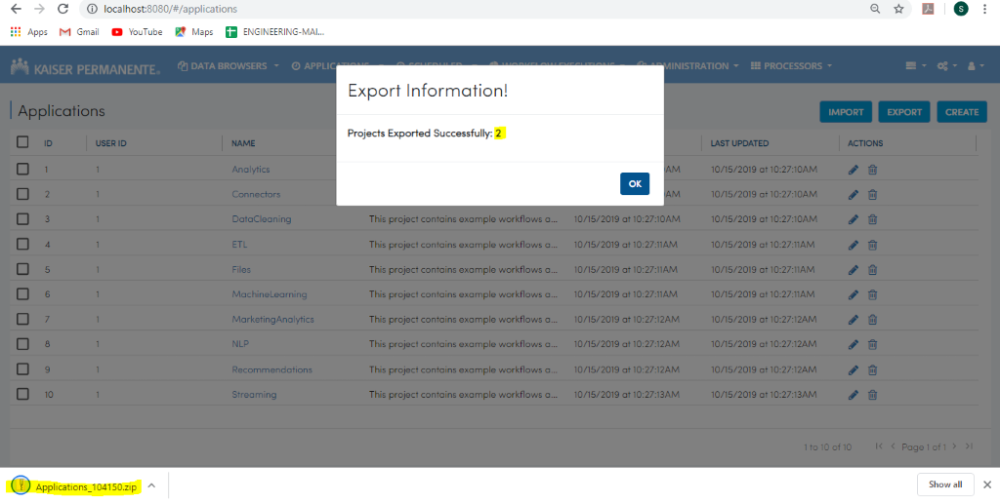
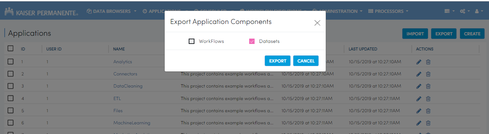
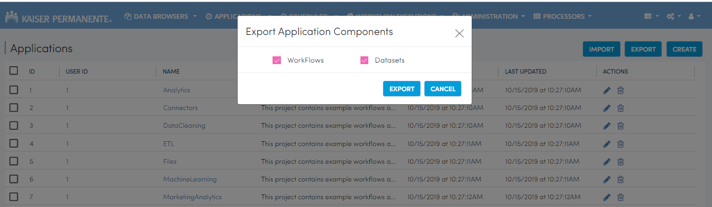
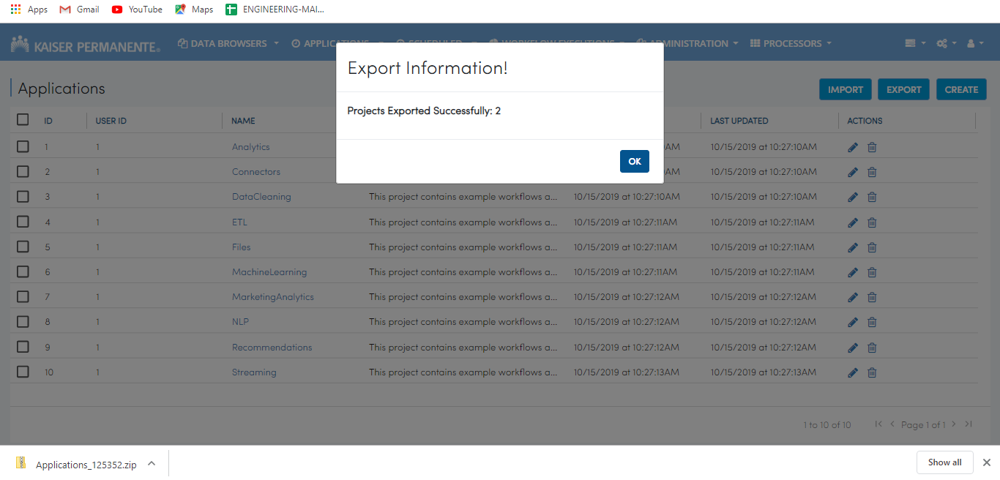

Exporting Applications
==============

Fire allows you to export Applications and download them to your computer.

Below are the steps for exporting Applications in Fire.

Export Workflows and Datasets
--------------------------

* Go to the Applications Page

 .. figure:: ../../_assets/tutorials/dataset/84.png
     :alt: tutorials
     :align: center
     :width: 60%

* Select the Application you want to export.

* Select whether you want to export workflow or dataset and click on the export button.

 .. figure:: ../../_assets/tutorials/dataset/85.png
     :alt: tutorials
     :align: center
     :width: 60%
     
     
* Fire will now export application and download it to your computer.

  .. figure:: ../../_assets/tutorials/dataset/86.png
     :alt: tutorials
     :align: center
     :width: 60%
  
     
     
     

Select the workflow option and click the export button.

   .. figure:: ../../_assets/tutorials/dataset/48.png
     :alt: tutorials
     :align: center
     :width: 60%

Export Dataset
---------------

Select the project which you want to export. 

     
Select the datasets option and click the export button.

     
     
After successful export, export information modal opens. 
 
 
 .. figure:: ../../_assets/tutorials/dataset/51.png
     :alt: tutorials
     :align: center
     :width: 60%
     
     
Export Workflows and Datasets
------------------------------

Select the project which you want to export. 

.. figure:: ../../_assets/tutorials/dataset/52.png
     :alt: tutorials
     :align: center
     :width: 60%
     
Select the workflow and datasets option and click the export button.

     
     
After successful export, export information modal opens. 

     
