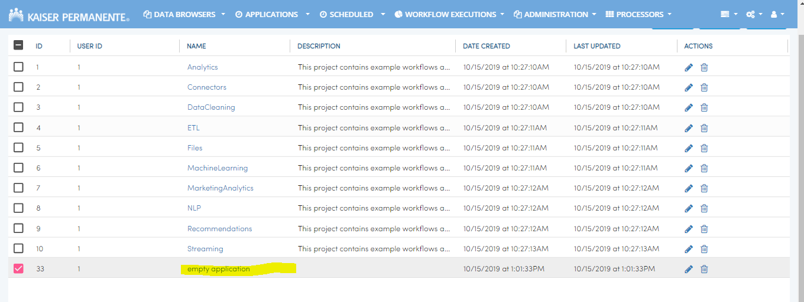
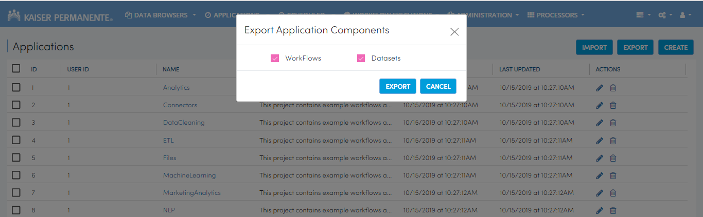
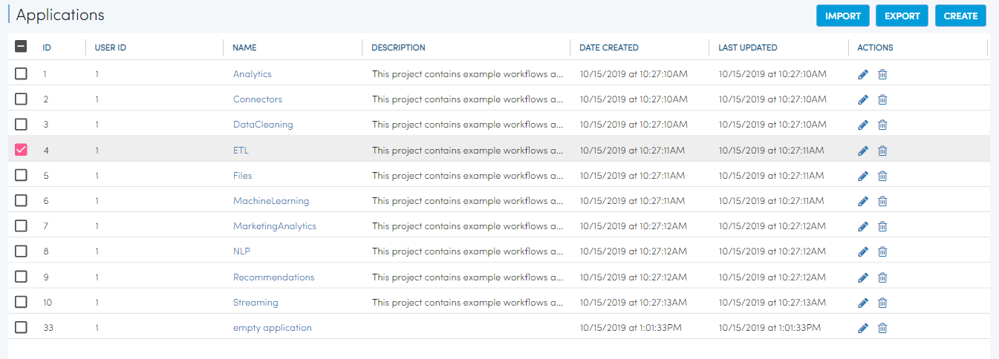
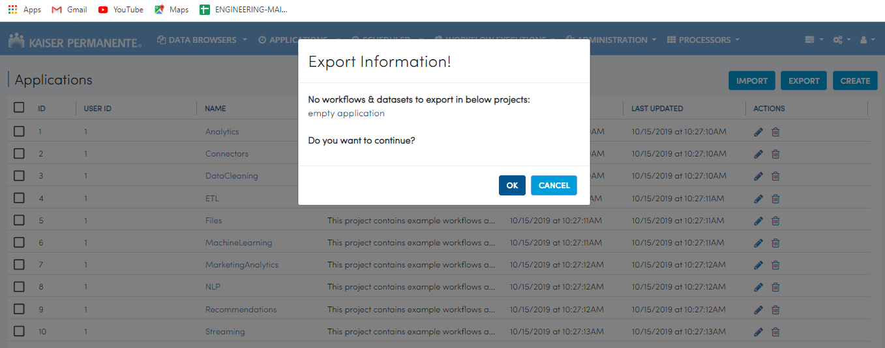
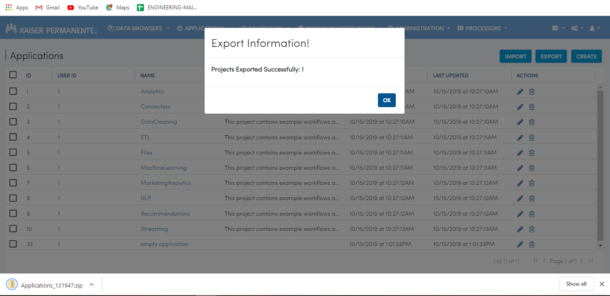

Exporting Applications
==============

Fire allows you to export Applications and download them to your computer.

Below are the steps for exporting Applications in Fire.

Export Workflows
---------------

* Go to the Applications Page

* Select the Applications you want to export

  .. figure:: ../../_assets/tutorials/dataset/47.png
     :alt: tutorials
     :align: center
     :width: 60%

Select the workflow option and click the export button.

   .. figure:: ../../_assets/tutorials/dataset/48.png
     :alt: tutorials
     :align: center
     :width: 60%

Export Dataset
---------------

Select the project which he/she want to export. 

.. figure:: ../../_assets/tutorials/dataset/49.png
     :alt: tutorials
     :align: center
     :width: 60%
     
Select the datasets option and click the export button.

.. figure:: ../../_assets/tutorials/dataset/50.png
     :alt: tutorials
     :align: center
     :width: 60%
     
     
After successful export, export information modal gets open. 
 
 
 .. figure:: ../../_assets/tutorials/dataset/51.png
     :alt: tutorials
     :align: center
     :width: 60%
     
     
Export Workflows and Datasets
------------------------------

Select the project which you want to export. 

.. figure:: ../../_assets/tutorials/dataset/52.png
     :alt: tutorials
     :align: center
     :width: 60%
     
Select the workflow and datasets option and click the export button.

.. figure:: ../../_assets/tutorials/dataset/53.png
     :alt: tutorials
     :align: center
     :width: 60%
     
     
After successful export, export information modal gets open. 

.. figure:: ../../_assets/tutorials/dataset/54.png
     :alt: tutorials
     :align: center
     :width: 60%
     
Export Empty Workflows and Datasets
------------------------------------ 

Select the project which you want to export. 

     
Select the workflow and datasets option and click the export button.

     
If there are no  workflows and datasets in the project, then error message will come.
 
 
 .. figure:: ../../_assets/tutorials/dataset/57.png
     :alt: tutorials
     :align: center
     :width: 60%
     
Export Empty Workflows 
----------------------

Select the project which you want to export.

 .. figure:: ../../_assets/tutorials/dataset/58.png
     :alt: tutorials
     :align: center
     :width: 60%
     
     
Select the workflow option and click the export button. 

 .. figure:: ../../_assets/tutorials/dataset/59.png
     :alt: tutorials
     :align: center
     :width: 60%
     
     
If there are no workflows in the project, then an error message will be displayed.
     
 .. figure:: ../../_assets/tutorials/dataset/60.png
     :alt: tutorials
     :align: center
     :width: 60%  
     

Export Empty Datasets 
----------------------

Select the project which you want to export.

  
Select the dataset option and click the export button.
     

 .. figure:: ../../_assets/tutorials/dataset/62.png
     :alt: tutorials
     :align: center
     :width: 60%      

If there are no datasets in the project, then an error message will be displayed.

 .. figure:: ../../_assets/tutorials/dataset/63.png
     :alt: tutorials
     :align: center
     :width: 60%  
     
     
     
Export one empty project and one project having some data(workflow and datasets)
-------------------------------------------------------------------------------

Select the project which you want to export.

 .. figure:: ../../_assets/tutorials/dataset/64.png
     :alt: tutorials
     :align: center
     :width: 60%  
     

Select the workflow and datasets option and click the export button. 

 .. figure:: ../../_assets/tutorials/dataset/65.png
     :alt: tutorials
     :align: center
     :width: 60%  
     
It will show modal which will give user the information that, if one project has no data and the other has it, the user can continue if he wants to.

     
     
If the user chooses yes, then, successful export of one project takes place.
After successful export, export information modal opens.

