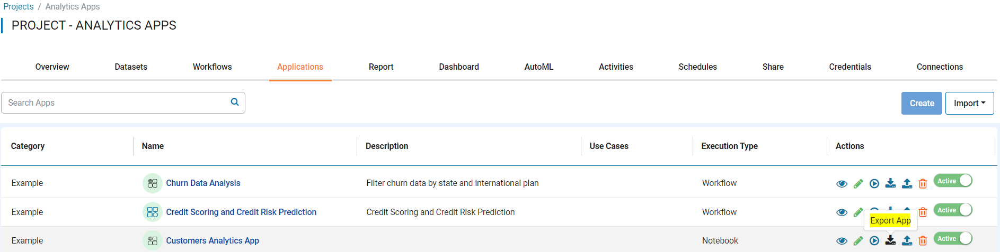
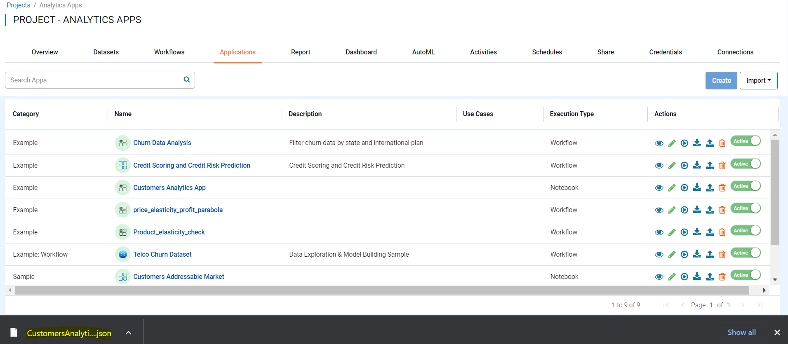

Export Applications
===============

Fire Insights enables you to export Applications as JSON files. These JSON files can be imported into another instance of Fire Insights.

Below are the steps for exporting a Applications.

Steps for Exporting Applications
-----

You can Login to Fire Insights Web server URL and follow below steps:

* Go to the Project List page.
* Select the project that has the Application you want to Export.
* Click the Applications tab

You should get to a page similar to below: 

.. figure:: ../../_assets/user-guide/export-import/application_list_page.PNG
     :alt: userguide
     :width: 70%

In order to export the Application you want, you must:

* Click on Export App icon in Actions section.

  
Once the Application gets exported successfully, you will see the Application JSON file in your local Computer and same can be imported to other instance of Fire Insights. 

.. note:: Make sure that data pointed to the Application should be available on new instance of Fire Insights.
