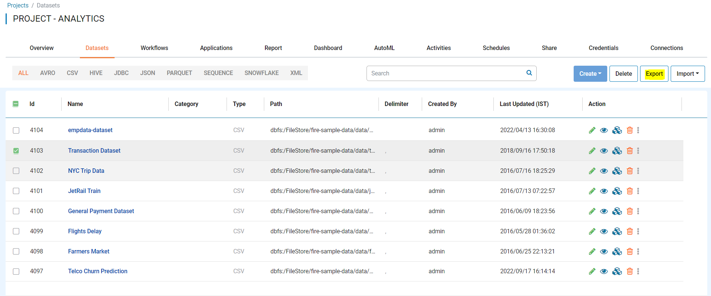
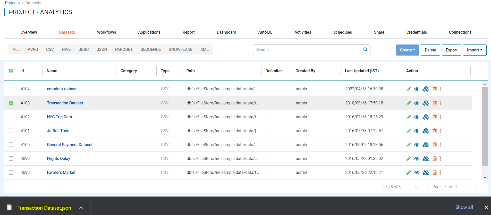

Export Datasets
===============

Fire Insights enables you to export Datasets as JSON files. These JSON files can be imported into another instance of Fire Insights.

Below are the steps for exporting a Dataset.

Steps for Exporting Datasets
-----

You can Login to Fire Insights Web server URL and follow below steps:

* Go to the Project List page.
* Select the project that has the Dataset you want to Export
* Click the Datasets tab

You should get to a page similar to below: 

.. figure:: ../../_assets/user-guide/export-import/dataset_list_page.PNG
     :alt: userguide
     :width: 60%

In order to export the Dataset you want, you must:

* Check the box next to the Dataset you want to Export
* Click Export 

  
Once the Dataset exported successfully, you will see the Dataset JSON file in your local Computer and same can be imported to other instance of Fire Insights. 

.. note:: Make sure that data pointed to the Dataset should be available on new instance of Fire Insights.
