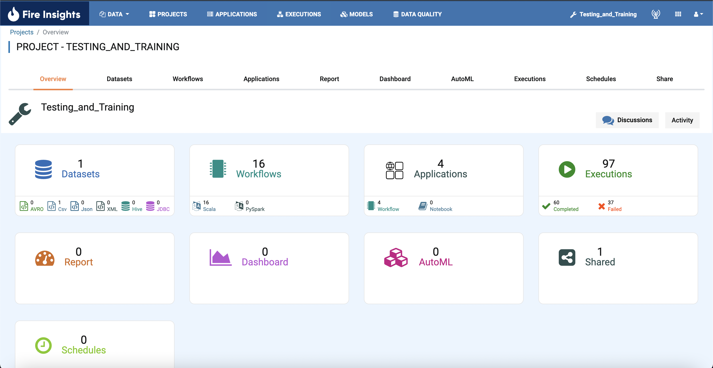
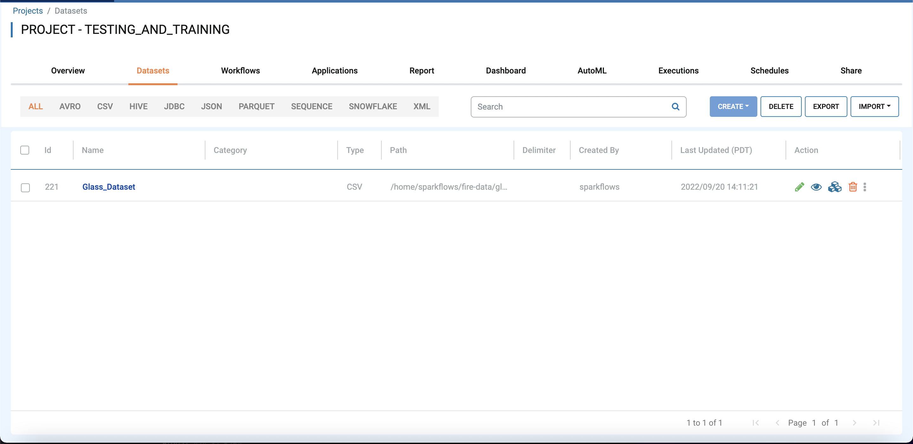

Export Datasets
===============

Fire Insights enables you to export Datasets as JSON files. These JSON files can be imported into another instance of Fire Insights.

Below are the steps for exporting a Dataset.

Steps for Exporting Datasets
-----

* Go to the Project page.
* Select the project to export a Dataset from 

You should get to a page similar to below

* Click the Datasets Tab

You should get to a page similar to below

     
     
* Click Export next to delete and import
