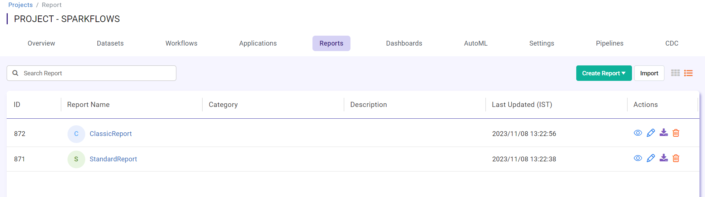
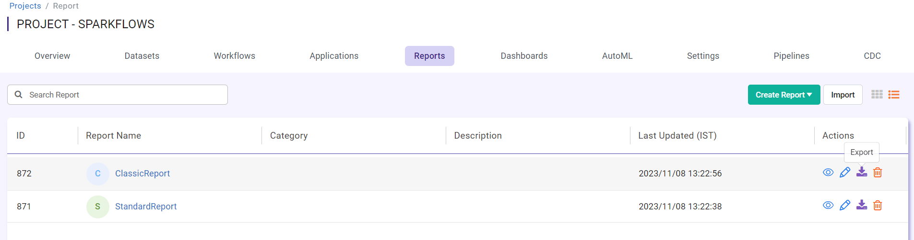
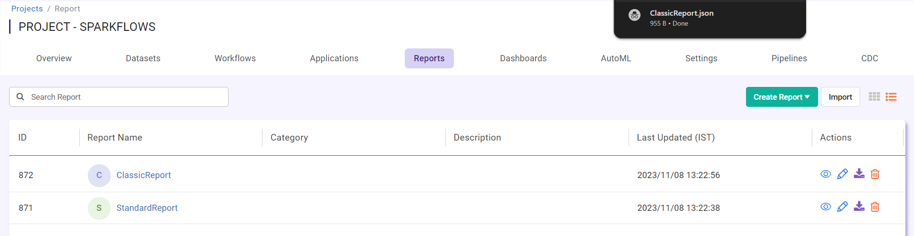

Export Reports
==============

Fire Insights enables you to export Reporst as JSON files. These JSON files can be imported into another instance of Fire Insights.

Below are the steps for exporting Reports.

Steps for Export Reports
-----

You can Login to Fire Insights Web server URL and follow below steps:

* Go to the Project List page.
* Select the project that has the Reports you want to Export.
* Click the Reports tab.

You should get to a page similar to below: 

In order to export the Report you want, you must:

* Click on the Export from Actions, you want to Export. 

  
Once the Report gets exported successfully, you will see the Report JSON file in your local Computer and same can be imported to other instance of Fire Insights. 

.. note:: Make sure that data pointed to the Report should be available on new instance of Fire Insights.

  
