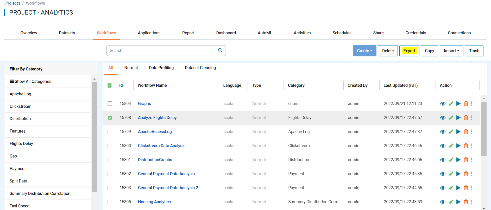
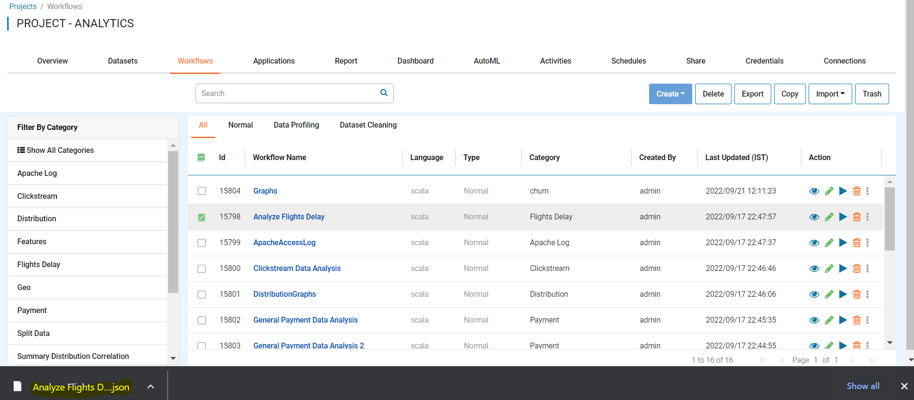

Export Workflows
===============

Fire Insights enables you to export workflows as JSON files. These JSON files can be imported into another instance of Fire Insights.

Below are the steps for exporting a workflow.

Steps for Exporting a Workflow
------

* Go to the Project List page.
* Select the project that has the workflow you want to Export
* Click the Workflows tab

You should get to a page similar to below: 

.. figure:: ../../_assets/user-guide/export-import/wf_list.PNG
     :alt: userguide
     :width: 60%

In order to export the workflow you want, you must:

* Check the box next to the workflow you want to Export
* Click Export 

  
Once the workflow exported successfully, you will see the workflow JSON file in your local Computer and same can be imported to other instance of Fire Insights. 

.. note:: Make sure that data pointed to the workflow should be available on new instance of Fire Insights.
