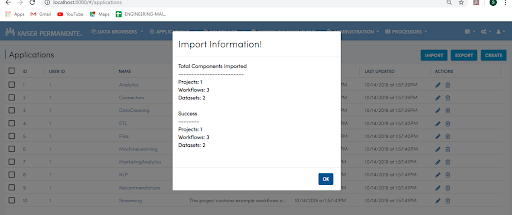

Importing Applications
==============

Fire allows you to import Applications. Below are the steps for importing Applications in Fire.

Go to the Applications Page
--------------------

- Click on the Import button
- Choose the zip file from your computer to Import
- Select the name of project which you would like to import from the zip file. Fire would display all the available Applications in your zip file. 

 .. figure:: ../../_assets/tutorials/dataset/67-2.png
     :alt: tutorials
     :align: center
     :width: 60%

Select the Option for importing the Application
-----------------------------------------------

There are two options when importing Applications:

* Import to a New Application
    * In this case, the selected Application would be imported as a new Application in Fire Insights. 

* Import to an Existing Application

When importing to an existing Application, there are 3 possible methods to choose from:

* Create new workflows and datasets in matching UUID's found.

* Overwrite datasets and workflows if same UUID found.

* Delete all workflows and datasets in the selected Application and create the imported workflows and datasets as new ones.

On Success
-------------------------------

On successful import of the Application into Fire Insights, the success dialog is displayed along with the details of the import.

