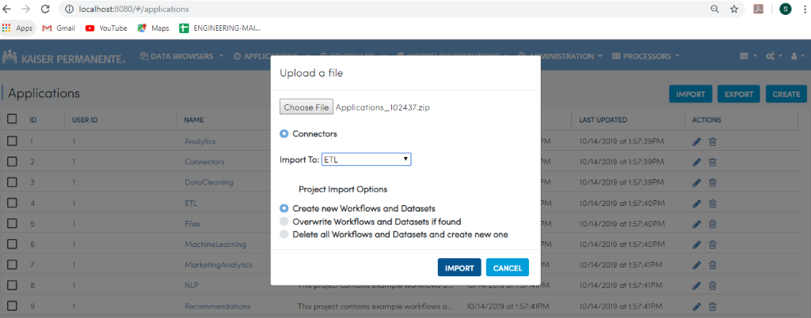
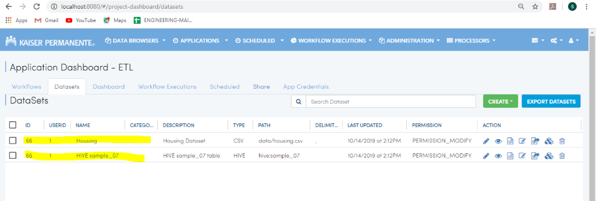
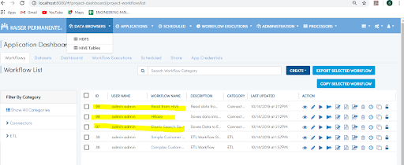
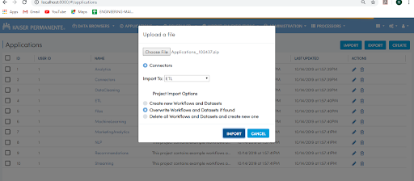
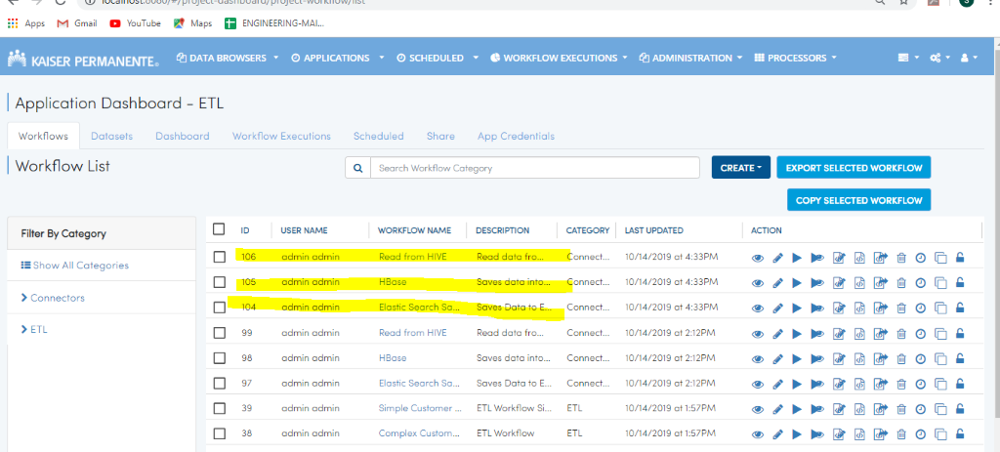
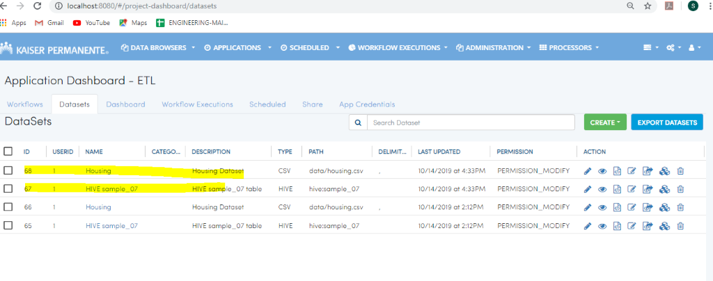
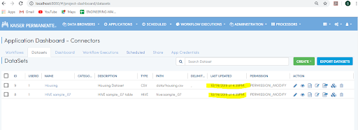

Importing Applications
==============

Fire allows you to import Applications. Below are the steps for importing Applications in Fire.

Go to the Applications Page
--------------------

- Click on the Import button
- Choose the zip file from your computer to Import
- Select the name of project which you would like to import from the zip file. Fire would display all the available Applications in your zip file. 

 .. figure:: ../../_assets/tutorials/dataset/67-2.png
     :alt: tutorials
     :align: center
     :width: 60%

There are two options when importing Applications:

* Import to a New Application
    * In this case, the selected Application would be imported as a new Application in Fire Insights. 

* Import to an Existing Application

When importing to an existing Application, there are 3 possible methods to choose from:

* Create new workflows and datasets in matching UUID's found.

* Overwrite datasets and workflows if same UUID found.

* Delete all workflows and datasets in the selected Application and create the imported workflows and datasets as new ones.

Option I : Create new workflows and datasets
-------------------------------

     
 
* Connectors data from file. 

* Import to ETL. 

* The workflows and datasets which are present in ETL will remain as it is, only the new workflows and datasets will be created which are present in the Connectors (data present in the zip file). 

After successful import, Import Information is shown with number of workflows and datasets imported successfully. 

.. figure:: ../../_assets/tutorials/dataset/71.png
     :alt: tutorials
     :align: center
     :width: 60%

Datasets

Workflows

     
Option II : Overwrite workflows and datasets if found
---------------------------------------

In this option, the workflows and datasets which are found with the same UUID, are overwritten.

     
     
* Connectors data from file. 

* Import to ETL. 

* It will check whether the workflows and datasets which are present in the folder (Connectors) are present in ETL or not. If present then overwrite else create new (depending upon project Id and uuid it will check). 

* After successful import, Import Information modal is shown with number of workflows and datasets count. 

.. figure:: ../../_assets/tutorials/dataset/77.png
     :alt: tutorials
     :align: center
     :width: 60%

Workflows

     
Datasets

     
If found then, overwrite  

* If I choose connectors and  also import to connectors and if the data (workflows and datasets) is present in the Project Connectors,  it will overwrite, not create new. 

Workflows

.. figure:: ../../_assets/tutorials/dataset/75.png
     :alt: tutorials
     :align: center
     :width: 60%

Datasets

     

  

Option III : Delete all workflows and datasets and create a new one
-----------------------------------------------------

In the option, all the workflows and datasets are first deleted from the existing Applicaiton. Then new ones are imported into the Application.

  .. figure:: ../../_assets/tutorials/dataset/78.png
     :alt: tutorials
     :align: center
     :width: 60%
     
     
  .. figure:: ../../_assets/tutorials/dataset/79.png
     :alt: tutorials
     :align: center
     :width: 60%   
     
     
 Choose the appropriate options.
 
  .. figure:: ../../_assets/tutorials/dataset/80.png
     :alt: tutorials
     :align: center
     :width: 60%  
     
     
* Connectors data from file. 

* Import to ETL.

* It will delete all the workflows and datasets from ETL and create new.

* After deletion data will be shown. 

After successful import, Import Information modal is shown with number of workflows and datasets count. 

 .. figure:: ../../_assets/tutorials/dataset/83.png
     :alt: tutorials
     :align: center
     :width: 60%

Workflows  

 
  .. figure:: ../../_assets/tutorials/dataset/81.png
     :alt: tutorials
     :align: center
     :width: 60%  
     
     
     
   
  .. figure:: ../../_assets/tutorials/dataset/82.png
     :alt: tutorials
     :align: center
     :width: 60%
     
     

