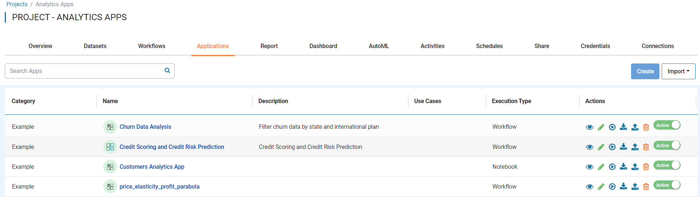
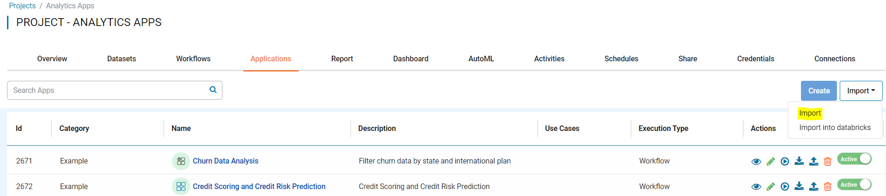
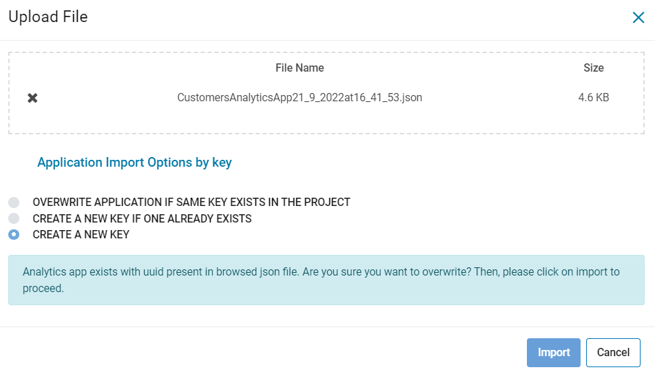
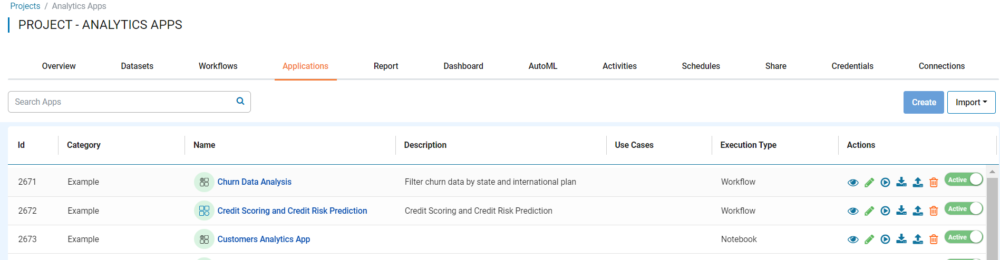

Import Applications
===============

Fire Insights enables you to import Applications as JSON files. These JSON files can be exported to use in another instance of Fire Insights.

Below are the steps for importing Applications.

Steps for Importing Applications
-------

You can Login to Fire Insights web server URL and follow below steps:

* Go to the Project List page.
* Select the project to import Applications to. 
* Click on the Applications tab.

You should get to a page similar as below:

* Click on the ``Import`` button and select ``Import``.

You should get to a page similar to below:

 

It will take you to new window where you can upload Application JSON file from your local Computer and select any one of the option depending on Application availablity in that project with KEY, the available options are listed below:

Import Applications Configuration
-----------------

When importing to an existing Project, there are 3 possible options to choose from:

* OVERWRITE APPLICATION IF SAME KEY EXISTS IN THE PROJECT
    * In this case, if the matching KEY is found, the existing project will be removed and replaced with the uploaded file.
* CREATE A NEW KEY IF ONE ALREADY EXISTS
    * In this case, if the matching KEY is found, the uploaded file will be assigned a new KEY.
* CREATE A NEW KEY
    * In this case, the uploaded file will always be assigned a new KEY.

     
Once you click on ``Import``, the Application should be available in Applications list page of Specific project.

     
.. note:: Make sure that data pointed to the Application JSON File should be available on new instance of Fire Insights where you are Importing.
