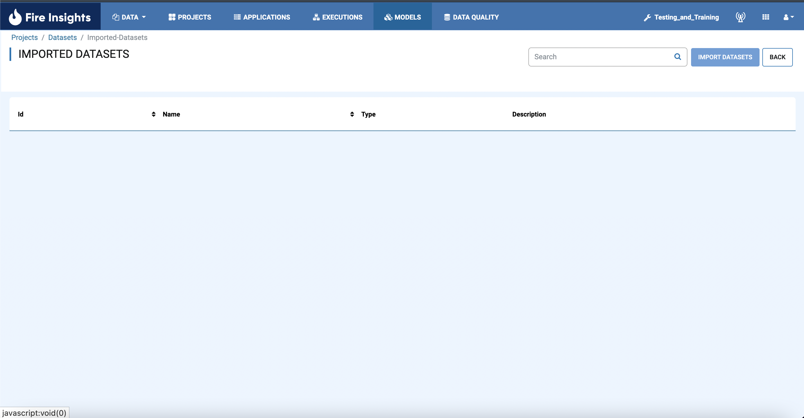
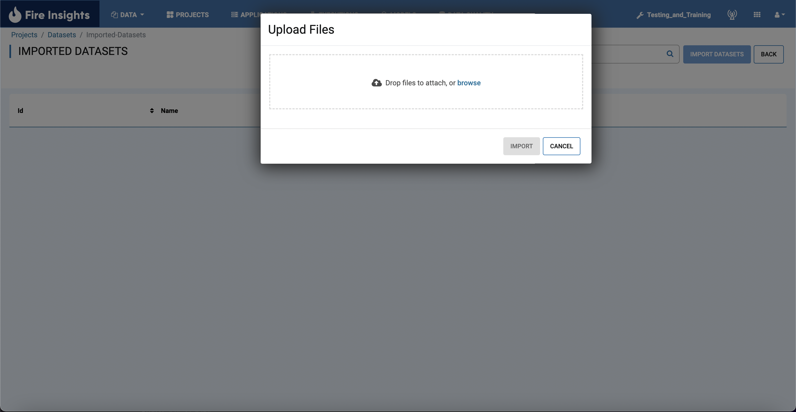

Import Datasets
===============

Fire Insights enables you to import Datasets to use in Projects.

Below are the steps for importing a Datasets.

Steps for Importing Datasets
-----

* Go to the Project page.
* Select the project to import  datasets to 

You should get to a page similar to below

.. figure:: ../../_assets/user-guide/export-import/Projects_Starting_Page.png
     :alt: userguide
     :width: 60%

* Click the Datasets Tab

You should get to a page similar to below

.. figure:: ../../_assets/user-guide/export-import/ImportExportDatasets_Starting_Page.png
     :alt: userguide
     :width: 60%
     
     
* Click Import Dataset next to the search bar

     
     
* Select the datasets you wish to import

