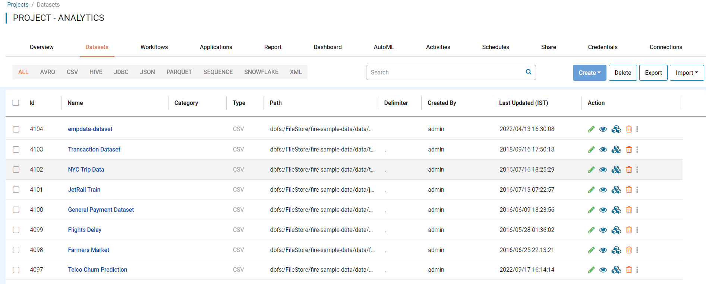
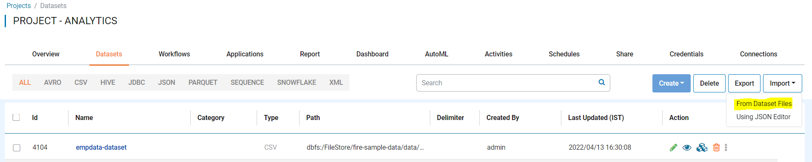
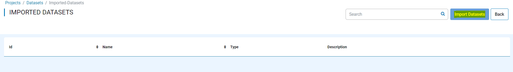
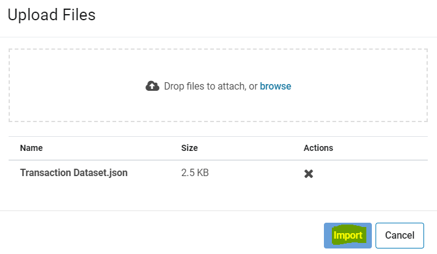
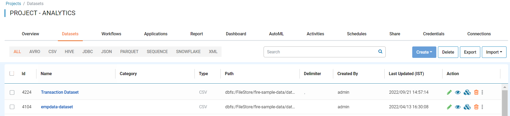

Import Datasets
===============

Fire Insights enables you to import datasets to use in projects.

Below are the steps for importing a datasets.

Steps for Importing Datasets
-----

You can Login to Fire Insights web server URL and follow the steps given below:

* Go to the Project List page.
* Select the project to import dataset to. 
* Click the Datasets tab.

You should get to a page similar to below:

* Click on the ``Import`` button and select ``From Dataset Files``.

You should get to a page similar to below:

 
Once you select from dataset files, it will take you to new window similar to below:
 

Once you click on ``Import Datasets`` tab, it will take you to new windows where you can upload datasets JSON file from your local Computer.

     
Once you Click on ``Import``, the dataset should be available in Datasets list page of specific project.

     
.. note:: Make sure that data pointed to the dataset JSON file should be available on new instance of Fire Insights where you are importing.
