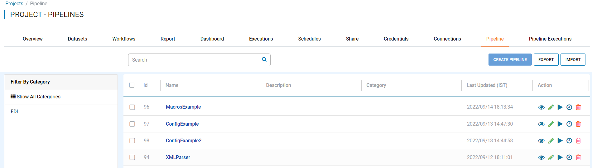
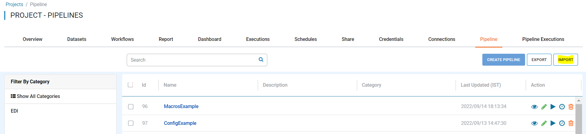
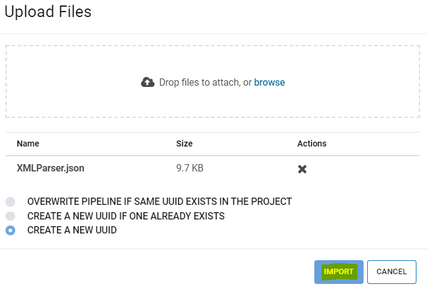
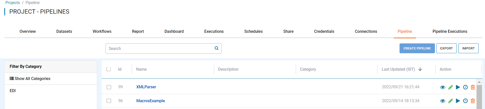

Importing Pipeline
==============

Fire Insights enables you to import Pipelines as JSON files. These JSON files can be export to use in another instance of Fire Insights. 

Below are the steps for importing a Pipeline.

Steps for Importing Pipeline
-------

You can Login to Fire Insights Web server URL and follow below steps:

* Go to the Project List page.
* Select the project to import Pipeline to 
* Click the Pipeline tab

You should get to a page similar as below:

* Click the ``Import`` button 

You should get to a page similar as below:

 
It will take you to new windows like below:
 

You can upload Pipeline JSON file from your local Computer and select any one of the option depending on Pipelines availablity in that project with UUID's, Below are Available Behaviour:

Configure Behavior
-----------------

When importing to an existing Project, there are 3 possible behaviors to choose from:

* OVERWRITE PIPELINE IF SAME UUID EXISTS IN THE PROJECT
    * In this case, if matching UUID's are found, the existing project will be removed and replaced with the uploaded file 
* CREATE A NEW UUID IF ONE ALREADY EXISTS
    * In this case, if matching UUID's are found, the uploaded file will be assigned a new UUID 
* CREATE A NEW UUID
    * In this case, the uploaded file will always be assigned a new UUID

     
Once you Click on ``Import``, the Pipeline should be available in Pipelines list page of Specific project.

     
.. note:: Make sure that data pointed to the Pipeline JSON File should be available on new instance of Fire Insights where you are Importing.

