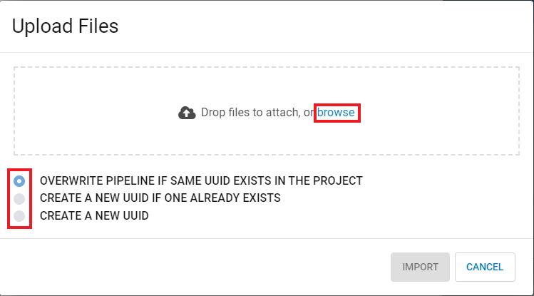

Importing Pipelines
==============

Fire allows you to import Pipelines. Below are the steps for importing Projects in Fire.
This is useful when moving Pipelines from one environment to another. 

Below are the steps for importing Pipelines into Fire.

Go to the Pipelines Tab
---------------------------

* From within a project, go to the Pipelines tab on the right hand side of the screen

 .. figure:: ../../_assets/user-guide/export-import/import_pipeline_tab.png
   :alt: userguide
   :width: 90%

Select Import and Configure Behavior
-----------------------------------------------

* First select the Import button in the top right hand side of the screen
* After the popup window appears, select Browse to select a file from your computer
* After selecting a file, choose a behavior for dealing with UUID's

When importing to an existing Project, there are 3 possible behaviors to choose from:

* OVERWRITE PIPELINE IF SAME UUID EXISTS IN THE PROJECT
    * In this case, if matching UUID's are found, the existing project will be removed and replaced with the uploaded file 
* CREATE A NEW UUID IF ONE ALREADY EXISTS
    * In this case, if matching UUID's are found, the uploaded file will be assigned a new UUID 
* CREATE A NEW UUID
    * In this case, the uploaded file will always be assigned a new UUID 
    

