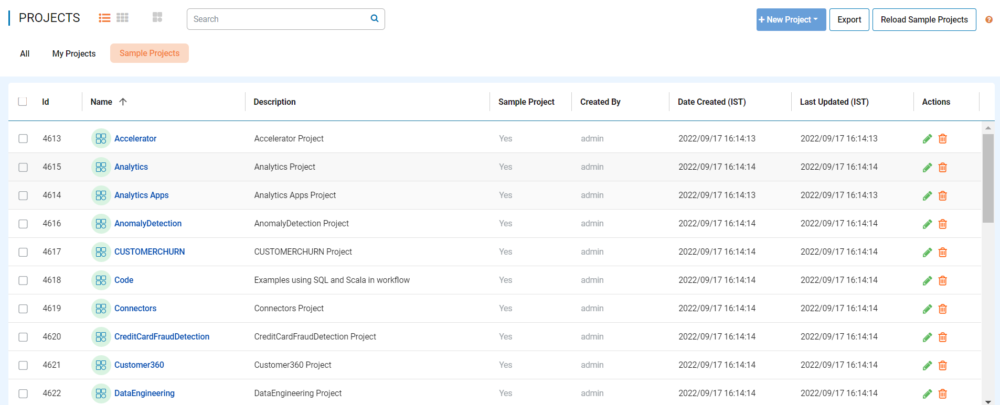
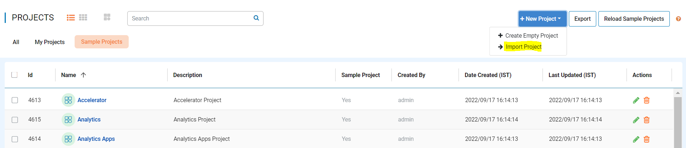
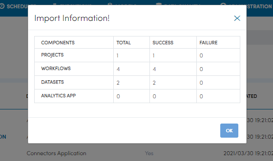

Import Projects
==============

Fire Insights enables you to Import Projects. These ZIP files can be Exported into another instance of Fire Insights.

Below are the steps for Importing Projects in Fire Insights.

Steps for Importing Projects
-----

You can Login to Fire Insights Web server URL and follow below steps:

* Go to the Project List page.

You should get to a page similar to below: 

- Click on the ``New Project`` button in top right hand side and select ``Import Project``. 

- Choose the zip file from your computer to Import from. You must have downloaded this zip file from Fire Insights during the export process.
- Select the name of the project which you would like to import from the zip file. Fire Insights would display all the available Projects in your zip file. 

 .. figure:: ../../_assets/user-guide/export-import/importapplication.png
     :alt: userguide
     :width: 60%

Select the Options for importing the Project
-----------------------------------------------

There are two options when importing Projects:

* Import to a New Project

    * In this case, the selected Project would be imported as a new Project in Fire Insights. 

* Import to an Existing Project

When importing to an existing Project, there are 3 possible methods to choose from:

* Create new Workflows, Datasets, Applications, and Pipelines if matching UUID’s found

* Overwrite Workflows, Datasets, Applications and Pipelines if same UUID found

* Delete all Workflows, Datasets, Applications and Pipelines in the selected project and create new ones

On Success
----------

On successful import of the Project into Fire Insights, the success dialog is displayed along with the details of the import.

.. note:: Make sure that data needed to the Projects should be available on new instance of Fire Insights.

