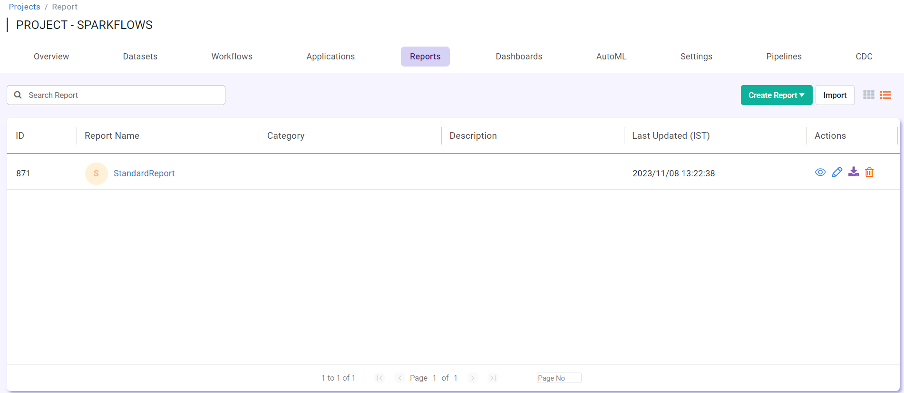
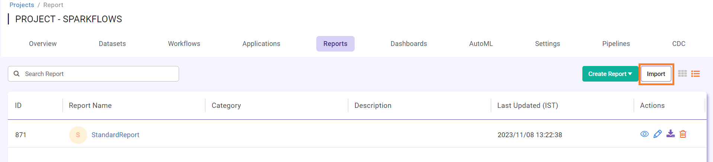
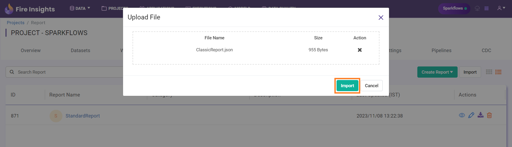
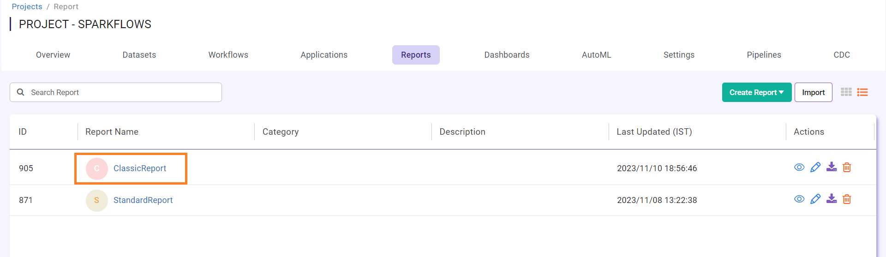

Import Reports
===============

Fire Insights enables you to import reports to use in projects.

Below are the steps for importing a report.

Steps for Importing Reports
-----

You can Login to Fire Insights web server URL and follow the steps given below:

* Go to the Project List page.
* Select the project to import reports to. 
* Click the Reports tab.

You should get to a page similar to below:

* Click on the ``Import`` button.

You should get to a page similar to below:

 

Once you click on ``Import``, it will take you to new windows where you can upload report JSON file from your local Computer.

     
Once you Click on ``Import``, the report should be available in Reports list page of specific project.

     
.. note:: Make sure that data pointed to the report JSON file should be available on new instance of Fire Insights where you are importing.
