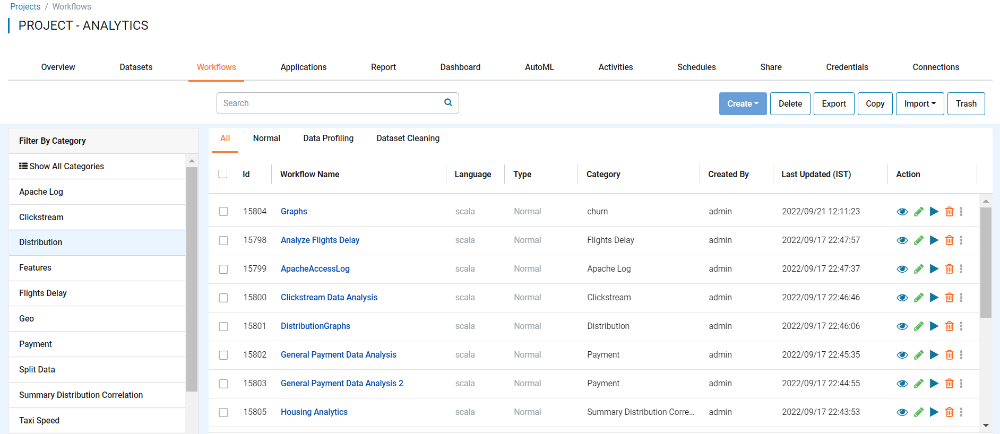
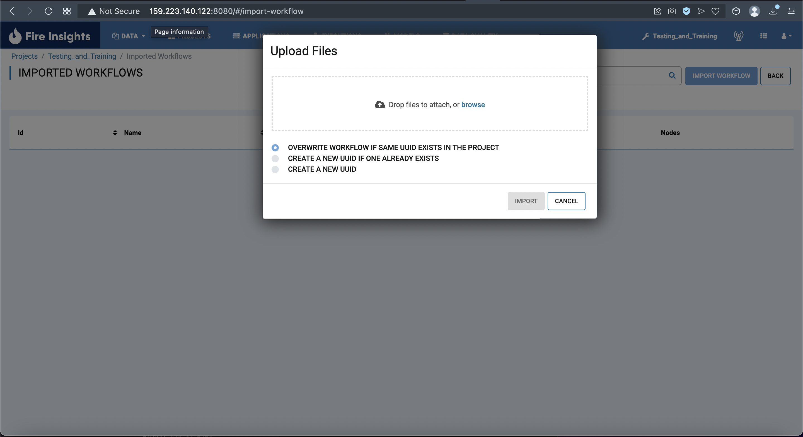

Import Workflows
===============

Fire Insights enables you to import workflows as JSON files. These JSON files can be export to use in another instance of Fire Insights.

Below are the steps for importing a workflow.

Steps for Importing Workflow
-------

* Go to the Project page.
* Select the project to import workflows to 
* Click the Workflows tab

You should get to a page similar to below

* Click the import button and select From Workflow files

You should get to a page similar to below

.. figure:: ../../_assets/user-guide/export-import/ImportWorkflow_BeginningPage.png
     :alt: userguide
     :width: 60%
     
* Click Import Workflow next to the search bar and select the workflow you wish to import

You should get to a page similar to below

