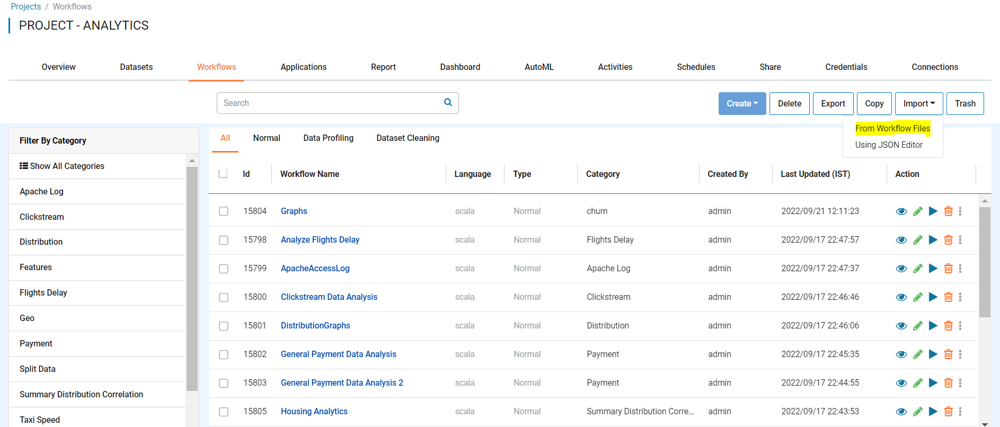
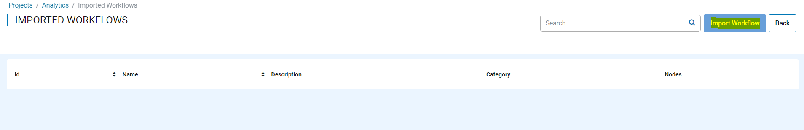
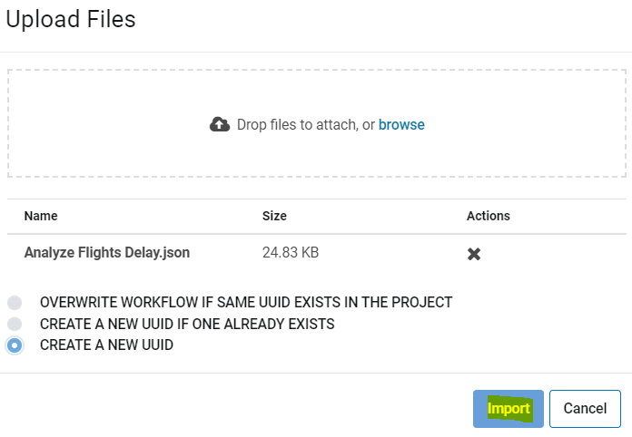
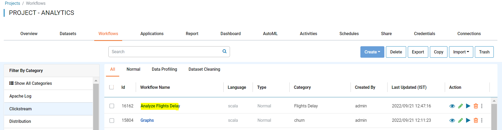

Import Workflows
===============

Fire Insights enables you to import workflows as JSON files. These JSON files can be export to use in another instance of Fire Insights.

Below are the steps for importing a workflow.

Steps for Importing Workflow
-------

You can Login to Fire Insights Web server URL and follow below steps:

* Go to the Project List page.
* Select the project to import workflows to 
* Click the Workflows tab

You should get to a page similar as below:

.. figure:: ../../_assets/user-guide/export-import/wf_list.PNG
     :alt: userguide
     :width: 60%

* Click the import button and select From Workflow Files

You should get to a page similar as below:

 
Once you Select From Workflow Files, it will take you to new windows like below:
 

Once you Click on ``Import Workflow` tab, it will take you to new windows where you can upload workflow JSON file in your local Computer and select any one of the option depending on workflow availablity in that project.

     
Once you Click on ``Import``, the workflow should be available in workflow list page of Specific project.

     
.. note:: Make sure that data pointed to the workflow JSON File should be available on new instance of Fire Insights where you are Importing.     
