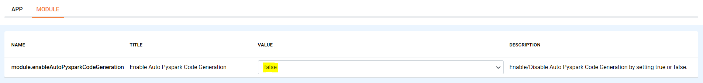
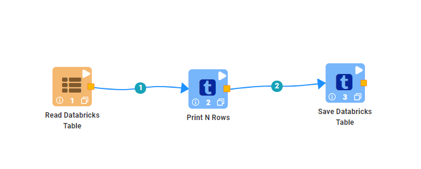
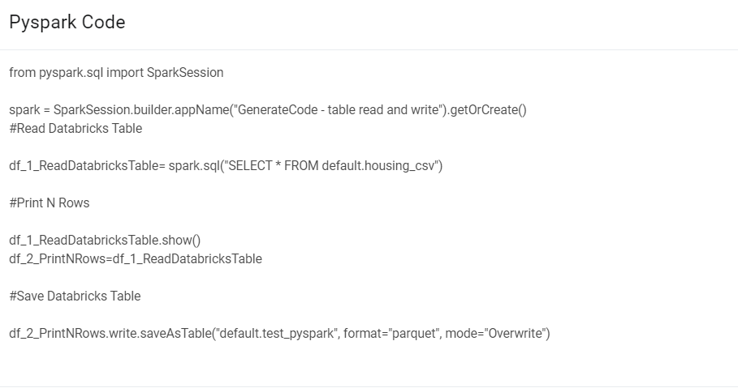

Generate Pyspark Code
====================

Fire Inisghts enable you to Generate Pyspark Code even with spark engine and run the job using python engine.

Below are steps:

Enable Auto Pyspark Code Generation
---------------

Login to Fire Insights application and Enable Auto Pyspark Code Generation from the Configurations page.

Go to ADMINISTRATION, select configuration, choose MODULE tab and search for 'module.enableAutoPysparkCodeGeneration' and make it to 'true', by default it will be false. 

Generate Pyspark Code
----------------

Now once the Configuration is enable for Generating Pyspark Code.

Create an example workflow using spark engine and saved it.

   
Once the workflow got saved, Go to workflow editor page, Click on the three dot on the top right corner of workflow editor page, you will see option of Generate Pyspark Code, select it.

.. figure:: ../../_assets/user-guide/generate-pyspark-code/3.PNG
   :alt: Pyspark code generate
   :width: 70%

Once you select option of Generate Pyspark Code, a window will open with Pyspark sample code for the example workflow copy it and save it into '.py' file.

