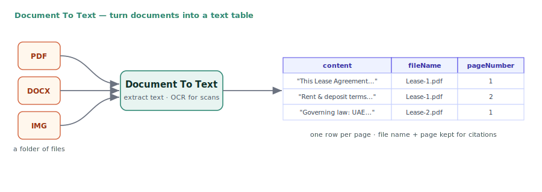
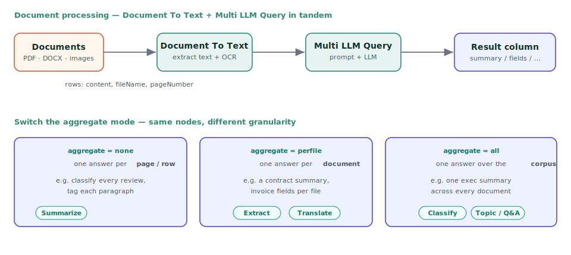

Document To Text
================

The **Document To Text** node turns a folder of documents into a text DataFrame — the entry point for almost every Generative AI pipeline in Sparkflows. It reads PDF, DOCX and image files, extracts their text (with OCR for scanned pages and images), and emits one row per page or per file, ready to feed an embedding node (for RAG) or a Multi LLM Query node (for summarization, extraction, translation, and more).

   Document To Text reads a folder of PDF/DOCX/image files and returns a table with the extracted ``content`` plus the ``fileName`` and ``pageNumber`` of each row.

Document To Text configuration
------------------------------

.. list-table::
   :widths: 26 74
   :header-rows: 1

   * - Setting
     - Meaning
   * - **File path**
     - The folder (or file) to read, for example ``data/GENAI/Lease-Negotiation``.
   * - **File type**
     - ``pdf``, ``docx`` or ``image``. This selects which files in the folder are read — the node does **not** read plain ``.txt`` files, so put your text in a PDF/DOCX or use a CSV reader for raw text.
   * - **OCR (image extraction)**
     - When enabled, scanned pages and image files are run through OCR to recover their text.
   * - **Content column**
     - Name of the output column holding the extracted text (default ``content``).
   * - **File-name column**
     - Adds the source file name to each row — essential for *per-file* processing downstream.
   * - **Page-number column**
     - For PDFs, each page becomes its own row tagged with its page number, so you can process or cite documents page by page.

Output columns
--------------

Each input document produces one or more rows with:

* the **extracted text** (content column),
* the **file name** (so downstream nodes can group or cite by document), and
* the **page number** (for PDFs), enabling page-level chunking and citations.

Document To Text combinations
-----------------------------

Document To Text is the first node in these common chains:

   Document To Text and Multi LLM Query in tandem: read the files, then let Multi LLM Query summarize, extract, translate or classify them. Switching the **aggregate mode** moves between per-page, per-document and whole-corpus answers without changing the workflow.

* **Summarize / extract / translate documents** — ``Document To Text`` → ``Multi LLM Query``. Read the files, then set the Multi LLM Query prompt and aggregate mode: ``perfile`` for one summary per document, ``none`` for page-level results. Typical uses: contract summaries, invoice field extraction, document translation, topic extraction.
* **RAG ingestion** — ``Document To Text`` → ``Text Embedder`` → ``Save to Pinecone / FAISS``. Read the documents, chunk + embed the text, and store the vectors so the documents become searchable (see :doc:`/user-guide/generative-ai/rag`).
* **Knowledge base in one node** — ``Document To Text`` → ``Create Knowledge Base``. The Knowledge Base node chunks, embeds and stores in a single step.
* **Scanned documents / images** — enable OCR and set file type ``image`` to pull text out of scans, photos of receipts, or image-only PDFs, then continue with any of the chains above.

Worked example
--------------

The RAG templates read lease PDFs from ``data/GENAI/Lease-Negotiation`` with **file type = pdf**, so each page's text (with its file name and page number) flows into the Text Embedder. Because the file name is carried through, the downstream answer can be grounded and attributed to the right document.

.. tip::

   The most common mistake is leaving **file type** on the wrong value or pointing at ``.txt`` files — the node reads ``pdf`` / ``docx`` / ``image`` only. Match the file type to the files in your folder, and keep the **file-name column** on so downstream *per-file* aggregation and citations work.
