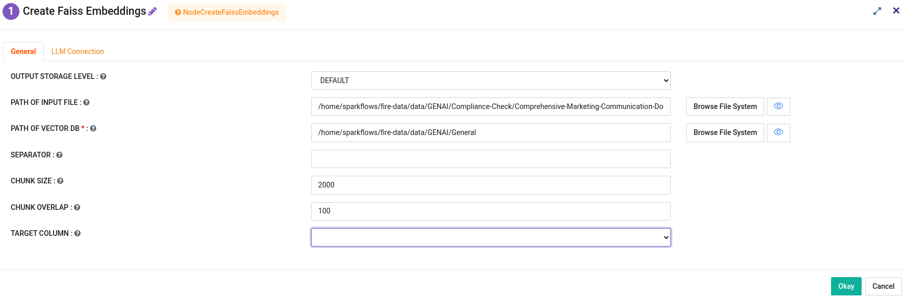

Create Faiss Embeddings Node
=============================

The **Create Faiss Embeddings** node is used to generate vector embeddings from textual data, which are then stored in a FAISS vector database. These embeddings enable efficient similarity search and clustering operations for downstream tasks like Natural Language Processing (NLP).

This guide explains how to configure the node and includes an example use case.

Overview
--------

The **Create Faiss Embeddings** node has two tabs for configuration:

1. **General**: Specifies file paths, storage settings, chunking options, and target column.
2. **LLM Connection**: Configures the connection to a Large Language Model (LLM) for generating embeddings.

Node Configuration
-------------------

### General Tab

.. list-table:: General Tab Configuration
   :widths: 30 70
   :header-rows: 1

   * - Parameter
     - Description
   * - **OUTPUT STORAGE LEVEL**
     - Specifies the storage level for output files (e.g., DEFAULT).
   * - **PATH OF INPUT FILE**
     - Path to the input file containing the text data.
   * - **PATH OF VECTOR DB** *(Required)*
     - Path where the FAISS vector database will be stored.
   * - **SEPARATOR**
     - Delimiter used in the input file (e.g., comma or tab).
   * - **CHUNK SIZE**
     - Specifies the size of text chunks for processing (e.g., 2000 characters).
   * - **CHUNK OVERLAP**
     - Overlap size between consecutive chunks (e.g., 100 characters).
   * - **TARGET COLUMN**
     - Column in the input file containing the text to be embedded.

   General tab for Create Faiss Embeddings Node.

### LLM Connection Tab

.. list-table:: LLM Connection Tab Configuration
   :widths: 30 70
   :header-rows: 1

   * - Parameter
     - Description
   * - **CONNECTION** *(Required)*
     - Select the connection to the LLM (e.g., OpenAI, Gemini).
   * - **MODEL** *(Required)*
     - Specify the LLM model to use (e.g., text-embedding-ada-002).
   * - **MAX RETRIES**
     - Number of retries in case of connection failures.
   * - **EMBEDDING CTX LENGTH**
     - Maximum context length for the embeddings (e.g., 8191).
   * - **OPENAI ORGANIZATION**
     - (Optional) Provide the OpenAI organization ID if applicable.
   * - **TIKTOKEN MODEL NAME**
     - (Optional) Specify the TikToken model name if needed.

   LLM Connection tab for Create Faiss Embeddings Node.

Example Use Case
-----------------

Suppose you have a dataset of marketing communications stored in a CSV file, and you want to build a vector database for similarity search. The following steps demonstrate how to use the **Create Faiss Embeddings** node to achieve this:

1. **Input Configuration**:
   - Set **PATH OF INPUT FILE** 
   - Specify **PATH OF VECTOR DB**
   - Set **SEPARATOR** to `,` and **TARGET COLUMN** to `message`.
   - Adjust **CHUNK SIZE** to `2000` and **CHUNK OVERLAP** to `100`.

2. **LLM Configuration**:
   - Select **CONNECTION** as `OpenAI` or `Gemini`.
   - Choose **MODEL** as `text-embedding-ada-002`.

3. **Run the Node**:
   - Execute the node to generate embeddings and store them in the FAISS database.

4. **Output**:
   - The FAISS vector database is created at the specified location. This database can be used for tasks like similarity search or clustering.

Key Notes
---------
- Ensure that the input file is formatted correctly with the required separator and target column.
- Configure the LLM connection properly to avoid issues during embedding generation.

For additional help, refer to the Fire Insights user guide or contact support.
