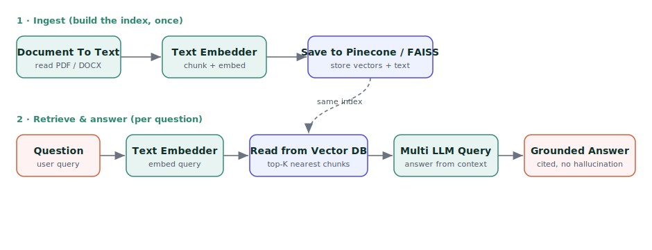

Retrieval-Augmented Generation (RAG)
====================================

**Retrieval-Augmented Generation (RAG)** lets a Large Language Model answer questions using *your* documents instead of only its training data. Sparkflows builds RAG pipelines visually — with low-code nodes for reading documents, chunking and embedding text, storing vectors in a vector database, retrieving the most relevant chunks for a question, and generating a grounded answer.

This page covers the RAG pattern, the building-block nodes, the supported vector stores, and the ready-to-run templates — with a full end-to-end walkthrough.

   The two halves of a RAG solution in Sparkflows: an **ingest** workflow that embeds documents into a vector index, and a **retrieve & answer** workflow that reads from the same index and generates a grounded answer.

The RAG pattern
---------------

A RAG solution is built as **two workflows** that share a vector store:

.. list-table::
   :widths: 22 78
   :header-rows: 1

   * - Stage
     - What happens
   * - **1. Ingest (offline)**
     - Read your documents → split them into chunks → convert each chunk to an embedding vector → **store** the vectors (plus the original text as metadata) in a vector database. Run this whenever your documents change.
   * - **2. Retrieve & answer (online)**
     - Embed the user's question → **retrieve** the top-K most similar chunks from the vector store → pass those chunks as context to the LLM → return an answer grounded on your data, often with citations.

Separating the two means you embed each document only once, then answer any number of questions against it cheaply.

Building-block nodes
--------------------

.. list-table::
   :widths: 30 70
   :header-rows: 1

   * - Node
     - Role in the pipeline
   * - Document To Text
     - Reads PDF / DOCX / TXT / HTML (and OCR for images) and extracts clean text, one row per file or page.
   * - Text Embedder
     - Splits text into chunks (``chunkSize`` / ``chunkOverlap``) and converts each chunk to an embedding vector using a configured provider (AzureOpenAI, OpenAI, or a local Hugging Face model).
   * - Save to Pinecone / Save to FAISS
     - Upserts the chunk vectors — with the original text kept as metadata — into a Pinecone index or a local FAISS index.
   * - Read from Pinecone / Read from FAISS
     - Embeds the query and returns the top-K nearest chunks from the store.
   * - Create Knowledge Base
     - An all-in-one node that chunks, embeds and stores documents into your chosen vector DB (FAISS or Pinecone) in a single step.
   * - Query Document
     - Runs the whole retrieval-augmented answer in one node: loads a vector store, retrieves for the question, and returns a grounded LLM answer.
   * - Multi LLM Query
     - Generates the final answer from the retrieved context, driven by a prompt (summary, Q&A, extraction, and more).

Vector stores
-------------

.. list-table::
   :widths: 20 20 60
   :header-rows: 1

   * - Store
     - Hosting
     - When to use
   * - **FAISS**
     - Local (on disk)
     - Fastest to start; no external service or key. Great for development and single-node use.
   * - **Pinecone**
     - Managed cloud
     - Production-grade, serverless, scales to large corpora; namespaces isolate tenants. Needs a Pinecone connection.
   * - **Chroma**
     - Local / self-hosted
     - Lightweight local vector DB, an alternative to FAISS.
   * - **Azure AI Search**
     - Managed cloud
     - Use when you are already on Azure and want hybrid keyword + vector search.

.. important::

   Keep the **embedding dimension consistent** between ingest and retrieval, and make sure it matches the index (for example, AzureOpenAI ``text-embedding-ada-002`` produces **1536**-dim vectors, so the index must be created with dimension 1536). Also include the chunk **text** column in the store's metadata — retrieval returns the metadata, and the LLM needs that text as context.

Ready-to-run RAG templates
---------------------------

Import these from the **Gen AI** template category. The Pinecone and answer-generating templates use the configured **AzureOpenAI** (embeddings + LLM) and **pinecone** connections; the FAISS templates run locally.

.. list-table::
   :widths: 40 60
   :header-rows: 1

   * - Template
     - Pipeline
   * - RAG — Pinecone Ingest (Embed & Store)
     - Document To Text → Text Embedder → Save to Pinecone
   * - RAG — Pinecone Retrieve & Answer
     - Text Embedder (query) → Read from Pinecone → Multi LLM Query
   * - RAG — FAISS Ingest (Local, Embed & Store)
     - Document To Text → Text Embedder → Save to FAISS
   * - RAG — FAISS Retrieve & Answer (Local)
     - Text Embedder (query) → Read from FAISS → Multi LLM Query
   * - RAG — Build a Knowledge Base (all-in-one)
     - Document To Text → Create Knowledge Base
   * - RAG — Document Q&A
     - Query Document (retrieve + answer in one node)

End-to-end walkthrough — Pinecone RAG
-------------------------------------

**Step 1 — Ingest your documents.** Open **RAG — Pinecone Ingest**:

#. **Document To Text** — point ``filePath`` at your document folder and set the file type (PDF, DOCX, TXT). It outputs a text column.
#. **Text Embedder** — set the embedding method to **AzureOpenAI** and the connection to **AzureOpenAI**; choose ``chunkSize`` (for example 1024) and ``chunkOverlap`` (for example 100). It appends an ``embeddings`` column.
#. **Save to Pinecone** — set the connection to **pinecone**, the index (for example ``genai-demo``), the namespace, and dimension **1536**. Keep the chunk **text** column in the metadata list.

Run it once; your documents are now searchable.

**Step 2 — Ask questions.** Open **RAG — Pinecone Retrieve & Answer**:

#. **Text Embedder** — embeds the user's question with the same **AzureOpenAI** connection.
#. **Read from Pinecone** — set the same connection, index and namespace, and ``topK`` (for example 5) to fetch the most relevant chunks.
#. **Multi LLM Query** — set the connection to **AzureOpenAI** and write the prompt (for example, *"Answer the question using only the retrieved context; cite the source."*). It returns the grounded answer.

Swap **Save/Read from Pinecone** for **Save/Read from FAISS** to run the same flow entirely locally with no external vector database.

A run of this pipeline over a set of lease PDFs, asked *"Summarize the key terms and the parties of this lease agreement,"* returns a grounded answer drawn only from the retrieved chunks:

.. code-block:: text

   - Parties: Prime Realty UAE (Landlord) and Verizon Wireless Middle East (Tenant).
   - Premises: retail spaces in UAE malls (e.g. a 1,792 sq ft kiosk at Mall of the Emirates).
   - Term & Renewal: 3 or 5 year terms from May 24 2025, renewable for one equal term with 180 days' notice.
   - Rent & Deposit: monthly rent $6,089-$9,904 with 3-4% annual increases; deposits $8,582-$14,800.
   - Insurance & Default: $2,000,000 liability cover; late rent beyond 10 days allows termination.
   - Governing Law: United Arab Emirates.

If the answer is not present in the retrieved context, the model says so rather than inventing one — which is exactly the behaviour you want from a grounded RAG pipeline.

.. note::

   **Making the templates run.** Point **Document To Text** at a folder of documents and set the matching **file type** (the node reads ``pdf`` / ``docx`` / images). Select your embedding + LLM connection on the **Text Embedder** and **Multi LLM Query** nodes, and your Pinecone connection on the **Save/Read from Pinecone** nodes. Embeddings and the vector index must share the same dimension (1536 for AzureOpenAI ``text-embedding-ada-002``).

Configuration reference
-----------------------

* **Embedding method** — ``AzureOpenAI`` / ``OpenAI`` use a hosted embedding model via the selected connection; ``HuggingFace`` runs a local embedding model.
* **Chunk size / overlap** — larger chunks preserve more context per vector; overlap avoids splitting an idea across a boundary. Typical: 500–1500 characters, 10–20% overlap.
* **topK** — how many chunks to retrieve as context. Higher gives the LLM more to work with but costs more tokens.
* **Namespace** — isolates vectors within one Pinecone index (for example, one namespace per customer or per document set).
* **Metadata columns** — the fields stored alongside each vector; always include the chunk text so it can be returned as context.

.. tip::

   Start on **FAISS** to prototype a RAG flow with zero external setup, then switch the store to **Pinecone** for production scale by changing only the Save/Read nodes.
