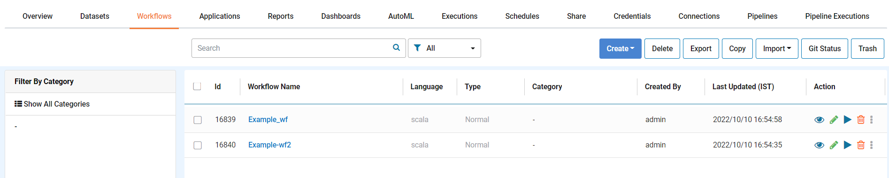
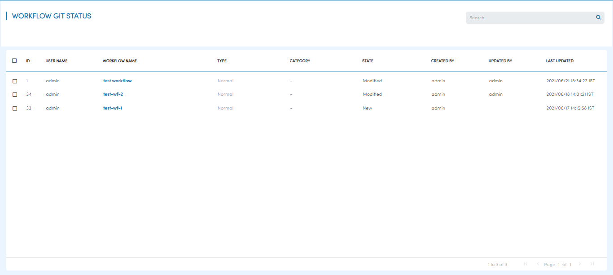
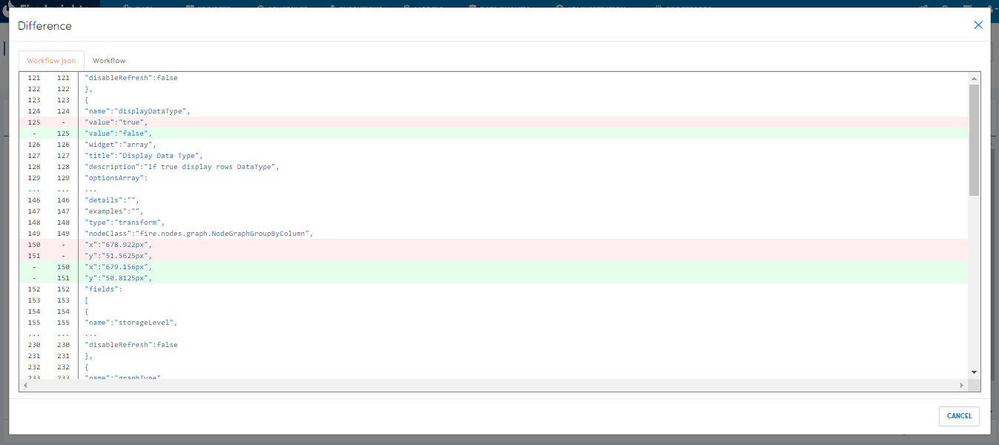
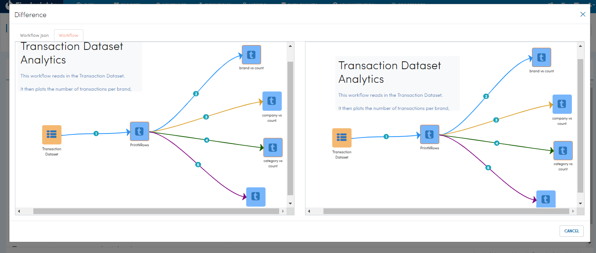
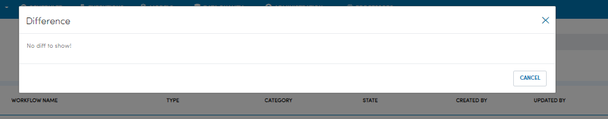

Git Status
==========

Sparkflows can show the changes yet to be pushed to git via the ``Git Status`` Button. 

To access ``Git status``, open a project and select ``Workflows``. You should see a page similar to below.

When ``Git Status`` is clicked you should be redirected to another page where we can see the list of workflows that have not been pushed to linked git configuration. You should see a page similar to below

Upon clicking the workflow name you should see Workflow json differences of existing workflow changes which has not been pushed to git and last workflow json changes whcih has been pushed to configured git, similar to below.

- To see the differences in workflow form click the ``Workflow`` tab. 

- If there are no differences to show the  message ``No diff to show!`` is shown.

