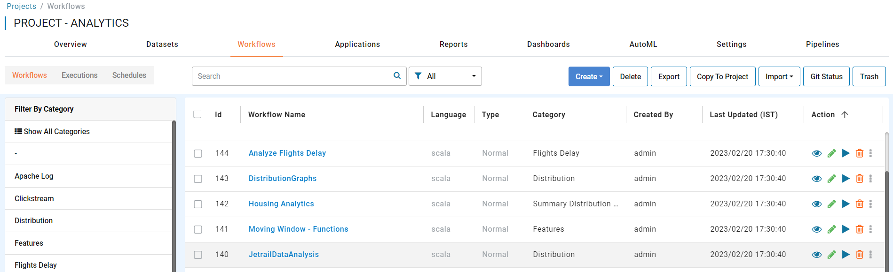
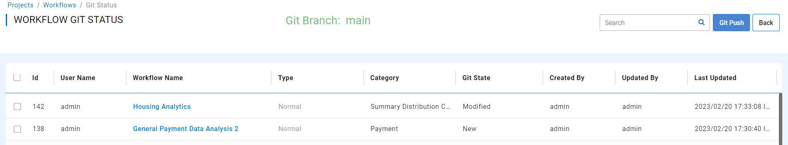
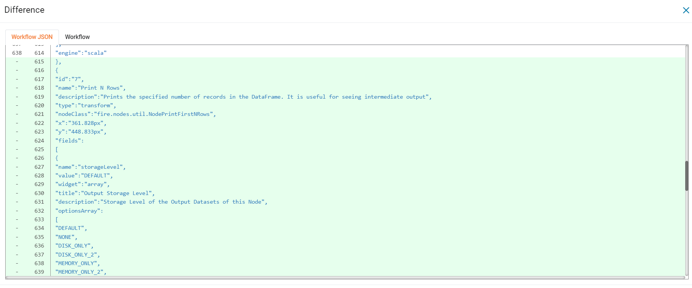
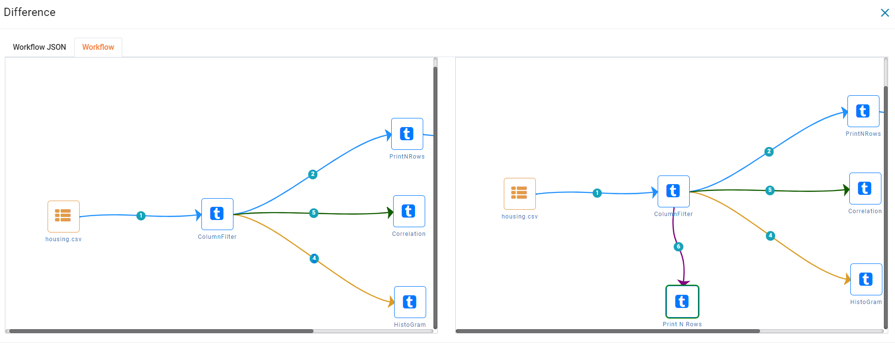

Git Status
==========

Sparkflows can show the changes related to Workflows, Analytical Apps and Pipelines yet to be pushed to Git via the ``Git Status`` Button. 

To access ``Git status``, open a project and select ``Workflows``. You would see a page similar to below.

When ``Git Status`` is clicked you would be redirected to another page where you can see the list of workflows that have not been pushed to Git. You would see a page similar to below.

Upon clicking the workflow name you would see Workflow JSON differences between the current JSON and last workflow JSON pushed to Git as seen in the image below. If the workflow has not been pushed to Git before, a pop up would show up stating ``There is no previous version available to show the diff``.

- To see the differences in workflow form click the ``Workflow`` tab. 

