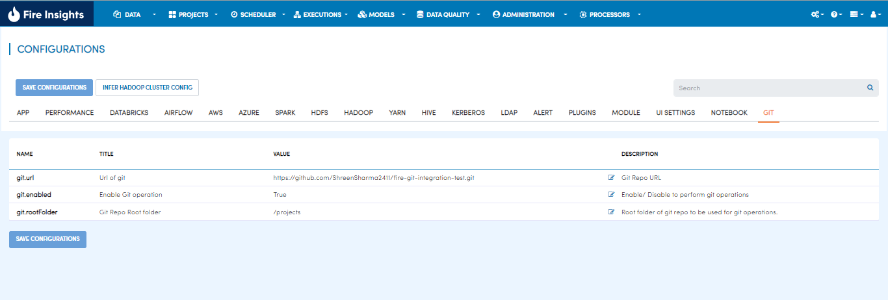
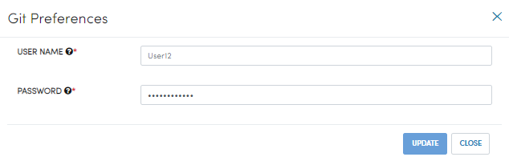

Git Configuration
===================

Enable Git Repository
----------------------

- Go to Administration/ COnfiguration.
- Click on `GIT` tab
- Make `git.enable` true.
- Provide the git repository link in `git.link` value field.
- Save the configuration.
- Refresh the brower to enable git-configuration.

Add git credentials
---------------------

- On the right corner, click on the `settings` icon.
- Click on the `Git Integration`.
- Git preferences dialog will appear.
- Provide the git username/ password.
- Click `SAVE`.

The system validates the user credentials and displays a success message.
You can also update the credentials anytime.

.. figure:: ../../_assets/git/git-cred-update-success.png
   :alt: Success
   :width: 60%

