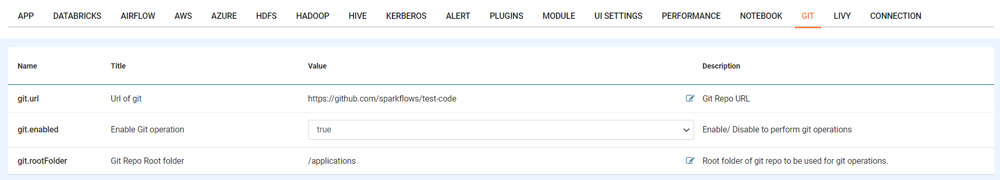
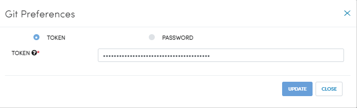
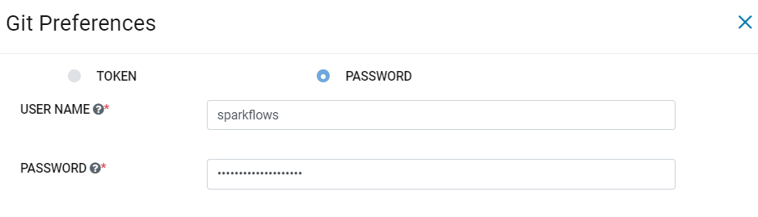
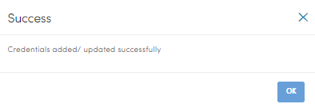

Git Configuration
===================

A User must input a personal access token as well as their GitHub Username and Password in order to push workflows and pipelines. The document below describes the process to enable Git integration in Sparkfows and configure it.

Enable Git Repository
----------------------

- Click Administration.
- Select Configurations. 
- Click on ``GIT`` tab
- Make ``git.enable`` true.
- Provide the git repository link in ``git.url`` value field.
- Provide the git root folder in ``git.rootFolder`` value field, it's default value is ``/ProjectsWorkflow``.
- Save the configuration.
- Refresh the browser to enable git-configuration.

Add git credentials with Token
--------------------------------------------

- On the right corner, click on the nine squares.
- Select ``Git Configuration``.
- Git preferences dialog will appear.
- Select ``Token``.
- Provide the ``git Token``.
- Click ``SAVE``.

Add git credentials with Username/Password
--------------------------------------------

- On the right corner, click on the nine squares.
- Click on the ``Git Configuration``.
- Git preferences dialog will appear.
- Select ``Password``
- Provide the git ``username/password``.
- Click ``SAVE``.

The system validates the user credentials and displays a success message.
You can also update the credentials anytime.

.. note:: Make sure that Git repository url should be accessible from Fire Insights machine
