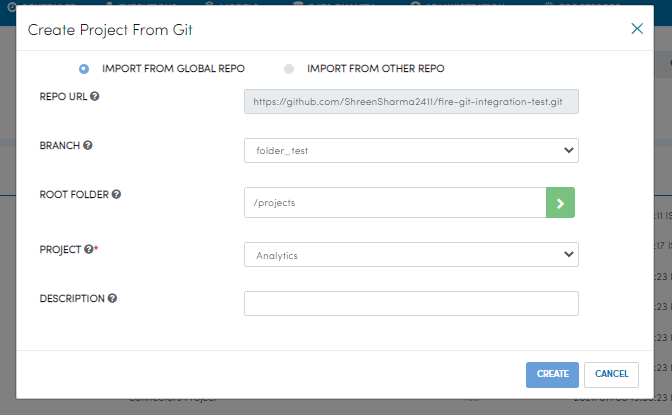

Import Project
=================

You can Import project from git using configured Git repo as well as others repos.

- Go to project-list page.
- Click on the ``New Project`` button.
- Select ``Create Project from git``.

.. figure:: ../../_assets/git/git-createProj.png
   :alt: CreateProject
   :width: 60%

A dialog box will appear with 2 choices.

  1. IMPORT FROM GLOBAL REPO
  2. IMPORT FROM OTHER REPO

Import project fom configured Git repo
--------------------------------------

- Select ``IMPORT FROM GLOBAL REPO``.
- Select the ``Branch``.
- You will get the project list of the selected branch.
- Select the ``Project``.
- Provide description of the project.
- Click on the ``CREATE``.

Selected Project will get created.

Import project fom other Git repo
------------------------------------
- Select ``IMPORT FROM OTHER REPO``.
- Provide the link of other Git repo.
- Select the ``Branch``.
- You will get the project list of the selected branch.
- Select the ``Project``.
- Provide description of the project.
- Click on the ``CREATE``.

Selected Project will get created from other repo.

.. figure:: ../../_assets/git/other-repo.png
   :alt: OtherRepo
   :width: 60%

You can see the created Project in project list.
