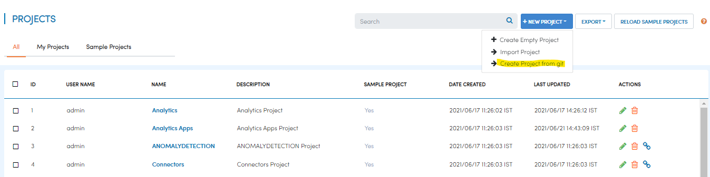
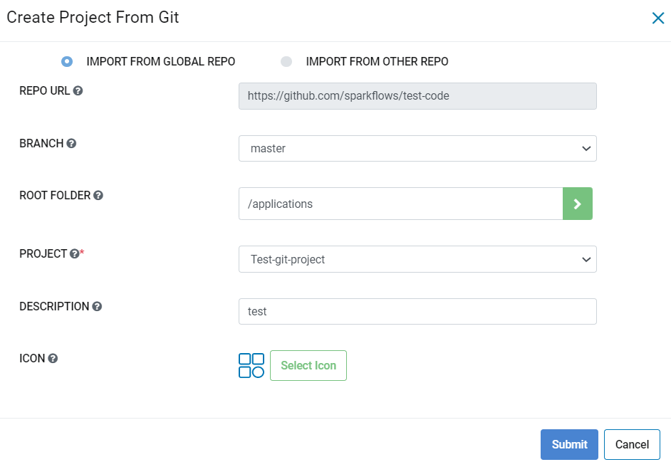
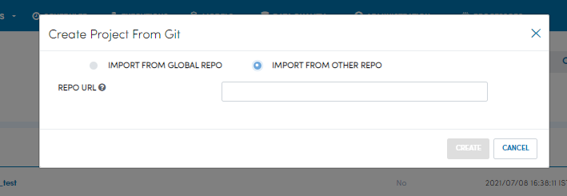

Import Project
=================

Sparkflows allows you to either import a project from git using a pre-configured global repo or another new repo. The document below describes the ways you can Import projects using different repositories. 

- Go to project-list page.
- Click on the ``New Project`` button.
- Select ``Create Project from git``.

A dialog box will appear with 2 choices.

  1. IMPORT FROM GLOBAL REPO
  2. IMPORT FROM OTHER REPO

Import project fom configured Git repo
--------------------------------------

- Select ``IMPORT FROM GLOBAL REPO``.
- Select the ``Branch``.
- Provide root folder path and click the button next to it to load the projects within the path

   If there is no root folder path provided it will get linked with the path added in the git configurations
   
- Provide description of the project.
- Select the ``Project``.
- Click on the ``CREATE``.

Selected Project will get created.

Import project from other Git repo
------------------------------------
- Select ``IMPORT FROM OTHER REPO``.
- Provide the url of other Git repo, all branches of provided git url get loaded below.
- Select the ``Branch``.
- Provide root folder path and click button next to it to load the projects within the path.

   If there is no root folder path provided it will get linked with the path added in the git configurations

- You will get the project list of the selected branch and provided root folder path.
- Select the ``Project``.
- Provide description of the project.
- Click on the ``CREATE``.

The selected project will get created from the other repo.

You can see the created Project in the project list.
