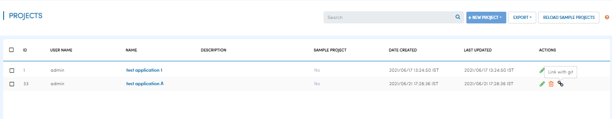
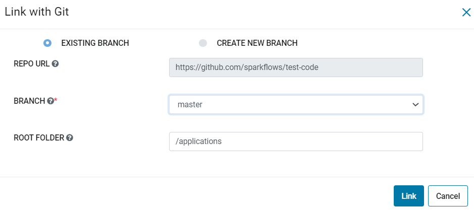
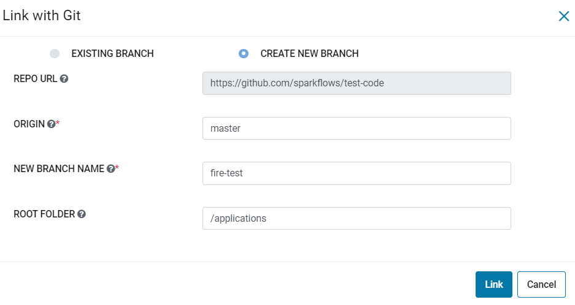

Link project with Git
===================

Sparkflows allows projects to be linked with git via the ``Link With Git`` under Actions. You can link projects with git in order to persist projects, workflows, pipelines, apps to git repo. On clicking on the button, following options show up: 

- To link to ``Existing branch`` 
- To link to ``New branch``

This document goes over how to link projects both ways. 

Existing Branch
----------------------

- Choose ``Existing Branch`` from the radio button.
- Select ``Branch`` from list 
- Provide ``Root folder``. If there is no root folder path provided it will get linked with the path configured in the ``Git configurations`` by the ``Admin`` 
- Click on ``Link`` button.

Create New Branch
----------------------

- Choose ``New Branch`` from the radio button.
- Provide ``Origin``. Default values usually is either ``master`` or ``main``
- Provide the ``New branch name``
- Provide ``Root folder``. If there is no root folder path provided it will get linked with the path configured in the ``Git configurations`` by the ``Admin`` 
- Click on the ``Link`` button. Sparkflows will first create a new branch with specified name pointing to the specified ``Origin``

Now, you can push workflows under Project to linked branch.
