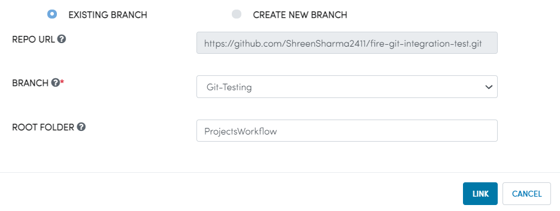

Link project with Git
===================

Project which are not been linked with git can click on Action button `Link With Git`. It is compulsory to link project with git if you want to push workflows under this project to configured git. Modal opens up where we have two options either link with existing branch present in or can create new branch in configured git repo url.

.. figure:: ../../_assets/git/link-project.png
   :alt: link-with-git
   :width: 60%

Existing Branch
----------------------

- Click on ``EXISTING BRANCH`` option.
- Branch list present in configured repo comes up.
- Select branch from list and provide root folder path(if not added it will get link with path added in config).
- link project with git.

Create New Branch
----------------------

- Click on ``CREATE NEW BRANCH`` option.
- Add NEW BRANCH NAME, ORIGIN and root folder path(if not added it will get link with path added in config).
- When you click on link button in this option it will first create branch with specified NEW BRANCH NAME. New branch is updated with specified ORIGIN.

.. figure:: ../../_assets/git/git_new_branch.PNG
   :alt: link-with-git
   :width: 60%

Successfully Linked Project with Git. Now, you can push workflows under Project to linked branch.
